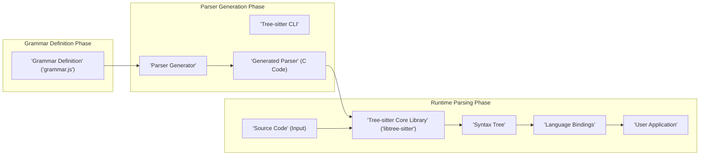
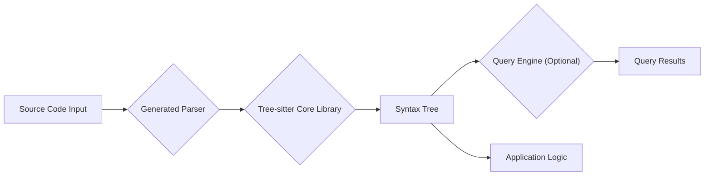

## Project Design Document: Tree-sitter (Improved)

**1. Introduction**

This document provides an enhanced design overview of the Tree-sitter project (based on information available at [https://github.com/tree-sitter/tree-sitter](https://github.com/tree-sitter/tree-sitter)). It aims to provide a clear and detailed understanding of the project's architecture, components, and data flow. This document is intended for developers, security engineers, and anyone involved in understanding or contributing to the Tree-sitter project, particularly for the purpose of threat modeling and security analysis.

**2. Goals**

The primary objectives of the Tree-sitter project are to:

*   Enable the creation of fast and robust incremental parsers for programming languages.
*   Provide a library for building abstract syntax trees (ASTs) from source code.
*   Offer an efficient mechanism for querying and manipulating these syntax trees.
*   Support the development of language-aware tools, such as syntax highlighters, code linters, and refactoring tools.
*   Maintain a language-agnostic core, allowing for parsers for various languages to be built upon it.

**3. High-Level Architecture**

The Tree-sitter architecture is structured around distinct phases and components, facilitating a clear separation of concerns:

*   **Grammar Definition Phase:**  Involves creating a formal description of a programming language's syntax.
*   **Parser Generation Phase:**  Transforms the grammar definition into efficient parsing code.
*   **Runtime Parsing Phase:**  Utilizes the generated parser and the core library to process source code.

The key components involved are:

*   **Grammar DSL (Domain Specific Language):** The language used to define the syntax rules (typically JavaScript).
*   **Tree-sitter CLI (Command-Line Interface):** Provides tools for grammar development, parser generation, and testing.
*   **Parser Generator:** The core logic that compiles the grammar into C code.
*   **Generated Parser (C Code):**  The language-specific parser produced by the generator.
*   **Tree-sitter Core Library (`libtree-sitter`):**  The runtime library providing the core parsing algorithms and data structures.
*   **Language Bindings:**  Allow interaction with the core library from other programming languages.
*   **User Application:** The software that integrates and utilizes Tree-sitter for language processing.

**4. Detailed Component Description**

*   **Grammar DSL (Domain Specific Language):**
    *   Uses a JavaScript-based syntax to define the grammar rules.
    *   Allows specifying lexical rules (tokens) and syntactic rules (grammar productions).
    *   Supports features like precedence rules, associativity, and error recovery strategies.
    *   Grammar files typically have a `.grammar.js` extension.

*   **Tree-sitter CLI (Command-Line Interface):**
    *   Provides essential commands for working with Tree-sitter.
    *   `tree-sitter generate`:  Invokes the parser generator to create parser code from a grammar.
    *   `tree-sitter parse`: Parses a source code file using a specified grammar.
    *   `tree-sitter test`: Executes tests defined for the grammar.
    *   `tree-sitter query`: Allows querying syntax trees using the Tree-sitter query language.
    *   `tree-sitter highlight`: Performs syntax highlighting based on the grammar.

*   **Parser Generator:**
    *   Takes a grammar definition file as input.
    *   Performs static analysis of the grammar to identify potential issues.
    *   Generates highly optimized C code for the parser, implementing a state machine.
    *   The generated code is specific to the language defined by the grammar.

*   **Generated Parser (C Code):**
    *   Contains the core parsing logic for a specific programming language.
    *   Provides functions to parse source code into a syntax tree.
    *   Relies on the `libtree-sitter` for fundamental data structures and algorithms.
    *   Needs to be compiled and linked with the core library.

*   **Tree-sitter Core Library (`libtree-sitter`):**
    *   Implemented in C, providing the foundational parsing capabilities.
    *   Manages the creation and manipulation of syntax trees.
    *   Implements the core parsing algorithm (typically a form of LR parsing).
    *   Offers APIs for:
        *   Initializing and configuring parsers.
        *   Parsing source code (both from scratch and incrementally).
        *   Traversing the syntax tree.
        *   Editing the syntax tree.
        *   Executing queries against the tree.

*   **Language Bindings:**
    *   Provide a bridge between the C core library and other programming languages.
    *   Utilize Foreign Function Interfaces (FFI) to call C functions from languages like JavaScript, Python, Ruby, Go, etc.
    *   Offer language-idiomatic APIs for interacting with Tree-sitter.

*   **User Application:**
    *   The software that integrates the Tree-sitter library (either directly or through language bindings).
    *   Utilizes the parsed syntax trees for various purposes, such as:
        *   Syntax highlighting in code editors.
        *   Static analysis and linting.
        *   Code navigation and refactoring tools.
        *   Semantic analysis and code understanding.

**5. Data Flow (Detailed)**

The process of using Tree-sitter involves a distinct flow of data:

1. **Grammar Definition Creation:** A developer authors a `.grammar.js` file defining the language syntax.
2. **Parser Generation:** The `tree-sitter generate` command processes the grammar, resulting in C source code for the parser.
3. **Parser Compilation:** The generated C code is compiled into a library (e.g., a `.so` or `.dylib` file) and linked with `libtree-sitter`.
4. **Source Code Input:** A user application provides source code as input to the Tree-sitter parser.
5. **Parsing Process:**
    *   The generated parser, using the algorithms from `libtree-sitter`, tokenizes and parses the input.
    *   A syntax tree is constructed in memory, representing the hierarchical structure of the code.
6. **Syntax Tree Access:** The user application interacts with the syntax tree through the `libtree-sitter` API or language bindings.
7. **Querying (Optional):** The application can use the Tree-sitter query language to extract specific information from the syntax tree.
8. **Incremental Parsing (Optional):** If the source code is modified, Tree-sitter can efficiently update the existing syntax tree by re-parsing only the changed regions.

**6. Key Data Structures**

*   **Syntax Tree:** A mutable, tree-like data structure representing the syntactic structure of the parsed code.
    *   Composed of **Nodes**, each representing a specific syntactic construct.
*   **Nodes:**
    *   Have a `type` indicating the kind of syntactic element (e.g., function declaration, identifier).
    *   Have a `range` defining their start and end positions in the source code (byte offsets).
    *   Can have `children`, forming the hierarchical structure.
    *   Can have a `parent` node.
*   **Cursors:** Lightweight objects used for efficiently traversing the syntax tree.
    *   Maintain a position within the tree.
    *   Provide methods for moving to parent, child, sibling, and other related nodes.
*   **Queries:** Represent patterns used to search for specific nodes or combinations of nodes within the syntax tree.
    *   Written in a dedicated query language.
    *   Define predicates and relationships between nodes.
    *   Return matches indicating the nodes that satisfy the query.

**7. Security Considerations**

This section details potential security considerations across different aspects of the Tree-sitter project:

*   **Grammar Definition and Parser Generation:**
    *   **Malicious Grammar Leading to DoS:** A deliberately crafted, complex grammar could cause excessive resource consumption during parser generation, potentially leading to denial of service.
    *   **Grammar Ambiguities Leading to Unexpected Behavior:** Ambiguous grammar rules could result in the generated parser behaving unpredictably or incorrectly for certain inputs.
    *   **Supply Chain Attacks on Grammar Dependencies:** If grammar definitions rely on external resources or dependencies, these could be compromised.

*   **Generated Parser (C Code):**
    *   **Memory Safety Vulnerabilities:** Bugs in the parser generation logic or the generated C code could lead to memory corruption vulnerabilities (e.g., buffer overflows, use-after-free).
    *   **Stack Overflow:** Deeply nested or recursive grammar rules, combined with specific input, could cause stack overflow during parsing.
    *   **Integer Overflow/Underflow:**  Potential for integer overflow or underflow issues in the generated parsing logic when handling large inputs or offsets.

*   **Tree-sitter Core Library (`libtree-sitter`):**
    *   **Memory Safety Vulnerabilities:**  Bugs within the core library itself could lead to memory corruption issues affecting all parsers using it.
    *   **DoS via Crafted Input:** Maliciously crafted input could exploit vulnerabilities in the parsing algorithm, causing excessive CPU usage or memory allocation.
    *   **Incorrect Handling of Invalid Input:** Failure to properly handle invalid or malformed input could lead to crashes or unexpected behavior.

*   **Language Bindings:**
    *   **FFI Vulnerabilities:** Improper use of the Foreign Function Interface (FFI) could introduce vulnerabilities in the bindings, allowing access to memory or resources that should be protected.
    *   **Type Confusion:** Mismatches between the types expected by the C library and the types provided by the binding language could lead to security issues.
    *   **Resource Leaks:**  Improper management of resources (memory, file handles) in the bindings could lead to leaks.

*   **Input Handling:**
    *   **Lack of Input Sanitization:**  Tree-sitter itself doesn't perform input sanitization. Applications using Tree-sitter must ensure that the input source code is handled securely.
    *   **Injection Attacks (Indirect):** While Tree-sitter doesn't directly execute code, vulnerabilities in applications using it could be exploited through carefully crafted input that influences subsequent actions based on the parsed tree.

*   **Query Language:**
    *   **DoS via Complex Queries:**  Extremely complex or inefficient queries could potentially cause performance issues or even denial of service.

**8. Deployment Considerations**

Tree-sitter is typically integrated into various types of applications:

*   **Text Editors and IDEs:** For features like syntax highlighting, code folding, auto-completion, and error checking.
*   **Static Analysis Tools:** For identifying potential bugs, security vulnerabilities, and code style issues.
*   **Language Servers:** Providing language intelligence to code editors through standardized protocols.
*   **Code Transformation and Refactoring Tools:** For automating code modifications.
*   **Command-Line Tools:** For tasks like code formatting or querying code structure.

The security implications can vary depending on the deployment context. For example, vulnerabilities in a text editor plugin using Tree-sitter could potentially be exploited to execute arbitrary code.

**9. Future Considerations**

*   **Enhanced Error Recovery Mechanisms:** Improving the ability of parsers to gracefully handle syntax errors and provide more informative diagnostics.
*   **Formal Verification of Grammar and Parser Generation:** Exploring techniques for formally verifying the correctness and security properties of grammars and the parser generator.
*   **Improved Performance and Memory Efficiency:** Continuously optimizing the parsing algorithms and data structures.
*   **Broader Language Support:** Expanding the number of supported programming languages through community contributions and official development.
*   **Standardized Security Audits:** Regularly conducting security audits of the core library and key parsers.