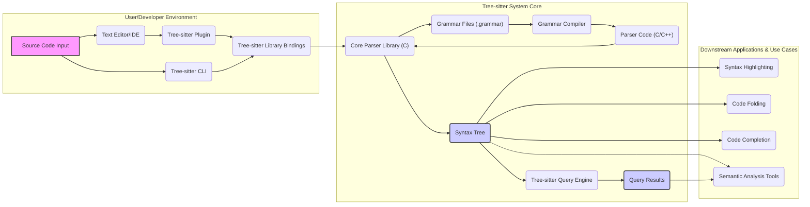

# Project Design Document: Tree-sitter

## 1. Introduction

### 1.1. Project Overview

Tree-sitter is a powerful parser generator tool and library designed to create fast, robust, and language-agnostic incremental parsing systems. It excels at parsing source code into concrete syntax trees, enabling efficient querying and manipulation of code structure.  Tree-sitter is a foundational technology for tools requiring deep code understanding, such as text editors, IDEs, and static analysis engines, powering features like syntax highlighting, code folding, code completion, and semantic analysis.

Key features of Tree-sitter include:

*   **High-Performance Parsing:** Optimized for speed, allowing real-time parsing even of large and complex codebases.
*   **Robust Error Tolerance:**  Designed to gracefully handle syntax errors in code, producing partial syntax trees that allow tools to remain functional even with invalid input.
*   **Incremental Parsing Efficiency:**  Updates syntax trees rapidly and efficiently when code is modified, minimizing redundant re-parsing and improving responsiveness.
*   **Language Versatility:**  Supports a wide range of programming languages through language-specific grammar files, making it adaptable to diverse coding environments.
*   **Flexible Query Language:**  Offers a sophisticated query language for extracting specific information and patterns from syntax trees.
*   **Multi-Language Bindings:**  Provides readily available bindings for popular programming languages like JavaScript, Python, and Go, facilitating integration into various software ecosystems.

### 1.2. Purpose of this Document

This document provides a detailed design overview of the Tree-sitter project, focusing on its architecture, components, data flow, and deployment strategies.  The primary purpose of this document is to serve as a comprehensive resource for threat modeling activities. By clearly outlining the system's internal workings and external interfaces, this document enables security professionals to effectively analyze potential security vulnerabilities and attack vectors within the Tree-sitter ecosystem. It aims to be a clear, well-structured, and accessible guide for anyone needing to understand the design of Tree-sitter, particularly from a security perspective.

## 2. System Architecture

### 2.1. High-Level Architecture Diagram



### 2.2. Component Description

*   **2.2.1. Source Code Input**:
    *   Represents the raw source code in a specific programming language that is the target of parsing.
    *   This is the initial input and entry point for the Tree-sitter parsing process.
    *   Input can be provided as a file path, a string in memory, or an input stream.
    *   *Security Note:* Maliciously crafted source code could be designed to exploit parser vulnerabilities if present.

*   **2.2.2. Grammar Files (.grammar)**:
    *   Define the formal syntax rules for a programming language using Tree-sitter's grammar DSL.
    *   These files are human-readable and specify the language's structure in terms of tokens, rules, and precedence.
    *   Grammar files are crucial for defining how code is interpreted and parsed.
    *   *Security Note:*  Incorrectly or maliciously crafted grammar files could lead to parser vulnerabilities or unexpected parsing behavior. Grammars are typically developed and maintained by the community or language maintainers.

*   **2.2.3. Grammar Compiler**:
    *   A command-line tool (`tree-sitter generate`) that takes a `.grammar` file as input.
    *   Compiles the grammar definition into highly optimized parser code, typically in C or C++.
    *   Generates parser tables and parsing logic based on the grammar rules, aiming for efficient and fast parsing.
    *   The output is a set of C/C++ source files that implement the language-specific parser.
    *   *Security Note:* The grammar compiler itself should be robust and free from vulnerabilities, as it processes potentially untrusted grammar files.

*   **2.2.4. Parser Code (C/C++)**:
    *   The generated C/C++ source code produced by the Grammar Compiler.
    *   Implements the core parsing logic for a specific programming language, based on its grammar.
    *   This code is compiled and linked with the Core Parser Library to create an executable parser module for a given language.
    *   *Security Note:* Vulnerabilities in the generated parser code could directly lead to security issues when parsing untrusted source code. Code generation processes need to be secure.

*   **2.2.5. Core Parser Library (C)**:
    *   The central engine of Tree-sitter, written in highly optimized C for performance.
    *   Provides the fundamental parsing algorithms, data structures (like parse trees), and incremental parsing capabilities.
    *   Takes the generated Parser Code and Source Code Input to produce a Syntax Tree representation.
    *   Handles error recovery during parsing, ensuring robustness even with syntactically incorrect code.
    *   Exposes a C API for interacting with the parser and the resulting syntax tree.
    *   *Security Note:*  As the core component, vulnerabilities in the Core Parser Library would have wide-ranging impact. Memory safety and input validation are critical in this component.

*   **2.2.6. Language Bindings**:
    *   Provide interfaces to the Core Parser Library from other programming languages, making Tree-sitter accessible in diverse environments.
    *   Examples include JavaScript bindings (via npm packages), Python bindings (via PyPI packages), Go bindings, etc.
    *   Wrappers handle language-specific memory management and API conventions.
    *   *Security Note:* Bindings must correctly and securely interface with the C core, avoiding issues like memory leaks or buffer overflows when crossing language boundaries.

*   **2.2.7. Tree-sitter CLI**:
    *   The command-line interface tool for Tree-sitter, providing utilities for grammar development, parser generation, testing, and direct parsing of source code.
    *   Used by developers to work with grammars, generate parsers, and debug parsing behavior.
    *   Commands include `generate`, `parse`, `test`, and others.
    *   *Security Note:* The CLI tool should handle user inputs and file system operations securely, as it might be used in automated build processes or by developers with varying levels of security awareness.

*   **2.2.8. Syntax Tree**:
    *   The primary output of the parsing process.
    *   A hierarchical, in-memory representation of the source code's syntactic structure, conforming to the language grammar.
    *   Nodes in the tree represent syntactic elements like expressions, statements, functions, classes, etc.
    *   The Syntax Tree is the data structure used for querying and further code analysis.
    *   *Security Note:* While primarily a data structure, efficient and secure memory management of the Syntax Tree is important, especially when parsing very large files or in resource-constrained environments.

*   **2.2.9. Tree-sitter Query Engine**:
    *   A component that enables pattern-based searching and extraction of information from the Syntax Tree.
    *   Uses a specialized query language (s-expressions) to define patterns to match against the tree structure.
    *   Allows for efficient and targeted access to specific code elements within the parsed syntax tree.
    *   *Security Note:* The query engine should be designed to prevent query injection vulnerabilities or denial-of-service attacks through overly complex or malicious queries.

*   **2.2.10. Query Results**:
    *   The output from the Query Engine, consisting of nodes from the Syntax Tree that match the provided query patterns.
    *   Results are typically used by downstream applications for tasks like code navigation, refactoring, static analysis, and code understanding.
    *   *Security Note:* The format and handling of query results should be consistent and predictable to avoid unexpected behavior in applications consuming these results.

*   **2.2.11. Text Editor/IDE Plugin**:
    *   Integrations of Tree-sitter into text editors and IDEs to enhance code editing and understanding capabilities.
    *   Plugins leverage Language Bindings to access Tree-sitter functionality.
    *   Enable features like real-time syntax highlighting, accurate code folding, intelligent code completion suggestions, and more advanced semantic analysis within the editor.
    *   *Security Note:* Plugins should use Tree-sitter APIs securely and avoid introducing vulnerabilities in the editor environment. Plugin security depends on both the plugin code and the underlying Tree-sitter library.

### 2.3. Data Flow Diagram

```mermaid
graph LR
    subgraph "Grammar Definition & Compilation"
        A["Grammar Files (.grammar)"] --> B("Grammar Compiler");
        B --> C["Parser Code (C/C++)"];
    end
    subgraph "Parsing & Syntax Tree Generation"
        D["Source Code Input"] --> E["Parser Code (C/C++)"];
        E --> F["Core Parser Library (C)"];
        F --> G["Syntax Tree"];
    end
    subgraph "Syntax Tree Querying & Result Extraction"
        G --> H["Tree-sitter Query Engine"];
        H --> I["Query Results"];
    end

    style A fill:#f9f,stroke:#333,stroke-width:2px
    style G fill:#ccf,stroke:#333,stroke-width:2px
    style I fill:#ccf,stroke:#333,stroke-width:2px

    linkStyle 0,1,2,3,4,5,6,7 stroke:#333,stroke-width:1.5px;
```

**Data Flow Description:**

1.  **Grammar Definition and Compilation:**
    *   The process begins with **"Grammar Files (.grammar)"** that define the syntax of a target programming language.
    *   These grammar files are processed by the **"Grammar Compiler"**.
    *   The compiler generates **"Parser Code (C/C++)"**, which contains the language-specific parsing logic derived from the grammar.

2.  **Parsing and Syntax Tree Generation:**
    *   **"Source Code Input"** (the code to be parsed) is fed into the **"Parser Code (C/C++)"**.
    *   The Parser Code interacts with the **"Core Parser Library (C)"**, which provides the core parsing algorithms and data structures.
    *   Together, they parse the Source Code Input and produce a **"Syntax Tree"**, representing the code's structure.

3.  **Syntax Tree Querying and Result Extraction (Optional):**
    *   The **"Syntax Tree"** can be further analyzed by the **"Tree-sitter Query Engine"**.
    *   The Query Engine allows users to define queries to extract specific nodes or information from the Syntax Tree based on structural patterns.
    *   The output of the Query Engine is **"Query Results"**, which are subsets of the Syntax Tree or specific data points extracted from it, matching the defined queries.

## 3. Deployment Model

Tree-sitter is deployed in various scenarios, primarily as a library and a command-line tool:

*   **3.1. As a Library (Embedded within Applications):**
    *   This is the most common deployment method for integrating Tree-sitter into applications like text editors, IDEs, and code analysis tools.
    *   Language bindings (JavaScript, Python, Go, etc.) are used to interface with the Core Parser Library.
    *   Applications link against the Tree-sitter library and language-specific parser libraries.
    *   Parsing happens within the application's process space.
    *   *Security Consideration:* Applications embedding Tree-sitter need to manage dependencies and ensure they are using trusted and updated versions of the library and parser modules to avoid known vulnerabilities in dependencies.

*   **3.2. As a Command-Line Tool (CLI):**
    *   The `tree-sitter` CLI is distributed as a standalone executable, enabling command-line parsing and grammar manipulation.
    *   Used for grammar development, testing, and scripting tasks involving code parsing.
    *   Deployment involves installing the `tree-sitter` executable on the system.
    *   *Security Consideration:*  The CLI tool should be used with caution when processing untrusted input files or grammars. Ensure the CLI tool itself is obtained from a trusted source to prevent supply chain attacks.

*   **3.3. Pre-compiled Parsers (Distribution with Bindings/Plugins):**
    *   Language parsers (compiled C/C++ libraries) are often pre-built and distributed as part of language bindings or editor plugins.
    *   Simplifies deployment for end-users as they don't need to compile grammars themselves.
    *   Reduces build complexity and ensures consistent parser versions.
    *   *Security Consideration:* Pre-compiled parsers should be built and distributed through secure channels to prevent tampering or the introduction of backdoors. Verify the integrity of pre-compiled binaries.

## 4. Technology Stack

*   **4.1. Core Components:**
    *   **Core Language:** C (for the Core Parser Library and generated Parser Code) - Chosen for performance and low-level control.
    *   **Grammar Definition Language:** Tree-sitter DSL (Domain Specific Language) -  A custom language designed for defining syntax grammars efficiently.
    *   **Grammar Compiler Implementation:** C++ (primarily) - Used for its object-oriented capabilities and performance in compiler development.

*   **4.2. Language Bindings & APIs:**
    *   **JavaScript Bindings:** Node.js N-API or WebAssembly - Enables use in JavaScript environments, including web browsers and Node.js applications.
    *   **Python Bindings:** CPython C-API - Allows integration with Python applications and libraries.
    *   **Go Bindings:** cgo - Facilitates integration with Go programs.
    *   **Ruby Bindings:** C extensions - Provides access from Ruby environments.
    *   **Rust Bindings:** FFI (Foreign Function Interface) - Enables use in Rust projects.

*   **4.3. Development & Build Tools:**
    *   **Build System:** CMake - A cross-platform build system used for managing the build process of the C core and parsers.
    *   **Testing Framework:** Custom testing infrastructure and potentially standard C/C++ testing frameworks (e.g., likely based on CUnit or similar).
    *   **Version Control:** Git (hosted on GitHub) - Used for source code management and collaboration.

*   **4.4. Distribution & Package Management:**
    *   **npm:** (for JavaScript bindings and CLI distribution) - Used for distributing JavaScript packages and the CLI tool.
    *   **PyPI:** (for Python bindings) - The Python Package Index for distributing Python packages.
    *   **Go modules:** (for Go bindings) - Go's dependency management system.
    *   **RubyGems:** (for Ruby bindings) - Ruby's package manager.
    *   **Crates.io:** (for Rust bindings) - Rust's package registry.

*   **4.5. Documentation:**
    *   Markdown - Used for writing documentation.
    *   Potentially documentation generators (e.g., Doxygen for C API, custom tools for DSL documentation).

This improved document provides a more detailed and security-conscious design overview of the Tree-sitter project, suitable for in-depth threat modeling and security analysis. It elaborates on component descriptions, adds security notes, and clarifies deployment models and technology choices, offering a stronger foundation for understanding the system's security posture.