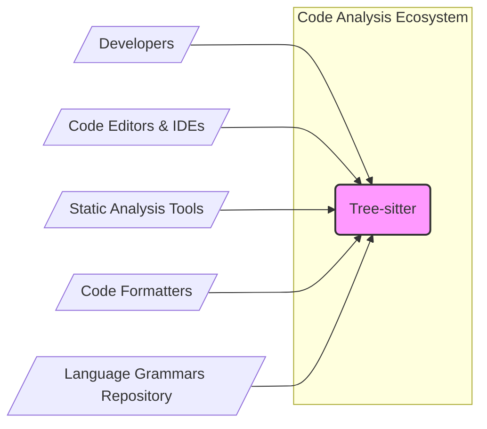

# BUSINESS POSTURE

The tree-sitter project aims to provide a fast, reliable, and language-agnostic parsing library. It enables developers to create tools that can efficiently parse source code, facilitating tasks such as syntax highlighting, code completion, refactoring, and static analysis. The project's primary goal is to improve the performance and accuracy of parsing compared to traditional regular expression-based or hand-written parsers.

Business Priorities and Goals:
- Provide a high-performance parsing solution.
- Support a wide range of programming languages through grammar definitions.
- Offer a stable and reliable API for integration into various tools.
- Foster a community around grammar development and parser usage.
- Enable advanced code analysis and manipulation capabilities.

Most Important Business Risks:
- Performance bottlenecks in the parsing engine impacting user experience in integrated tools.
- Inaccuracies in parsing due to grammar errors or engine limitations leading to incorrect tool behavior.
- Security vulnerabilities in the parsing engine that could be exploited by malicious code input.
- Lack of community adoption and grammar contributions hindering language support and project growth.
- Compatibility issues with different programming languages or tool environments.

# SECURITY POSTURE

Existing Security Controls:
- security control: Public code repository on GitHub, enabling community review and scrutiny. (Implemented: GitHub Repository)
- security control: Issue tracking system on GitHub for reporting and addressing bugs and potential vulnerabilities. (Implemented: GitHub Issues)
- security control: Standard GitHub access controls for repository contributors. (Implemented: GitHub Permissions)

Accepted Risks:
- accepted risk: Reliance on community contributions for grammar quality and security.
- accepted risk: Potential for vulnerabilities to be discovered in the core parsing engine due to its complexity.
- accepted risk: Open source nature implies public disclosure of vulnerabilities once identified.

Recommended Security Controls:
- security control: Implement automated static analysis security testing (SAST) in the CI/CD pipeline to identify potential code vulnerabilities.
- security control: Integrate dependency scanning to detect and manage vulnerabilities in third-party libraries used by tree-sitter.
- security control: Conduct regular security audits and penetration testing, especially focusing on parser robustness against malicious inputs.
- security control: Establish a clear vulnerability disclosure and response process to handle security issues effectively.
- security control: Implement fuzz testing to automatically discover parsing errors and potential security vulnerabilities caused by unexpected or malformed inputs.

Security Requirements:
- Authentication: Not directly applicable as tree-sitter is a library and CLI tool, not a user-facing application requiring authentication.
- Authorization: Not directly applicable as tree-sitter does not manage user access or permissions.
- Input Validation: Critical. The parser must robustly handle potentially malicious or malformed input code without crashing or exhibiting unexpected behavior. Grammars should be designed to prevent injection vulnerabilities.
- Cryptography: Not directly applicable to the core parsing functionality. However, if tree-sitter is used in tools that handle sensitive data, those tools will need to implement appropriate cryptography.

# DESIGN

## C4 CONTEXT



Context Diagram Elements:

- Element:
    - Name: Developers
    - Type: Person
    - Description: Software developers who use tree-sitter to build tools or integrate parsing capabilities into their applications. They also contribute to grammar development and the tree-sitter project itself.
    - Responsibilities: Use tree-sitter library and CLI, develop and maintain language grammars, contribute to the tree-sitter project.
    - Security controls: Secure development practices on their local machines, secure contribution process via GitHub (code review, pull requests).

- Element:
    - Name: Code Editors & IDEs
    - Type: Software System
    - Description: Integrated Development Environments and code editors that integrate tree-sitter for features like syntax highlighting, code folding, and code navigation.
    - Responsibilities: Utilize tree-sitter library for parsing code, provide user interface for code editing and analysis features.
    - Security controls: Input validation of code opened in the editor, secure plugin architecture if tree-sitter integration is provided as a plugin.

- Element:
    - Name: Static Analysis Tools
    - Type: Software System
    - Description: Tools that use tree-sitter to parse code and perform static analysis for bug detection, security vulnerability scanning, and code quality checks.
    - Responsibilities: Parse code using tree-sitter, implement static analysis algorithms, report analysis results.
    - Security controls: Secure handling of analyzed code, secure reporting of analysis results, input validation of code to be analyzed.

- Element:
    - Name: Code Formatters
    - Type: Software System
    - Description: Tools that use tree-sitter to parse code and reformat it according to defined style rules.
    - Responsibilities: Parse code using tree-sitter, apply formatting rules based on the parsed syntax tree, output formatted code.
    - Security controls: Secure handling of code to be formatted, ensure formatting process does not introduce vulnerabilities.

- Element:
    - Name: Language Grammars Repository
    - Type: Software System
    - Description: Repository (like GitHub or similar) where language grammar definitions for tree-sitter are stored and managed.
    - Responsibilities: Store and version control language grammar files, provide access to grammars for tree-sitter users.
    - Security controls: Access control to grammar repository, integrity checks for grammar files, version control to track changes.

- Element:
    - Name: Tree-sitter
    - Type: Software System
    - Description: The tree-sitter parsing library and command-line interface. It takes source code and a language grammar as input and produces a concrete syntax tree.
    - Responsibilities: Parse source code according to provided grammar, generate syntax tree, provide API for tree traversal and manipulation.
    - Security controls: Robust parsing logic to handle malicious inputs, input validation of grammar files, secure build process to prevent supply chain attacks.

## C4 CONTAINER

```mermaid
flowchart LR
    subgraph "Code Analysis Ecosystem"
        subgraph "Tree-sitter System"
            CoreLib("Core Library (C/C++)")
            CLI("Command-Line Interface")
            Grammars("Language Grammars")
        end
    end

    U[/"Developers"/] --> CLI
    T[/"Code Editors & IDEs"/] --> CoreLib
    A[/"Static Analysis Tools"/] --> CoreLib
    F[/"Code Formatters"/] --> CoreLib
    Grammars --> CoreLib

    style "Tree-sitter System" fill:#ccf,stroke:#333,stroke-width:2px
    style CoreLib fill:#fcf,stroke:#333,stroke-width:1px
    style CLI fill:#fcf,stroke:#333,stroke-width:1px
    style Grammars fill:#fcf,stroke:#333,stroke-width:1px
```

Container Diagram Elements:

- Element:
    - Name: Core Library (C/C++)
    - Type: Container
    - Description: The core parsing engine of tree-sitter, implemented in C and C++. It provides the main API for parsing code and interacting with syntax trees.
    - Responsibilities: Efficient and accurate parsing of source code, syntax tree generation, API for tree traversal and manipulation, grammar loading and management.
    - Security controls: Memory safety in C/C++ code, input validation within parsing logic, fuzz testing to identify parsing vulnerabilities, static analysis during development.

- Element:
    - Name: Command-Line Interface (CLI)
    - Type: Container
    - Description: A command-line tool built on top of the core library. It allows developers to parse code, query syntax trees, and test grammars from the command line.
    - Responsibilities: Provide command-line interface to tree-sitter functionality, facilitate grammar testing and development, demonstrate library usage.
    - Security controls: Input validation of command-line arguments and input files, secure handling of output data, limited privileges for CLI execution.

- Element:
    - Name: Language Grammars
    - Type: Container
    - Description: Collections of grammar definition files (typically `.grammar` files) that describe the syntax of different programming languages. These grammars are used by the core library to parse code.
    - Responsibilities: Define the syntax rules for specific programming languages, enable parsing of different languages by the core library, be maintained and updated to reflect language evolution.
    - Security controls: Grammar validation to prevent parsing errors, community review of grammars to ensure correctness and prevent malicious grammar constructs, version control of grammars.

## DEPLOYMENT

Deployment Architecture: Library Distribution

```mermaid
flowchart LR
    subgraph "Developer Machine"
        DevEnv[/"Development Environment"/]
        TSLibDev[/"Tree-sitter Library"/]
    end
    subgraph "Package Registry (npm, crates.io, etc.)"
        PkgRegistry[/"Package Registry"/]
        TSLibPkg[/"Tree-sitter Library Package"/]
    end
    subgraph "User Machine (Editor, Tool)"
        UserEnv[/"User Environment"/]
        TSLibUser[/"Tree-sitter Library"/]
        EditorTool[/"Editor or Tool"/]
    end

    DevEnv --> PkgRegistry: Publish
    PkgRegistry --> UserEnv: Download/Install
    EditorTool --> TSLibUser: Use Library

    style "Developer Machine" fill:#eee,stroke:#333,stroke-width:1px
    style "Package Registry (npm, crates.io, etc.)" fill:#eee,stroke:#333,stroke-width:1px
    style "User Machine (Editor, Tool)" fill:#eee,stroke:#333,stroke-width:1px
    style TSLibDev fill:#fcf,stroke:#333,stroke-width:1px
    style TSLibPkg fill:#fcf,stroke:#333,stroke-width:1px
    style TSLibUser fill:#fcf,stroke:#333,stroke-width:1px
    style EditorTool fill:#fcf,stroke:#333,stroke-width:1px
```

Deployment Diagram Elements:

- Element:
    - Name: Development Environment
    - Type: Environment
    - Description: Developer's local machine where tree-sitter library is built and tested.
    - Responsibilities: Development, building, testing of tree-sitter library and grammars.
    - Security controls: Secure coding practices, local security tools (antivirus, firewall), secure access to development tools and dependencies.

- Element:
    - Name: Tree-sitter Library (Dev)
    - Type: Software
    - Description: The tree-sitter library built in the development environment.
    - Responsibilities: Parsing functionality, API for integration.
    - Security controls: Static analysis, unit testing, integration testing during development.

- Element:
    - Name: Package Registry
    - Type: Infrastructure
    - Description: Online package registries like npm, crates.io, etc., used to distribute tree-sitter library packages.
    - Responsibilities: Hosting and distributing tree-sitter library packages, managing package versions.
    - Security controls: Package integrity checks, malware scanning of uploaded packages, access control for package publishing.

- Element:
    - Name: Tree-sitter Library Package
    - Type: Software Package
    - Description: Packaged version of the tree-sitter library distributed through package registries.
    - Responsibilities: Provide installable and distributable format of the library.
    - Security controls: Signed packages to ensure integrity and authenticity, checksums for package verification.

- Element:
    - Name: User Environment
    - Type: Environment
    - Description: User's machine where code editors, IDEs, or other tools that use tree-sitter are installed.
    - Responsibilities: Running code editors and tools that integrate tree-sitter.
    - Security controls: User machine security practices, secure software installation, operating system security controls.

- Element:
    - Name: Tree-sitter Library (User)
    - Type: Software
    - Description: Tree-sitter library installed on the user's machine as part of an editor or tool.
    - Responsibilities: Providing parsing functionality within the user's editor or tool.
    - Security controls: Library security features, integration security within the editor or tool.

- Element:
    - Name: Editor or Tool
    - Type: Software System
    - Description: Code editors, IDEs, static analysis tools, or code formatters that integrate and use the tree-sitter library.
    - Responsibilities: Provide code editing, analysis, or formatting features using tree-sitter.
    - Security controls: Secure integration with tree-sitter, input validation of user code, secure handling of parsed data.

## BUILD

Build Process: GitHub Actions based CI

```mermaid
flowchart LR
    subgraph "Developer"
        DevMachine[/"Developer Machine"/]
        CodeChanges[/"Code Changes"/]
    end
    subgraph "GitHub"
        GitHubRepo[/"GitHub Repository"/]
        GitHubActions[/"GitHub Actions CI"/]
        BuildArtifacts[/"Build Artifacts"/]
    end
    subgraph "Package Registry"
        PkgRegistry[/"Package Registry"/]
        PublishedPkg[/"Published Package"/]
    end

    DevMachine --> GitHubRepo: Push Code
    GitHubRepo --> GitHubActions: Trigger Build
    GitHubActions --> BuildArtifacts: Create Artifacts
    BuildArtifacts --> PkgRegistry: Publish Package

    style "Developer" fill:#eee,stroke:#333,stroke-width:1px
    style "GitHub" fill:#eee,stroke:#333,stroke-width:1px
    style "Package Registry" fill:#eee,stroke:#333,stroke-width:1px
    style DevMachine fill:#fcf,stroke:#333,stroke-width:1px
    style GitHubRepo fill:#fcf,stroke:#333,stroke-width:1px
    style GitHubActions fill:#fcf,stroke:#333,stroke-width:1px
    style BuildArtifacts fill:#fcf,stroke:#333,stroke-width:1px
    style PkgRegistry fill:#fcf,stroke:#333,stroke-width:1px
    style PublishedPkg fill:#fcf,stroke:#333,stroke-width:1px
    style CodeChanges fill:#fcf,stroke:#333,stroke-width:1px
```

Build Diagram Elements:

- Element:
    - Name: Developer Machine
    - Type: Environment
    - Description: Developer's local machine where code changes are made.
    - Responsibilities: Writing and testing code, committing and pushing changes to the repository.
    - Security controls: Secure development practices, code review before commit, local security tools.

- Element:
    - Name: Code Changes
    - Type: Data
    - Description: Source code modifications made by developers.
    - Responsibilities: Implementing new features, fixing bugs, updating grammars.
    - Security controls: Code review process, version control system (Git).

- Element:
    - Name: GitHub Repository
    - Type: Code Repository
    - Description: Central repository hosting the tree-sitter project code.
    - Responsibilities: Version control, code storage, collaboration platform.
    - Security controls: Access control, branch protection, audit logs, vulnerability scanning by GitHub.

- Element:
    - Name: GitHub Actions CI
    - Type: CI/CD System
    - Description: GitHub's built-in CI/CD service used for automated building, testing, and publishing of tree-sitter.
    - Responsibilities: Automated build process, running tests, static analysis, creating build artifacts, publishing packages.
    - Security controls: Secure build pipelines, secrets management, dependency scanning, SAST integration, build artifact signing.

- Element:
    - Name: Build Artifacts
    - Type: Software Artifacts
    - Description: Compiled libraries, CLI executables, and other build outputs produced by the CI system.
    - Responsibilities: Distributable components of tree-sitter.
    - Security controls: Integrity checks (checksums), signing of artifacts, secure storage of artifacts before publishing.

- Element:
    - Name: Package Registry
    - Type: Package Repository
    - Description: Online package registries (npm, crates.io, etc.) where tree-sitter packages are published.
    - Responsibilities: Distribution of tree-sitter packages to users.
    - Security controls: Package integrity checks, malware scanning, access control for publishing, package signing.

- Element:
    - Name: Published Package
    - Type: Software Package
    - Description: Final distributable package of tree-sitter available in package registries.
    - Responsibilities: Providing users with installable and usable version of tree-sitter.
    - Security controls: Signed packages, checksums, versioning.

# RISK ASSESSMENT

Critical Business Processes:
- Reliable and accurate parsing of source code across supported languages.
- Stable and performant API for integration into developer tools.
- Secure and timely delivery of updates and bug fixes.
- Community contribution and maintenance of language grammars.

Data to Protect:
- Source code of tree-sitter library and CLI: Sensitivity - Publicly available, but integrity and availability are crucial.
- Language grammar definitions: Sensitivity - Publicly available, but integrity and correctness are important.
- Build artifacts and release packages: Sensitivity - Publicly available, but integrity and authenticity are critical to prevent supply chain attacks.

Data Sensitivity:
- Publicly available code and grammars, but integrity is paramount.
- Build artifacts require high integrity and authenticity to ensure users are not downloading compromised versions.

# QUESTIONS & ASSUMPTIONS

Questions:
- What are the specific performance requirements for parsing in different use cases (e.g., real-time syntax highlighting vs. batch static analysis)?
- Are there any specific compliance requirements (e.g., for handling user data in tools that integrate tree-sitter)?
- What is the expected level of security assurance required by users of tree-sitter in different contexts (e.g., open-source tools vs. commercial products)?
- What are the plans for long-term maintenance and security updates for tree-sitter?
- Are there any specific languages or grammar features that are considered high priority for security hardening?

Assumptions:
- BUSINESS POSTURE: The primary business goal is to provide a widely adopted, high-quality parsing library for the open-source community and commercial tool developers. Performance and accuracy are key drivers for adoption.
- SECURITY POSTURE: Security is considered important, but the project is likely operating with standard open-source security practices. There is room for improvement in proactive security measures like automated security testing and formal vulnerability management.
- DESIGN: The architecture is centered around a core C/C++ library with a CLI tool and language grammars as key components. Deployment is primarily through package registries for library distribution. The build process is assumed to be using GitHub Actions for CI.