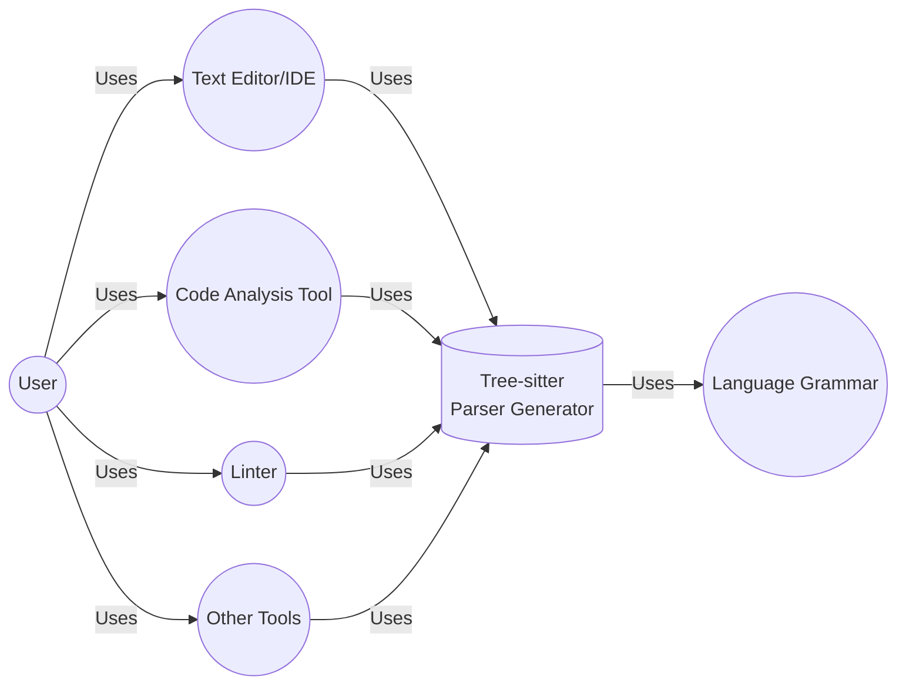
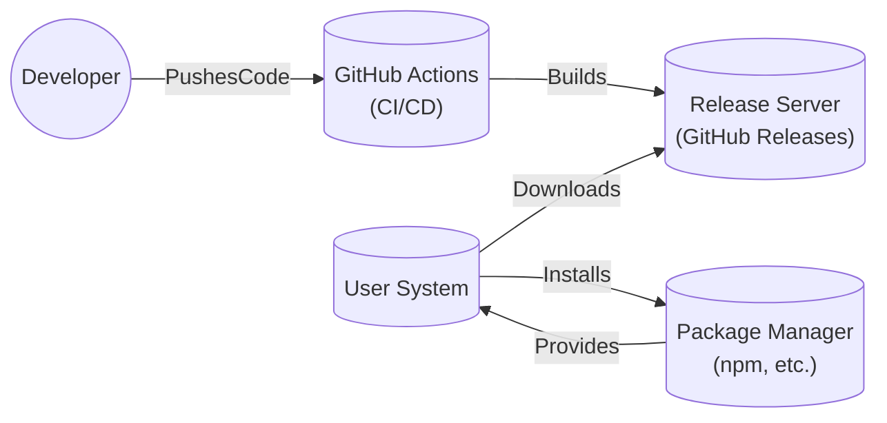
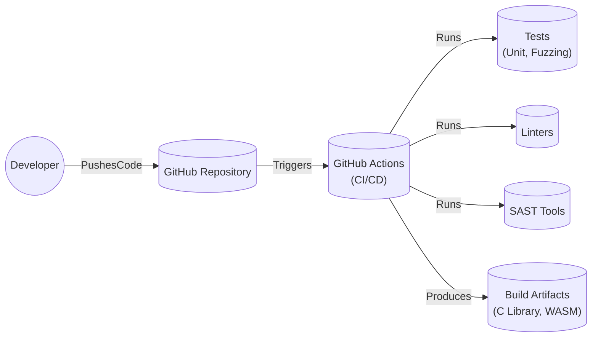

# BUSINESS POSTURE

Business Priorities and Goals:

*   Maintainability: Tree-sitter aims to be a core library used in many different applications, so maintainability and stability are crucial.
*   Performance: As a parser generator used in text editors and IDEs, parsing speed and efficiency are paramount.
*   Accuracy: The generated parsers must correctly parse code according to the defined grammars, minimizing errors and inconsistencies.
*   Extensibility: The ability to easily create and maintain grammars for new languages and update existing ones is a key goal.
*   Community Adoption: Wide adoption by developers and integration into popular tools increases the project's impact and sustainability.

Most Important Business Risks:

*   Inaccurate Parsing: Incorrectly parsed code can lead to security vulnerabilities in tools that rely on Tree-sitter, such as code analysis tools, linters, and syntax highlighters.
*   Performance Bottlenecks: Slow parsing can negatively impact the user experience of applications using Tree-sitter, making them feel sluggish.
*   Lack of Adoption: If Tree-sitter fails to gain traction within the developer community, its long-term viability and maintenance could be at risk.
*   Security Vulnerabilities in Parsers: Flaws in generated parsers could be exploited, potentially leading to vulnerabilities in applications that use them.
*   Supply Chain Attacks: Compromise of the Tree-sitter library or its dependencies could introduce vulnerabilities into numerous downstream projects.

# SECURITY POSTURE

Existing Security Controls:

*   security control: Fuzzing: The project uses fuzzing (OSS-Fuzz) to test the robustness of the parser against unexpected inputs. (Mentioned in the README and repository structure).
*   security control: Code Reviews: Pull requests are used for code changes, implying a code review process. (Standard GitHub practice).
*   security control: Static Analysis: Some C code analysis is likely performed, although not explicitly stated.
*   security control: Tests: Unit tests are present to verify the functionality of the parser.

Accepted Risks:

*   accepted risk: Complexity of Parsing: Parsing is inherently complex, and while fuzzing helps, there's an accepted risk of undiscovered edge cases that could lead to crashes or incorrect parsing.
*   accepted risk: Reliance on Third-Party Libraries: Tree-sitter has dependencies, and vulnerabilities in those dependencies could affect Tree-sitter.
*   accepted risk: Grammar Errors: The correctness of the parsing heavily relies on the accuracy of the language grammars, which are often community-contributed. Errors in grammars can lead to parsing issues.

Recommended Security Controls:

*   security control: Regular Security Audits: Conduct periodic security audits of the codebase and generated parsers.
*   security control: Dependency Management: Implement a robust dependency management system to track and update dependencies, mitigating supply chain risks. Use tools like Dependabot.
*   security control: Static Application Security Testing (SAST): Integrate SAST tools into the build process to automatically identify potential vulnerabilities in the C and JavaScript code.
*   security control: Dynamic Application Security Testing (DAST): While fuzzing is a form of DAST, consider additional DAST tools that can analyze the behavior of the parser at runtime.
*   security control: Signed Releases: Digitally sign releases to ensure the integrity of distributed binaries.
*   security control: Security.md: Create a SECURITY.md file in the repository to provide clear instructions on how to report security vulnerabilities.

Security Requirements:

*   Authentication: Not directly applicable to the core Tree-sitter library, as it's a parser generator. However, any web-based components or tools built around Tree-sitter (e.g., online grammar playgrounds) should implement secure authentication mechanisms.
*   Authorization: Not directly applicable to the core library. However, if Tree-sitter is integrated into systems with authorization requirements, the integration should respect those requirements.
*   Input Validation: Crucial for security. The parser must handle invalid or malicious input gracefully, without crashing or leading to vulnerabilities. Fuzzing is a key component of this. Grammars should be designed to be as restrictive as possible, minimizing the attack surface.
*   Cryptography: Not directly used in the core parsing functionality. However, if Tree-sitter is used to parse or generate code that includes cryptographic operations, it should not interfere with the correct implementation of those operations. Any web components should use HTTPS.
*   Error Handling: The parser should handle errors gracefully, providing informative error messages without revealing sensitive information.

# DESIGN

## C4 CONTEXT



Element List:

*   Element:
    *   Name: User
    *   Type: Person
    *   Description: A developer or end-user interacting with tools that utilize Tree-sitter.
    *   Responsibilities: Uses text editors, IDEs, code analysis tools, and other applications that integrate Tree-sitter for parsing.
    *   Security controls: Not directly applicable.

*   Element:
    *   Name: Tree-sitter
    *   Type: Software System
    *   Description: A parser generator library that creates parsers for various programming languages.
    *   Responsibilities: Generates parsers based on provided grammars, provides an API for parsing code and querying the resulting syntax tree.
    *   Security controls: Fuzzing, Code Reviews, Unit Tests.

*   Element:
    *   Name: Text Editor/IDE
    *   Type: Software System
    *   Description: Applications like VS Code, Atom, or other IDEs that use Tree-sitter for syntax highlighting, code completion, and other features.
    *   Responsibilities: Provides a user interface for editing code, integrates Tree-sitter for parsing, and displays the parsed code with syntax highlighting.
    *   Security controls: Dependent on the specific text editor/IDE implementation.

*   Element:
    *   Name: Code Analysis Tool
    *   Type: Software System
    *   Description: Tools that analyze code for potential bugs, vulnerabilities, or style issues.
    *   Responsibilities: Uses Tree-sitter to parse code and perform static analysis based on the resulting syntax tree.
    *   Security controls: Dependent on the specific code analysis tool implementation.

*   Element:
    *   Name: Linter
    *   Type: Software System
    *   Description: Tools that check code for stylistic errors and potential bugs.
    *   Responsibilities: Uses Tree-sitter to parse code and enforce coding style rules.
    *   Security controls: Dependent on the specific linter implementation.

*   Element:
    *   Name: Other Tools
    *   Type: Software System
    *   Description: Any other application that might utilize Tree-sitter for parsing, such as code formatters, documentation generators, or refactoring tools.
    *   Responsibilities: Varies depending on the specific tool.
    *   Security controls: Dependent on the specific tool implementation.

*   Element:
    *   Name: Language Grammar
    *   Type: Data
    *   Description: A formal description of the syntax of a programming language, used by Tree-sitter to generate a parser.
    *   Responsibilities: Defines the rules for parsing a specific language.
    *   Security controls: Grammar reviews, validation, and testing.

## C4 CONTAINER

```mermaid
graph LR
    User((User))
    TreeSitterAPI[("Tree-sitter API\n(C, WASM)")]
    Parser[("Generated Parser\n(C)")]
    LanguageGrammar(("Language Grammar\n(JavaScript)")]
    TextEditor(("Text Editor/IDE"))

    User -- Uses --> TextEditor
    TextEditor -- Uses --> TreeSitterAPI
    TreeSitterAPI -- Uses --> Parser
    Parser -- Uses --> LanguageGrammar

```

Element List:

*   Element:
    *   Name: User
    *   Type: Person
    *   Description: A developer or end-user interacting with a text editor or IDE.
    *   Responsibilities: Uses text editors, IDEs.
    *   Security controls: Not directly applicable.

*   Element:
    *   Name: Tree-sitter API
    *   Type: API
    *   Description: The interface through which applications interact with Tree-sitter.  Provides functions for parsing, querying the syntax tree, and managing parsers. Available in C and WebAssembly.
    *   Responsibilities: Exposes Tree-sitter's functionality to other applications.
    *   Security controls: Input validation, error handling.

*   Element:
    *   Name: Generated Parser
    *   Type: Library
    *   Description:  The C code generated by Tree-sitter from a language grammar.  This is the core parsing engine.
    *   Responsibilities: Parses code according to the provided grammar and produces a syntax tree.
    *   Security controls: Fuzzing, Code Reviews.

*   Element:
    *   Name: Language Grammar
    *   Type: Data
    *   Description: A JavaScript file defining the syntax of a programming language.
    *   Responsibilities: Defines the rules for parsing a specific language.
    *   Security controls: Grammar reviews, validation, and testing.

*   Element:
    *   Name: Text Editor/IDE
    *   Type: Software System
    *   Description: Applications like VS Code, Atom, or other IDEs that use Tree-sitter for syntax highlighting, code completion, and other features.
    *   Responsibilities: Provides a user interface for editing code, integrates Tree-sitter for parsing, and displays the parsed code with syntax highlighting.
    *   Security controls: Dependent on the specific text editor/IDE implementation.

## DEPLOYMENT

Possible Deployment Solutions:

1.  **Local Compilation and Linking:** Users compile Tree-sitter from source and link it with their applications.
2.  **Pre-built Binaries:** Tree-sitter provides pre-built binaries for various platforms, which users can download and use.
3.  **Package Managers:** Tree-sitter is distributed through package managers (e.g., npm for the WebAssembly version, potentially others for native bindings).
4.  **WebAssembly:** The WebAssembly version can be used directly in web browsers or Node.js environments.

Chosen Solution (Pre-built Binaries and Package Managers):



Element List:

*   Element:
    *   Name: GitHub Actions
    *   Type: CI/CD System
    *   Description: Automates the build, test, and release process.
    *   Responsibilities: Runs tests, builds binaries for different platforms, and publishes releases.
    *   Security controls: Access controls, secure configuration, dependency scanning.

*   Element:
    *   Name: Developer
    *   Type: Person
    *   Description: Contributes code to the Tree-sitter project.
    *   Responsibilities: Writes code, creates pull requests, and participates in code reviews.
    *   Security controls: Code reviews, secure coding practices.

*   Element:
    *   Name: Release Server
    *   Type: Server
    *   Description: Stores and distributes released versions of Tree-sitter (likely GitHub Releases).
    *   Responsibilities: Provides a download location for pre-built binaries.
    *   Security controls: Access controls, integrity checks (e.g., checksums).

*   Element:
    *   Name: User System
    *   Type: System
    *   Description: The user's development or runtime environment.
    *   Responsibilities: Downloads and uses Tree-sitter binaries or installs them via a package manager.
    *   Security controls: Standard system security practices.

*   Element:
    *   Name: Package Manager
    *   Type: System
    *   Description: A system for managing software packages (e.g., npm for JavaScript).
    *   Responsibilities: Downloads, installs, and updates Tree-sitter packages.
    *   Security controls: Package integrity checks, dependency management.

## BUILD



Build Process Description:

1.  **Code Commit:** A developer commits code changes to the GitHub repository.
2.  **GitHub Actions Trigger:** The commit triggers a GitHub Actions workflow.
3.  **Linting:** Linters (e.g., for C and JavaScript) are run to check for code style and potential errors.
4.  **Static Analysis (SAST):** SAST tools are run to identify potential security vulnerabilities in the code.
5.  **Testing:** Unit tests and fuzzing tests are executed to verify the functionality and robustness of the parser.
6.  **Build:** If all tests and checks pass, the build process compiles the C code and generates the WebAssembly module.
7.  **Artifact Creation:** The build process produces build artifacts, including the compiled C library and the WebAssembly module.
8.  **Release (Optional):** If the workflow is configured for a release, the build artifacts are packaged and published (e.g., to GitHub Releases or npm).

Security Controls in Build Process:

*   security control: GitHub Actions: Provides a secure and automated build environment.
*   security control: Linters: Enforce coding standards and help prevent common errors.
*   security control: SAST Tools: Automatically identify potential security vulnerabilities.
*   security control: Tests (Unit and Fuzzing): Verify the correctness and robustness of the code.
*   security control: Dependency Management (not shown in diagram, but crucial): Regularly scan and update dependencies to mitigate supply chain risks.

# RISK ASSESSMENT

Critical Business Processes to Protect:

*   **Code Parsing:** The core functionality of Tree-sitter must be reliable and secure.
*   **Grammar Management:** The process of creating, updating, and distributing language grammars needs to be protected from malicious modifications.
*   **Software Distribution:** The build and release process must be secure to prevent the distribution of compromised binaries.

Data to Protect and Sensitivity:

*   **Source Code (Indirectly):** Tree-sitter itself doesn't store source code, but it processes it. The sensitivity of the source code depends on the application using Tree-sitter. If Tree-sitter is used in a security-sensitive context (e.g., a code analysis tool analyzing proprietary code), then the confidentiality of that code is indirectly a concern.
*   **Language Grammars:** These are generally public, but their integrity is crucial. Malicious modifications to grammars could lead to vulnerabilities. Sensitivity: Medium.
*   **Build Artifacts (Binaries):** The integrity of the distributed binaries is paramount. Compromised binaries could lead to widespread vulnerabilities. Sensitivity: High.

# QUESTIONS & ASSUMPTIONS

Questions:

*   What specific SAST tools are currently used, if any?
*   Are there any plans to support formal grammar verification?
*   What is the process for reviewing and accepting community-contributed grammars?
*   Are there any specific performance benchmarks or targets that Tree-sitter aims to meet?
*   What is the long-term strategy for maintaining and evolving Tree-sitter?
*   Are there any specific security certifications or compliance requirements that Tree-sitter needs to meet?

Assumptions:

*   BUSINESS POSTURE: Assumed that maintainability, performance, accuracy, extensibility, and community adoption are the primary business goals.
*   SECURITY POSTURE: Assumed that code reviews are performed for all pull requests. Assumed that some level of static analysis is performed, even if not explicitly documented. Assumed that the project is aware of the risks associated with parsing complexity and third-party dependencies.
*   DESIGN: Assumed that GitHub Actions is used for CI/CD. Assumed that the primary distribution methods are pre-built binaries and package managers. Assumed that the WebAssembly version is a key component for web-based applications.