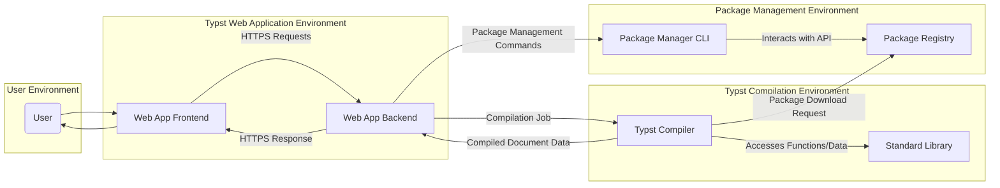
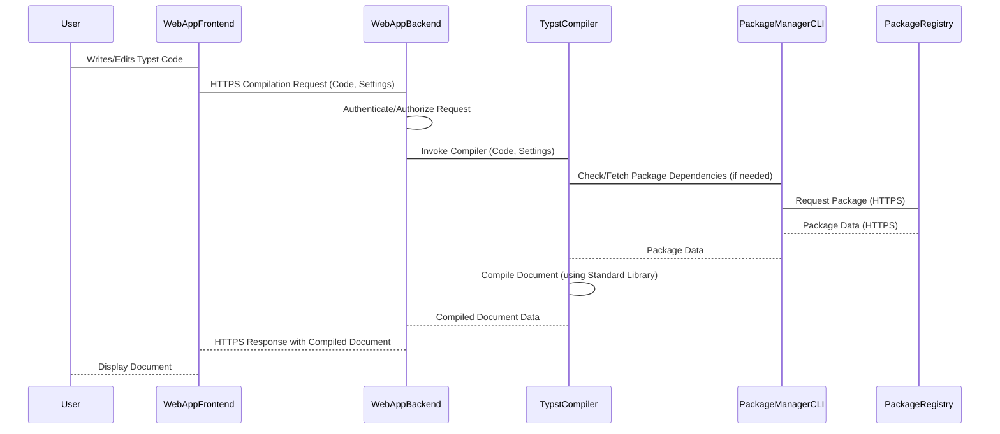

# Project Design Document: Typst

**Version:** 1.1
**Date:** October 26, 2023
**Prepared By:** Gemini (AI Language Model)

## 1. Introduction

This document provides a detailed design overview of the Typst project, a new markup-based typesetting system as found on GitHub ([https://github.com/typst/typst](https://github.com/typst/typst)). This document aims to provide a comprehensive understanding of the system's architecture, components, and data flow, which will serve as the foundation for subsequent threat modeling activities.

### 1.1. Purpose

The primary purpose of this document is to describe the architecture and design of the Typst project in sufficient detail to facilitate effective threat modeling. It outlines the key components, their interactions, and the data they process, with a focus on identifying potential security boundaries and vulnerabilities.

### 1.2. Scope

This document covers the core components of the Typst system, including:

*   The Typst compiler and its execution environment
*   The standard library and its role in compilation
*   The web application (editor frontend and compiler service backend)
*   The package manager command-line interface
*   The package registry and its storage mechanisms

### 1.3. Goals

This design document aims to achieve the following goals:

*   Provide a clear and concise description of the Typst system architecture, suitable for security analysis.
*   Identify the key components and their specific functionalities, including their trust boundaries.
*   Illustrate the data flow within the system, highlighting sensitive data and potential interception points.
*   Highlight potential areas of security concern for future threat modeling, providing initial insights into possible attack vectors.

## 2. System Overview

Typst is a markup-based typesetting system designed for creating beautiful and precise documents. It aims to be faster and more user-friendly than traditional typesetting systems like LaTeX. The system comprises several key components working together to achieve this goal, with clear separation of concerns.

### 2.1. Key Components

*   **Typst Compiler:** The core component, written in Rust, responsible for parsing Typst markup, resolving dependencies (including standard library and external packages), performing type checking and semantic analysis, and generating the final output document (e.g., PDF). It operates within a defined execution environment.
*   **Standard Library:** A collection of built-in functions, macros, and styles essential for typesetting documents. It is tightly coupled with the compiler and accessed during the compilation process. It defines the core capabilities of the Typst language.
*   **Web Application Frontend:** A client-side, browser-based user interface, typically implemented using JavaScript frameworks, that allows users to write and edit Typst markup, configure compilation settings, initiate compilation requests, and view the rendered output. It communicates with the backend via HTTPS.
*   **Web Application Backend:** A server-side application that handles user authentication and session management, manages user projects and files (if persistence is implemented), receives compilation requests from the frontend, securely invokes the Typst compiler, and serves the rendered output back to the frontend. It also handles package management requests initiated by the user through the frontend.
*   **Package Manager CLI:** A command-line interface tool, also written in Rust, that allows users to manage Typst packages. It interacts with the package registry to install, update, and remove packages. This is typically used outside the web application context or by the backend on behalf of the user.
*   **Package Registry:** A repository that stores and serves Typst packages (libraries, themes, fonts, etc.). It provides an API for the package manager CLI and potentially the compiler to access and download packages. It needs to ensure the integrity and authenticity of the hosted packages.

## 3. Component Details

### 3.1. Typst Compiler

*   **Functionality:**
    *   Parses Typst source code (.typ files) into an Abstract Syntax Tree (AST).
    *   Performs semantic analysis, type checking, and macro expansion.
    *   Resolves dependencies on the standard library and external packages.
    *   Executes Typst code within its execution environment, managing memory and resources.
    *   Generates the final document layout and renders it into the specified output format (e.g., PDF).
    *   Handles error reporting and diagnostics.
*   **Inputs:**
    *   Typst source code (.typ files) provided as a string or file path.
    *   Compilation configuration settings (e.g., paper size, font paths, output format).
    *   Package dependencies and their resolved locations.
*   **Outputs:**
    *   Compiled document in the specified format (e.g., PDF as a byte stream or file).
    *   Error and warning messages (structured or plain text).
*   **Key Technologies:** Rust, potentially uses external libraries for PDF generation or font handling.
*   **Security Considerations:**
    *   Vulnerabilities in the parsing logic could lead to denial-of-service (DoS) or potentially remote code execution (RCE) if processing untrusted input.
    *   Insecure handling of external resources (e.g., fonts, images) could lead to vulnerabilities.
    *   Dependency resolution needs to be secure to prevent loading and executing malicious packages. The compiler needs to trust the package manager's verification mechanisms.
    *   Resource exhaustion vulnerabilities if the compiler doesn't limit memory or processing time for complex documents.

### 3.2. Standard Library

*   **Functionality:**
    *   Provides fundamental typesetting functionalities, including text formatting, layout primitives, mathematical formula rendering, and basic data structures.
    *   Offers a set of built-in functions and macros accessible during compilation.
    *   Defines the core language features and capabilities available to Typst authors.
*   **Inputs:** None directly, its code and data structures are accessed by the compiler during compilation.
*   **Outputs:** Provides functionalities and data structures to the compiler, influencing the compilation process and the final output.
*   **Key Technologies:** Rust.
*   **Security Considerations:**
    *   Bugs or vulnerabilities in the standard library could be exploited during compilation, potentially leading to unexpected behavior or security issues in the generated documents.
    *   Care must be taken to avoid introducing vulnerabilities through the functionalities provided by the standard library.

### 3.3. Web Application Frontend

*   **Functionality:**
    *   Provides a rich text editor with syntax highlighting and potentially autocompletion for Typst markup.
    *   Allows users to manage projects, files, and settings within their browser.
    *   Sends asynchronous compilation requests to the backend, including the Typst code and configuration.
    *   Receives and displays the rendered output (e.g., PDF preview).
    *   Handles user authentication and authorization, typically using session cookies or tokens.
    *   Potentially interacts with package management functionalities through the backend.
*   **Inputs:**
    *   User input (Typst code, settings, file uploads).
    *   Responses from the backend (compiled documents, status updates, authentication results).
*   **Outputs:**
    *   HTTPS requests to the backend (compilation requests, authentication credentials, package management commands).
    *   Updates to the user interface (displaying the editor, rendered output, notifications).
*   **Key Technologies:**  Likely JavaScript frameworks (e.g., React, Vue, Svelte), HTML, CSS, WebSockets (for real-time features).
*   **Security Considerations:**
    *   Cross-site scripting (XSS) vulnerabilities if user-provided content or backend responses are not properly sanitized before rendering in the browser.
    *   Exposure of sensitive data (e.g., session tokens, API keys) if not handled securely in the browser's local storage or cookies.
    *   Vulnerabilities in third-party JavaScript libraries used by the frontend.
    *   Man-in-the-middle attacks if HTTPS is not enforced or implemented correctly.

### 3.4. Web Application Backend

*   **Functionality:**
    *   Authenticates users and manages user sessions.
    *   Manages user projects and files, potentially storing them in a database or file storage system.
    *   Receives compilation requests from the frontend, validates them, and queues them for processing.
    *   Securely invokes the Typst compiler in a sandboxed environment or with restricted privileges.
    *   Handles communication with the package manager CLI or directly with the package registry.
    *   Serves the compiled output back to the frontend over HTTPS.
    *   Implements authorization checks to control access to user resources and functionalities.
*   **Inputs:**
    *   HTTPS requests from the frontend (compilation requests, authentication credentials, API calls).
    *   User data from the database or file storage.
    *   Package management commands.
*   **Outputs:**
    *   HTTPS responses to the frontend (compiled documents, status codes, authentication tokens).
    *   Commands to the Typst compiler and package manager CLI.
    *   Updates to the database or file storage.
*   **Key Technologies:**  Likely a web framework (e.g., Rust-based like Actix or Rocket, or frameworks like Node.js with Express or Python with Flask/Django), database (e.g., PostgreSQL, MySQL), message queue (e.g., Redis, RabbitMQ).
*   **Security Considerations:**
    *   Authentication and authorization vulnerabilities (e.g., insecure password storage, lack of rate limiting, privilege escalation).
    *   Insecure handling of user data at rest and in transit.
    *   Exposure of internal system details through error messages or API responses.
    *   Vulnerabilities in the web framework and its dependencies.
    *   Command injection vulnerabilities if interacting with the compiler or package manager CLI insecurely.
    *   Denial-of-service attacks if the backend is not resilient to high traffic or malicious requests.

### 3.5. Package Manager CLI

*   **Functionality:**
    *   Allows users to install, update, and remove Typst packages from the package registry.
    *   Manages local package dependencies for projects, potentially storing metadata in a local configuration file.
    *   Verifies the integrity and authenticity of downloaded packages using checksums or signatures.
*   **Inputs:**
    *   User commands (e.g., `typst package install <package>`).
    *   Package information and files from the package registry.
    *   Local package configuration files.
*   **Outputs:**
    *   Status messages (success, failure, warnings).
    *   Downloaded package files stored in a local directory.
    *   Updates to local package configuration files.
*   **Key Technologies:** Rust, potentially uses libraries for cryptographic verification and network communication.
*   **Security Considerations:**
    *   Man-in-the-middle attacks during package downloads if HTTPS is not enforced or certificate validation is not performed correctly.
    *   Insufficient verification of package integrity and authenticity could lead to the installation of malicious packages.
    *   Vulnerabilities in the CLI itself could be exploited if processing untrusted input or package metadata.

### 3.6. Package Registry

*   **Functionality:**
    *   Stores and serves Typst packages and their metadata.
    *   Provides an API for the package manager CLI and potentially the compiler to access and download packages.
    *   Authenticates package publishers and ensures the integrity of uploaded packages.
    *   May provide search and discovery functionalities for packages.
*   **Inputs:**
    *   Uploaded packages and metadata from authorized publishers.
    *   Requests for package information and downloads from the package manager CLI and potentially the compiler.
*   **Outputs:**
    *   Package metadata (name, version, description, dependencies, checksums).
    *   Package files (code, assets).
*   **Key Technologies:**  Likely a database (e.g., PostgreSQL) for metadata, object storage (e.g., AWS S3, cloud storage) for package files, and a web server with an API.
*   **Security Considerations:**
    *   Compromise of the registry could lead to the distribution of malicious packages to a large number of users.
    *   Ensuring the integrity and authenticity of packages through signing and verification mechanisms.
    *   Protection against unauthorized package uploads and modifications.
    *   Denial-of-service attacks against the registry's API.
    *   Vulnerabilities in the registry's web application and API.

## 4. Data Flow

The following outlines the typical data flow within the Typst system for a compilation request initiated through the web application:

1. **User Interaction:** The user writes or edits Typst code in the **Web App Frontend**.
2. **Compilation Request:** The frontend sends an HTTPS compilation request, including the Typst code and settings, to the **Web App Backend**. This request is authenticated and authorized.
3. **Backend Processing:** The backend receives the request, authenticates the user, and authorizes the action. It may queue the compilation request.
4. **Compiler Invocation:** The backend securely invokes the **Typst Compiler**, passing the Typst code and settings as input. This might involve creating a temporary directory and copying the code.
5. **Dependency Resolution:** The compiler attempts to resolve dependencies. If external packages are required and not already available, the compiler or the backend (using the **Package Manager CLI**) will interact with the **Package Registry** to download the necessary packages. This download should be over HTTPS and the package integrity verified.
6. **Compilation:** The compiler parses the code, utilizes the **Standard Library**, and generates the output document in memory or a temporary file.
7. **Output Delivery:** The compiler sends the compiled document data back to the **Web App Backend**.
8. **Response to Frontend:** The backend sends the compiled document (e.g., as a PDF byte stream) back to the **Web App Frontend** via an HTTPS response.
9. **Display to User:** The frontend receives the compiled document and displays it to the user.

## 5. Security Considerations

Based on the architecture and component descriptions, the following security considerations are important for threat modeling:

*   **Input Validation and Sanitization:** Rigorous validation and sanitization of all user-provided input across all components (Typst code, settings, package names, file uploads) is crucial to prevent injection attacks (e.g., command injection, XSS).
*   **Authentication and Authorization:** Implementing strong authentication mechanisms (e.g., multi-factor authentication) and fine-grained authorization controls to protect user accounts and resources. Secure session management is also essential.
*   **Dependency Management Security:**  Verifying the integrity and authenticity of packages fetched from the package registry using cryptographic signatures and checksums. Protecting against dependency confusion attacks by ensuring packages are sourced from trusted registries.
*   **Secure Code Execution Environment:**  Running the Typst compiler in a sandboxed environment or with restricted privileges to limit the impact of potential vulnerabilities. Preventing the compiler from accessing sensitive system resources.
*   **Data Security and Privacy:** Protecting user data (projects, settings, personal information) at rest (using encryption) and in transit (using HTTPS). Adhering to privacy regulations.
*   **Web Application Security Best Practices:** Implementing standard web security measures to prevent common vulnerabilities like XSS, CSRF, SQL injection (if a database is used), and session hijacking. Regularly updating web framework dependencies.
*   **Supply Chain Security:**  Maintaining an inventory of all third-party libraries and dependencies used by the various components and monitoring them for known vulnerabilities. Using tools like Software Bill of Materials (SBOM).
*   **Rate Limiting and DoS Protection:** Implementing rate limiting on API endpoints and other measures to protect against denial-of-service attacks.
*   **Error Handling and Logging:**  Implementing secure error handling to avoid leaking sensitive information. Maintaining comprehensive audit logs for security monitoring and incident response.

## 6. Technologies Used

*   **Programming Language (Compiler, Package Manager CLI):** Rust (known for memory safety)
*   **Web Application Frontend:** Likely JavaScript frameworks (e.g., React, Vue, Svelte), HTML5, CSS3
*   **Web Application Backend:**
    *   Likely a web framework (e.g., Rust-based like Actix, Rocket, or Warp; or frameworks like Node.js with Express, Python with Flask/Django, Go with Gin/Echo)
    *   Potentially a database (e.g., PostgreSQL, MySQL, SQLite)
    *   Potentially a message queue (e.g., Redis, RabbitMQ, Kafka)
*   **Package Registry:**
    *   Likely a database (e.g., PostgreSQL) for metadata
    *   Object storage (e.g., AWS S3, Google Cloud Storage, Azure Blob Storage) for package files
    *   Web server (e.g., Nginx, Apache) with an API framework
*   **Communication Protocols:** HTTPS, potentially WebSockets

## 7. Deployment Model

The Typst project can be deployed in various ways, each with its own security implications:

*   **Local Installation:** Users install the Typst compiler and potentially the package manager CLI directly on their local machines. Security relies on the user's system security and the integrity of the downloaded binaries.
*   **Web Application (Self-Hosted):**  Organizations or individuals deploy the web application components (frontend and backend) on their own infrastructure. This requires managing server security, network configurations, and application security.
*   **Web Application (Hosted Service):**  The Typst developers or a third party provide a hosted service, managing the infrastructure and application. Users rely on the security measures implemented by the service provider. This model introduces trust in the provider's security practices.

## 8. Future Considerations

Future development of Typst might introduce new security considerations:

*   **Plugin System:** Allowing users to create and install custom plugins could introduce significant security risks if plugins are not properly sandboxed or vetted. Plugin APIs need to be carefully designed to prevent malicious actions.
*   **Collaboration Features:** Real-time collaboration on documents will require secure communication channels (e.g., WebSockets with encryption) and robust access control mechanisms to prevent unauthorized access and modifications.
*   **Extended Output Formats:** Supporting additional output formats might introduce new dependencies and potential vulnerabilities related to the processing of those formats.
*   **Integration with External Services:**  Integration with external services (e.g., cloud storage, version control systems) will require secure authentication and authorization mechanisms for accessing those services.

This document provides a more detailed and refined understanding of the Typst project's design, emphasizing security considerations. This information is crucial for conducting a thorough threat model to identify potential security vulnerabilities and develop appropriate mitigation strategies for each component and interaction.