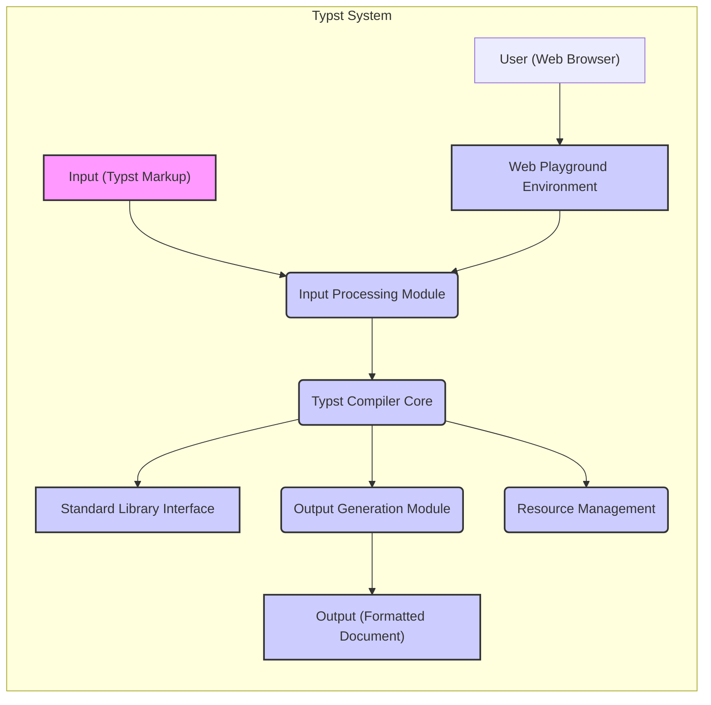
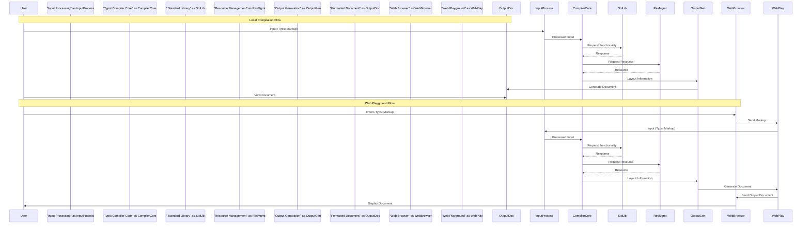

## Project Design Document: Typst

**Version:** 1.1
**Date:** October 26, 2023
**Author:** AI Software Architect

### 1. Introduction

This document provides an enhanced and more detailed design overview of the Typst project, a modern markup-based typesetting system designed for speed, excellent error messages, and robust standard libraries. This document is intended to be used as the foundation for subsequent threat modeling activities, providing a comprehensive understanding of the system's architecture and components.

### 2. Project Overview

Typst is a typesetting tool that aims to offer a more user-friendly and efficient alternative to LaTeX for creating high-quality documents. It encompasses a compiler, a standard library, and optionally a web-based playground. The core functionality revolves around transforming Typst markup into various output formats, with a primary focus on PDF. This document describes the architecture of these core components and their interactions.

### 3. Goals and Objectives

*   **High Performance Compilation:** Minimize the time required to compile Typst documents.
*   **Intuitive Markup Language:** Design a syntax that is easier to learn and use compared to traditional typesetting languages.
*   **Actionable Error Reporting:** Provide clear and specific error messages to facilitate debugging.
*   **Comprehensive Standard Library:** Offer a rich set of built-in functionalities and extension points.
*   **Platform Independence:** Ensure the core compiler can run on major operating systems.
*   **Secure and Reliable Execution:** Prevent malicious input from causing harm or unexpected behavior.

### 4. Target Audience

*   Researchers and academics requiring professional document formatting.
*   Technical writers creating documentation and technical reports.
*   Students working on assignments and projects with formatting requirements.
*   Individuals and organizations seeking an efficient and modern typesetting solution.
*   Developers interested in contributing to or extending the Typst ecosystem.

### 5. High-Level Architecture

The Typst system comprises several key interacting components:

*   **Typst Compiler Core:** The central engine responsible for the compilation process.
*   **Standard Library Interface:** Provides access to built-in functionalities for the compiler.
*   **Input Processing Module:** Handles the initial reading and processing of Typst markup.
*   **Output Generation Module:** Responsible for creating the final formatted document.
*   **Resource Management:** Manages access to external resources like fonts and images.
*   **Web Playground Environment (Optional):** An online platform for interactive Typst usage.

### 6. Detailed Component Breakdown

#### 6.1. Typst Compiler Core

*   **Responsibilities:**
    *   **Parsing:** Converts the input Typst markup into an Abstract Syntax Tree (AST). This involves lexical analysis and syntax analysis.
    *   **Semantic Analysis:** Checks the AST for type correctness, variable scope, and other semantic rules. This stage resolves symbols and ensures the code is meaningful.
    *   **Layout Engine:** Determines the spatial arrangement of elements on the page, considering factors like margins, spacing, and element sizes.
    *   **Rendering Engine:** Translates the layout information into the final output format (e.g., drawing commands for PDF).
    *   **Error Reporting:** Generates and presents diagnostic messages to the user during compilation.
*   **Key Aspects for Threat Modeling:**
    *   Handles untrusted user input, making it a primary target for injection and denial-of-service attacks.
    *   Complexity of parsing and semantic analysis can introduce vulnerabilities if not implemented carefully.
    *   Interaction with the Standard Library exposes potential attack vectors through malicious library calls.
    *   Resource consumption during compilation needs to be controlled to prevent resource exhaustion.

#### 6.2. Standard Library Interface

*   **Responsibilities:**
    *   Provides a well-defined API for the Compiler Core to access built-in functionalities.
    *   Encapsulates common typesetting operations and data structures.
    *   May provide access to system resources or external data sources (e.g., file system for including images).
*   **Key Aspects for Threat Modeling:**
    *   Vulnerabilities within the Standard Library can be exploited by malicious Typst code.
    *   Unrestricted access to system resources through the Standard Library could lead to security breaches.
    *   The interface needs to be designed to prevent the compiler from performing unintended or unsafe operations.

#### 6.3. Input Processing Module

*   **Responsibilities:**
    *   Reads the Typst markup from the input source (file or string).
    *   Handles character encoding and normalization.
    *   May perform initial pre-processing steps like stripping comments.
*   **Key Aspects for Threat Modeling:**
    *   Vulnerable to path traversal attacks if processing includes file system operations based on user input.
    *   Improper handling of character encodings could lead to unexpected behavior or vulnerabilities.
    *   Large input files could be used for denial-of-service attacks.

#### 6.4. Output Generation Module

*   **Responsibilities:**
    *   Takes the processed layout information and generates the final output document in the desired format (e.g., PDF).
    *   Handles embedding fonts and other resources into the output.
*   **Key Aspects for Threat Modeling:**
    *   Vulnerabilities in the output generation logic could lead to the creation of malicious output files.
    *   Improper handling of embedded resources could introduce security risks.
    *   The process needs to ensure the integrity and validity of the generated document.

#### 6.5. Resource Management

*   **Responsibilities:**
    *   Locates and loads external resources referenced in the Typst document (e.g., fonts, images).
    *   May involve accessing the file system or network resources.
    *   Potentially caches resources for performance.
*   **Key Aspects for Threat Modeling:**
    *   Susceptible to path traversal vulnerabilities if resource paths are not properly sanitized.
    *   Downloading resources from untrusted sources could introduce malicious content.
    *   Resource exhaustion could occur if a document references a large number of external resources.

#### 6.6. Web Playground Environment (Optional)

*   **Responsibilities:**
    *   Provides a web interface for users to write and execute Typst code.
    *   Handles communication between the frontend and the backend.
    *   Manages user sessions and potentially stores user code.
    *   Executes the Typst Compiler on the server-side.
*   **Key Aspects for Threat Modeling:**
    *   Introduces typical web application security concerns (e.g., XSS, CSRF, injection attacks).
    *   Requires robust sandboxing to prevent malicious code from affecting the server or other users.
    *   Secure handling of user data and code is crucial.
    *   Authentication and authorization mechanisms are necessary if user accounts are supported.

### 7. Data Flow

The data flow within the Typst system can be described as follows:

*   **Local Compilation:**
    1. The user provides a Typst markup file to the Typst Compiler.
    2. The **Input Processing Module** reads and prepares the input.
    3. The **Typst Compiler Core** parses the input, performs semantic analysis, and determines the layout, interacting with the **Standard Library Interface** as needed.
    4. The **Resource Management** component loads any required external resources.
    5. The **Output Generation Module** creates the final formatted document.

*   **Web Playground Compilation:**
    1. The user enters Typst markup in the web browser.
    2. The browser sends the markup to the **Web Playground Environment** on the server.
    3. The **Web Playground Environment** invokes the **Typst Compiler Core** with the provided markup.
    4. The compilation process proceeds as in local compilation, involving the **Input Processing Module**, **Standard Library Interface**, and **Resource Management**.
    5. The **Output Generation Module** produces the formatted document.
    6. The **Web Playground Environment** sends the output document back to the browser for display.

### 8. Technology Stack

*   **Core Programming Language:** Rust
*   **Build System and Dependency Management:** Cargo
*   **Output Format (Primary):** PDF
*   **Potential Future Output Formats:** HTML, EPUB
*   **Web Playground (If Implemented):**
    *   **Frontend:** Likely a modern JavaScript framework (e.g., React, Vue.js, Svelte)
    *   **Backend:** Potentially a Rust-based web framework (e.g., Actix Web, Rocket, Axum) or another suitable language.

### 9. Deployment Model

The Typst Compiler is primarily intended as a command-line tool for local installation and execution on user machines. The optional Web Playground would be deployed as a web application, accessible via standard web browsers. Distribution of the command-line tool will likely involve platform-specific packages or binaries.

### 10. Security Considerations

This section outlines potential security considerations for the Typst project. A dedicated threat modeling exercise will further explore and detail these aspects.

*   **Input Validation and Sanitization:**
    *   The **Input Processing Module** and **Typst Compiler Core** must rigorously validate and sanitize all input markup to prevent injection attacks (e.g., command injection, cross-site scripting if rendering to web formats).
    *   Strict limits on input size and complexity should be enforced to mitigate denial-of-service attacks.
*   **Resource Access Control:**
    *   The **Resource Management** component needs to implement strict controls on accessing external resources, preventing access to sensitive files or unauthorized network locations.
    *   Consider using sandboxing or containerization to limit the compiler's access to the file system and network.
*   **Standard Library Security:**
    *   The **Standard Library Interface** must be carefully designed to prevent the compiler from performing unsafe operations.
    *   Regular security audits and testing of the Standard Library code are crucial.
*   **Memory Safety:**
    *   Leveraging Rust's memory safety features helps prevent common vulnerabilities like buffer overflows and use-after-free errors in the **Typst Compiler Core** and **Standard Library**.
*   **Web Playground Security:**
    *   Implement robust server-side input validation and output encoding to prevent XSS and other web-based attacks.
    *   Utilize Content Security Policy (CSP) to restrict the sources of content the browser is allowed to load.
    *   Employ secure authentication and authorization mechanisms for user accounts and data.
    *   Isolate the compilation process within the **Web Playground Environment** using sandboxing or virtualization to prevent malicious code execution from affecting the server.
*   **Dependency Management:**
    *   Carefully review and manage third-party dependencies to avoid introducing known vulnerabilities.
    *   Regularly update dependencies to patch security flaws.
*   **Output Security:**
    *   Ensure the **Output Generation Module** produces valid and secure output formats, preventing vulnerabilities in the generated documents (e.g., malicious PDF features).
*   **Error Handling:**
    *   Avoid exposing sensitive information in error messages.
    *   Ensure error handling logic does not introduce new vulnerabilities.

### 11. Diagrams

The diagrams provided in sections 5 and 7 offer visual representations of the Typst project's architecture and data flow. These diagrams are essential for understanding the system's structure and the interactions between its components, which is crucial for identifying potential threat vectors during the threat modeling process.