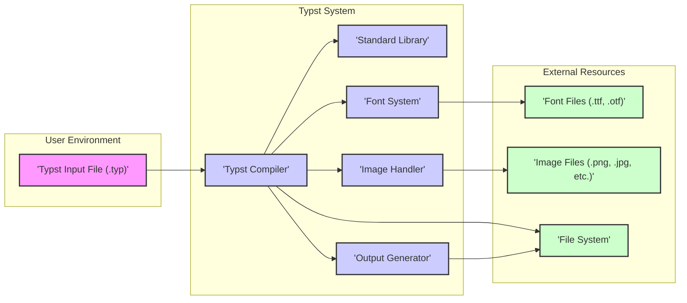

## Project Design Document: Typst Typesetting System

**Project Name:** Typst

**Project Repository:** [https://github.com/typst/typst](https://github.com/typst/typst)

**Document Version:** 1.1

**Date:** 2023-10-27

**Author:** AI Expert

### 1. Project Overview

Typst is a modern, web-based typesetting system designed to be as powerful as LaTeX but significantly easier to learn and use. It aims to provide a streamlined and efficient workflow for creating beautiful and professional documents, presentations, and scientific publications. Typst distinguishes itself with its markup language, real-time compilation, and focus on user experience. This document outlines the high-level design of the Typst system to facilitate threat modeling and security analysis. This document is intended to be a living document and will be updated as the project evolves.

### 2. System Architecture

Typst's architecture can be broadly divided into several key components that interact to process input Typst markup and generate output documents. The following diagram illustrates the system's architecture:

**Component Descriptions:**

*   **Typst Input File (.typ):**
    *   Description: This is the source file written by the user in the Typst markup language. It defines the document's content, structure, and styling.
    *   Security Relevance: Represents the primary untrusted input to the system. Maliciously crafted `.typ` files could exploit vulnerabilities in the Typst Compiler. Input validation and sanitization are critical here.
*   **Typst Compiler:**
    *   Description: The core of the Typst system, written primarily in Rust. It orchestrates the entire typesetting process.
        *   **Parsing:** Converts the Typst markup into an Abstract Syntax Tree (AST) or similar internal representation.  This stage is crucial for preventing injection attacks.
        *   **Compilation & Semantic Analysis:**  Resolves symbols, type checks, and performs semantic analysis on the AST. This stage ensures the Typst code is valid and consistent.
        *   **Layout Engine:**  Calculates the precise layout of document elements, handling complex typesetting rules, line breaking, page breaking, and positioning. This is computationally intensive and needs to be robust against DoS attacks.
        *   **Resource Management:** Manages fonts and images, loading them from the file system and making them available for rendering. Secure resource handling is vital to prevent malicious file access.
        *   **Output Generation Orchestration:**  Instructs the Output Generator to create the final document.
    *   Security Relevance:  The most complex and security-critical component. Vulnerabilities in parsing, compilation, layout, or resource management could have significant security implications.
*   **Standard Library:**
    *   Description: Provides built-in functions, modules, and templates accessible within Typst markup. Offers core typesetting functionalities and extends the language's capabilities.
    *   Security Relevance:  Standard library functions, if not carefully implemented, could introduce vulnerabilities. For example, functions that interact with external systems or perform complex operations need to be reviewed for security.
*   **Font System:**
    *   Description: Responsible for loading, parsing, and managing font files (e.g., TTF, OTF). It provides glyph data and font metrics to the Compiler for text rendering. Likely utilizes libraries for font parsing and shaping.
    *   Security Relevance: Font files are external, potentially untrusted data. Vulnerabilities in font parsing libraries could be exploited by malicious font files, leading to crashes or even code execution. Font loading and access mechanisms need to be secure.
*   **Image Handler:**
    *   Description: Handles loading, decoding, and embedding images (e.g., PNG, JPG) into the output document. May perform image format conversion, resizing, or optimization. Likely uses image decoding libraries.
    *   Security Relevance: Image files are external, potentially untrusted data. Image decoding libraries are known to have vulnerabilities. Malicious image files could exploit these vulnerabilities, leading to crashes or code execution. Image processing needs to be sandboxed or use secure libraries.
*   **Output Generator:**
    *   Description: Takes the compiled document representation and generates the final output document in formats like PDF, SVG, or potentially other formats. Likely uses libraries for PDF or SVG generation.
    *   Security Relevance: Output generation, especially PDF generation, can be complex. Vulnerabilities in PDF generation libraries could lead to issues. The generated output should not contain any unintended information or vulnerabilities.
*   **Font Files (.ttf, .otf):**
    *   Description: External font files used for rendering text.
    *   Security Relevance: Untrusted external input. Malicious font files can be crafted to exploit vulnerabilities in font parsing.
*   **Image Files (.png, .jpg, etc.):**
    *   Description: External image files embedded in the document.
    *   Security Relevance: Untrusted external input. Malicious image files can exploit vulnerabilities in image decoding.
*   **File System:**
    *   Description: The local file system where Typst reads input files, fonts, images, and writes output files.
    *   Security Relevance: Typst's interaction with the file system needs to be carefully controlled to prevent unauthorized access or modification of files. File path handling and permissions are important security considerations.

### 3. Data Flow

The data flow within Typst can be described in more detail, highlighting data transformations and potential security checkpoints:

1.  **Typst Input File Reading:** The Typst Compiler reads the `.typ` input file from the File System. This is the initial point of untrusted data entry.
2.  **Parsing and AST Generation:** The Compiler's parser processes the input file and generates an Abstract Syntax Tree (AST).  Input validation and sanitization should occur during parsing to reject invalid or potentially malicious markup early in the process.
3.  **Semantic Analysis and Compilation:** The Compiler performs semantic analysis on the AST, resolving symbols, type checking, and transforming the AST into an intermediate representation suitable for layout. This stage should enforce language rules and prevent logical errors that could be exploited.
4.  **Font and Image Resource Loading:** Based on the document content, the Compiler identifies required fonts and images.
    *   **Font Loading:** The Font System is invoked to load font files from specified paths or system font directories. Font files are read from the File System. Font parsing occurs here.
    *   **Image Loading:** The Image Handler is invoked to load image files from specified paths. Image files are read from the File System. Image decoding occurs here.
    *   **Security Checkpoint:** Both font and image loading are critical security checkpoints. File access should be restricted, and parsing/decoding processes must be robust against malicious files.
5.  **Layout Calculation:** The Layout Engine calculates the positions and sizes of all elements in the document. This is a complex process that needs to be efficient and resistant to DoS attacks (e.g., from extremely complex layouts).
6.  **Rendering and Output Generation:** The Output Generator receives the layout information and rendered glyphs and images. It then generates the final output document (e.g., PDF). Output encoding and sanitization might be necessary to prevent output-based injection vulnerabilities in certain output formats.
7.  **Output File Writing:** The Output Generator writes the generated document to the File System. File system write permissions should be appropriately configured.

### 4. Technology Stack

*   **Programming Language:** Rust (Primarily) - Provides memory safety and performance.
*   **Build System:** Cargo (Rust's build system) - For dependency management and building the project. Security of dependencies managed by Cargo is relevant.
*   **Font Rendering:**
    *   Likely using libraries like `font-kit`, `ttf-parser`, `rustybuzz`, or similar Rust crates for font parsing, shaping, and glyph rasterization.  Specific libraries need to be confirmed by examining the project's dependencies.
    *   Security Relevance: Vulnerabilities in these font rendering libraries could be exploited.
*   **PDF Generation:**
    *   Likely using libraries like `pdf-canvas`, `lopdf`, or similar Rust crates for PDF creation. Specific library needs to be confirmed.
    *   Security Relevance: Vulnerabilities in PDF generation libraries could lead to issues in generated PDF documents.
*   **Image Handling:**
    *   Likely using libraries like `image`, `image-rs`, or format-specific crates (e.g., `png`, `jpeg-decoder`) for image decoding and encoding. Specific libraries need to be confirmed.
    *   Security Relevance: Vulnerabilities in image handling libraries are common.
*   **Operating System:** Cross-platform, designed to run on major operating systems (Linux, macOS, Windows). OS-level security features and vulnerabilities are relevant.

### 5. External Interfaces

*   **File System:**
    *   **Input:**
        *   Typst Input Files (`.typ`): User-provided document source. **Security Risk:** Maliciously crafted input files.
        *   Font Files (`.ttf`, `.otf`): External fonts. **Security Risk:** Malicious font files exploiting font parsing vulnerabilities.
        *   Image Files (`.png`, `.jpg`, etc.`): External images. **Security Risk:** Malicious image files exploiting image decoding vulnerabilities.
    *   **Output:**
        *   Generated Document Files (e.g., `.pdf`, `.svg`): Output documents. **Security Risk:**  Potential for information leakage or vulnerabilities in generated output if output generation process is flawed.
    *   **Access Method:** Standard file system APIs provided by the operating system.
    *   **Security Considerations:** File path handling, permissions, access control, and sanitization of file names are important.
*   **Operating System:**
    *   **System Calls:**  Typst relies on OS system calls for file I/O, memory management, process management (if any for external tools), etc.
    *   **Security Relevance:** OS-level vulnerabilities and security configurations can impact Typst's security.  Privilege separation and least privilege principles should be considered.
*   **External Fonts:**
    *   **Source:** User-specified paths, system font directories.
    *   **Data Format:** Font file formats (TTF, OTF).
    *   **Security Risk:** As mentioned above, malicious font files.
*   **External Images:**
    *   **Source:** User-specified paths.
    *   **Data Format:** Image file formats (PNG, JPG, etc.).
    *   **Security Risk:** As mentioned above, malicious image files.
*   **(Potential Future Interfaces - Network):**
    *   **Package Manager/Dependency Download:** If Typst introduces a package manager to download templates, styles, or extensions, network interfaces will be involved.
    *   **Web Services Integration:**  Future features might involve interacting with web services for data retrieval or online collaboration.
    *   **Security Risks:** Network-related vulnerabilities: Man-in-the-middle attacks, insecure communication, malicious package sources, etc.

### 6. Trust Boundaries

*   **User Input Boundary: Typst Input File <-> Typst Compiler (Parser):**
    *   Description: The boundary between the untrusted Typst input file provided by the user and the Typst Compiler's parser.
    *   Security Implication: All data from the input file is considered untrusted and must be validated and sanitized by the parser to prevent injection attacks (e.g., command injection, markup injection), DoS attacks (e.g., excessively complex markup), and other input-related vulnerabilities.
    *   Mitigation: Robust parsing logic, input validation, sanitization, and potentially sandboxing the parsing process.
*   **External Resource Boundary: Font/Image Files <-> Font System/Image Handler:**
    *   Description: The boundary between external font and image files and the Font System and Image Handler components.
    *   Security Implication: External font and image files are untrusted. Malicious files could exploit vulnerabilities in font parsing or image decoding libraries.
    *   Mitigation: Secure font and image parsing/decoding libraries, input validation on file formats, and potentially sandboxing resource processing. Consider using memory-safe libraries and techniques to mitigate buffer overflows and other memory-related vulnerabilities.
*   **File System Boundary: Typst System <-> File System:**
    *   Description: The boundary between the Typst System and the underlying File System.
    *   Security Implication:  Uncontrolled file system access could allow Typst to read or write sensitive files outside its intended scope.
    *   Mitigation: Principle of least privilege for file system access. Limit Typst's access to only necessary directories and files. Sanitize file paths to prevent path traversal vulnerabilities.
*   **(Potential Future Boundary - Network Boundary: Typst System <-> Network):**
    *   Description: If network features are introduced, the boundary between the Typst System and the network.
    *   Security Implication: Network communication introduces new attack vectors like man-in-the-middle attacks, data breaches, and reliance on external, potentially compromised services.
    *   Mitigation: Secure communication protocols (HTTPS), input validation of network data, authentication and authorization mechanisms, and careful selection of trusted external services.

### 7. Security Considerations (Detailed)

Expanding on the initial security considerations, a more detailed list for threat modeling:

*   **Input Validation & Sanitization (Typst Input):**
    *   **Injection Attacks:** Prevent Typst markup injection, command injection (if Typst ever executes external commands), or cross-site scripting (XSS) if outputting to web formats.
    *   **Denial of Service (DoS):** Protect against DoS attacks via maliciously complex markup that could cause excessive CPU or memory consumption during parsing, compilation, or layout. Implement resource limits and timeouts.
    *   **Format String Vulnerabilities:** If Typst uses format strings internally, ensure user input is never directly used in format strings to prevent format string vulnerabilities.
    *   **Integer Overflows/Underflows:**  Carefully handle numerical inputs in markup to prevent integer overflows or underflows that could lead to unexpected behavior or vulnerabilities.
*   **Font Security:**
    *   **Font Parsing Vulnerabilities:** Use robust and well-vetted font parsing libraries. Regularly update these libraries to patch known vulnerabilities. Consider fuzzing font parsing code.
    *   **Malicious Font Files:** Implement checks to detect and reject potentially malicious font files. Consider sandboxing font parsing and rendering.
    *   **Font Cache Poisoning:** If font caching is implemented, ensure the cache is secure and resistant to poisoning attacks.
*   **Image Security:**
    *   **Image Decoding Vulnerabilities:** Use secure and updated image decoding libraries. Regularly update these libraries. Fuzz image decoding code.
    *   **Malicious Image Files:** Implement checks to detect and reject potentially malicious image files. Consider sandboxing image decoding and processing.
    *   **Image Processing DoS:** Protect against DoS attacks via maliciously crafted images that could cause excessive resource consumption during decoding or processing.
*   **File System Security:**
    *   **Path Traversal Vulnerabilities:** Sanitize file paths provided in Typst markup to prevent path traversal attacks.
    *   **Unauthorized File Access:** Enforce the principle of least privilege for file system access. Limit Typst's access to only necessary directories.
    *   **Output File Overwriting:**  Implement safeguards to prevent accidental or malicious overwriting of important files when writing output documents.
*   **Resource Management:**
    *   **Memory Management:** Implement robust memory management to prevent memory leaks, buffer overflows, and use-after-free vulnerabilities. Rust's memory safety features help, but careful coding is still needed.
    *   **CPU Usage:**  Optimize performance and implement safeguards to prevent excessive CPU usage that could lead to DoS.
    *   **File Handle Limits:** Manage file handles efficiently to prevent resource exhaustion and DoS attacks.
*   **Error Handling and Logging:**
    *   **Secure Error Handling:** Implement secure error handling to avoid revealing sensitive information in error messages.
    *   **Logging:** Implement comprehensive logging for security auditing and incident response. Log relevant security events and errors.
*   **Dependency Management:**
    *   **Supply Chain Security:** If Typst relies on external Rust crates (dependencies), ensure these dependencies are from trusted sources and are regularly updated to patch vulnerabilities. Use dependency scanning tools.
*   **Updates and Patching:**
    *   **Regular Updates:** Establish a process for regularly updating Typst and its dependencies to address security vulnerabilities.
    *   **Security Advisories:**  Have a mechanism for issuing security advisories and communicating security updates to users.
*   **Configuration Management:**
    *   **Secure Defaults:**  Use secure default configurations.
    *   **Configuration Options:** If configuration options are provided, ensure they are secure and do not introduce new vulnerabilities when misconfigured.
*   **(Future Considerations - Network Security):**
    *   **Authentication and Authorization:** If network features are added, implement robust authentication and authorization mechanisms to control access to resources and functionalities.
    *   **Secure Communication:** Use HTTPS for all network communication to protect data in transit.
    *   **Input Validation (Network Data):**  Thoroughly validate all data received from network sources to prevent injection attacks and other network-based vulnerabilities.
    *   **Dependency Security (Package Manager):** If a package manager is introduced, ensure the security of package repositories and the package download and installation process. Verify package integrity and authenticity.

This improved design document provides a more detailed and security-focused overview of the Typst system, suitable for more in-depth threat modeling activities. Further analysis and code review will be necessary to identify and mitigate specific vulnerabilities.