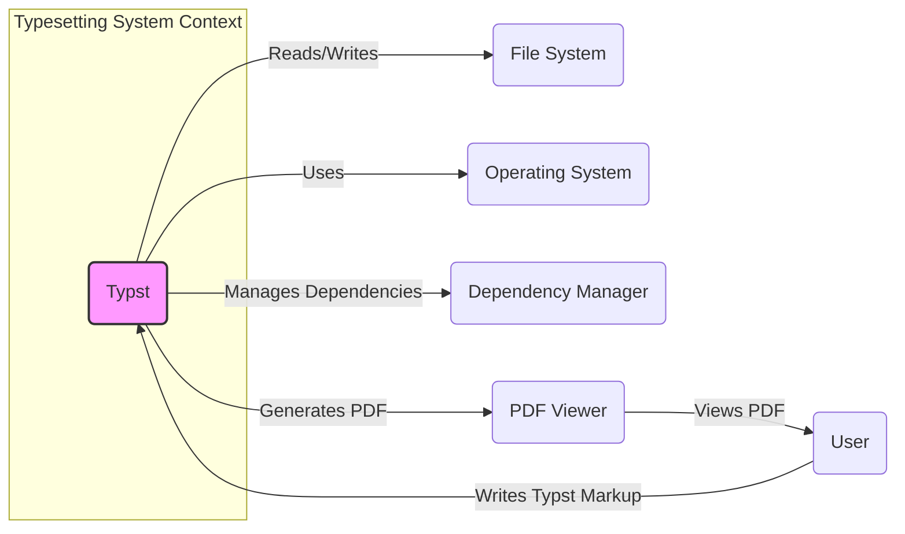
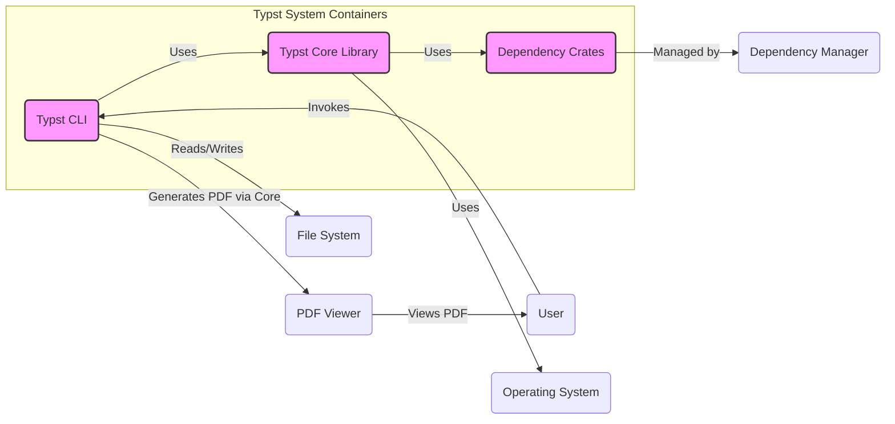
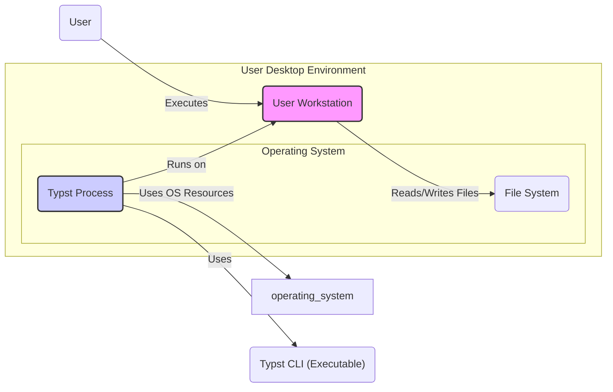
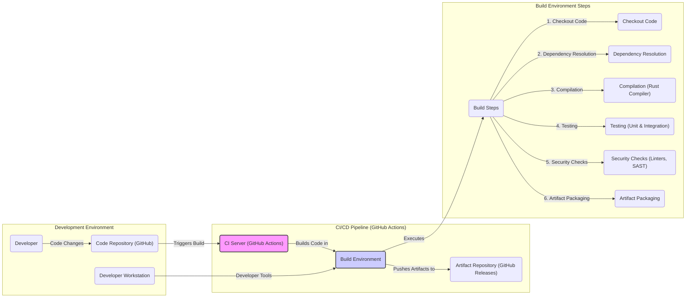

# BUSINESS POSTURE

- Business Priorities and Goals:
  - Provide a modern, efficient, and user-friendly typesetting system as an alternative to existing solutions like LaTeX.
  - Enable users to create high-quality documents with a simplified markup language and fast compilation times.
  - Foster a community around Typst and encourage contributions to its development.
  - Support a wide range of document types and output formats.
- Business Risks:
  - Risk of vulnerabilities in the typesetting engine leading to incorrect or insecure document generation.
  - Risk of supply chain attacks through dependencies used in the project.
  - Risk of denial of service if the system is used in a service context and becomes resource-intensive or exploitable.
  - Risk of data breaches if sensitive information is processed and not handled securely during typesetting or storage.

# SECURITY POSTURE

- Existing Security Controls:
  - security control: Memory safety through the use of Rust programming language, which reduces the risk of memory-related vulnerabilities like buffer overflows. Implemented in: Core Typst codebase.
  - security control: Use of standard cryptographic libraries provided by Rust ecosystem for any cryptographic operations. Implemented in: Typst codebase where cryptography is needed.
  - security control: Open source nature of the project allows for community review and identification of potential security issues. Implemented in: GitHub repository and public issue tracking.
- Accepted Risks:
  - accepted risk: Potential vulnerabilities might be discovered in dependencies that are not immediately patched.
  - accepted risk: Security audits are not performed regularly or systematically, relying on community contributions.
  - accepted risk: Input validation might not be exhaustive, potentially leading to vulnerabilities if processing untrusted Typst markup.
- Recommended Security Controls:
  - recommended security control: Implement automated security scanning (SAST/DAST) in the CI/CD pipeline to detect potential vulnerabilities early in the development process.
  - recommended security control: Conduct regular security code reviews, especially for critical components like the parser and renderer.
  - recommended security control: Establish a process for reporting and handling security vulnerabilities, including a security policy and contact information.
  - recommended security control: Implement dependency scanning to monitor for known vulnerabilities in project dependencies and automate updates.
- Security Requirements:
  - Authentication: Not applicable as a primary requirement for the core typesetting engine, as it is designed to be a standalone tool or library. If integrated into a larger system, authentication requirements will be determined by the integrating system.
  - Authorization: Not applicable as a primary requirement for the core typesetting engine. Authorization will be relevant in the context of systems that use Typst as a service or component, and should be handled by those systems.
  - Input Validation: Robust input validation is crucial to prevent vulnerabilities arising from processing malicious or malformed Typst markup. This should be implemented in the parser to ensure that only valid and expected input is processed.
  - Cryptography: Cryptography might be required for features like document signing or encryption in the future. If implemented, strong and well-vetted cryptographic libraries must be used correctly.

# DESIGN

## C4 CONTEXT

- Context Diagram Elements:
  - - Name: User
    - Type: Person
    - Description: Individuals who write Typst markup to create documents.
    - Responsibilities: Creating Typst markup files, viewing generated PDF documents.
    - Security controls: User workstations security controls, access control to Typst markup files.
  - - Name: Typst
    - Type: Software System
    - Description: The Typst typesetting system, responsible for compiling Typst markup into PDF documents.
    - Responsibilities: Parsing Typst markup, typesetting documents, generating PDF output.
    - Security controls: Input validation, memory safety, secure dependency management, build process security controls.
  - - Name: File System
    - Type: System
    - Description: The local file system where Typst reads input files and writes output files.
    - Responsibilities: Storing Typst markup files, storing generated PDF documents.
    - Security controls: Operating system file access controls, file system permissions.
  - - Name: Operating System
    - Type: System
    - Description: The operating system on which Typst is executed.
    - Responsibilities: Providing runtime environment for Typst, managing system resources.
    - Security controls: Operating system security hardening, user access controls, process isolation.
  - - Name: Dependency Manager
    - Type: Software System
    - Description: Tools like Cargo (for Rust) used to manage Typst's dependencies.
    - Responsibilities: Downloading, installing, and managing external libraries required by Typst.
    - Security controls: Dependency vulnerability scanning, checksum verification of downloaded dependencies.
  - - Name: PDF Viewer
    - Type: Software System
    - Description: Application used by users to view the PDF documents generated by Typst.
    - Responsibilities: Rendering and displaying PDF documents.
    - Security controls: PDF viewer security controls, vulnerability management of PDF viewer software.

## C4 CONTAINER

- Container Diagram Elements:
  - - Name: Typst CLI
    - Type: Application
    - Description: Command-line interface application that provides users with access to Typst's typesetting functionality.
    - Responsibilities: Accepting user commands, parsing command-line arguments, invoking the Typst Core Library, handling file I/O.
    - Security controls: Input validation of command-line arguments, secure handling of file paths, process isolation by operating system.
  - - Name: Typst Core Library
    - Type: Library
    - Description: The core typesetting library containing the main logic for parsing Typst markup, layout, and PDF generation.
    - Responsibilities: Parsing Typst markup, performing typesetting algorithms, generating PDF document data structures.
    - Security controls: Memory safety (Rust), input validation of markup, secure handling of external resources (if any), use of secure cryptographic libraries (if needed).
  - - Name: Dependency Crates
    - Type: Library
    - Description: External Rust crates (libraries) that Typst Core Library depends on for various functionalities.
    - Responsibilities: Providing functionalities like PDF generation, font handling, image processing, etc.
    - Security controls: Dependency scanning, vulnerability monitoring of dependencies, using crates from reputable sources, checksum verification during dependency download.

## DEPLOYMENT

- Deployment Options:
  - Desktop Application: Typst CLI can be directly installed and run on user's desktop operating systems (Windows, macOS, Linux).
  - Library Integration: Typst Core Library can be integrated into other software applications to provide typesetting capabilities.
  - Web Service (Hypothetical): Typst could be deployed as a web service to provide typesetting as a service, although this is not the primary deployment model currently.

- Detailed Deployment (Desktop Application):

- Deployment Diagram Elements:
  - - Name: User Workstation
    - Type: Infrastructure
    - Description: User's personal computer or laptop where Typst is installed and executed.
    - Responsibilities: Providing hardware and software environment for running Typst.
    - Security controls: Workstation security policies, operating system security hardening, endpoint security software (antivirus, EDR).
  - - Name: Operating System
    - Type: Infrastructure Software
    - Description: Operating system (e.g., Windows, macOS, Linux) installed on the user workstation.
    - Responsibilities: Managing system resources, providing process isolation, enforcing security policies.
    - Security controls: Operating system security updates, access control mechanisms, firewall.
  - - Name: Typst Process
    - Type: Software Process
    - Description: Instance of the Typst CLI executable running as a process on the operating system.
    - Responsibilities: Executing Typst code, accessing file system, utilizing system resources.
    - Security controls: Process isolation provided by the operating system, resource limits, user permissions.
  - - Name: File System
    - Type: Infrastructure
    - Description: Local file system on the user workstation.
    - Responsibilities: Storing Typst input files and output PDF files.
    - Security controls: File system permissions, access control lists, data encryption at rest (if configured by user).
  - - Name: Typst CLI (Executable)
    - Type: Software Artifact
    - Description: The compiled Typst command-line executable file.
    - Responsibilities: Providing the entry point for running Typst on the user workstation.
    - Security controls: Code signing of the executable (if applicable), integrity checks during installation.

## BUILD

- Build Process Description:
  - Developer writes code on their workstation and pushes changes to the GitHub repository.
  - GitHub Actions CI/CD pipeline is triggered upon code changes (e.g., push, pull request).
  - CI server (GitHub Actions runners) executes a predefined workflow.
  - Build environment is set up within the CI pipeline, including necessary tools and dependencies (Rust toolchain, etc.).
  - Build steps are executed sequentially:
    - Checkout Code: Source code is checked out from the repository.
    - Dependency Resolution: Dependencies are resolved and downloaded using Cargo.
    - Compilation: Rust code is compiled using the Rust compiler.
    - Testing: Unit and integration tests are executed to ensure code quality.
    - Security Checks: Security checks are performed, including:
      - Linters: Code linters (e.g., Clippy) are used to identify potential code quality and style issues.
      - SAST: Static Application Security Testing tools (e.g., `cargo audit`) can be used to scan for known vulnerabilities in dependencies.
    - Artifact Packaging: Compiled binaries and other necessary files are packaged into distributable artifacts (e.g., zip files, release binaries).
  - Artifacts are pushed to the Artifact Repository (GitHub Releases) for distribution.
- Build Process Security Controls:
  - security control: Automated build process using CI/CD pipeline (GitHub Actions) to ensure consistent and repeatable builds. Implemented in: GitHub Actions workflows.
  - security control: Dependency scanning using `cargo audit` or similar tools to detect known vulnerabilities in dependencies. Implemented in: GitHub Actions workflows.
  - security control: Code linting using Clippy to enforce code quality and potentially identify security-related code patterns. Implemented in: GitHub Actions workflows.
  - security control: Unit and integration testing to ensure code functionality and reduce the risk of introducing bugs. Implemented in: Rust test framework and GitHub Actions workflows.
  - security control: Use of a controlled build environment in CI to minimize the risk of build environment compromise. Implemented in: GitHub Actions isolated runners.
  - security control: Code review process before merging code changes to the main branch to identify potential security issues. Implemented in: GitHub pull request workflow.
  - security control: Signing of release artifacts (if implemented) to ensure integrity and authenticity of distributed binaries. Implemented in: Release process (can be added to GitHub Actions).

# RISK ASSESSMENT

- Critical Business Processes:
  - Document creation and typesetting: Ensuring users can reliably create documents using Typst.
  - Software distribution: Providing users with secure and trustworthy releases of Typst.
- Data Sensitivity:
  - Typst processes user-provided markup and generates PDF documents. The sensitivity of data depends on the content of the markup files. Markup files and generated documents can contain sensitive information, including personal data, confidential business information, or intellectual property.
  - Data in transit: Markup files and generated documents might be transferred between systems (e.g., user workstation to file system, Typst process to PDF viewer).
  - Data at rest: Markup files and generated documents are stored in the file system.

# QUESTIONS & ASSUMPTIONS

- Questions:
  - Are there any specific regulatory compliance requirements that Typst needs to adhere to (e.g., GDPR, HIPAA)?
  - Is Typst intended to be used in environments with specific security requirements (e.g., government, financial institutions)?
  - Are there plans to offer Typst as a web service or integrate it into web applications in the future?
  - What is the process for handling security vulnerability reports and releasing security patches?
- Assumptions:
  - BUSINESS POSTURE: The primary business goal is to provide a useful and reliable typesetting tool for general use. Security is important for user trust and software integrity, but not necessarily driven by strict regulatory compliance.
  - SECURITY POSTURE: Security is considered during development, primarily through the use of memory-safe languages and community review. Formal security audits and dedicated security teams are not assumed to be in place currently.
  - DESIGN: Typst is primarily designed as a desktop application and library. Deployment as a web service is not the current focus. The build process uses standard open-source CI/CD practices with some basic security checks.