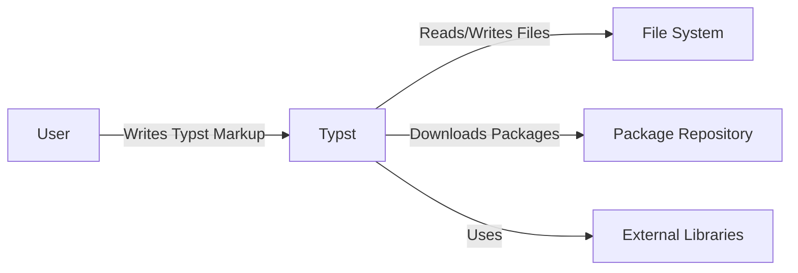
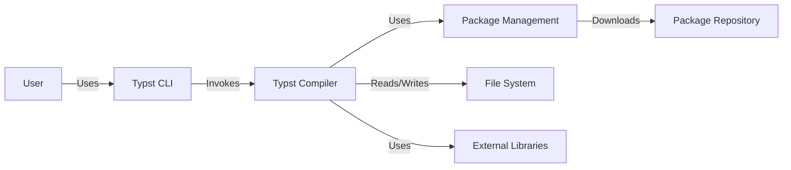
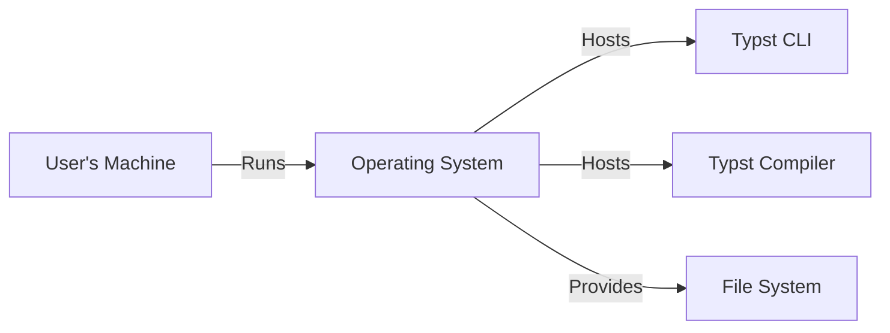
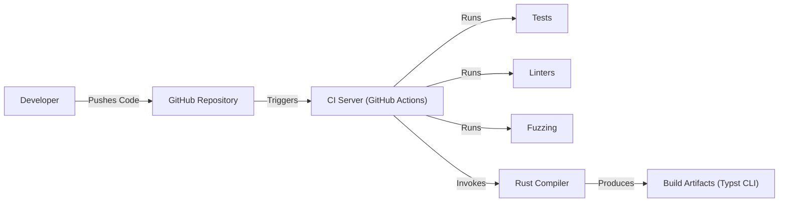

Okay, let's create a design document for the Typst project, focusing on aspects relevant for threat modeling.

# BUSINESS POSTURE

Typst is a new markup-based typesetting system designed to be a viable alternative to LaTeX.  The core business priorities and goals appear to be:

*   Provide a simpler, more modern, and easier-to-learn typesetting system compared to LaTeX.
*   Offer fast compilation times for improved developer productivity.
*   Create a system that is extensible and customizable through packages.
*   Build a strong community around the project.
*   Potentially, offer commercial services or products built around the core open-source project (e.g., cloud-based editing, collaboration tools). This is a common model for open-source projects.

Based on these priorities, the most important business risks are:

*   **Compromise of the compiler/core library:**  Malicious code injected into the Typst compiler or core libraries could allow attackers to execute arbitrary code on users' systems when they compile documents. This is a critical risk, as it directly impacts user security.
*   **Vulnerabilities in the package system:**  If the package management system is insecure, attackers could distribute malicious packages that compromise users' systems. This is similar to the risk with npm, PyPI, etc.
*   **Denial of Service (DoS):**  Vulnerabilities that allow crafting documents that cause the compiler to crash, consume excessive resources, or hang indefinitely could disrupt users' workflows and potentially impact any cloud-based services built on Typst.
*   **Data Exfiltration:** While Typst itself doesn't inherently handle sensitive data *during compilation*, if it's integrated into a larger system (e.g., a web-based editor), vulnerabilities could potentially be exploited to leak user documents or other data.
*   **Reputational Damage:**  Security vulnerabilities, especially those that are widely publicized, could significantly damage the reputation of the project and hinder adoption.

# SECURITY POSTURE

Here's an assessment of the existing security controls, accepted risks, and recommendations based on the provided GitHub repository:

*   security control: **Secure Development Practices:** The project uses Rust, a memory-safe language, which significantly reduces the risk of common vulnerabilities like buffer overflows and use-after-free errors. This is a strong foundation for security. Implemented in: source code.
*   security control: **Fuzzing:** The repository includes fuzzing tests (in the `fuzz/` directory). Fuzzing is a crucial technique for discovering unexpected vulnerabilities by providing invalid or random inputs to the compiler. Implemented in: `fuzz/` directory.
*   security control: **Continuous Integration (CI):** The project uses GitHub Actions for CI, which includes running tests and linters on every commit. This helps to catch bugs and enforce coding standards early in the development process. Implemented in: `.github/workflows/` directory.
*   security control: **Code Reviews:** The project uses a pull request-based workflow, which implies that code is reviewed by other developers before being merged. Code reviews are essential for catching security flaws that might be missed by automated tools. Implemented in: GitHub pull request workflow.
*   security control: **Dependency Management:** The project uses Cargo, Rust's package manager, which provides some level of dependency management. However, it's crucial to audit dependencies for known vulnerabilities. Implemented in: `Cargo.toml` and `Cargo.lock` files.
*   accepted risk: **Limited Input Validation:** While Rust's type system provides some level of input validation, the project likely needs more explicit input validation to handle potentially malicious Typst markup. This is an area that should be carefully considered during threat modeling.
*   accepted risk: **No Explicit Security Policy:** The repository does not appear to have a dedicated security policy (e.g., a `SECURITY.md` file) outlining how to report vulnerabilities.
*   accepted risk: **No Sandboxing:** The compiler runs with the full privileges of the user. There's no sandboxing mechanism to limit the impact of a potential vulnerability.
*   accepted risk: **Package Security:** The security of the package ecosystem is not fully addressed. There's no mention of package signing, verification, or a centralized repository with security checks.

Recommended Security Controls (High Priority):

*   Implement a robust input validation system to sanitize Typst markup and prevent injection attacks.
*   Develop a clear security policy (`SECURITY.md`) that explains how to report vulnerabilities responsibly.
*   Investigate sandboxing techniques to isolate the compiler and limit the impact of potential vulnerabilities.  Consider WebAssembly as a potential sandboxing solution.
*   Implement security measures for the package system, including package signing, verification, and a secure repository.
*   Perform regular security audits and penetration testing.
*   Use a Software Bill of Materials (SBOM) to track all dependencies and their versions.
*   Integrate static application security testing (SAST) tools into the CI pipeline to automatically scan for vulnerabilities.

Security Requirements:

*   **Authentication:** Not directly applicable to the core compiler, but crucial for any web-based services or collaborative features built on top of Typst.
*   **Authorization:** Not directly applicable to the core compiler, but important for any multi-user systems or services.
*   **Input Validation:**  Crucial for the compiler.  All input from Typst markup and external files should be carefully validated to prevent injection attacks and other vulnerabilities.
*   **Cryptography:**  Potentially relevant for package signing and secure communication with a package repository.  Use well-established cryptographic libraries and algorithms.
*   **Output Encoding:** Not directly applicable, as Typst produces PDF files, not HTML. However, if Typst were to support other output formats (e.g., HTML), output encoding would be essential to prevent cross-site scripting (XSS) vulnerabilities.

# DESIGN

## C4 CONTEXT

Element Descriptions:

*   Element:
    *   Name: User
    *   Type: Person
    *   Description: A person who writes Typst markup and uses the Typst compiler to generate documents.
    *   Responsibilities: Writing Typst code, running the compiler, managing files.
    *   Security controls: None (external to the system).

*   Element:
    *   Name: Typst
    *   Type: Software System
    *   Description: The Typst typesetting system, including the compiler and core libraries.
    *   Responsibilities: Parsing Typst markup, resolving dependencies, generating output (PDF), managing packages.
    *   Security controls: Memory safety (Rust), fuzzing, CI, code reviews.

*   Element:
    *   Name: Package Repository
    *   Type: External System
    *   Description: A repository (potentially a web server) that hosts Typst packages.
    *   Responsibilities: Storing packages, providing an API for downloading packages.
    *   Security controls: (To be determined - ideally, package signing, verification, and secure communication).

*   Element:
    *   Name: File System
    *   Type: External System
    *   Description: The user's local file system.
    *   Responsibilities: Storing Typst source files, output files, and potentially cached data.
    *   Security controls: Operating system file permissions.

*   Element:
    *   Name: External Libraries
    *   Type: External System
    *   Description: Libraries that Typst depends on, such as for font rendering, image processing, etc.
    *   Responsibilities: Providing specific functionality used by the Typst compiler.
    *   Security controls: Dependency management (Cargo), auditing of dependencies.

## C4 CONTAINER

Element Descriptions:

*   Element:
    *   Name: User
    *   Type: Person
    *   Description: A person who writes Typst markup and uses the Typst compiler to generate documents.
    *   Responsibilities: Writing Typst code, running the compiler, managing files.
    *   Security controls: None (external to the system).

*   Element:
    *   Name: Typst CLI
    *   Type: Container (Command-Line Interface)
    *   Description: The command-line interface for interacting with the Typst compiler.
    *   Responsibilities: Parsing command-line arguments, invoking the compiler, handling user input/output.
    *   Security controls: Input validation (of command-line arguments).

*   Element:
    *   Name: Typst Compiler
    *   Type: Container (Compiler)
    *   Description: The core Typst compiler, responsible for parsing, compiling, and generating output.
    *   Responsibilities: Parsing Typst markup, resolving dependencies, generating PDF output.
    *   Security controls: Memory safety (Rust), fuzzing, input validation (of Typst markup).

*   Element:
    *   Name: Package Management
    *   Type: Container (Library/Module)
    *   Description: The component responsible for managing Typst packages.
    *   Responsibilities: Downloading packages, resolving dependencies, managing package versions.
    *   Security controls: Secure communication with the package repository, package verification (ideally).

*   Element:
    *   Name: File System
    *   Type: External System
    *   Description: The user's local file system.
    *   Responsibilities: Storing Typst source files, output files, and potentially cached data.
    *   Security controls: Operating system file permissions.

*   Element:
    *   Name: Packages
    *   Type: External System
    *   Description: A repository (potentially a web server) that hosts Typst packages.
    *   Responsibilities: Storing packages, providing an API for downloading packages.
    *   Security controls: (To be determined - ideally, package signing, verification, and secure communication).

*   Element:
    *   Name: External Libraries
    *   Type: External System
    *   Description: Libraries that Typst depends on, such as for font rendering, image processing, etc.
    *   Responsibilities: Providing specific functionality used by the Typst compiler.
    *   Security controls: Dependency management (Cargo), auditing of dependencies.

## DEPLOYMENT

Possible deployment solutions:

1.  **Local Installation:** Users download and install the Typst CLI and compiler on their local machines. This is the most likely primary deployment model.
2.  **Web-Based Editor (Future):** A cloud-based editor could be built, allowing users to write and compile Typst documents in their browsers. This would involve deploying the compiler (potentially compiled to WebAssembly) to a server.
3.  **CI/CD Integration:** Typst could be integrated into CI/CD pipelines to automatically generate documentation or reports.

Chosen solution (for detailed description): **Local Installation**

Element Descriptions:

*   Element:
    *   Name: User's Machine
    *   Type: Deployment Node (Physical or Virtual Machine)
    *   Description: The user's computer, where Typst is installed and run.
    *   Responsibilities: Running the operating system and the Typst software.
    *   Security controls: Operating system security features (user accounts, firewalls, etc.).

*   Element:
    *   Name: Operating System
    *   Type: Software (Operating System)
    *   Description: The user's operating system (e.g., Windows, macOS, Linux).
    *   Responsibilities: Providing the environment for running Typst, managing resources, and providing security features.
    *   Security controls: File permissions, user account management, process isolation, etc.

*   Element:
    *   Name: Typst CLI
    *   Type: Software (Command-Line Interface)
    *   Description: The installed Typst command-line interface.
    *   Responsibilities: Executing user commands, interacting with the compiler.
    *   Security controls: Input validation (of command-line arguments).

*   Element:
    *   Name: Typst Compiler
    *   Type: Software (Compiler)
    *   Description: The installed Typst compiler.
    *   Responsibilities: Compiling Typst code into PDF documents.
    *   Security controls: Memory safety (Rust), fuzzing, input validation (of Typst markup).

*   Element:
    *   Name: File System
    *   Type: Software (File System)
    *   Description: The file system provided by the operating system.
    *   Responsibilities: Storing files, managing access permissions.
    *   Security controls: File permissions, access control lists (ACLs).

## BUILD

Build Process Description:

1.  **Developer Action:** Developers write code and push changes to the GitHub repository.
2.  **CI Trigger:** GitHub Actions is configured to trigger a build on every push to the repository.
3.  **Build Environment:** The CI server (GitHub Actions) sets up a build environment with the necessary tools (Rust compiler, Cargo, etc.).
4.  **Security Checks:**
    *   **Linters:** Code linters (e.g., Clippy for Rust) are run to enforce coding standards and identify potential issues.
    *   **Tests:** Unit tests and integration tests are executed to verify the correctness of the code.
    *   **Fuzzing:** Fuzzing tests are run to discover vulnerabilities by providing random inputs to the compiler.
    *   **SAST (Recommended):** Integrate a static application security testing (SAST) tool to automatically scan for vulnerabilities in the code.
5.  **Compilation:** The Rust compiler (Cargo) compiles the code into the Typst CLI executable.
6.  **Artifact Generation:** The build process produces the Typst CLI executable as a build artifact.
7.  **Deployment (Manual):** Currently, deployment is likely manual, involving downloading the build artifacts and installing them on the user's system.

Security Controls in Build Process:

*   security control: **CI/CD:** Automated build and testing with GitHub Actions.
*   security control: **Linters:** Use of linters to enforce coding standards.
*   security control: **Testing:** Unit, integration, and fuzzing tests.
*   security control: **Dependency Management:** Cargo manages dependencies.
*   security control: **Reproducible Builds (Potentially):** Rust and Cargo can support reproducible builds, ensuring that the same source code always produces the same binary.

# RISK ASSESSMENT

*   **Critical Business Processes:**
    *   Compiling Typst documents into PDF files.
    *   Managing and distributing Typst packages.
    *   Providing a reliable and user-friendly typesetting experience.

*   **Data to Protect:**
    *   **Typst Source Code:** While not inherently sensitive, source code could contain vulnerabilities that could be exploited. Sensitivity: Low to Medium.
    *   **User Documents (If integrated into a larger system):** User documents could contain sensitive information. Sensitivity: Varies depending on the content, potentially High.
    *   **Package Metadata:** Information about packages, including their names, versions, and dependencies. Sensitivity: Low.
    *   **User Credentials (If integrated into a larger system):** Usernames, passwords, API keys, etc. Sensitivity: High.

# QUESTIONS & ASSUMPTIONS

*   **Questions:**
    *   What is the long-term plan for package management? Will there be a centralized repository? What security measures will be implemented?
    *   Are there any plans to develop a web-based editor or other cloud-based services built on Typst?
    *   What is the target audience for Typst? (This helps to determine the acceptable level of risk.)
    *   What are the specific external libraries that Typst depends on? (Need to assess their security posture.)
    *   How are updates to the Typst compiler distributed to users?

*   **Assumptions:**
    *   The primary deployment model is local installation.
    *   The project is in its early stages, and security features are still being developed.
    *   The developers are aware of security best practices and are committed to building a secure system.
    *   The project has a relatively small attack surface, as it primarily focuses on compiling documents locally.
    *   There is no existing web-based editor or cloud service.
    *   No sensitive data is stored or processed by the compiler itself.