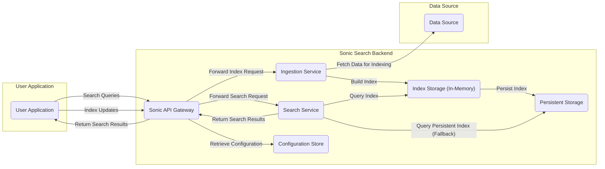

# Project Design Document: Sonic Search Backend

**Version:** 1.1
**Date:** October 26, 2023
**Author:** AI Software Architect

## 1. Introduction

This document provides an enhanced design overview of the Sonic search backend project, as found on GitHub at [https://github.com/valeriansaliou/sonic](https://github.com/valeriansaliou/sonic). Building upon the previous version, this document aims for greater clarity and detail in articulating the system's architecture, components, data flow, and key considerations, specifically to facilitate comprehensive threat modeling activities.

## 2. Goals and Objectives

The primary goals of this design document are:

*   To provide a clear and detailed understanding of the Sonic search backend's architecture and functionality.
*   To explicitly identify key components and their interactions within the system, highlighting trust boundaries.
*   To illustrate the data flow through the system with specific examples of operations.
*   To comprehensively outline potential areas of security concern, categorized for easier threat modeling.
*   To define the scope for future threat modeling exercises.

## 3. High-Level Architecture

Sonic acts as a dedicated search service, decoupling search functionality from the main application. It efficiently indexes data from a source and provides a fast search interface.

## 4. Detailed Architecture and Components

Sonic's architecture comprises several interconnected components, each with specific responsibilities:

*   **Sonic API Gateway:**
    *   Serves as the entry point for all external interactions with Sonic.
    *   Handles client authentication and authorization.
    *   Routes incoming requests (indexing and searching) to the appropriate backend services.
    *   May implement rate limiting and other security policies.
    *   Formats and returns responses to the client application.
*   **Ingestion Service:**
    *   Dedicated service responsible for processing data to be indexed.
    *   Receives indexing requests from the API Gateway.
    *   Fetches data from the designated Data Source.
    *   Transforms and analyzes the data for indexing.
    *   Builds and updates the **Index Storage (In-Memory)**.
    *   Triggers persistence of the index to **Persistent Storage**.
*   **Search Service:**
    *   Dedicated service for handling search queries.
    *   Receives search requests from the API Gateway.
    *   Queries the **Index Storage (In-Memory)** for efficient retrieval of results.
    *   May fall back to querying **Persistent Storage** if necessary.
    *   Ranks and filters search results based on the query.
    *   Returns the search results to the API Gateway.
*   **Index Storage (In-Memory):**
    *   The primary, volatile storage for the indexed data, optimized for speed.
    *   Built and maintained by the Ingestion Service.
    *   Provides low-latency access for the Search Service.
    *   Data is lost upon service restart if not persisted.
*   **Persistent Storage:**
    *   Provides durable storage for the index data, ensuring data persistence across restarts.
    *   Typically file-based, but the specific implementation might be configurable.
    *   Used for initial index loading and as a fallback for the Search Service.
*   **Configuration Store:**
    *   Stores the configuration settings for all Sonic components.
    *   May include settings for network ports, storage locations, authentication details, and performance parameters.
    *   Accessed by all components to retrieve their respective configurations.

## 5. Data Flow

The following details the data flow for indexing and searching operations, highlighting potential points of interaction and data transformation:

### 5.1. Indexing Data Flow

1. A **User Application** initiates an indexing request, sending data to the **Sonic API Gateway**.
2. The **Sonic API Gateway** authenticates and authorizes the request.
3. The **Sonic API Gateway** forwards the indexing request to the **Ingestion Service**.
4. The **Ingestion Service**, based on the request, fetches the data to be indexed from the **Data Source**.
5. The **Ingestion Service** processes and transforms the fetched data.
6. The **Ingestion Service** updates the **Index Storage (In-Memory)** with the indexed data.
7. The **Ingestion Service** triggers a process to persist the **Index Storage (In-Memory)** to the **Persistent Storage**.
8. The **Ingestion Service** confirms the successful indexing operation to the **Sonic API Gateway**.
9. The **Sonic API Gateway** relays the confirmation back to the **User Application**.

### 5.2. Searching Data Flow

1. A **User Application** submits a search query to the **Sonic API Gateway**.
2. The **Sonic API Gateway** authenticates and authorizes the request.
3. The **Sonic API Gateway** forwards the search query to the **Search Service**.
4. The **Search Service** queries the **Index Storage (In-Memory)** for matching documents.
5. If the data is not found or partially available in the in-memory index, the **Search Service** may query the **Persistent Storage**.
6. The **Search Service** ranks and filters the retrieved results based on relevance and query parameters.
7. The **Search Service** returns the search results to the **Sonic API Gateway**.
8. The **Sonic API Gateway** formats the results and sends them back to the **User Application**.

## 6. Security Considerations

This section outlines potential security considerations, categorized for structured threat modeling using frameworks like STRIDE:

*   **Spoofing:**
    *   How is the identity of clients interacting with the **Sonic API Gateway** verified?
    *   Can an attacker impersonate a legitimate user or service to send malicious indexing or search requests?
*   **Tampering:**
    *   How is the integrity of data during indexing ensured between the **Data Source**, **Ingestion Service**, and storage components?
    *   Can an attacker modify data in transit or at rest within the Sonic infrastructure?
    *   How is the integrity of the **Configuration Store** protected?
*   **Repudiation:**
    *   Are actions performed by users and services logged and auditable?
    *   Can a user or service deny performing an action, such as indexing or searching?
*   **Information Disclosure:**
    *   How is sensitive data protected during indexing, storage, and searching?
    *   Could an attacker gain unauthorized access to the index data in memory or persistent storage?
    *   Are error messages or logs revealing sensitive information?
*   **Denial of Service:**
    *   Is the **Sonic API Gateway** protected against excessive requests that could overwhelm the system?
    *   Can an attacker flood the **Ingestion Service** with indexing requests or the **Search Service** with complex queries?
    *   Are there resource limits in place to prevent resource exhaustion?
*   **Elevation of Privilege:**
    *   Are there different roles and permissions within the Sonic system?
    *   Could an attacker gain unauthorized access to administrative functions or sensitive data by exploiting vulnerabilities?
    *   How are internal service-to-service communications secured to prevent unauthorized access?

**Specific Security Concerns:**

*   **Authentication and Authorization:**
    *   Mechanisms used for client authentication (e.g., API keys, OAuth).
    *   Granularity of authorization controls for indexing and searching.
    *   Security of credentials used for accessing the **Data Source**.
*   **Input Validation:**
    *   Sanitization and validation of data received by the **Sonic API Gateway** and **Ingestion Service**.
    *   Protection against injection attacks (e.g., cross-site scripting in indexed data, command injection if external processes are invoked).
*   **Data Storage Security:**
    *   Encryption at rest for **Persistent Storage**.
    *   Access controls on the storage location.
    *   Security of the **Index Storage (In-Memory)**, especially if sensitive data is involved.
*   **Network Security:**
    *   Use of TLS/SSL for communication between the **User Application** and the **Sonic API Gateway**, and between internal services.
    *   Network segmentation and firewall rules to restrict access to Sonic components.
*   **Configuration Management Security:**
    *   Secure storage and access control for the **Configuration Store**.
    *   Protection of sensitive configuration parameters (e.g., database credentials, API keys).
*   **Logging and Auditing:**
    *   Comprehensive logging of security-relevant events (authentication attempts, authorization failures, data access).
    *   Secure storage and access control for log files.
*   **Dependency Management:**
    *   Regularly updating dependencies to patch known vulnerabilities.
    *   Security scanning of dependencies.
*   **Code Security:**
    *   Secure coding practices followed during development.
    *   Regular security code reviews and penetration testing.

## 7. Deployment Considerations

The security posture of Sonic can be significantly influenced by its deployment environment. Key considerations include:

*   **Standalone Server:**
    *   Security relies heavily on the host operating system's security configurations.
    *   Network security (firewall rules) is crucial.
*   **Containerized Deployment (e.g., Docker, Kubernetes):**
    *   Container image security and vulnerability scanning.
    *   Secure container orchestration platform configuration.
    *   Network policies within the container environment.
    *   Secrets management for sensitive configuration data.
*   **Cloud Deployment (e.g., AWS, Azure, GCP):**
    *   Leveraging cloud provider's security services (e.g., IAM, security groups, encryption services).
    *   Proper configuration of cloud resources and access controls.
    *   Compliance with cloud security best practices.

## 8. Threat Model Scope

The scope of future threat modeling activities for the Sonic project should encompass the following:

*   All components within the "Sonic Search Backend" boundary as depicted in the High-Level Architecture diagram.
*   The interactions between the "User Application" and the "Sonic API Gateway".
*   The interactions between the "Ingestion Service" and the "Data Source".
*   The storage and management of the "Persistent Storage" and "Configuration Store".
*   The network communication channels between all components.

Out of scope for the initial threat modeling effort may include:

*   The security of the "User Application" itself.
*   The internal workings and security of the "Data Source".
*   The physical security of the infrastructure hosting Sonic.

## 9. Future Considerations

Potential future developments that could impact the design and security of Sonic include:

*   **Clustering and High Availability:** Introducing new components for coordination and data replication, requiring analysis of inter-node communication security.
*   **Enhanced Search Functionality:** Adding features like faceted search or geo-spatial search, potentially introducing new data processing and security considerations.
*   **Plugin Architecture:** Allowing external developers to extend Sonic's functionality, requiring careful consideration of plugin security and sandboxing.
*   **Support for Multiple Data Sources:** Integrating with various data sources with different authentication and authorization mechanisms.

## 10. Conclusion

This enhanced design document provides a more detailed and structured overview of the Sonic search backend, specifically tailored for effective threat modeling. By clearly defining the architecture, data flow, and security considerations, and by outlining the scope for future analysis, this document serves as a solid foundation for identifying and mitigating potential security risks within the Sonic project.