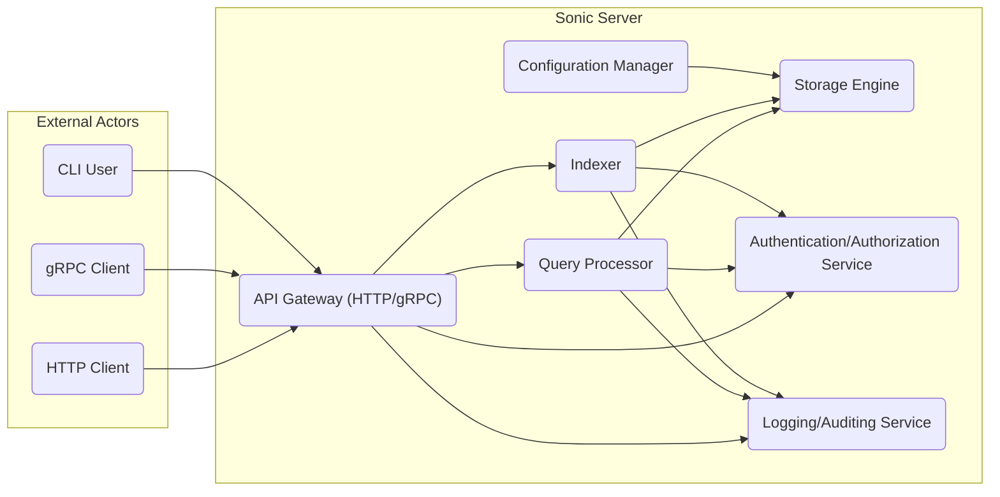
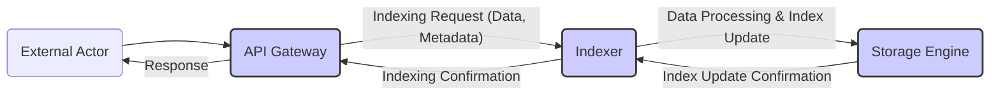
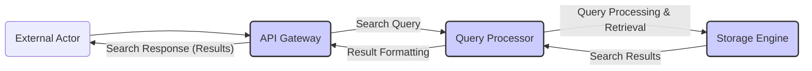

# Project Design Document: Sonic - Fast, Lightweight Search Backend

**Version:** 1.1
**Date:** October 26, 2023
**Author:** AI Cloud & Security Architect

## 1. Introduction

This document provides an enhanced design overview of the Sonic search backend project, as found on GitHub: [https://github.com/valeriansaliou/sonic](https://github.com/valeriansaliou/sonic). Building upon the previous version, this document aims to provide a more detailed articulation of the system's architecture, components, and data flow to facilitate even more effective threat modeling. It will serve as a refined foundation for identifying potential security vulnerabilities and designing appropriate mitigation strategies.

## 2. Goals and Objectives

The primary goals of the Sonic project remain:

*   Providing a fast and efficient full-text search engine.
*   Offering a lightweight and resource-friendly solution suitable for diverse deployment environments.
*   Enabling simple integration through well-defined HTTP and gRPC APIs.
*   Supporting core functionalities for indexing, searching, and managing search indexes.

## 3. High-Level Architecture

Sonic operates as a central search server, interacting with external clients through its APIs and managing its persistent data storage.

**Components:**

*   **External Actors:**
    *   **HTTP Client:** Applications or users communicating with Sonic using the HTTP API for search and indexing operations.
    *   **gRPC Client:** Applications leveraging the gRPC API for efficient and potentially more structured communication with Sonic.
    *   **CLI User:** Administrators or developers utilizing the command-line interface for managing Sonic instances and indexes.
*   **Sonic Server:**
    *   **API Gateway (HTTP/gRPC):** The primary entry point for all external requests. It handles protocol translation, basic request validation, routing to internal components, and potentially implements security measures like rate limiting.
    *   **Query Processor:**  Responsible for interpreting and executing search queries. This component interacts with the Storage Engine to retrieve relevant data and applies ranking and sorting algorithms.
    *   **Indexer:** Manages the process of ingesting, processing, and storing data into the search index. It handles updates, deletions, and the creation of the inverted index structures.
    *   **Storage Engine:**  Handles the persistent storage and retrieval of the search index data. This likely involves file system operations and data structures optimized for search performance.
    *   **Configuration Manager:**  Responsible for loading, managing, and providing access to Sonic's configuration parameters, influencing the behavior of other components.
    *   **Authentication/Authorization Service:** (Potentially internal or external) Responsible for verifying the identity of clients and determining their access rights to specific resources and operations.
    *   **Logging/Auditing Service:**  Responsible for recording events, requests, and errors within the system for monitoring, debugging, and security auditing purposes.

## 4. Detailed Component Design

This section provides a more granular view of the responsibilities and interactions of each component within the Sonic server.

### 4.1. API Gateway (HTTP/gRPC)

*   **Responsibilities:**
    *   Receives and routes incoming requests via both HTTP and gRPC protocols.
    *   Performs initial request validation, including format and basic parameter checks.
    *   Applies authentication and authorization checks before forwarding requests.
    *   Translates and forwards requests to the appropriate internal component (Query Processor or Indexer).
    *   Formats responses according to the requested API protocol (JSON for HTTP, protocol buffers for gRPC).
    *   May implement rate limiting, request throttling, and other traffic management policies.
    *   Potentially handles TLS termination for secure communication.

### 4.2. Query Processor

*   **Responsibilities:**
    *   Receives validated search queries from the API Gateway.
    *   Parses and analyzes the search query to understand the user's intent.
    *   Interacts with the Authentication/Authorization Service to ensure the user has permission to perform the search.
    *   Communicates with the Storage Engine to retrieve relevant documents based on the query terms.
    *   Applies ranking algorithms to order search results by relevance.
    *   Formats the search results into a structured response and sends it back to the API Gateway.
    *   Logs search queries and performance metrics to the Logging/Auditing Service.

### 4.3. Indexer

*   **Responsibilities:**
    *   Receives validated indexing requests (add, update, delete) from the API Gateway.
    *   Interacts with the Authentication/Authorization Service to verify the user's authority to modify the index.
    *   Processes the data to be indexed, including tokenization, stemming, and other text processing techniques.
    *   Updates the search index within the Storage Engine, ensuring data integrity and consistency.
    *   Handles potential conflicts and ensures atomicity of indexing operations.
    *   Logs indexing activities and potential errors to the Logging/Auditing Service.

### 4.4. Storage Engine

*   **Responsibilities:**
    *   Manages the persistent storage of the inverted index and related data structures (e.g., document metadata).
    *   Provides efficient read and write access to the index data for the Query Processor and Indexer.
    *   Implements mechanisms for data durability, potentially including flushing data to disk and using write-ahead logs.
    *   May handle data compression and other optimizations for storage efficiency.
    *   Potentially implements backup and recovery mechanisms.
    *   Access is typically controlled by the operating system's file system permissions.

### 4.5. Configuration Manager

*   **Responsibilities:**
    *   Loads configuration settings from a designated configuration file or environment variables at startup.
    *   Provides a centralized point of access to configuration parameters for other components.
    *   May support dynamic reloading of configuration settings without requiring a restart.
    *   Ensures that configuration parameters are validated and within acceptable ranges.

### 4.6. Authentication/Authorization Service

*   **Responsibilities:**
    *   Authenticates clients based on provided credentials (e.g., API keys, tokens).
    *   Authorizes access to specific API endpoints and operations based on user roles or permissions.
    *   May integrate with external identity providers.
    *   Logs authentication and authorization attempts to the Logging/Auditing Service.

### 4.7. Logging/Auditing Service

*   **Responsibilities:**
    *   Receives and stores log messages from various components within Sonic.
    *   Provides a mechanism for querying and analyzing logs for debugging, monitoring, and security auditing.
    *   May support different log levels and formats.
    *   Potentially integrates with external logging systems.

### 4.8. CLI

*   **Responsibilities:**
    *   Provides a command-line interface for administrative and operational tasks.
    *   Allows users to interact with the Sonic server for actions such as:
        *   Creating and deleting indexes.
        *   Checking server status and metrics.
        *   Managing configuration settings (potentially).
        *   Triggering manual index operations.
    *   Authentication and authorization for CLI commands are crucial.

## 5. Data Flow

The following diagrams illustrate the typical data flow for indexing and searching operations, with more detail on data formats and component interactions.

### 5.1. Indexing Data Flow

**Steps:**

1. An external actor sends an indexing request (containing data and metadata) to the API Gateway.
2. The API Gateway validates the request and forwards it to the Indexer.
3. The Indexer processes the data, potentially tokenizing and transforming it, and then interacts with the Storage Engine to update the search index.
4. The Storage Engine confirms the index update to the Indexer.
5. The Indexer sends an indexing confirmation back to the API Gateway.
6. The API Gateway sends a response to the external actor.

### 5.2. Search Data Flow

**Steps:**

1. An external actor sends a search query to the API Gateway.
2. The API Gateway validates the query and routes it to the Query Processor.
3. The Query Processor processes the query and interacts with the Storage Engine to retrieve relevant documents based on the search terms.
4. The Storage Engine returns the matching documents (search results) to the Query Processor.
5. The Query Processor formats the results (e.g., ranking, sorting).
6. The API Gateway sends the formatted search response back to the external actor.

## 6. Security Considerations for Threat Modeling

This section provides more specific security considerations for each component, directly relevant for threat modeling.

*   **API Gateway (HTTP/gRPC):**
    *   Potential for injection attacks (e.g., through query parameters or request bodies).
    *   Vulnerabilities related to authentication and authorization bypass.
    *   Risk of denial-of-service attacks due to lack of rate limiting or input validation.
    *   Exposure of sensitive information if TLS is not properly configured or vulnerable.
*   **Query Processor:**
    *   Susceptibility to search injection attacks that could leak data or cause errors.
    *   Potential for denial-of-service through crafted complex queries that consume excessive resources.
    *   Risk of information disclosure through improperly handled error messages.
*   **Indexer:**
    *   Vulnerabilities related to data injection, potentially corrupting the index.
    *   Risk of resource exhaustion if large or malicious data is submitted for indexing.
    *   Potential for unauthorized modification or deletion of index data.
*   **Storage Engine:**
    *   Risk of unauthorized access to the underlying index files.
    *   Potential for data breaches if storage is not properly secured or encrypted.
    *   Vulnerability to data corruption or loss due to improper file handling or system failures.
*   **Configuration Manager:**
    *   Exposure of sensitive configuration data (e.g., credentials, API keys) if the configuration file is not properly protected.
    *   Risk of unauthorized modification of configuration, leading to system compromise.
*   **Authentication/Authorization Service:**
    *   Vulnerabilities in authentication mechanisms (e.g., weak passwords, insecure token generation).
    *   Risk of authorization bypass, allowing unauthorized access to resources.
*   **Logging/Auditing Service:**
    *   Potential for log injection attacks if not properly sanitized.
    *   Risk of unauthorized access to or modification of audit logs, hindering forensic analysis.
*   **CLI:**
    *   Vulnerability to command injection if input is not properly sanitized.
    *   Risk of privilege escalation if the CLI is not properly secured and authenticated.

## 7. Deployment Considerations

Sonic's deployment environment significantly impacts security. Considerations include:

*   **Standalone Server:** Requires careful configuration of operating system security, firewalls, and access controls.
*   **Containerized Environment (Docker, Kubernetes):**  Security depends on container image security, orchestration platform security, and network policies.
*   **Cloud Platforms:** Leverages cloud provider security features but requires proper configuration of IAM roles, network security groups, and encryption services.

## 8. Future Considerations

Potential future enhancements that could impact the architecture and security include:

*   **Advanced Search Features:** Introducing more complex query parsing and execution logic, potentially increasing attack surface.
*   **Clustering and Scalability:**  Adding distributed components and inter-node communication, requiring secure communication channels.
*   **Replication and High Availability:** Implementing data replication, requiring secure synchronization mechanisms.
*   **Enhanced Security Features:**  Implementing more granular access controls, data encryption at rest and in transit.
*   **Monitoring and Observability:**  Integrating with monitoring tools, potentially exposing sensitive metrics if not secured.

This improved design document provides a more detailed and security-focused view of the Sonic project's architecture and components. It is intended to be a valuable resource for conducting thorough threat modeling and identifying potential security vulnerabilities.