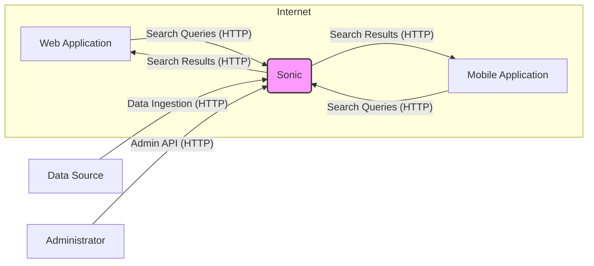
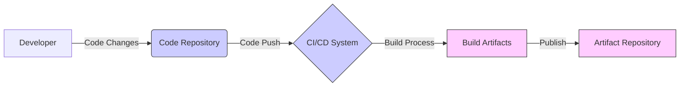

# BUSINESS POSTURE

- Business Priorities and Goals:
  - Provide fast and efficient search capabilities for applications and services.
  - Offer a lightweight and easily deployable search backend solution.
  - Enable schema-less data indexing for flexible data ingestion.
  - Enhance user experience by providing relevant and timely search results.
  - Support developer productivity through a simple and well-documented API.
- Business Risks:
  - Risk of data breaches if sensitive data is indexed and not properly secured.
  - Risk of service disruption if the search backend becomes unavailable, impacting dependent applications.
  - Risk of data integrity issues if indexed data is corrupted or tampered with, leading to incorrect search results.
  - Risk of performance degradation if the system is not properly scaled or optimized, affecting search speed and user experience.
  - Risk of reputational damage if security vulnerabilities are exploited, leading to data leaks or service outages.

# SECURITY POSTURE

- Security Controls:
  - security control: HTTPS for API communication (assumed, standard practice for web services). Implemented in: Network configuration and application deployment.
  - security control: Role-Based Access Control (RBAC) for administrative API endpoints (assumed, based on common security needs for data management systems). Implemented in: Application code and configuration.
  - security control: Input validation on API requests (assumed, standard secure coding practice). Implemented in: Application code.
  - security control: Dependency scanning for known vulnerabilities in used libraries (assumed, as part of modern software development). Implemented in: Build process (if automated).
- Accepted Risks:
  - accepted risk: Lack of formal security audit by a third-party security firm.
  - accepted risk: Reliance on community contributions for vulnerability discovery and patching.
  - accepted risk: Potential for zero-day vulnerabilities in dependencies or core code.
- Recommended Security Controls:
  - security control: Implement rate limiting on API endpoints to prevent denial-of-service attacks.
  - security control: Regularly perform static application security testing (SAST) and dynamic application security testing (DAST) on the codebase.
  - security control: Implement comprehensive logging and monitoring of security-relevant events, including API access and errors.
  - security control: Consider data-at-rest encryption for sensitive indexed data.
  - security control: Implement a robust vulnerability management process, including timely patching and security updates.
- Security Requirements:
  - Authentication:
    - Requirement: Secure authentication mechanism for administrative API endpoints to control access to sensitive operations like index management and configuration.
    - Requirement: Consider API keys or tokens for authentication of applications accessing the search API.
  - Authorization:
    - Requirement: Implement fine-grained authorization controls to restrict access to specific data or operations based on user roles or application permissions.
    - Requirement: Ensure that only authorized applications or users can perform administrative tasks.
  - Input Validation:
    - Requirement: Thoroughly validate all inputs to the API to prevent injection attacks (e.g., command injection, NoSQL injection).
    - Requirement: Sanitize input data before indexing to prevent stored cross-site scripting (XSS) vulnerabilities if search results are displayed in a web context.
  - Cryptography:
    - Requirement: Use HTTPS for all API communication to protect data in transit.
    - Requirement: Consider encrypting sensitive data at rest if the indexed data warrants it.
    - Requirement: Ensure proper handling of cryptographic keys and secrets, avoiding hardcoding or insecure storage.

# DESIGN

- C4 CONTEXT



- C4 CONTEXT Elements:
  - - Name: Web Application
    - Type: Software System
    - Description: A web-based application that utilizes Sonic for search functionality.
    - Responsibilities:
      - Sending search queries to Sonic API.
      - Displaying search results to users.
      - Authenticating users and managing sessions.
    - Security controls:
      - security control: User authentication and authorization.
      - security control: Input validation on user search queries before sending to Sonic.
      - security control: Output encoding of search results before displaying to prevent XSS.
  - - Name: Mobile Application
    - Type: Software System
    - Description: A mobile application that utilizes Sonic for search functionality.
    - Responsibilities:
      - Sending search queries to Sonic API.
      - Displaying search results to users.
      - User authentication and session management.
    - Security controls:
      - security control: User authentication and authorization.
      - security control: Input validation on user search queries before sending to Sonic.
      - security control: Secure storage of API keys or tokens if used for authentication.
  - - Name: Sonic
    - Type: Software System
    - Description: The Sonic search backend, responsible for indexing and searching data.
    - Responsibilities:
      - Receiving data for indexing via HTTP API.
      - Indexing data for efficient searching.
      - Processing search queries and returning relevant results.
      - Providing an administrative API for management tasks.
    - Security controls:
      - security control: HTTPS for all API endpoints.
      - security control: Role-Based Access Control for administrative API.
      - security control: Input validation on all API requests.
      - security control: Rate limiting on API endpoints.
  - - Name: Data Source
    - Type: External System
    - Description: External systems or databases that provide data to be indexed by Sonic.
    - Responsibilities:
      - Providing data to Sonic for indexing via HTTP API.
      - Ensuring data integrity and availability.
    - Security controls:
      - security control: Authorization and authentication for data ingestion requests to Sonic.
      - security control: Secure transmission of data to Sonic (HTTPS).
  - - Name: Administrator
    - Type: Person
    - Description: A human administrator responsible for managing and configuring the Sonic search backend.
    - Responsibilities:
      - Configuring Sonic settings.
      - Managing indexes and collections.
      - Monitoring Sonic performance and health.
      - Managing user access to administrative functions.
    - Security controls:
      - security control: Strong password policy for administrator accounts.
      - security control: Multi-factor authentication for administrator access (recommended).
      - security control: Audit logging of administrative actions.

- C4 CONTAINER

```mermaid
flowchart LR
    subgraph "Sonic System"
        subgraph "HTTP API Container"
            A["HTTP API"];
        end
        subgraph "Search Engine Container"
            B["Search Engine"];
        end
        subgraph "Data Storage Container"
            C["Data Storage"];
        end
        A -- "HTTP Requests/Responses" --> B;
        B -- "Data Access" --> C;
    end
    D["Web Application"] -- "HTTP API Requests" --> A;
    E["Mobile Application"] -- "HTTP API Requests" --> A;
    F["Data Source"] -- "HTTP API Requests (Ingestion)" --> A;
    G["Administrator"] -- "HTTP API Requests (Admin)" --> A;
    style "Sonic System" fill:#ccf,stroke:#333,stroke-width:2px
    style A fill:#fcf,stroke:#333,stroke-width:1px
    style B fill:#fcf,stroke:#333,stroke-width:1px
    style C fill:#fcf,stroke:#333,stroke-width:1px
```

- C4 CONTAINER Elements:
  - - Name: HTTP API Container
    - Type: Container
    - Description: Exposes the HTTP API for Sonic, handling requests for indexing, searching, and administration.
    - Responsibilities:
      - Receiving and validating HTTP requests.
      - Routing requests to the Search Engine or Data Storage containers.
      - Handling authentication and authorization for API requests.
      - Returning HTTP responses.
    - Security controls:
      - security control: HTTPS termination.
      - security control: Input validation and sanitization.
      - security control: Rate limiting.
      - security control: Authentication and authorization checks.
      - security control: Logging of API requests and errors.
  - - Name: Search Engine Container
    - Type: Container
    - Description: The core search engine component of Sonic, responsible for indexing and processing search queries.
    - Responsibilities:
      - Indexing data received from the HTTP API.
      - Processing search queries and retrieving relevant results from Data Storage.
      - Managing search indexes and configurations.
    - Security controls:
      - security control: Secure data access to Data Storage.
      - security control: Protection against denial-of-service attacks through efficient query processing.
  - - Name: Data Storage Container
    - Type: Container
    - Description: Persists the indexed data for Sonic. This could be file-based storage or a dedicated database.
    - Responsibilities:
      - Storing indexed data.
      - Providing data access to the Search Engine container.
      - Ensuring data persistence and integrity.
    - Security controls:
      - security control: File system permissions or database access controls to restrict access to indexed data.
      - security control: Data-at-rest encryption (optional, depending on sensitivity).
      - security control: Regular backups for data recovery.

- DEPLOYMENT

```mermaid
flowchart LR
    subgraph "Deployment Environment"
        subgraph "Server 1"
            A["Sonic Instance 1"];
        end
        subgraph "Server 2"
            B["Sonic Instance 2"];
        end
        subgraph "Load Balancer"
            C["Load Balancer"];
        end
    end
    D["Web Application"] -- "Search Queries (HTTP)" --> C;
    E["Mobile Application"] -- "Search Queries (HTTP)" --> C;
    F["Data Source"] -- "Data Ingestion (HTTP)" --> C;
    G["Administrator"] -- "Admin API (HTTP)" --> C;
    C -- "HTTP Requests" --> A;
    C -- "HTTP Requests" --> B;
    style "Deployment Environment" fill:#eef,stroke:#333,stroke-width:2px
    style A fill:#fcf,stroke:#333,stroke-width:1px
    style B fill:#fcf,stroke:#333,stroke-width:1px
    style C fill:#fcf,stroke:#333,stroke-width:1px
```

- DEPLOYMENT Elements:
  - - Name: Server 1
    - Type: Infrastructure Node (Server)
    - Description: A physical or virtual server instance hosting a Sonic instance.
    - Responsibilities:
      - Running a Sonic instance.
      - Providing compute resources for Sonic.
      - Ensuring network connectivity.
    - Security controls:
      - security control: Operating system hardening.
      - security control: Firewall rules to restrict network access.
      - security control: Regular security patching.
  - - Name: Server 2
    - Type: Infrastructure Node (Server)
    - Description: Another physical or virtual server instance hosting a Sonic instance, for redundancy and scalability.
    - Responsibilities:
      - Running a Sonic instance.
      - Providing compute resources for Sonic.
      - Ensuring network connectivity.
    - Security controls:
      - security control: Operating system hardening.
      - security control: Firewall rules to restrict network access.
      - security control: Regular security patching.
  - - Name: Load Balancer
    - Type: Infrastructure Node (Load Balancer)
    - Description: Distributes incoming search and admin API requests across multiple Sonic instances for high availability and scalability.
    - Responsibilities:
      - Distributing traffic to Sonic instances.
      - Performing health checks on Sonic instances.
      - Providing a single entry point for API requests.
    - Security controls:
      - security control: DDoS protection.
      - security control: SSL/TLS termination.
      - security control: Access control lists to restrict access to the load balancer itself.

- BUILD



- BUILD Elements:
  - - Name: Developer
    - Type: Person
    - Description: Software developer contributing code to the Sonic project.
    - Responsibilities:
      - Writing and testing code.
      - Committing code changes to the code repository.
      - Following secure coding practices.
    - Security controls:
      - security control: Secure development environment.
      - security control: Code review process.
  - - Name: Code Repository
    - Type: Software System (e.g., GitHub)
    - Description: Version control system hosting the Sonic source code.
    - Responsibilities:
      - Storing and managing source code.
      - Tracking code changes.
      - Providing access control to the codebase.
    - Security controls:
      - security control: Access control to the repository (authentication and authorization).
      - security control: Audit logging of code changes.
      - security control: Branch protection policies.
  - - Name: CI/CD System
    - Type: Software System (e.g., GitHub Actions)
    - Description: Automated system for building, testing, and deploying Sonic.
    - Responsibilities:
      - Automating the build process.
      - Running automated tests (unit, integration, security).
      - Performing static analysis and security scans.
      - Packaging build artifacts.
      - Publishing artifacts to the artifact repository.
    - Security controls:
      - security control: Secure configuration of CI/CD pipelines.
      - security control: Secret management for credentials used in the build process.
      - security control: Integration of SAST and dependency scanning tools.
  - - Name: Build Artifacts
    - Type: Data
    - Description: The output of the build process, typically executable binaries or container images.
    - Responsibilities:
      - Representing a built version of Sonic.
      - Being ready for deployment.
    - Security controls:
      - security control: Integrity checks (e.g., checksums) to ensure artifacts are not tampered with.
      - security control: Signing of artifacts (optional, for enhanced supply chain security).
  - - Name: Artifact Repository
    - Type: Software System (e.g., Docker Registry, Package Registry)
    - Description: Stores and manages build artifacts for distribution and deployment.
    - Responsibilities:
      - Storing build artifacts.
      - Providing access to artifacts for deployment.
      - Versioning of artifacts.
    - Security controls:
      - security control: Access control to the artifact repository.
      - security control: Vulnerability scanning of stored artifacts (e.g., container image scanning).

# RISK ASSESSMENT

- Critical Business Processes:
  - Providing search functionality to web and mobile applications, enabling users to find information quickly and efficiently.
  - Data ingestion and indexing process, ensuring that data is available for searching.
  - Administrative functions for managing and configuring the search backend.
- Data Sensitivity:
  - The sensitivity of data depends entirely on what data is indexed by Sonic. It could range from publicly available information to highly sensitive personal or business data.
  - If sensitive data is indexed, it requires appropriate security controls to protect its confidentiality, integrity, and availability.
  - Consider data types like: Personally Identifiable Information (PII), financial data, confidential business documents, etc.

# QUESTIONS & ASSUMPTIONS

- Questions:
  - What type of data will be indexed by Sonic in the target deployment environment? (Sensitivity level?)
  - What are the specific performance and scalability requirements for Sonic?
  - What authentication and authorization mechanisms are currently in place or planned for applications accessing Sonic?
  - Are there any specific compliance requirements (e.g., GDPR, HIPAA) that need to be considered?
  - What is the expected deployment environment (cloud, on-premise, hybrid)?
- Assumptions:
  - BUSINESS POSTURE: The primary business goal is to provide fast and reliable search functionality to enhance user experience. Availability and data integrity are important business priorities.
  - SECURITY POSTURE: HTTPS is used for API communication. Basic input validation is implemented. Role-Based Access Control is assumed for administrative functions. No formal security audits have been conducted.
  - DESIGN: Sonic is deployed as a cluster of instances behind a load balancer for high availability. Data is persisted in a file-based storage or database. The build process involves a CI/CD system with basic automated checks.