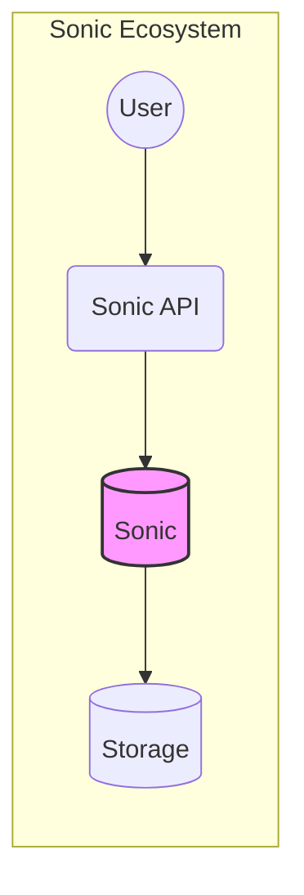
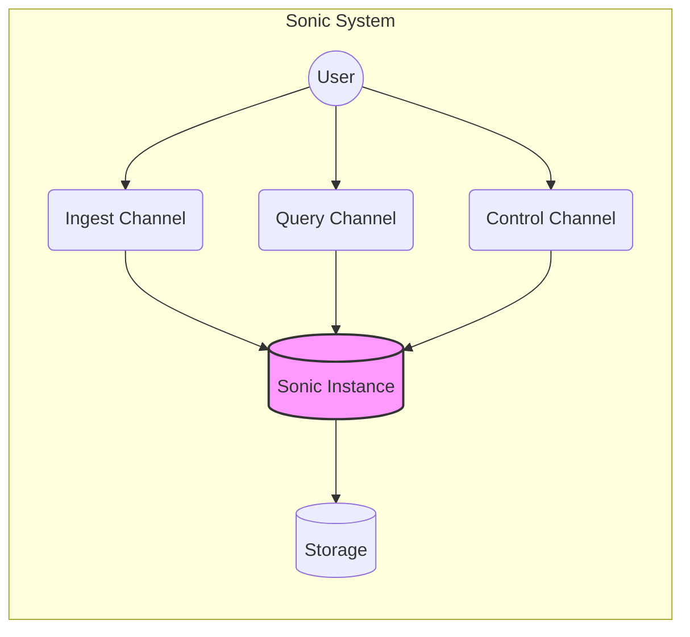
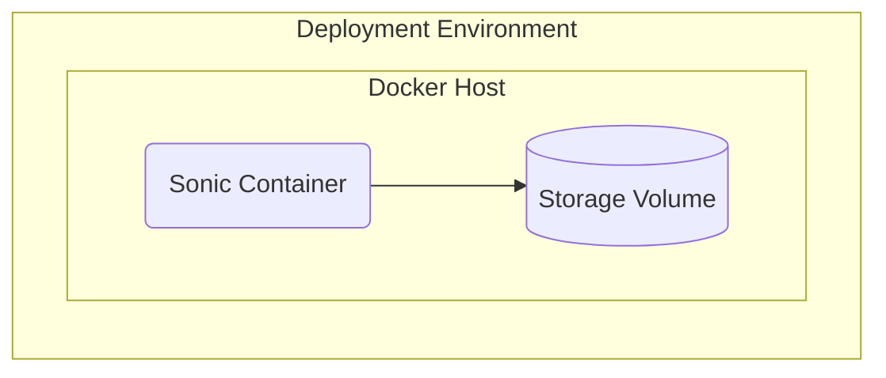
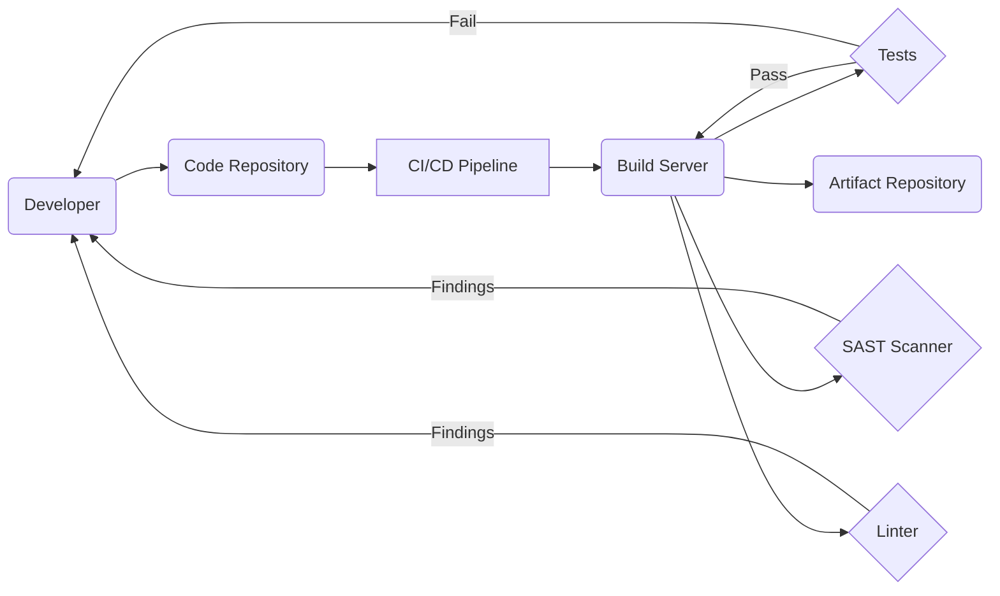

Okay, let's create a design document for the Sonic project, keeping in mind its purpose and potential security considerations.

# BUSINESS POSTURE

Sonic is positioned as a lightweight, fast, and schema-less alternative to traditional search backends like Elasticsearch.  It prioritizes speed and efficiency, making it suitable for use cases where low latency search is critical.  The project appears to be targeted at developers and companies who need a simple, performant search solution without the overhead of a full-fledged search engine.  It's likely aimed at startups or projects within larger organizations where rapid iteration and minimal operational burden are valued.

Business Priorities:

*   Provide a fast and efficient search backend.
*   Offer a simple, easy-to-use alternative to more complex solutions.
*   Minimize operational overhead and resource consumption.
*   Enable quick integration into existing systems.

Business Goals:

*   Gain adoption among developers seeking a lightweight search solution.
*   Establish Sonic as a viable alternative to Elasticsearch for specific use cases.
*   Build a community around the project to foster contributions and support.

Most Important Business Risks:

*   Data breaches or unauthorized access to indexed data. Since Sonic is a search backend, the confidentiality and integrity of the data it handles are paramount.
*   Denial-of-service attacks that could render the search service unavailable. Given Sonic's focus on speed, any disruption to its availability would directly impact its core value proposition.
*   Data corruption or loss due to software bugs or operational errors.  Reliability and data integrity are crucial for any search backend.
*   Supply chain vulnerabilities introduced through dependencies.
*   Lack of robust access control mechanisms, potentially leading to unauthorized data manipulation or deletion.

# SECURITY POSTURE

Based on the provided GitHub repository, here's an assessment of the existing security posture:

Existing Security Controls:

*   security control: The project uses Rust, a memory-safe language, which inherently mitigates many common vulnerabilities like buffer overflows. (Described in the README and inherent to the codebase).
*   security control: Limited external dependencies, reducing the attack surface. (Visible in the Cargo.toml file).
*   security control: Basic command-line interface with some input validation. (Observable in the source code).
*   security control: Configuration file to control some aspects of Sonic's behavior. (Described in the documentation).

Accepted Risks:

*   accepted risk: The project is relatively young, and its security posture may not be fully mature.
*   accepted risk: Limited built-in authentication and authorization mechanisms. The documentation suggests relying on network-level security (firewalls) for access control.
*   accepted risk: The focus on performance might have led to trade-offs in terms of security features.

Recommended Security Controls (High Priority):

*   Implement robust authentication and authorization mechanisms. This is crucial to prevent unauthorized access to the search index and administrative functions.
*   Introduce comprehensive input sanitization and validation to prevent injection attacks.
*   Implement rate limiting and other DoS mitigation techniques.
*   Consider adding support for data encryption at rest and in transit.
*   Perform regular security audits and penetration testing.
*   Establish a clear security vulnerability reporting process.
*   Implement robust logging and monitoring to detect and respond to security incidents.

Security Requirements:

*   Authentication:
    *   Strong password policies or other robust authentication methods (e.g., API keys, mutual TLS).
    *   Protection against brute-force attacks.
    *   Secure storage of credentials (e.g., hashing and salting).

*   Authorization:
    *   Role-based access control (RBAC) to restrict access to specific commands and data.
    *   Granular control over search and indexing operations.
    *   Ability to define different access levels for different users or groups.

*   Input Validation:
    *   Strict validation of all input data, including search queries, configuration parameters, and control commands.
    *   Whitelist-based validation where possible, rejecting any input that doesn't conform to expected patterns.
    *   Protection against common injection attacks (e.g., command injection, cross-site scripting).

*   Cryptography:
    *   Use of strong, well-vetted cryptographic libraries for any encryption or hashing needs.
    *   Secure key management practices.
    *   Consider encrypting data at rest if sensitive information is stored in the index.
    *   Use TLS/SSL for network communication to protect data in transit.

# DESIGN

## C4 CONTEXT

C4 Context Element List:

*   Element:
    *   Name: User
    *   Type: Person
    *   Description: Represents a user or system interacting with Sonic to perform searches or manage the index.
    *   Responsibilities:
        *   Sends search queries to Sonic.
        *   Manages the Sonic index (adding, deleting, updating data).
    *   Security controls:
        *   Authentication and authorization should be enforced at the Sonic API level.

*   Element:
    *   Name: Sonic API
    *   Type: API
    *   Description: The interface through which users interact with Sonic.
    *   Responsibilities:
        *   Receives and processes search requests.
        *   Handles index management operations.
        *   Enforces access control.
    *   Security controls:
        *   Input validation.
        *   Authentication and authorization.
        *   Rate limiting.

*   Element:
    *   Name: Sonic
    *   Type: Software System
    *   Description: The core Sonic search backend.
    *   Responsibilities:
        *   Manages the search index.
        *   Processes search queries.
        *   Handles data storage and retrieval.
    *   Security controls:
        *   Internal input validation.
        *   Secure data handling.

*   Element:
    *   Name: Storage
    *   Type: Storage
    *   Description: Persistent storage for the search index.
    *   Responsibilities:
        *   Stores the search index data.
        *   Provides data persistence.
    *   Security controls:
        *   Data encryption at rest (recommended).
        *   Access control to the storage system.

## C4 CONTAINER

C4 Container Element List:

*   Element:
    *   Name: User
    *   Type: Person
    *   Description: Represents a user or system interacting with Sonic to perform searches or manage the index.
    *   Responsibilities:
        *   Sends search queries to Sonic.
        *   Manages the Sonic index (adding, deleting, updating data).
    *   Security controls:
        *   Authentication and authorization should be enforced at the channel level.

*   Element:
    *   Name: Ingest Channel
    *   Type: Channel
    *   Description: Channel for ingesting data into Sonic.
    *   Responsibilities:
        *   Receives data to be indexed.
        *   Sends data to the Sonic Instance for processing.
    *   Security controls:
        *   Input validation.
        *   Authentication and authorization.

*   Element:
    *   Name: Query Channel
    *   Type: Channel
    *   Description: Channel for querying data from Sonic.
    *   Responsibilities:
        *   Receives search queries.
        *   Sends queries to the Sonic Instance for processing.
        *   Returns search results to the user.
    *   Security controls:
        *   Input validation.
        *   Authentication and authorization.
        *   Rate limiting.

*   Element:
    *   Name: Control Channel
    *   Type: Channel
    *   Description: Channel for controlling the Sonic instance.
    *   Responsibilities:
        *   Receives control commands (e.g., flush, consolidate).
        *   Sends commands to the Sonic Instance for execution.
    *   Security controls:
        *   Input validation.
        *   Authentication and authorization.

*   Element:
    *   Name: Sonic Instance
    *   Type: Container
    *   Description: A running instance of the Sonic search backend.
    *   Responsibilities:
        *   Manages the search index.
        *   Processes search queries and ingest requests.
        *   Handles data storage and retrieval.
    *   Security controls:
        *   Internal input validation.
        *   Secure data handling.

*   Element:
    *   Name: Storage
    *   Type: Storage
    *   Description: Persistent storage for the search index.
    *   Responsibilities:
        *   Stores the search index data.
        *   Provides data persistence.
    *   Security controls:
        *   Data encryption at rest (recommended).
        *   Access control to the storage system.

## DEPLOYMENT

Possible Deployment Solutions:

1.  Standalone Server: Sonic can be deployed as a standalone process on a dedicated server or virtual machine.
2.  Containerized Deployment (Docker): Sonic can be packaged as a Docker container, making it easy to deploy and manage.
3.  Cloud-Based Deployment (e.g., AWS EC2, Google Compute Engine, Azure VMs): Sonic can be deployed on cloud-based virtual machines.

Chosen Solution (Detailed Description): Containerized Deployment (Docker)

Sonic is packaged and distributed as a Docker image. This allows for easy deployment and management across various environments. The Docker image contains the Sonic binary and all necessary dependencies.

Deployment Element List:

*   Element:
    *   Name: Docker Host
    *   Type: Server
    *   Description: The physical or virtual machine running the Docker engine.
    *   Responsibilities:
        *   Hosts and runs the Sonic Docker container.
        *   Provides the necessary resources (CPU, memory, storage).
    *   Security controls:
        *   Operating system hardening.
        *   Firewall rules to restrict network access.
        *   Regular security updates.

*   Element:
    *   Name: Sonic Container
    *   Type: Container
    *   Description: The running instance of the Sonic Docker image.
    *   Responsibilities:
        *   Runs the Sonic search backend.
        *   Handles search queries and index management.
    *   Security controls:
        *   Container isolation.
        *   Limited privileges within the container.
        *   Regular image updates to patch vulnerabilities.

*   Element:
    *   Name: Storage Volume
    *   Type: Storage
    *   Description: A persistent volume mounted to the Sonic container for storing the search index.
    *   Responsibilities:
        *   Provides persistent storage for the search index data.
    *   Security controls:
        *   Data encryption at rest (recommended).
        *   Access control to the storage volume.

## BUILD

The Sonic build process leverages Rust's Cargo build system.  It involves compiling the source code, running tests, and creating a release binary.  The process can be automated using a CI/CD pipeline.

Build Process Description:

1.  Developer commits code changes to the code repository (e.g., GitHub).
2.  A CI/CD pipeline (e.g., GitHub Actions, Travis CI, Jenkins) is triggered.
3.  The CI/CD pipeline checks out the code and starts a build server.
4.  The build server uses Cargo to compile the Sonic source code.
5.  Unit tests and integration tests are executed.
6.  Static analysis tools (SAST) like Clippy and cargo-audit are run to identify potential security vulnerabilities and coding errors.
7.  Linters are used to enforce code style and best practices.
8.  If all tests and checks pass, a release binary is created.
9.  The release binary is published to an artifact repository (e.g., Docker Hub, GitHub Releases).

Security Controls in Build Process:

*   Automated Build: The build process is automated using a CI/CD pipeline, ensuring consistency and repeatability.
*   Dependency Management: Cargo.toml and Cargo.lock manage dependencies, and tools like cargo-audit can be used to check for known vulnerabilities in dependencies.
*   Static Analysis (SAST): Static analysis tools are used to identify potential security vulnerabilities in the code.
*   Testing: Unit and integration tests help ensure the correctness and security of the code.
*   Artifact Repository: The built artifact is stored in a secure repository.

# RISK ASSESSMENT

Critical Business Processes to Protect:

*   Search functionality: Ensuring the availability and responsiveness of the search service.
*   Index management: Protecting the integrity and confidentiality of the search index.

Data to Protect and Sensitivity:

*   Indexed data: The sensitivity of this data depends on the specific use case. It could range from publicly available information to highly confidential data.
*   Configuration data: This may contain sensitive information like passwords or API keys.
*   Logs: Logs may contain sensitive information about user activity and system events.

# QUESTIONS & ASSUMPTIONS

Questions:

*   What specific types of data will be indexed by Sonic in typical deployments? This will help determine the appropriate level of security controls.
*   What are the expected performance requirements (queries per second, latency)? This will influence the design and deployment choices.
*   What is the expected scale of deployments (number of users, index size)? This will impact scalability considerations.
*   Are there any existing security infrastructure or policies that Sonic needs to integrate with?
*   What level of operational expertise is expected from users deploying and managing Sonic?

Assumptions:

*   BUSINESS POSTURE: The primary use case for Sonic is for scenarios where speed and simplicity are prioritized over comprehensive security features.
*   SECURITY POSTURE: Users deploying Sonic will have a basic understanding of security best practices and will take responsibility for securing the deployment environment.
*   DESIGN: The initial design prioritizes simplicity and performance, with the understanding that additional security features may be added later based on user feedback and evolving requirements. The deployment environment will be secured separately.