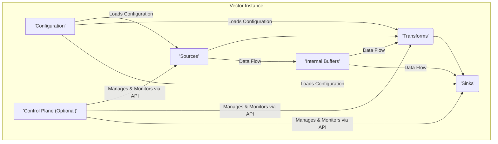
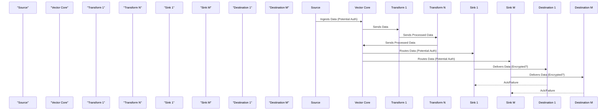

# Project Design Document: Vector (Improved)

**Version:** 1.1
**Date:** October 26, 2023
**Author:** AI Software Architect

## 1. Introduction

This document provides an enhanced and more detailed design overview of the Vector project, an open-source observability data pipeline. Building upon the initial design, this version aims to provide a richer understanding of the system's architecture, components, and data flow, specifically tailored for effective threat modeling. It elaborates on the key elements of Vector to facilitate a comprehensive analysis of its potential security vulnerabilities, attack surfaces, and potential threat actors.

## 2. Goals and Scope

The primary goal of this document is to provide a clear, comprehensive, and security-focused architectural description of Vector. The scope includes:

*   High-level system architecture with detailed component breakdowns
*   In-depth descriptions of core components, emphasizing security-relevant functionalities
*   Detailed data flow diagrams and explanations, highlighting potential interception points
*   Specific deployment considerations and their security implications
*   A more comprehensive initial security considerations section, categorized for clarity

This document will not cover:

*   Granular implementation details within each component's codebase
*   An exhaustive list of all possible configuration options
*   Detailed performance testing methodologies or results
*   Specific threat modeling outputs or mitigation strategies

## 3. System Overview

Vector is a robust and efficient observability data router designed for high-throughput processing of logs, metrics, and traces. It empowers users to collect data from diverse sources, apply transformations for enrichment and standardization, and route this data to multiple heterogeneous destinations. The fundamental concept within Vector is the data pipeline, a configurable sequence of stages: sources, transforms, and sinks, through which observability data flows.

## 4. Architectural Design

The following diagram illustrates the enhanced high-level architecture of Vector, emphasizing key interactions:

### 4.1. Core Components (Detailed)

*   **Sources:**
    *   **Functionality:** Responsible for the initial acquisition of observability data from various origins. This involves listening on network ports, reading from files, polling APIs, or consuming messages from queues.
    *   **Security Relevance:**
        *   **Authentication:** Some sources might require authentication credentials to access the data source (e.g., API keys, usernames/passwords). Secure storage and handling of these credentials are critical.
        *   **Authorization:**  Ensuring Vector has the necessary permissions to access the data source is important to prevent access errors or privilege escalation.
        *   **Data Integrity:** Sources should ideally verify the integrity of the data received, if possible, to prevent the introduction of corrupted data into the pipeline.
        *   **Network Exposure:** Sources listening on network ports increase the attack surface. Proper network segmentation and firewall rules are necessary.
    *   **Examples:** `file`, `socket`, `http`, `kafka`, `aws_cloudwatch_logs`.

*   **Transforms:**
    *   **Functionality:**  Perform in-flight processing and manipulation of data records. This includes filtering unwanted data, enriching records with additional information, converting data formats, aggregating metrics, and redacting sensitive information.
    *   **Security Relevance:**
        *   **Data Confidentiality:** Transforms handling sensitive data must be configured correctly to prevent accidental exposure or leakage. Redaction and masking techniques are crucial.
        *   **Data Integrity:**  Transforms should not introduce errors or corrupt data during processing. Validation of transformation logic is important.
        *   **Code Injection:**  Carefully designed transform configurations are needed to prevent potential code injection vulnerabilities if user-provided scripts or expressions are used.
        *   **Resource Consumption:**  Inefficient transforms can consume excessive CPU or memory, leading to denial-of-service within the Vector instance.
    *   **Examples:** `remap`, `filter`, `aggregate`, `json_parser`, `regex_parser`.

*   **Sinks:**
    *   **Functionality:**  Responsible for delivering the processed data to its final destination. This involves sending data over the network, writing to files, or pushing messages to queues.
    *   **Security Relevance:**
        *   **Authentication and Authorization:** Sinks often require authentication credentials to write data to the destination. Secure management of these credentials is vital.
        *   **Data Confidentiality and Integrity in Transit:** Communication with sinks should be encrypted (e.g., TLS) to protect data in transit.
        *   **Authorization at Destination:** Ensuring the destination service is configured to only allow Vector to write the intended data is important.
        *   **Rate Limiting and Error Handling:** Sinks should implement appropriate rate limiting and error handling to prevent overwhelming the destination service and to handle delivery failures gracefully.
    *   **Examples:** `file`, `elasticsearch`, `splunk_hec`, `kafka`, `prometheus_remote_write`.

*   **Configuration:**
    *   **Functionality:** Defines the entire behavior of a Vector instance, including the pipeline stages (sources, transforms, sinks) and their specific configurations.
    *   **Security Relevance:**
        *   **Confidentiality:** Configuration files may contain sensitive information like API keys, passwords, and connection strings. Secure storage and access control are paramount. Encryption at rest should be considered.
        *   **Integrity:**  Tampering with the configuration can lead to misconfiguration, data loss, or security breaches. Integrity checks and version control are important.
        *   **Access Control:**  Limiting who can read and modify the configuration is crucial.
        *   **Secrets Management:**  Using dedicated secrets management solutions to handle sensitive credentials within the configuration is a best practice.
    *   **Formats:** TOML, YAML.

*   **Control Plane (Optional):**
    *   **Functionality:** Provides a centralized platform for managing and monitoring multiple Vector instances. This includes remote configuration management, health monitoring, metrics collection about Vector's performance, and potentially centralized logging.
    *   **Security Relevance:**
        *   **Authentication and Authorization:**  Strong authentication and authorization are essential to control access to the control plane and prevent unauthorized management of Vector instances.
        *   **Secure Communication:** Communication between the control plane and Vector instances must be secured (e.g., TLS with mutual authentication).
        *   **Data Confidentiality and Integrity:** Data transmitted to and from the control plane (including configurations and metrics) needs to be protected.
        *   **Availability:** The control plane's availability is important for managing and monitoring the Vector infrastructure.
    *   **Interaction:** Typically through REST APIs.

*   **Internal Buffers:**
    *   **Functionality:** Vector utilizes internal buffers to handle temporary backpressure, network latency, or sink unavailability. This ensures data is not lost during transient issues.
    *   **Security Relevance:**
        *   **Data Confidentiality at Rest:**  Data residing in internal buffers might be sensitive. Consider encryption of these buffers, especially if they are persisted to disk.
        *   **Resource Limits:**  Unbounded buffer growth can lead to resource exhaustion and denial-of-service. Proper sizing and management of buffers are necessary.
        *   **Access Control:**  Access to the memory or disk locations where buffers are stored should be restricted.

### 4.2. Data Flow (Enhanced)

The data flow within a Vector instance can be broken down into more granular steps, highlighting potential security checkpoints:

1. **Data Acquisition (Source):** The source component initiates the data collection process based on its configuration. This might involve establishing network connections, reading files, or polling APIs. *Security Checkpoint: Verify source authentication and authorization.*
2. **Initial Buffering:**  Incoming data is often placed in an initial buffer within the source or the Vector core. *Security Checkpoint: Consider encryption for sensitive data in buffers.*
3. **Transformation Pipeline:** Data is passed sequentially through the configured transforms. Each transform applies its specific logic. *Security Checkpoint: Validate transform configurations to prevent data leaks or corruption.*
4. **Internal Buffering (Pre-Sink):** Before reaching the sink, data is typically buffered again to handle potential backpressure or temporary sink unavailability. *Security Checkpoint: Consider encryption for sensitive data in these buffers.*
5. **Routing and Delivery (Sink):** The Vector core routes the processed data to the appropriate sink(s). The sink then attempts to deliver the data to its configured destination. *Security Checkpoint: Verify sink authentication, authorization, and secure communication protocols.*
6. **Delivery Acknowledgement/Failure:** Sinks typically provide feedback on the success or failure of data delivery. Vector can use this information for retry mechanisms or error logging. *Security Checkpoint: Securely handle and log delivery failures, avoiding exposure of sensitive information.*

The following diagram illustrates the enhanced data flow with a focus on potential security considerations:

## 5. Deployment Considerations (Security Focused)

Vector's deployment environment significantly impacts its security posture. Consider the following scenarios:

*   **Standalone on a Host:**
    *   **Security Implications:**  Relies on the host operating system's security features (firewall, user permissions). Configuration files are typically stored locally, requiring careful access control. Network exposure depends on the configured sources and sinks.
    *   **Threats:**  Compromise of the host system can directly impact Vector. Misconfigured host firewalls can expose Vector services.

*   **Containerized (Docker, Kubernetes):**
    *   **Security Implications:**  Benefits from container isolation and resource management. Kubernetes provides features for secrets management, network policies, and role-based access control. Container image security is crucial.
    *   **Threats:**  Vulnerabilities in the container image, misconfigured network policies, or compromised Kubernetes control plane can impact Vector.

*   **As a Sidecar:**
    *   **Security Implications:**  Shares the network namespace and potentially other resources with the main application. Isolation depends on the container runtime and configuration.
    *   **Threats:**  Compromise of the main application container could potentially lead to the compromise of the Vector sidecar.

*   **Distributed Cluster (Managed by Control Plane):**
    *   **Security Implications:**  Centralized management and monitoring but introduces the security considerations of the control plane itself. Secure communication between Vector instances and the control plane is critical.
    *   **Threats:**  Compromise of the control plane can have a widespread impact on the entire Vector infrastructure. Network segmentation between cluster nodes is important.

## 6. Security Considerations (Categorized)

This section provides a more structured overview of security considerations, categorized for clarity:

*   **Confidentiality:**
    *   Protecting sensitive data within the configuration files (credentials, API keys).
    *   Ensuring secure transport of data between Vector components and external systems (TLS).
    *   Implementing proper redaction and masking of sensitive data within transforms.
    *   Securing internal buffers to prevent unauthorized access to data at rest.

*   **Integrity:**
    *   Protecting the integrity of configuration files to prevent tampering.
    *   Ensuring transforms do not corrupt or introduce errors into the data stream.
    *   Verifying the integrity of data received from sources, if possible.
    *   Maintaining the integrity of the Vector application binaries and dependencies.

*   **Availability:**
    *   Preventing denial-of-service attacks against Vector instances.
    *   Ensuring the resilience of Vector to handle temporary outages of sources or sinks.
    *   Proper resource management to prevent resource exhaustion.
    *   High availability considerations for critical Vector deployments.

*   **Authentication and Authorization:**
    *   Securely managing credentials for accessing sources and sinks.
    *   Implementing strong authentication for the Control Plane.
    *   Using authorization mechanisms to control access to Vector management functions.
    *   Considering mutual TLS for authentication between Vector components.

*   **Auditing and Logging:**
    *   Logging security-relevant events (e.g., configuration changes, authentication failures).
    *   Securely storing and managing audit logs.
    *   Ensuring logs contain sufficient information for security analysis without exposing sensitive data.

*   **Supply Chain Security:**
    *   Vetting dependencies for known vulnerabilities.
    *   Securing the build and release pipeline to prevent tampering.
    *   Using signed artifacts for distribution.

## 7. Future Considerations

Future enhancements to Vector that could introduce new security considerations include:

*   **Dynamic Configuration Updates:**  Implementing secure mechanisms for applying configuration changes without restarts.
*   **Enhanced Plugin System Security:**  Providing secure sandboxing and validation for custom plugins.
*   **Built-in Secrets Management Integration:**  Direct integration with secrets management providers.
*   **Advanced Routing Based on Data Content:**  Requires careful consideration of potential information leakage.

## 8. Conclusion

This improved design document provides a more detailed and security-focused overview of the Vector project. By elaborating on the functionality of each component, clarifying data flow, and categorizing security considerations, this document aims to be a valuable resource for conducting thorough threat modeling activities. Understanding these architectural details and potential security implications is crucial for building and deploying Vector in a secure manner.