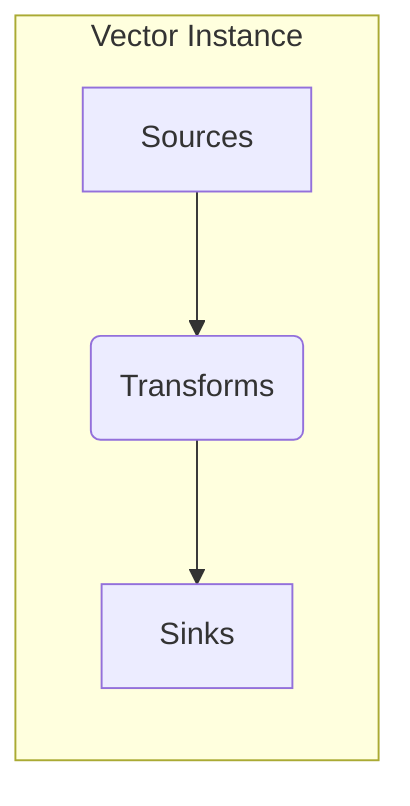
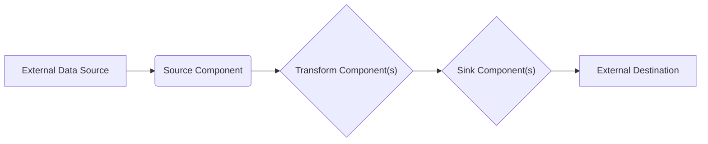

# Project Design Document: Vector

**Version:** 1.1
**Date:** October 26, 2023
**Author:** AI Software Architect

## 1. Introduction

This document provides an enhanced and more detailed design overview of the Vector project, an open-source observability data pipeline. It elaborates on the system's architecture, key components, data flow, configuration, deployment considerations, and security aspects. This document serves as a comprehensive foundation for understanding the system's design and will be used as input for subsequent threat modeling activities.

## 2. Project Overview

Vector is a robust, high-performance, and vendor-neutral observability data pipeline designed for collecting, transforming, and routing logs, metrics, and traces efficiently. Vector aims to be a highly flexible and reliable solution for managing observability data at scale, catering to diverse infrastructure and application needs.

## 3. Goals and Objectives

* **Highly Reliable Data Delivery:** Guarantee accurate and consistent delivery of observability data to designated destinations, even under varying load conditions.
* **Optimized Resource Utilization:** Minimize resource consumption (CPU, memory, network bandwidth) during data processing and transportation, ensuring cost-effectiveness.
* **Extensive Extensibility and Flexibility:**  Support a broad spectrum of data sources, transformation logic, and data sinks, allowing seamless integration with various observability ecosystems.
* **Simplified Configuration and Management:** Offer a user-friendly and intuitive configuration experience, reducing operational overhead and complexity.
* **Comprehensive Observability of the Pipeline:** Provide deep insights into the pipeline's health, performance metrics, and data flow characteristics for effective monitoring and troubleshooting.

## 4. High-Level Architecture



A Vector instance operates as a self-contained process or as part of a distributed cluster. The fundamental architecture is built upon three core component types that work in concert:

* **Sources:** The entry points for data into the Vector pipeline, responsible for collecting data from diverse origins.
* **Transforms:** The processing units that manipulate and enrich the data received from sources, preparing it for delivery.
* **Sinks:** The exit points for data from the Vector pipeline, responsible for delivering the processed data to its final destinations.

## 5. Component Details

### 5.1. Sources

Sources are the data ingestion mechanisms within Vector. They actively listen for incoming data or periodically pull data from external systems.

* **Functionality:**
    * **Connection Management:** Establish and maintain connections to various data source types, handling connection pooling and error recovery.
    * **Data Decoding:** Decode data from a variety of formats (e.g., JSON, plain text, Protobuf) into Vector's internal representation.
    * **Event Emission:**  Emit structured events representing the ingested data, including metadata about the source and ingestion time.
    * **Backpressure Handling:** Implement mechanisms to handle backpressure from downstream components, preventing data loss or overload. This might involve buffering or signaling back to the source.
    * **Schema Discovery (where applicable):**  Some sources can automatically discover the schema of the incoming data.

* **Examples:**
    * `"File"`: Monitors and reads data from local files, supporting various file formats and rotation strategies.
    * `"Socket"`: Listens for data on network sockets (TCP, UDP), allowing for real-time data ingestion from applications. Supports different framing mechanisms.
    * `"HTTP"`: Exposes an HTTP endpoint to receive data via POST requests, often used for webhook integrations. Supports authentication and authorization.
    * `"Kafka"`: Consumes messages from specified Kafka topics and partitions, handling consumer group management and offset tracking.
    * `"Prometheus"`: Periodically scrapes metrics from configured Prometheus `/metrics` endpoints. Supports various authentication methods.
    * `"Journald"`: Reads structured system logs from the `journald` service on Linux systems.
    * `"AWS CloudWatch Logs"`: Retrieves log events from specified AWS CloudWatch Logs log groups and streams, handling API authentication and pagination.
    * `"Internal Metrics"`:  A special source that exposes Vector's internal performance metrics.

### 5.2. Transforms

Transforms are the data processing engines within Vector. They operate on individual events emitted by sources, allowing for manipulation and enrichment.

* **Functionality:**
    * **Event Filtering:** Selectively include or exclude events based on defined criteria using logical expressions.
    * **Data Enrichment:** Add contextual information to events by looking up data from external sources or performing calculations.
    * **Data Aggregation:** Combine multiple events into aggregated metrics over specified time windows, useful for summarizing data.
    * **Format Conversion:** Convert data between different formats (e.g., converting a string field to an integer, or restructuring JSON).
    * **Event Routing:**  Direct events to different sinks based on the content of the event or other criteria.
    * **Data Masking and Redaction:**  Remove or obfuscate sensitive data within events to comply with privacy regulations.
    * **Schema Transformation:** Modify the structure of events, renaming fields or nesting data.
    * **Error Handling:**  Implement logic to handle errors during transformation, such as logging errors or dropping malformed events.

* **Examples:**
    * `"json_parser"`: Parses JSON formatted data within a specified field, extracting the JSON structure into event fields.
    * `"regex_parser"`: Extracts data from string fields using regular expressions, capturing groups into new fields.
    * `"sampler"`:  Randomly samples events based on a configured rate or probability, useful for reducing data volume.
    * `"filter"`:  Removes events that match specified conditions defined using Vector Remap Language (VRL).
    * `"add_fields"`: Adds static or dynamically generated fields to events, enriching them with context.
    * `"remap"`:  Transforms event structure and content using the powerful Vector Remap Language (VRL), allowing for complex manipulations.
    * `"aggregate"`:  Calculates aggregate metrics (e.g., count, sum, average) over a time window, grouping by specific fields.
    * `"geoip"`: Enriches events with geographical information based on IP addresses.

### 5.3. Sinks

Sinks are the data delivery mechanisms within Vector. They are responsible for sending the processed data to external systems.

* **Functionality:**
    * **Connection Management:** Establish and manage connections to various destination systems, handling connection pooling and retries.
    * **Data Encoding:** Encode data into the format required by the destination system (e.g., JSON, line protocol, specific API formats).
    * **Delivery Guarantees:** Implement mechanisms to ensure data delivery, such as retries with exponential backoff and dead-letter queues for failed deliveries.
    * **Backpressure Handling:**  Handle backpressure from destination systems, preventing Vector from overwhelming the destination. This might involve buffering or slowing down data processing.
    * **Batching:**  Group multiple events into batches before sending them to the destination, improving efficiency.
    * **Buffering:**  Temporarily store events in memory or on disk before sending them to the destination, providing resilience against temporary outages.

* **Examples:**
    * `"File"`: Writes data to local files, supporting various file formats and rotation strategies.
    * `"Socket"`: Sends data over network sockets (TCP, UDP) to listening applications. Supports different framing mechanisms.
    * `"HTTP"`: Sends data to HTTP endpoints via POST requests, often used for sending data to APIs. Supports various authentication methods.
    * `"Kafka"`: Produces messages to specified Kafka topics and partitions, handling serialization and producer configuration.
    * `"Elasticsearch"`: Indexes data into Elasticsearch, supporting bulk indexing and template management.
    * `"Loki"`: Pushes log entries to a Grafana Loki instance, supporting batching and labeling.
    * `"Prometheus Remote Write"`: Sends metrics to Prometheus-compatible remote write endpoints, adhering to the remote write protocol.
    * `"AWS CloudWatch Metrics"`: Publishes numerical metrics to AWS CloudWatch Metrics, configuring namespaces and dimensions.
    * `"Datadog Logs"`: Sends logs to Datadog's logging platform, supporting API key authentication.

## 6. Data Flow



The typical data flow within a Vector pipeline follows these stages:

1. **Data Ingestion:** An appropriate Source component establishes a connection with an external data source and begins ingesting data.
2. **Event Creation:** The Source component transforms the raw data into structured events, adding relevant metadata.
3. **Transformation Processing:**  One or more Transform components process the emitted events sequentially or in parallel, modifying, enriching, or filtering the data.
4. **Conditional Routing:** Transforms can route events to specific Sinks based on the event content, allowing for flexible data distribution.
5. **Data Delivery:** Sink components establish connections with external destinations and deliver the processed events in the required format.

## 7. Configuration

Vector's behavior is defined through a TOML (Tom's Obvious, Minimal Language) configuration file. This file specifies the pipeline's components and their settings.

* **Configuration Sections:**
    * **`sources`:** Defines one or more source components, specifying their `type` and type-specific configuration options.
    * **`transforms`:** Defines one or more transform components, specifying their `type`, `inputs` (referencing source or other transform names), and type-specific configuration options.
    * **`sinks`:** Defines one or more sink components, specifying their `type`, `inputs` (referencing transform names), and type-specific configuration options.
    * **`global`:**  Contains global settings for the Vector instance, such as data directories, logging levels, and telemetry settings.

* **Configuration Principles:**
    * **Declarative:** The configuration describes the desired state of the pipeline.
    * **Human-Readable:** TOML is designed to be easy to read and understand.
    * **Validation:** Vector validates the configuration file at startup to catch errors early.

Example Configuration Snippet:

```toml
[sources.my_application_logs]
type = "file"
include = ["/var/log/my-app/*.log"]

[transforms.parse_nginx_logs]
inputs = ["my_application_logs"]
type = "regex_parser"
field = "message"
regex = '(?P<remote_addr>\\S+) - - \\[(?P<time_local>.+?)\\] "(?P<method>\\S+) (?P<path>\\S+) (?P<protocol>\\S+)" (?P<status>\\d+) (?P<body_bytes_sent>\\d+) "(?P<http_referer>[^"]*)" "(?P<http_user_agent>[^"]*)"'

[sinks.send_to_splunk]
inputs = ["parse_nginx_logs"]
type = "splunk_hec"
endpoint = "https://splunk.example.com:8088/services/collector/event"
token = "your_splunk_hec_token"
```

## 8. Deployment Considerations

Vector offers flexibility in deployment environments:

* **Standalone Process:** A single Vector instance running directly on an operating system. Suitable for simpler setups or resource-constrained environments.
* **Containerized Environment (Docker, Podman):** Packaging Vector as a container image allows for consistent deployments and easy management using container runtimes.
* **Orchestrated Environment (Kubernetes, Nomad):** Deploying Vector within orchestration platforms enables scalability, resilience, and automated management of multiple Vector instances.

Key deployment considerations include:

* **Resource Provisioning:** Allocate sufficient CPU, memory, and disk space based on the anticipated data volume and processing complexity. Monitor resource utilization and adjust as needed.
* **Network Configuration:** Ensure proper network connectivity between Vector instances and all data sources and sinks. Consider firewall rules and network segmentation.
* **Monitoring and Alerting:** Implement comprehensive monitoring of Vector's performance metrics (e.g., throughput, latency, error rates, resource usage) and set up alerts for critical issues. Tools like Prometheus and Grafana can be used.
* **Logging and Log Management:** Configure Vector's logging to capture relevant events for debugging and auditing. Integrate with a log management system for centralized storage and analysis.
* **Scalability and High Availability:** Design the deployment architecture to scale horizontally by adding more Vector instances to handle increased load. Implement strategies for high availability to ensure continuous operation in case of failures. This might involve load balancing and state management (if clustering).
* **Configuration Management:**  Establish a process for managing and deploying Vector's configuration. Consider using version control and automation tools.
* **Security Hardening:** Follow security best practices for the deployment environment, such as minimizing the attack surface, applying security patches, and using secure communication protocols.

## 9. Security Considerations

This section provides a more detailed overview of security considerations relevant to the Vector project, forming a basis for threat modeling.

* **Data in Transit Security:**
    * **Encryption (TLS/SSL):** Enforce the use of TLS/SSL for all network communication involving sensitive data, including connections to sources (e.g., HTTPS endpoints, secure Kafka), sinks (e.g., HTTPS APIs, secure Elasticsearch), and internal communication within a Vector cluster (if applicable).
    * **Authentication and Authorization:**  When connecting to secured external systems, utilize strong authentication mechanisms (e.g., API keys, OAuth 2.0, mutual TLS, username/password with strong hashing). Store and manage credentials securely, avoiding hardcoding them in configuration files.

* **Data at Rest Security:**
    * **Configuration File Security:** The Vector configuration file may contain sensitive credentials. Protect this file with appropriate file system permissions and consider encrypting it at rest.
    * **Buffering Security:** If Vector uses disk-based buffering, ensure the storage location is secured with appropriate permissions and consider encrypting the buffered data, especially if it contains sensitive information.

* **Access Control and Authorization:**
    * **Process Security:**  Run the Vector process with the least privileges necessary. Restrict access to the Vector process and its configuration files to authorized users and systems.
    * **API Security (if applicable):** If Vector exposes an API for management or control, implement robust authentication (e.g., API keys, JWT) and authorization mechanisms to control access to API endpoints.

* **Input Validation and Sanitization:**
    * **Source Data Validation:** While Vector primarily routes and transforms data, consider the potential for malicious data injection. Implement transforms to validate and sanitize input data to prevent exploitation of vulnerabilities in downstream systems.
    * **Configuration Validation:** Vector's configuration validation helps prevent errors, but ensure that configuration parameters related to security (e.g., allowed hosts, ports) are carefully reviewed and restricted.

* **Dependency Management and Supply Chain Security:**
    * **Third-Party Libraries:** Regularly audit and update Vector's dependencies to address known security vulnerabilities. Use dependency scanning tools to identify potential risks.
    * **Secure Build Process:** Ensure the Vector build process is secure and prevents the introduction of malicious code.

* **Logging and Auditing for Security:**
    * **Security Event Logging:** Log security-related events, such as authentication attempts, authorization failures, configuration changes, and errors encountered during secure communication.
    * **Audit Trails:** Maintain audit trails of administrative actions performed on the Vector instance.

* **Resource Exhaustion and Denial of Service (DoS) Prevention:**
    * **Rate Limiting:** Implement rate limiting on sources or transforms that receive data from untrusted sources to prevent resource exhaustion attacks.
    * **Resource Limits:** Configure appropriate resource limits (e.g., memory limits, file descriptor limits) for the Vector process to prevent it from consuming excessive resources.

* **Secrets Management Best Practices:**
    * **Avoid Hardcoding Secrets:** Never hardcode sensitive credentials directly in the configuration file.
    * **Environment Variables:** Utilize environment variables to inject secrets into the Vector process.
    * **Dedicated Secrets Management Solutions:** Integrate with dedicated secrets management solutions (e.g., HashiCorp Vault, AWS Secrets Manager) to securely store and retrieve secrets.

## 10. Future Considerations

* **Advanced Observability Features:**  Enhance Vector's internal observability with more granular metrics, distributed tracing capabilities for the pipeline itself, and integration with observability platforms.
* **Enhanced Plugin Ecosystem:** Develop a more flexible and robust plugin system to facilitate easier development and integration of custom sources, transforms, and sinks by the community.
* **Improved Clustering and High Availability:**  Further enhance clustering capabilities with features like automatic leader election, distributed state management, and improved fault tolerance.
* **Graphical User Interface (GUI) or Web Interface:** Explore the development of a user-friendly GUI or web interface for simplified configuration, management, and monitoring of Vector pipelines.
* **Schema Registry Integration:**  Integrate with schema registries (e.g., Apache Kafka Schema Registry) to manage and enforce data schemas within the pipeline.

This enhanced document provides a more detailed and comprehensive design overview of the Vector project, offering a stronger foundation for understanding its architecture and serving as a more robust input for subsequent threat modeling activities.
