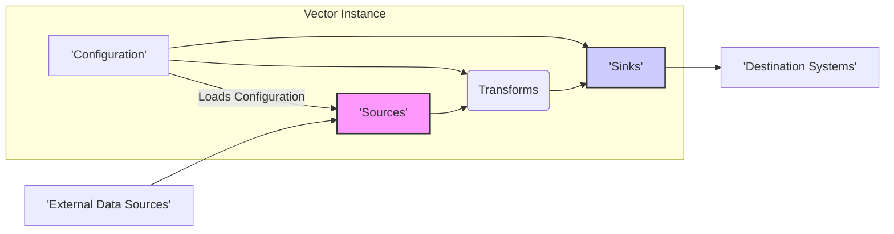

## Project Design Document: Vector Observability Data Pipeline - Improved

**1. Introduction**

Vector is a high-performance, open-source observability data router designed for collecting, transforming, and routing logs, metrics, and traces with speed and reliability. This document details Vector's architecture and key components to facilitate threat modeling and security analysis. It provides a comprehensive understanding of how data flows through the system and the technologies involved.

**2. Goals**

* Clearly articulate the architectural design of the Vector observability pipeline.
* Identify and describe the core components and their interactions within the system.
* Provide a detailed overview of the data flow from ingestion to delivery.
* Outline the underlying technologies and dependencies that constitute Vector.
* Serve as a definitive reference for threat modeling exercises and security assessments.

**3. Scope**

This document focuses on the core data processing pipeline of Vector, encompassing data ingestion, transformation, and routing. It covers the configuration mechanisms that define pipeline behavior. While connector examples are provided for clarity, the specific details of every individual source, transform, and sink connector are outside the scope. This document does not cover aspects like Vector's build process, community contributions, or specific deployment infrastructure details beyond general considerations.

**4. High-Level Architecture**

* **External Data Sources:** Represent external systems generating observability data (e.g., application servers emitting logs, monitoring agents collecting metrics, tracing systems).
* **Vector Instance:** A single running process of the Vector application responsible for processing observability data.
* **Sources:**  Dedicated components within Vector responsible for collecting data from various external sources. Each source is tailored to a specific data source type.
* **Transforms:** Components that process and modify events as they flow through Vector. Transformations are applied based on user-defined logic.
* **Sinks:** Components responsible for delivering processed data to designated destination systems. Each sink is designed to interact with a specific type of destination.
* **Configuration:** The set of rules and parameters that define how Vector operates, including the definition and connection of sources, transforms, and sinks.
* **Destination Systems:** External systems where processed observability data is ultimately stored, analyzed, or visualized (e.g., Elasticsearch, Kafka, cloud monitoring services).

**5. Detailed Architecture and Components**

* **Sources:**
    * **Purpose:**  Ingest data from various origins.
    * **Mechanism:**  Each source implements specific logic to connect to and retrieve data from its designated source. This might involve polling, subscribing to streams, or listening on network sockets.
    * **Configuration:** Requires parameters specific to the data source, such as connection strings, file paths, API keys, and data formats.
    * **Examples:**
        * `file`: Reads log data from files.
        * `socket`: Listens for data on TCP or UDP sockets (e.g., syslog).
        * `http`: Receives data via HTTP endpoints.
        * `internal_metrics`: Collects internal metrics about Vector's performance.
        * `kafka`: Consumes messages from Kafka topics.

* **Transforms:**
    * **Purpose:** Modify and enrich events as they pass through the pipeline.
    * **Mechanism:** Apply user-defined logic, written in the Vector Remap Language (VRL), to individual events or batches of events.
    * **Configuration:**  Defines the VRL code to be executed and specifies which events the transform should operate on.
    * **Examples:**
        * `json_parser`: Parses JSON formatted data.
        * `regex_parser`: Extracts data using regular expressions.
        * `sampler`:  Samples events based on a defined rate.
        * `filter`:  Removes events based on specific criteria.
        * `rename_fields`: Changes the names of fields within events.
        * `add_fields`: Adds new fields to events.

* **Sinks:**
    * **Purpose:** Deliver processed data to external destination systems.
    * **Mechanism:**  Each sink implements the necessary logic to connect to and send data to its target destination. This might involve API calls, writing to files, or publishing to message queues.
    * **Configuration:** Requires parameters specific to the destination system, such as connection URLs, authentication credentials, data formats, and batching settings.
    * **Examples:**
        * `elasticsearch`: Sends data to an Elasticsearch cluster.
        * `kafka`: Produces messages to Kafka topics.
        * `datadog_logs`: Sends logs to Datadog.
        * `console`: Outputs data to the standard output.
        * `loki`: Sends logs to a Loki instance.

* **Configuration:**
    * **Format:** Typically defined in TOML or YAML files.
    * **Structure:**  Specifies global settings for the Vector instance and defines individual sources, transforms, and sinks, including their types and configuration options.
    * **Loading:** Vector loads the configuration at startup and can be configured to reload automatically upon changes to the configuration file.
    * **Centralized Management (Potential Future Feature):** While currently file-based, future iterations might introduce centralized configuration management.

* **Vector Remap Language (VRL):**
    * **Purpose:** A domain-specific language for defining data transformation logic.
    * **Features:** Provides functions for manipulating event data, including accessing and modifying fields, performing conditional logic, type conversions, and string manipulation.
    * **Security Implications:**  The expressiveness of VRL requires careful consideration of potential security risks associated with user-defined scripts.

* **Internal Buffering and Queues:**
    * **Purpose:**  Provide resilience and handle varying data throughput.
    * **Mechanism:**  Vector utilizes internal buffers and queues between pipeline stages (sources to transforms, transforms to sinks). This allows components to operate independently and handle temporary backpressure.

**6. Data Flow**

```mermaid
graph LR
    A["'External Data Source'"] --> B("'Source Component'");
    B -- "Raw Events" --> C("'Internal Buffer (Source -> Transform)'");
    C --> D("'Transform Component 1'");
    D -- "Transformed Events" --> E("'Internal Buffer (Transform -> Transform/Sink)'");
    E --> F("'Transform Component N'");
    F -- "Transformed Events" --> G("'Internal Buffer (Transform -> Sink)'");
    G --> H("'Sink Component'");
    H -- "Processed Data" --> I["'Destination System'"];
```

1. **Data Generation:** External systems generate observability data.
2. **Source Ingestion:** The configured source component connects to the external data source and ingests raw events.
3. **Buffering (Source to Transform):** Raw events are placed into an internal buffer, decoupling the source from downstream processing.
4. **Transformation (Stage 1):** The first transform component in the pipeline retrieves events from its input buffer and applies its configured transformations.
5. **Buffering (Transform to Transform/Sink):** Transformed events are placed into an internal buffer, allowing for further processing or delivery.
6. **Transformation (Stage N):** Subsequent transform components retrieve events from their input buffers and apply their transformations. This can be a chain of multiple transforms.
7. **Buffering (Transform to Sink):**  Final transformed events are placed into a buffer destined for the sink.
8. **Sink Delivery:** The sink component retrieves processed events from its buffer and delivers them to the configured destination system.

**7. Security Considerations (for Threat Modeling)**

* **Configuration Security:**
    * **Storage:** How are configuration files stored and protected from unauthorized access or modification?
    * **Secrets Management:** How are sensitive credentials (API keys, passwords) within the configuration handled? Are they encrypted or stored securely?
    * **Access Control:** Who has permissions to read and modify the Vector configuration?
    * **Injection Attacks:** Can malicious actors inject harmful configurations that could disrupt operations or expose sensitive data?

* **Source Security:**
    * **Authentication and Authorization:** How does Vector authenticate and authorize connections to external data sources?
    * **Data Integrity:** How is the integrity of the ingested data verified? Can malicious sources inject fabricated data?
    * **Source Vulnerabilities:** Are there known vulnerabilities in the specific source connectors being used?
    * **Denial of Service:** Can a malicious source overwhelm Vector with excessive data?

* **Transform Security:**
    * **VRL Execution:** Can the VRL be exploited to execute arbitrary code or access sensitive system resources?
    * **VRL Injection:** Can malicious VRL code be injected through configuration vulnerabilities?
    * **Data Leakage:** Can transformations unintentionally expose sensitive data?
    * **Logic Errors:** Can errors in transformation logic lead to data corruption or incorrect routing?

* **Sink Security:**
    * **Authentication and Authorization:** How does Vector authenticate and authorize connections to destination systems?
    * **Sink Vulnerabilities:** Are there known vulnerabilities in the specific sink connectors being used?
    * **Data Injection into Destinations:** Can malicious actors leverage Vector to inject harmful data into destination systems?
    * **Access Control to Destinations:** Does Vector respect access control policies of the destination systems?

* **Internal Communication and Buffering:**
    * **Inter-Component Security:** How is communication between Vector's internal components secured?
    * **Buffer Overflow/Manipulation:** Are there risks of buffer overflows or manipulation of data within internal buffers?

* **Control Plane Security (Configuration Management):**
    * **Authentication and Authorization:** How is access to configuration management features controlled?
    * **Audit Logging:** Are configuration changes logged and auditable?

* **Dependencies:**
    * **Vulnerability Management:** What processes are in place for tracking and addressing vulnerabilities in Vector's dependencies?

* **Deployment Environment:**
    * **Network Security:** How is network traffic to and from Vector secured?
    * **Host Security:** How is the host system running Vector secured?

**8. Technology Stack**

* **Core Language:** Rust (known for its performance and memory safety)
* **Configuration Languages:** TOML (primarily), YAML (supported)
* **Transformation Language:** Vector Remap Language (VRL)
* **Networking:** Relies on standard networking protocols (TCP, UDP, HTTP/HTTPS) depending on the specific sources and sinks used.
* **Key Libraries/Dependencies (Examples):**
    * `tokio`: Asynchronous runtime for efficient I/O operations.
    * `hyper`: HTTP library for source and sink connectors.
    * Specific client libraries for interacting with various data sources and destinations (e.g., `rdkafka` for Kafka).

**9. Deployment Considerations**

* **Deployment Models:**
    * **Standalone Binary:** Vector can be deployed as a single executable.
    * **Containerized (Docker, etc.):**  Commonly deployed within containers for portability and isolation.
    * **Managed Services (Potential Future):**  Possibility of managed Vector offerings in the future.
* **Scalability and High Availability:**  Multiple Vector instances can be deployed behind a load balancer for increased throughput and resilience.
* **Operating Systems:** Primarily targets Linux-based systems but can also run on macOS and Windows with varying levels of support for specific connectors.
* **Security Best Practices:** Deployment should follow security best practices, including least privilege, network segmentation, and regular security updates.

**10. Future Considerations (Potential Areas for Expansion and Security Review)**

* **Enhanced Centralized Management:**  Development of a more sophisticated control plane with features like centralized configuration, monitoring, and role-based access control. This will introduce new security requirements for the management interface and its API.
* **Plugin System for Connectors:**  A plugin architecture for extending Vector's capabilities with custom sources, transforms, and sinks. This would necessitate a robust security model for validating and isolating plugins.
* **Improved Observability of Vector Internals:**  Enhanced metrics and logging for monitoring Vector's own performance and identifying potential security issues.
* **Advanced Security Features:**  Integration of features like data masking, encryption at rest, and more granular access control within the data pipeline.

This improved design document provides a more detailed and structured overview of the Vector project, specifically tailored for threat modeling activities. It highlights key architectural components, data flow, and security considerations, offering a solid foundation for identifying and mitigating potential security risks.