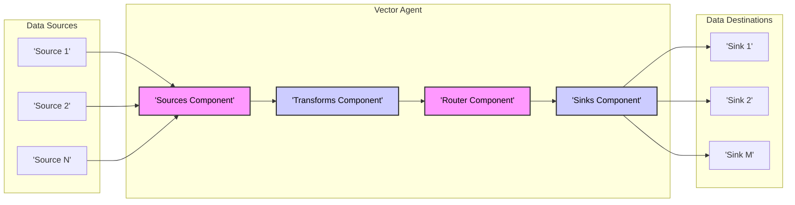
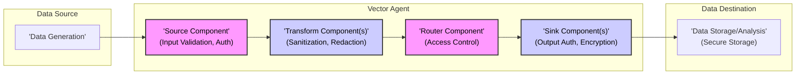

## Project Design Document: Vector (Improved)

### 1. Introduction

#### 1.1. Project Overview

Vector is a robust and versatile observability data pipeline designed for modern infrastructure. It excels at collecting, transforming, and routing high-volume telemetry data, including logs, metrics, and traces, from diverse sources to various destinations. Vector is engineered for performance, reliability, and operational simplicity, making it a critical component in observability stacks. Its modular design and extensive configuration options allow users to tailor it precisely to their specific monitoring and data processing needs.  A key design goal is to provide secure data handling throughout the pipeline.

#### 1.2. Purpose of this Document

This document provides an enhanced and detailed design overview of the Vector project, specifically tailored for threat modeling and security analysis. It expands upon the system architecture, delves deeper into the functionality of key components, clarifies data flow with security considerations, elaborates on deployment models and their security implications, and provides a more security-focused view of the technology stack. This document is intended to be a comprehensive resource for security professionals, developers, and operations teams to understand Vector's security posture and identify potential threats and vulnerabilities. It will serve as the primary input for subsequent threat modeling exercises.

### 2. System Architecture

#### 2.1. High-Level Architecture Diagram

#### 2.2. Component Description (Enhanced for Security)

*   **Sources:**
    *   Function: As previously described, Sources are responsible for data ingestion. From a security perspective, sources are the entry points for data into the Vector pipeline and represent the first line of defense against potentially malicious or malformed data.
    *   Security Considerations:
        *   **Input Validation:** Sources should perform initial validation of incoming data to prevent injection attacks or processing of unexpected data formats.
        *   **Authentication & Authorization:** Sources that receive data over a network (e.g., `http`, `socket`, `kafka`) should implement appropriate authentication and authorization mechanisms to ensure only legitimate sources can send data. Misconfigured or missing authentication can lead to unauthorized data injection.
        *   **Denial of Service (DoS):**  Sources exposed to external networks are potential targets for DoS attacks. Rate limiting and connection limits should be considered.
        *   **Data Confidentiality & Integrity:** Sources handling sensitive data must ensure confidentiality and integrity during ingestion. Encryption at the source or during transmission to Vector is crucial.
    *   Examples (with security notes):
        *   `file`:  File permissions and access control on the monitored files are critical. Ensure Vector agent has only necessary read permissions.
        *   `socket`:  Implement TLS/SSL for encrypted communication. Authenticate clients if necessary. Consider rate limiting connections.
        *   `http`: Enforce HTTPS. Implement authentication (e.g., API keys, OAuth). Validate request parameters and body to prevent injection.
        *   `kafka`: Utilize Kafka's security features like TLS encryption and SASL/SCRAM authentication. Configure ACLs to restrict access to topics.
        *   `internal_metrics`: Generally less exposed, but ensure access to Vector agent's metrics endpoint is restricted if exposed externally.
    *   Configuration: Securely store and manage source configurations, especially credentials.
    *   Output: Raw events, potentially containing sensitive data, must be handled securely as they are passed to the Transforms component.

*   **Transforms:**
    *   Function: Transforms process and enrich events. From a security perspective, transforms are crucial for data sanitization, redaction of sensitive information, and ensuring data integrity throughout the pipeline.
    *   Security Considerations:
        *   **Data Sanitization & Redaction:** Transforms should be used to sanitize data, remove or mask sensitive information (PII, secrets), and normalize data formats to reduce attack surface in downstream systems. VRL's capabilities are vital here.
        *   **Vulnerability in Transformation Logic:**  Complex transformation logic, especially using regular expressions or custom scripts within VRL, can introduce vulnerabilities if not carefully designed and tested.  Incorrectly written VRL could lead to information leakage or unexpected behavior.
        *   **Resource Exhaustion:**  Inefficient or malicious transformation logic could lead to excessive resource consumption (CPU, memory), causing performance degradation or DoS.
        *   **Data Integrity:** Ensure transforms maintain data integrity. Transformations should not unintentionally corrupt or alter data in a way that could impact downstream analysis or security monitoring.
    *   Examples (with security notes):
        *   `json_parser`:  Handle malformed JSON gracefully to prevent parsing errors or vulnerabilities.
        *   `log_parser`:  Carefully design parsing patterns (e.g., grok, regex) to avoid ReDoS (Regular Expression Denial of Service) attacks.
        *   `remap`:  Use VRL securely. Validate inputs and outputs of VRL transformations. Be mindful of potential side effects or unintended data modifications. Implement input validation within VRL where necessary.
        *   `filter`:  Use filters to drop irrelevant or potentially malicious events early in the pipeline, reducing processing load and exposure.
        *   `aggregate`:  Ensure aggregation logic does not inadvertently leak information or create vulnerabilities.
    *   Configuration: Securely manage transform configurations. Test transformations thoroughly in a non-production environment before deployment.
    *   Input: Events from Sources, potentially containing untrusted data.
    *   Output: Processed events, ideally sanitized and secured, passed to the Router or Sinks.

*   **Router:**
    *   Function: The Router directs events to appropriate Sinks. Security relevance lies in controlling data flow and ensuring sensitive data is routed only to authorized and secure destinations.
    *   Security Considerations:
        *   **Access Control via Routing:** Routing rules act as a form of access control, determining which sinks receive specific data streams. Misconfigured routing can lead to unauthorized data access or data leakage to unintended destinations.
        *   **Routing Logic Vulnerabilities:**  Complex routing logic, especially if based on user-provided data or external factors, could be exploited to bypass intended routing or redirect data to malicious sinks.
        *   **Information Disclosure:**  Routing decisions based on sensitive data attributes might inadvertently expose that data in routing logs or error messages.
    *   Mechanism: Routing rules are typically embedded within transform or sink configurations using conditional statements or routing tables.
    *   Configuration: Securely manage routing configurations. Regularly review routing rules to ensure they align with security policies and data access controls.
    *   Input: Events from Transforms.
    *   Output: Routes events to one or more Sinks based on configured rules.

*   **Sinks:**
    *   Function: Sinks deliver processed events to destinations. Sinks are critical from a security perspective as they handle the final transmission of data to external systems, and vulnerabilities here can lead to data breaches or compromise of destination systems.
    *   Security Considerations:
        *   **Authentication & Authorization (Outbound):** Sinks must authenticate and authorize with destination systems securely. Misconfigured or weak authentication can lead to unauthorized data access or data breaches at the destination. Securely manage credentials (API keys, passwords, certificates).
        *   **Encryption in Transit (Outbound):**  Sinks should always use encryption (TLS/SSL) when transmitting data over networks, especially to external or untrusted destinations.
        *   **Data Integrity (Outbound):** Ensure data integrity during transmission to sinks. Use checksums or other mechanisms if necessary to verify data delivery.
        *   **Sink Vulnerabilities:** Vulnerabilities in sink implementations could be exploited to compromise Vector or destination systems. Keep Vector and sink components updated.
        *   **Data Leakage via Sinks:**  Misconfigured sinks or vulnerabilities in sink implementations could lead to unintended data leakage or exposure of sensitive information at the destination.
        *   **Rate Limiting & Resource Management (Outbound):** Sinks should implement rate limiting and resource management to prevent overwhelming destination systems or causing DoS at the sink or destination.
    *   Examples (with security notes):
        *   `file`:  Ensure appropriate file permissions and access control on destination files. Prevent writing sensitive data to world-readable locations.
        *   `socket`:  Enforce TLS/SSL for encrypted communication. Authenticate with destination servers if required.
        *   `http`:  Use HTTPS. Implement authentication (e.g., API keys, tokens). Validate server certificates. Be aware of potential vulnerabilities in HTTP client libraries.
        *   `loki`, `elasticsearch`, `aws_cloudwatch_logs`, `datadog_logs`:  Utilize the security features of these destination systems (e.g., authentication, authorization, encryption). Securely manage credentials for accessing these services. Follow security best practices for each destination platform.
    *   Configuration: Securely manage sink configurations, especially credentials. Regularly rotate credentials.
    *   Input: Events from the Router.
    *   Output: Sends data to external systems or storage. Securely handle credentials and connection details.

*   **Vector Agent:**
    *   Function: The core process hosting all components. Security of the Vector Agent itself is paramount as it's the central point of the data pipeline.
    *   Security Considerations:
        *   **Process Security:** Run Vector Agent with minimal privileges (least privilege principle). Use dedicated user accounts. Implement process isolation if possible (e.g., containers).
        *   **Configuration Security:** Securely store and manage Vector Agent configuration files. Restrict access to configuration files. Implement configuration validation to prevent errors or malicious configurations.
        *   **Logging & Monitoring:**  Enable comprehensive logging and monitoring of the Vector Agent itself. Monitor for security-related events, errors, and performance anomalies. Securely store and access Vector Agent logs.
        *   **Updates & Patching:** Keep Vector Agent updated to the latest version to patch security vulnerabilities. Implement a regular update process.
        *   **Resource Limits:** Configure resource limits (CPU, memory, file descriptors) for the Vector Agent to prevent resource exhaustion and DoS.
    *   Deployment: Secure deployment practices are crucial (see Deployment Model section).
    *   Configuration: Secure configuration management is essential (see Configuration Security section below).
    *   Management: Secure management practices are needed (see Operational Security section below).

*   **Control Plane (Optional, for Vector Cloud/Enterprise):**
    *   Function: Centralized management, configuration, monitoring, and orchestration. Control plane security is critical as it manages multiple Vector Agents and potentially sensitive configurations.
    *   Security Considerations:
        *   **Authentication & Authorization (Control Plane Access):** Implement strong authentication and authorization (RBAC) for access to the control plane. Securely manage user accounts and roles.
        *   **Secure Communication (Control Plane to Agents):**  Ensure secure communication between the control plane and Vector Agents (e.g., using TLS/SSL and mutual authentication).
        *   **Data Security in Control Plane:**  Securely store and manage configurations, secrets, and monitoring data within the control plane. Implement encryption at rest and in transit.
        *   **Control Plane Vulnerabilities:**  Secure the control plane application itself against vulnerabilities. Regularly update and patch the control plane software.
        *   **Audit Logging:**  Implement comprehensive audit logging of control plane activities, including configuration changes, user access, and agent management operations.
    *   Features: (as previously described)
    *   Scope: Relevant in enterprise deployments and managed Vector services.

### 3. Data Flow (Security Focused)

#### 3.1. Data Flow Diagram (Security Highlighted)

#### 3.2. Data Processing Pipeline (Security Considerations at Each Stage)

1.  **Data Ingestion (Sources - Security Entry Point):**
    *   Security Focus: Input validation, authentication, authorization, DoS prevention, data confidentiality and integrity at the source.
    *   Actions: Implement source-specific security measures as described in the Source component section.

2.  **Event Processing (Transforms - Security Processing):**
    *   Security Focus: Data sanitization, redaction, vulnerability-free transformation logic, resource management, data integrity during transformation.
    *   Actions: Utilize transforms for security processing. Design and test transformations carefully.

3.  **Routing (Router - Security Policy Enforcement):**
    *   Security Focus: Access control via routing rules, preventing unauthorized data flow, secure routing logic.
    *   Actions: Configure routing rules to enforce data access policies. Regularly review and audit routing configurations.

4.  **Data Delivery (Sinks - Security Exit Point):**
    *   Security Focus: Output authentication, authorization, encryption in transit, data integrity during delivery, sink security, preventing data leakage.
    *   Actions: Implement sink-specific security measures as described in the Sink component section. Securely manage sink credentials and configurations.

5.  **Data at Destination (Data Storage/Analysis - Destination Security):**
    *   Security Focus: Secure storage of data at the destination, access control at the destination, compliance with data security policies at the destination.
    *   Actions: Ensure destination systems are securely configured and managed according to security best practices. Vector's security is only one part of the end-to-end data security chain.

### 4. Deployment Model (Security Implications)

*   **Standalone Agent:**
    *   Description: (as previously described)
    *   Security Implications:
        *   **Isolated Security Perimeter:** Security is focused on each individual host where the agent is deployed.
        *   **Configuration Management Overhead:** Managing configurations across many standalone agents can be challenging and increase the risk of misconfigurations.
        *   **Patch Management:**  Patching and updating agents on individual hosts needs to be managed effectively.
        *   **Limited Centralized Visibility:** Security monitoring and incident response might be more distributed and less centralized.
    *   Security Best Practices: Implement host-based security measures (firewall, intrusion detection). Securely manage configuration files on each host. Automate patching and updates.

*   **Agent with Aggregator (Vector Aggregator):**
    *   Description: (as previously described)
    *   Security Implications:
        *   **Centralized Security Point (Aggregator):** The aggregator becomes a central point for security controls and monitoring. Securing the aggregator is paramount.
        *   **Network Security between Agents and Aggregator:** Secure communication between agents and the aggregator is crucial (TLS/SSL).
        *   **Reduced Configuration Overhead:** Centralized configuration at the aggregator simplifies management and can improve consistency.
        *   **Improved Centralized Visibility:** Security monitoring and incident response can be more centralized at the aggregator.
    *   Security Best Practices: Secure the aggregator host and process rigorously. Enforce TLS/SSL for agent-aggregator communication. Implement access control for the aggregator. Centralize security monitoring at the aggregator.

*   **Vector Cloud/Enterprise (Managed Service):**
    *   Description: (as previously described)
    *   Security Implications:
        *   **Shared Responsibility Model:** Security is a shared responsibility between the user and the service provider. Understand the provider's security posture and your own responsibilities.
        *   **Trust in Service Provider:**  Trust the service provider to securely manage the control plane and infrastructure. Review their security certifications and compliance.
        *   **Data Residency & Compliance:** Consider data residency requirements and compliance regulations when using a managed service.
        *   **API Security:** Secure access to the control plane API. Use strong authentication and authorization.
    *   Security Best Practices:  Choose a reputable service provider with strong security practices. Understand the service provider's security policies and SLAs. Implement strong authentication for control plane access. Securely manage API keys and access tokens.

### 5. Technology Stack (Security Aspects)

*   **Rust:**
    *   Security Advantages: Memory safety (prevents buffer overflows, use-after-free vulnerabilities), strong type system, concurrency safety. Rust's design inherently reduces many common classes of security vulnerabilities.
    *   Security Considerations:  While Rust reduces memory safety issues, logic vulnerabilities and vulnerabilities in dependencies are still possible.

*   **Tokio:**
    *   Security Aspects:  Provides asynchronous I/O, which can improve performance and potentially reduce resource exhaustion attacks compared to synchronous models. Security depends on the correct usage of Tokio and its underlying libraries.

*   **YAML/TOML:**
    *   Security Considerations: Configuration file formats themselves don't introduce direct vulnerabilities, but insecure configuration practices (e.g., hardcoded secrets, overly permissive configurations) are common risks.

*   **VRL (Vector Remap Language):**
    *   Security Considerations:  VRL's power and flexibility can also introduce security risks if not used carefully.  Vulnerabilities in VRL parsing or execution engine are possible (though less likely due to Rust).  More likely risks are related to insecure VRL code written by users (e.g., information leakage, resource exhaustion).

*   **gRPC:**
    *   Security Aspects: gRPC supports TLS/SSL for encrypted communication and authentication mechanisms. Secure gRPC configuration is essential for control plane communication.

*   **Various Libraries (Dependencies):**
    *   Security Risks:  Dependencies can introduce vulnerabilities. Regularly audit and update dependencies. Use dependency scanning tools to identify known vulnerabilities. Vector's dependency management practices are crucial for its overall security.

### 6. Configuration Security

*   **Secure Storage of Configuration Files:**
    *   Protect configuration files with appropriate file system permissions. Restrict read and write access to only authorized users and processes.
    *   Consider encrypting configuration files at rest, especially if they contain sensitive information.

*   **Secrets Management:**
    *   Avoid hardcoding secrets (passwords, API keys, certificates) directly in configuration files.
    *   Use environment variables, secret management systems (e.g., HashiCorp Vault, Kubernetes Secrets), or Vector's built-in secret management features (if available) to securely manage secrets.
    *   Implement secret rotation policies.

*   **Configuration Validation:**
    *   Implement configuration validation mechanisms to detect errors and misconfigurations before deployment. Vector itself performs some configuration validation.
    *   Use schema validation tools to ensure configuration files adhere to expected formats.

*   **Principle of Least Privilege in Configuration:**
    *   Configure Vector components with the minimum necessary privileges and permissions. Avoid overly permissive configurations.

*   **Configuration Auditing and Versioning:**
    *   Implement version control for configuration files to track changes and facilitate rollbacks.
    *   Audit configuration changes to identify unauthorized modifications.

### 7. Operational Security

*   **Monitoring and Logging:**
    *   Enable comprehensive logging of Vector Agent activities, including security-related events, errors, and performance metrics.
    *   Securely store and access Vector Agent logs.
    *   Implement monitoring and alerting for Vector Agent health and security events.

*   **Incident Response:**
    *   Develop an incident response plan for security incidents related to Vector.
    *   Establish procedures for investigating and responding to security alerts and vulnerabilities.

*   **Regular Security Assessments:**
    *   Conduct regular security assessments and penetration testing of Vector deployments to identify vulnerabilities.
    *   Perform code reviews of Vector configurations and VRL transformations from a security perspective.

*   **Patch Management and Updates:**
    *   Establish a process for regularly patching and updating Vector Agents and related components to address security vulnerabilities.
    *   Automate patching where possible.

*   **Network Security:**
    *   Implement network segmentation and firewalls to restrict network access to Vector Agents and related systems.
    *   Enforce the principle of least privilege for network access.

This improved design document provides a more comprehensive and security-focused overview of the Vector project, suitable for detailed threat modeling and security analysis. It highlights key security considerations for each component, data flow stage, deployment model, and technology aspect.  It also emphasizes configuration and operational security best practices. This document should serve as a strong foundation for identifying and mitigating potential security risks within the Vector ecosystem.