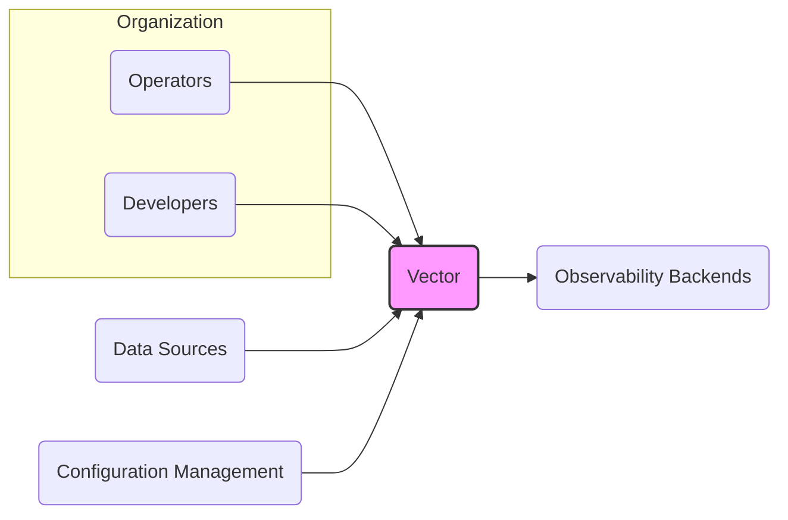
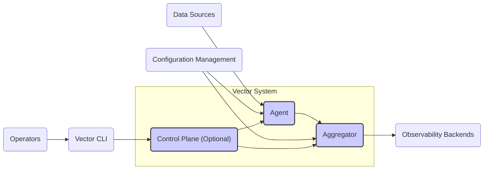
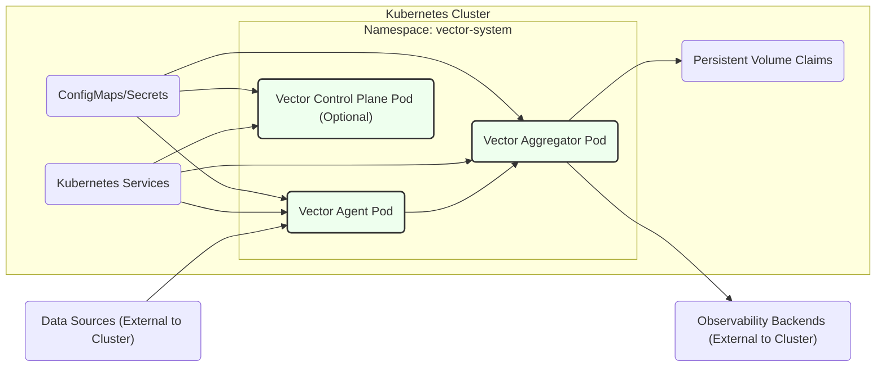
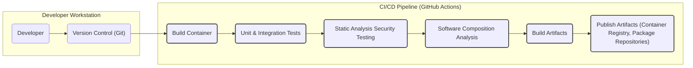

# BUSINESS POSTURE

This project, represented by the GitHub repository `vectordotdev/vector`, aims to provide a high-performance, open-source observability data pipeline. The primary business goal is to offer a reliable, efficient, and scalable solution for collecting, processing, and routing observability data (logs, metrics, traces) from various sources to diverse destinations.

Business priorities for this project are:

*   Reliability: Ensuring consistent and uninterrupted data flow is critical for observability. Data loss or pipeline downtime can severely impact monitoring and incident response capabilities.
*   Performance: High throughput and low latency are essential to handle large volumes of observability data in real-time. Performance bottlenecks can lead to data backlog and delayed insights.
*   Scalability: The solution must scale horizontally to accommodate growing data volumes and expanding infrastructure. Scalability ensures the system can adapt to future needs without significant architectural changes.
*   Security: Protecting observability data in transit and at rest is paramount. Security breaches can expose sensitive information and compromise the integrity of the observability platform.
*   Extensibility: The pipeline should be extensible to support new data sources, destinations, and processing logic. Extensibility allows users to adapt Vector to their evolving observability requirements.
*   Community Adoption: As an open-source project, community adoption is vital for long-term success. A strong community contributes to development, provides support, and ensures the project remains relevant and vibrant.

Key business risks associated with these priorities include:

*   Service disruption: Downtime or instability of the data pipeline can lead to observability gaps, hindering incident detection and resolution, potentially causing financial and reputational damage.
*   Data loss: Loss of observability data due to pipeline failures or misconfigurations can result in incomplete insights and missed critical events.
*   Data breach: Security vulnerabilities in the pipeline can be exploited to access or exfiltrate sensitive observability data, leading to compliance violations, reputational damage, and potential legal liabilities.
*   Performance degradation: Inefficient pipeline design or resource constraints can lead to performance bottlenecks, delaying data delivery and impacting real-time observability.
*   Lack of adoption: Failure to attract a strong community and user base can limit the project's growth, innovation, and long-term viability.
*   Compliance violations: Mishandling of sensitive data within the pipeline can lead to violations of data privacy regulations (e.g., GDPR, HIPAA), resulting in fines and legal repercussions.

# SECURITY POSTURE

Existing security controls and accepted risks for the Vector project, based on common open-source project practices and general cloud-native application security considerations:

*   security control: Code reviews are likely conducted for contributions to the project, although the extent and rigor may vary depending on the contributor and the complexity of the change. (Location: GitHub Pull Request process)
*   security control: Unit and integration tests are likely in place to ensure code functionality and stability. These tests may indirectly contribute to security by catching functional bugs that could have security implications. (Location: GitHub repository, CI/CD pipelines)
*   security control: Static analysis tools (linters, formatters) are likely used to enforce code quality and style, which can indirectly improve security by reducing code complexity and potential for errors. (Location: CI/CD pipelines, developer tooling)
*   security control: Dependency scanning might be in place to detect known vulnerabilities in third-party libraries used by Vector. (Location: CI/CD pipelines, dependency management tools)
*   security control: HTTPS is expected for communication with external services and APIs used by Vector components. (Location: Configuration and code related to HTTP clients and servers)
*   accepted risk: The depth and frequency of security-specific code reviews (focused on identifying security vulnerabilities) might be limited due to resource constraints and community-driven development.
*   accepted risk: Penetration testing and formal security audits might not be regularly conducted, especially for specific deployments or configurations.
*   accepted risk: Vulnerability disclosure and incident response processes might be informal or less mature compared to established commercial products.

Recommended security controls to implement as high priority:

*   security control: Implement a formal Security Development Lifecycle (SDLC) process, integrating security considerations into each phase of development, from design to deployment.
*   security control: Introduce regular security-focused code reviews, specifically looking for common vulnerability patterns (e.g., injection flaws, insecure deserialization, broken authentication).
*   security control: Integrate Static Application Security Testing (SAST) tools into the CI/CD pipeline to automatically detect potential security vulnerabilities in the codebase.
*   security control: Integrate Dynamic Application Security Testing (DAST) tools to test the running application for vulnerabilities.
*   security control: Implement Software Composition Analysis (SCA) to continuously monitor dependencies for known vulnerabilities and ensure timely patching.
*   security control: Establish a clear vulnerability disclosure policy and incident response plan to handle security issues effectively.
*   security control: Conduct regular penetration testing and security audits, especially before major releases or significant architectural changes.
*   security control: Implement robust input validation and sanitization across all Vector components to prevent injection attacks.
*   security control: Enforce least privilege principles for Vector processes and user access to configuration and data.
*   security control: Provide secure configuration guidelines and best practices for users deploying and operating Vector in different environments.

Security requirements for the Vector project:

*   Authentication:
    *   Requirement: Vector should support secure authentication mechanisms for administrative access and control plane interactions (if applicable).
    *   Requirement: Consider supporting mutual TLS (mTLS) for secure communication between Vector components and external systems where strong authentication is needed.
*   Authorization:
    *   Requirement: Implement fine-grained authorization controls to manage access to Vector's configuration, data streams, and operational commands.
    *   Requirement: Follow the principle of least privilege, granting users and processes only the necessary permissions.
*   Input Validation:
    *   Requirement: Validate all inputs received by Vector components, including configuration parameters, data payloads, and API requests.
    *   Requirement: Sanitize inputs to prevent injection attacks (e.g., SQL injection, command injection, cross-site scripting).
    *   Requirement: Implement input validation at multiple layers (e.g., client-side, server-side) to ensure comprehensive protection.
*   Cryptography:
    *   Requirement: Use strong encryption algorithms and protocols (e.g., TLS 1.3, AES-256) to protect sensitive data in transit and at rest.
    *   Requirement: Securely manage cryptographic keys and certificates, following industry best practices for key generation, storage, and rotation.
    *   Requirement: Consider data encryption at rest for sensitive data persisted by Vector components (e.g., configuration, buffers, persistent queues).

# DESIGN

## C4 CONTEXT

Context Diagram Elements:

*   Element:
    *   Name: Operators
    *   Type: User
    *   Description: System administrators and operations teams responsible for deploying, configuring, and maintaining Vector instances.
    *   Responsibilities: Deploying Vector, configuring pipelines, monitoring Vector's health, troubleshooting issues, managing upgrades.
    *   Security controls: Role-Based Access Control (RBAC) for Vector management interfaces, audit logging of administrative actions, secure access to configuration files.
*   Element:
    *   Name: Developers
    *   Type: User
    *   Description: Software developers who use Vector to collect and analyze application logs, metrics, and traces for debugging, performance monitoring, and understanding application behavior.
    *   Responsibilities: Configuring Vector to collect application telemetry, using observability data for development and troubleshooting, providing feedback on Vector's functionality.
    *   Security controls: Access control to observability data based on application or team, data masking or anonymization for sensitive data, secure access to Vector's query interfaces (if applicable).
*   Element:
    *   Name: Vector
    *   Type: Software System
    *   Description: High-performance observability data pipeline for collecting, processing, and routing logs, metrics, and traces. The system under design.
    *   Responsibilities: Ingesting data from various sources, transforming and enriching data, routing data to multiple destinations, providing monitoring and management capabilities.
    *   Security controls: Input validation, authorization, authentication, encryption in transit and at rest, secure configuration management, audit logging, vulnerability management, secure build process.
*   Element:
    *   Name: Data Sources
    *   Type: External System
    *   Description: Various systems and applications that generate observability data, such as application servers, databases, network devices, cloud services, and operating systems.
    *   Responsibilities: Generating logs, metrics, and traces, exposing data through various protocols (e.g., HTTP, TCP, UDP, APIs), ensuring data integrity and availability.
    *   Security controls: Authentication and authorization for data access, secure data transmission protocols (e.g., TLS), access control lists (ACLs), firewalls, security monitoring.
*   Element:
    *   Name: Observability Backends
    *   Type: External System
    *   Description: Destination systems where Vector routes processed observability data for storage, visualization, and analysis. Examples include Elasticsearch, Prometheus, Grafana, cloud monitoring platforms, and data lakes.
    *   Responsibilities: Storing and indexing observability data, providing query and visualization capabilities, offering APIs for data access and integration.
    *   Security controls: Authentication and authorization for data ingestion and access, data encryption at rest, secure APIs, access control lists (ACLs), security monitoring.
*   Element:
    *   Name: Configuration Management
    *   Type: External System
    *   Description: Systems used to manage and store Vector's configuration, such as configuration files, environment variables, secrets management tools (e.g., HashiCorp Vault), and orchestration platforms (e.g., Kubernetes ConfigMaps).
    *   Responsibilities: Securely storing and managing configuration data, providing version control and audit trails for configuration changes, enabling automated configuration updates.
    *   Security controls: Access control to configuration data, encryption at rest for sensitive configuration parameters (e.g., secrets), audit logging of configuration changes, secure access to secrets management systems.

## C4 CONTAINER

Container Diagram Elements:

*   Element:
    *   Name: Agent
    *   Type: Container (Process/Application)
    *   Description: Lightweight process deployed close to data sources. Responsible for collecting data from local sources, performing initial processing (e.g., filtering, sampling), and forwarding data to aggregators or destinations.
    *   Responsibilities: Data collection from various sources (logs, metrics, traces), local data buffering, initial data processing, data forwarding, health monitoring.
    *   Security controls: Input validation for data received from sources, secure configuration loading, least privilege execution, secure communication with aggregators/destinations (e.g., mTLS), local data buffering with encryption (optional).
*   Element:
    *   Name: Aggregator
    *   Type: Container (Process/Application)
    *   Description: Centralized component responsible for receiving data from multiple agents, performing more complex processing (e.g., aggregation, enrichment, transformation), and routing data to observability backends. May be horizontally scalable for high throughput.
    *   Responsibilities: Data aggregation from multiple agents, advanced data processing, data routing to destinations, centralized monitoring and management, data buffering and persistence (optional).
    *   Security controls: Authentication and authorization for agent connections (e.g., mTLS), input validation for data received from agents, secure configuration loading, least privilege execution, secure communication with destinations, data encryption at rest (optional), rate limiting and traffic shaping.
*   Element:
    *   Name: Control Plane (Optional)
    *   Type: Container (Process/Application)
    *   Description:  An optional component for centralized management and control of Vector agents and aggregators. Provides APIs for configuration management, monitoring, and orchestration. May not be present in simpler deployments.
    *   Responsibilities: Centralized configuration management for agents and aggregators, monitoring and health checks, orchestration and scaling of Vector components, API for management and control.
    *   Security controls: Authentication and authorization for API access, secure configuration storage and distribution, audit logging of management actions, secure communication with agents and aggregators, RBAC for administrative users.
*   Element:
    *   Name: Vector CLI
    *   Type: Container (Command Line Interface)
    *   Description: Command-line interface tool for interacting with the Control Plane (if present) or directly with Agents/Aggregators for configuration, monitoring, and management tasks.
    *   Responsibilities: Providing a command-line interface for operators to manage Vector, configuration validation, interacting with Control Plane APIs.
    *   Security controls: Authentication and authorization for CLI access, secure communication with Control Plane/Agents/Aggregators, input validation for commands and parameters, audit logging of CLI actions.

## DEPLOYMENT

Deployment Architecture (Example: Kubernetes)

Deployment Diagram Elements (Kubernetes):

*   Element:
    *   Name: Vector Agent Pod
    *   Type: Kubernetes Pod
    *   Description: Kubernetes Pod running one or more Vector Agent containers. Deployed as DaemonSet or sidecar containers for data sources within the cluster or on edge nodes.
    *   Responsibilities: Collecting data from sources within the Kubernetes cluster or on the node, forwarding data to aggregators, health monitoring within Kubernetes.
    *   Security controls: Network policies to restrict agent pod network access, Pod Security Policies/Admission Controllers to enforce security configurations, resource limits and quotas, secure container image, secret management for credentials.
*   Element:
    *   Name: Vector Aggregator Pod
    *   Type: Kubernetes Pod
    *   Description: Kubernetes Pod running one or more Vector Aggregator containers. Deployed as a Deployment or StatefulSet for scalability and resilience.
    *   Responsibilities: Aggregating data from multiple agents, processing and routing data, providing centralized monitoring endpoints, managing persistent queues (if used).
    *   Security controls: Network policies to restrict aggregator pod network access, Pod Security Policies/Admission Controllers, resource limits and quotas, secure container image, secret management, persistent volume encryption, load balancing and scaling for resilience.
*   Element:
    *   Name: Vector Control Plane Pod (Optional)
    *   Type: Kubernetes Pod
    *   Description: Kubernetes Pod running the Vector Control Plane containers (if deployed). Deployed as a Deployment or StatefulSet for high availability.
    *   Responsibilities: Centralized management of Vector agents and aggregators, providing APIs for configuration and monitoring, orchestration and scaling.
    *   Security controls: Network policies to restrict control plane pod network access, Pod Security Policies/Admission Controllers, resource limits and quotas, secure container image, secret management, RBAC for API access, audit logging.
*   Element:
    *   Name: Kubernetes Services
    *   Type: Kubernetes Service
    *   Description: Kubernetes Services used to expose Vector components within the cluster (e.g., for agent-aggregator communication, operator access to control plane).
    *   Responsibilities: Service discovery and load balancing for Vector components, providing stable endpoints for internal communication.
    *   Security controls: Network policies to control service access, service account based authentication and authorization, TLS termination at ingress controllers (optional).
*   Element:
    *   Name: Persistent Volume Claims
    *   Type: Kubernetes Persistent Volume Claim
    *   Description: Persistent Volume Claims used by Vector Aggregators (and potentially Agents or Control Plane) for persistent data storage (e.g., for buffering, queues, configuration).
    *   Responsibilities: Providing persistent storage for Vector data, ensuring data durability and availability across pod restarts.
    *   Security controls: Encryption at rest for persistent volumes, access control policies for volume access, backups and recovery procedures.
*   Element:
    *   Name: ConfigMaps/Secrets
    *   Type: Kubernetes ConfigMaps/Secrets
    *   Description: Kubernetes ConfigMaps and Secrets used to manage Vector's configuration and sensitive credentials.
    *   Responsibilities: Securely storing and managing configuration data and secrets, providing configuration to Vector pods at runtime.
    *   Security controls: RBAC for access to ConfigMaps/Secrets, encryption at rest for Secrets (Kubernetes Secrets encryption), secure mounting of ConfigMaps/Secrets into pods.
*   Element:
    *   Name: Data Sources (External to Cluster)
    *   Type: External System
    *   Description: Data sources located outside the Kubernetes cluster that Vector Agents collect data from.
    *   Responsibilities: Generating observability data, making data accessible to Vector Agents over network.
    *   Security controls: Authentication and authorization for data access, secure network communication (e.g., TLS), firewalls, network segmentation.
*   Element:
    *   Name: Observability Backends (External to Cluster)
    *   Type: External System
    *   Description: Observability backend systems located outside the Kubernetes cluster where Vector Aggregators send processed data.
    *   Responsibilities: Receiving and storing observability data, providing query and visualization capabilities.
    *   Security controls: Authentication and authorization for data ingestion, secure network communication (e.g., TLS), access control lists (ACLs), security monitoring.

## BUILD

Build Process Description:

1.  Developer (DEV) writes code and commits changes to Version Control (VC) system (e.g., GitHub).
2.  Upon code commit or pull request, a CI/CD pipeline (e.g., GitHub Actions) is triggered.
3.  A Build Container (BC) is initiated in the CI/CD environment, providing a consistent and isolated build environment.
4.  Unit & Integration Tests (TEST) are executed to verify code functionality and catch regressions.
5.  Static Analysis Security Testing (SAST) tools scan the codebase for potential security vulnerabilities (e.g., using linters, SAST scanners).
6.  Software Composition Analysis (SCA) tools analyze project dependencies to identify known vulnerabilities in third-party libraries.
7.  Build Artifacts (BUILD) are created, including compiled binaries, container images, and packages.
8.  Publish Artifacts (PUBLISH) step distributes the build artifacts to container registries (e.g., Docker Hub, GitHub Container Registry), package repositories (e.g., npm, crates.io), and release management systems.

Security Controls in Build Process:

*   security control: Version Control (Git): Code changes are tracked and auditable, enabling rollback and traceability. Branch protection rules can enforce code review and prevent direct commits to main branches.
*   security control: CI/CD Pipeline (GitHub Actions): Automates the build process, reducing manual errors and ensuring consistent builds. Pipeline configuration as code allows for version control and auditability.
*   security control: Build Container: Provides a controlled and reproducible build environment, minimizing supply chain risks from build dependencies.
*   security control: Unit & Integration Tests: Help ensure code quality and catch functional bugs that could have security implications.
*   security control: Static Analysis Security Testing (SAST): Identifies potential security vulnerabilities early in the development lifecycle, allowing for remediation before deployment.
*   security control: Software Composition Analysis (SCA): Detects known vulnerabilities in third-party dependencies, enabling timely patching and reducing supply chain risks.
*   security control: Secure Build Configuration: Hardening build environment, using minimal base images for containers, applying least privilege principles to build processes.
*   security control: Artifact Signing and Verification: Signing build artifacts (e.g., container images, packages) to ensure integrity and authenticity. Verification of signatures during deployment.
*   security control: Access Control for CI/CD Pipeline: Restricting access to CI/CD pipeline configuration and execution to authorized personnel.
*   security control: Audit Logging of Build Process: Logging all build steps, security scans, and publishing activities for auditability and incident investigation.

# RISK ASSESSMENT

Critical business processes we are trying to protect:

*   Observability Data Collection and Delivery: Ensuring continuous and reliable collection, processing, and delivery of logs, metrics, and traces is the core business process. Disruptions to this process directly impact observability capabilities.
*   Configuration Management: Secure and reliable management of Vector's configuration is crucial for maintaining pipeline functionality and security posture. Compromised configuration can lead to service disruption or security breaches.
*   Software Build and Release: Maintaining the integrity and security of the software build and release process is essential to prevent supply chain attacks and ensure users are deploying trusted software.

Data we are trying to protect and their sensitivity:

*   Observability Data (Logs, Metrics, Traces): Sensitivity varies depending on the data sources. Logs and traces can contain sensitive information such as:
    *   Personally Identifiable Information (PII): Usernames, IP addresses, email addresses, session IDs, etc.
    *   Application Secrets: API keys, passwords, tokens accidentally logged.
    *   Business Sensitive Data: Transaction details, financial information, internal system names, etc.
    *   Compliance Data: Data subject to regulations like GDPR, HIPAA, PCI DSS.
    Sensitivity level can range from low (public metrics) to high (logs containing PII or secrets).
*   Configuration Data: Configuration files and parameters can contain sensitive information:
    *   Credentials: Passwords, API keys, tokens for accessing data sources and destinations.
    *   Internal System Details: Network addresses, service endpoints, internal architecture information.
    Sensitivity level is generally medium to high, as exposure can lead to unauthorized access or service disruption.
*   Build Artifacts: While build artifacts themselves may not contain sensitive data, their integrity is critical:
    *   Compromised artifacts can lead to supply chain attacks and deployment of malicious software.
    Sensitivity level is medium to high in terms of integrity and availability.

# QUESTIONS & ASSUMPTIONS

Questions:

*   What is the intended deployment environment for Vector (cloud, on-premise, hybrid)? This will influence deployment architecture and security controls.
*   What is the expected data volume and velocity for the observability pipeline? This will impact scalability and performance requirements.
*   What are the specific compliance requirements for the organization using Vector (e.g., GDPR, HIPAA, PCI DSS)? This will dictate data handling and security controls.
*   Is there a central control plane planned for Vector deployment, or will it be primarily agent/aggregator based? This affects the complexity of management and security architecture.
*   What is the organization's current security maturity level and existing security infrastructure? This will help tailor security recommendations and identify gaps.
*   What are the specific data sources and observability backends that Vector will integrate with? This will inform integration security requirements.

Assumptions:

*   BUSINESS POSTURE: The primary business goal is to provide a reliable, high-performance, and secure observability data pipeline for general-purpose use. Security is a significant concern, but performance and reliability are also critical.
*   SECURITY POSTURE: The project follows common open-source security practices, but there is room for improvement in formal security processes and tooling. Security is considered important but might not be the top priority compared to functionality and performance in the initial stages.
*   DESIGN: Vector architecture is assumed to be modular, consisting of agents, aggregators, and potentially a control plane. Deployment is likely to be containerized, with Kubernetes as a common target environment. The build process is automated using CI/CD pipelines and includes basic security checks.