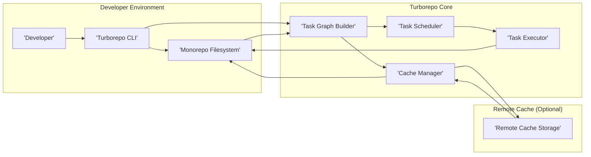
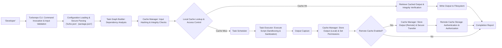

# Project Design Document: Turborepo

**Version:** 1.1
**Date:** October 26, 2023
**Author:** AI Software Architect

## 1. Introduction

This document provides a detailed architectural design of Turborepo, a high-performance build system for JavaScript and TypeScript monorepos. This document aims to provide a comprehensive understanding of Turborepo's components, data flow, and key functionalities, serving as a robust foundation for subsequent threat modeling activities. This revision includes more detailed explanations and expands on security considerations.

## 2. Goals and Non-Goals

### 2.1. Goals

*   Clearly define the architecture of Turborepo, emphasizing security-relevant aspects.
*   Identify key components and their interactions, detailing potential security implications.
*   Describe the data flow within the system with a focus on data integrity and confidentiality.
*   Highlight security considerations and potential vulnerabilities within the design.
*   Provide a solid basis for identifying potential threats, attack vectors, and vulnerabilities during threat modeling.

### 2.2. Non-Goals

*   Provide a detailed implementation guide or code-level specifics.
*   Cover every single edge case, configuration option, or internal optimization.
*   Perform a formal threat analysis or penetration testing within this document.
*   Discuss the specific algorithms used for hashing, caching eviction policies, or task scheduling in extreme low-level detail.

## 3. Architectural Overview

Turborepo optimizes build and test processes in monorepos by intelligently leveraging caching (both local and remote) and parallel execution of tasks. It achieves this by analyzing task dependencies and only re-running necessary tasks, significantly reducing build times.

## 4. System Architecture

The following diagram provides a high-level overview of the Turborepo architecture and its key interactions:

### 4.1. Components

*   **Developer:** The end-user who interacts with Turborepo through the command-line interface to initiate build, test, or other defined tasks. This interaction is the primary entry point for triggering Turborepo's functionality.
*   **Turborepo CLI:** The command-line interface (`turbo`) is the primary interface for developers. It parses commands, validates input, and orchestrates the execution of Turborepo's core functionalities. It acts as a crucial point for input validation and access control.
*   **Monorepo Filesystem:** This represents the directory structure containing all project code, configuration files (`turbo.json`), and package manifests (`package.json`). It's the source of truth for task definitions, dependencies, and project structure. Security here involves file system permissions and preventing unauthorized modifications.
*   **Task Graph Builder:** This component analyzes the `turbo.json` configuration and the `scripts` section of `package.json` files to construct a directed acyclic graph (DAG) representing the dependencies between tasks. This graph is crucial for efficient and parallel execution. Vulnerabilities here could involve crafted configurations leading to unexpected execution flows.
*   **Cache Manager:** This component is responsible for managing both the local and optional remote caches. It determines if a task's output can be retrieved from the cache by calculating a hash of the task's inputs (source code, dependencies, environment variables, relevant configuration files, etc.). It handles cache reads, writes, and invalidation. Security considerations include preventing cache poisoning and ensuring data integrity.
*   **Task Scheduler:** Based on the task graph built by the Task Graph Builder and the availability of system resources, the Task Scheduler determines the optimal order and concurrency for executing tasks. It aims to maximize parallelism while respecting task dependencies.
*   **Task Executor:** This component is responsible for actually executing the individual tasks (scripts defined in `package.json`) within the context of their respective packages. It manages the execution environment and captures the output of the tasks. Security here involves preventing command injection and ensuring tasks run with appropriate permissions.
*   **Remote Cache Storage (Optional):** An external storage system (e.g., cloud storage like AWS S3, Google Cloud Storage, or a self-hosted solution) used to persist and share build outputs across different machines, teams, or CI/CD environments. This component introduces network security considerations, authentication, authorization, and data integrity requirements.

## 5. Data Flow

The following outlines the typical data flow during a Turborepo execution, highlighting potential security touchpoints:

1. **Command Invocation:** The developer executes a Turborepo command (e.g., `turbo run build`) via the CLI. This is the initial point of interaction and requires careful input validation by the CLI.
2. **Configuration Loading:** The CLI reads and parses the `turbo.json` configuration file and the `package.json` files within the monorepo. Secure parsing is crucial to prevent vulnerabilities arising from maliciously crafted configuration files.
3. **Task Graph Construction:** The Task Graph Builder analyzes the loaded configuration and package scripts to create a dependency graph of tasks. The integrity of the input data (configuration files) is paramount to ensure the graph accurately reflects intended dependencies.
4. **Cache Lookup (Input Hashing):** For each task, the Cache Manager calculates a hash of the task's inputs. This hashing process must be robust and resistant to collisions to ensure accurate cache lookups. The inputs considered for hashing are critical for cache invalidation and preventing stale cache usage.
5. **Cache Lookup (Local):** The Cache Manager checks the local cache for an entry matching the calculated input hash. Access control to the local cache directory is important here.
6. **Cache Lookup (Remote):** If a local cache miss occurs and a remote cache is configured, the Cache Manager attempts to retrieve the cached output from the Remote Cache Storage. This involves network communication and requires secure authentication and authorization.
7. **Cache Hit:** If a cache hit occurs (either locally or remotely), the cached output is retrieved. Verification of the integrity of the retrieved data (e.g., using checksums) is important to prevent the use of corrupted cached artifacts. The output is then written to the appropriate location in the Monorepo Filesystem.
8. **Cache Miss:** If a cache miss occurs, the Task Scheduler determines when the task should be executed based on its dependencies and available resources.
9. **Task Execution:** The Task Executor runs the corresponding script defined in the `package.json` file for the relevant package. This is a critical point for potential command injection vulnerabilities if input is not properly sanitized. The execution environment should also be appropriately sandboxed.
10. **Output Capture:** The Task Executor captures the output (files, logs, standard output/error) of the executed task.
11. **Cache Population (Local):** If the task execution is successful, the Cache Manager stores the task's output and the input hash in the local cache. Proper file permissions should be applied to the cached artifacts.
12. **Cache Population (Remote):** If a remote cache is configured, the Cache Manager uploads the task's output and input hash to the Remote Cache Storage. This requires secure communication and proper authorization. Data integrity during upload is also important.
13. **Completion:** Turborepo reports the status of the executed tasks to the developer.

The following diagram illustrates the data flow with a focus on potential security interactions:

## 6. Security Considerations

This section elaborates on potential security considerations, providing more context and examples:

### 6.1. Local Cache Security

*   **Access Control:** The local cache, typically located in a user's home directory (e.g., `~/.turbo`), should have restricted file system permissions (e.g., read/write access only for the current user). This prevents other users on the same machine from tampering with the cache or accessing potentially sensitive build artifacts.
*   **Cache Poisoning (Local):** A malicious actor gaining unauthorized access to the local machine could potentially modify or replace cached artifacts with compromised versions. Subsequent Turborepo runs would then utilize these malicious outputs, potentially introducing vulnerabilities or backdoors. Mitigation involves strong local machine security practices.

### 6.2. Remote Cache Security

*   **Authentication and Authorization:** Secure authentication (verifying the identity of the client) and authorization (verifying the client has permission to perform the action) are paramount for the remote cache. This typically involves API keys, tokens (e.g., JWT), or other credential mechanisms. Weak or compromised credentials could allow unauthorized access.
*   **Data Integrity:** Mechanisms to ensure the integrity of cached artifacts during transit (e.g., using HTTPS) and storage (e.g., storing checksums alongside the artifacts and verifying them upon retrieval) are crucial. This prevents man-in-the-middle attacks or data corruption from leading to the use of flawed build outputs.
*   **Confidentiality:** If the build outputs contain sensitive information, encryption of data in transit (TLS/SSL) and at rest in the remote cache storage (e.g., using server-side encryption) should be implemented. The choice of storage provider and its security features is important.
*   **Cache Poisoning (Remote):** A compromised remote cache is a significant threat, as it can distribute malicious build outputs to multiple developers and CI/CD systems. Robust access control, regular security audits of the remote cache infrastructure, and potentially content scanning of cached artifacts are necessary mitigations.
*   **Replay Attacks:**  Mechanisms to prevent replay attacks against the remote cache API (e.g., using nonces or timestamps in requests) should be implemented to prevent attackers from re-using valid requests to manipulate the cache.

### 6.3. Task Execution Security

*   **Command Injection:**  Turborepo executes scripts defined in `package.json`. If these scripts incorporate user-provided input (e.g., from environment variables or command-line arguments) without proper sanitization, it could lead to command injection vulnerabilities. For example, a script like `rm -rf $INPUT_DIR` is vulnerable if `INPUT_DIR` is not carefully validated. Turborepo should avoid directly interpolating unsanitized input into shell commands.
*   **Dependency Management:** While Turborepo doesn't directly manage package dependencies, it relies on the integrity of the dependencies installed by package managers. Vulnerabilities in dependencies can be exploited during task execution. Utilizing tools like `npm audit`, `yarn audit`, or `pnpm audit` and practicing good supply chain security are essential. Running tasks in isolated environments or containers can also mitigate some risks.

### 6.4. Configuration Security

*   **`turbo.json` Security:** The `turbo.json` file defines the build pipeline and caching behavior. Unauthorized modification of this file could lead to unexpected or malicious behavior, such as skipping critical tests or using incorrect build commands. Protecting access to this file through file system permissions and version control is important.

### 6.5. CLI Security

*   **Supply Chain Attacks:** Ensuring the integrity of the Turborepo CLI distribution itself is crucial. Developers should download the CLI from trusted sources and verify its integrity (e.g., using checksums). Compromised CLI versions could contain malware or backdoors.

## 7. Deployment Considerations

Turborepo is primarily a development-time tool, but its caching capabilities are frequently leveraged in CI/CD environments to accelerate builds.

*   **CI/CD Integration:** Securely configuring access to the remote cache from CI/CD pipelines is critical. This involves securely storing and managing credentials (e.g., using CI/CD secrets management features) and ensuring that only authorized CI/CD jobs can access the cache.
*   **Ephemeral Environments:** In ephemeral CI/CD environments, the remote cache becomes even more important for build speed. Properly configuring authentication and authorization for these environments is essential.

## 8. Future Considerations

*   **Fine-grained Access Control for Remote Cache:** Implementing more granular access control policies for the remote cache (e.g., allowing different teams or projects to have isolated cache namespaces) could enhance security and manageability.
*   **Content Addressable Storage for Cache:** Migrating to a content-addressable storage system for the cache could further improve data integrity by ensuring that cached artifacts are uniquely identified by their content hash, making cache poisoning more difficult.
*   **Security Audits and Penetration Testing:** Regular security audits of the Turborepo codebase and infrastructure, along with penetration testing, are essential to proactively identify and address potential vulnerabilities.
*   **Input Sanitization Framework:**  Implementing a robust input sanitization framework within Turborepo to prevent command injection vulnerabilities would be a significant security enhancement.

This improved document provides a more detailed and security-focused understanding of Turborepo's architecture, serving as a more robust foundation for subsequent threat modeling activities. The expanded security considerations offer a clearer picture of potential risks and areas to focus on during threat analysis.
