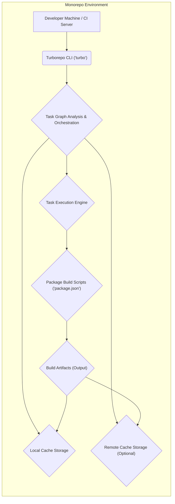
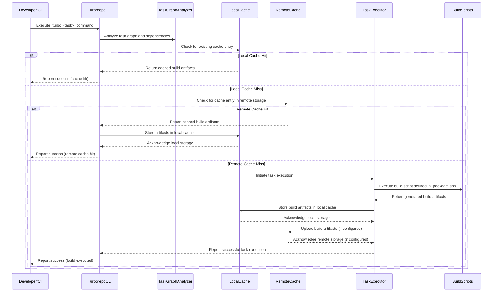

# Project Design Document: Turborepo

**Version:** 1.1
**Date:** October 26, 2023
**Author:** AI Software Architect

## 1. Introduction

This document provides an enhanced design overview of Turborepo, a high-performance build system for JavaScript and TypeScript monorepos. This revised document aims to provide a more granular understanding of the system's architecture and data flows, specifically tailored for subsequent threat modeling activities. It details the key components, their interactions, and architectural decisions relevant from a security perspective.

## 2. Goals and Objectives

The core objectives of Turborepo are:

*   **Accelerated Build Times:** Significantly reduce build times in monorepos through intelligent caching and parallel task execution.
*   **Resource Optimization:** Minimize redundant build operations by effectively caching and replaying build artifacts when inputs remain unchanged.
*   **Simplified Build Management:** Offer an intuitive and straightforward interface for orchestrating builds within complex monorepo structures.
*   **Scalable Build Infrastructure:**  Provide a solution that scales effectively for large and intricate monorepos containing numerous packages and intricate dependency relationships.
*   **Seamless Toolchain Integration:** Ensure smooth integration with established JavaScript and TypeScript ecosystem tools like npm, yarn, and pnpm.

## 3. High-Level Architecture

Turborepo functions as a command-line interface (CLI) tool that orchestrates the build process within a monorepo. It analyzes the dependency graph of the projects within the monorepo and executes tasks in an optimized manner, leveraging both local and optional remote caching mechanisms.

*   **Developer Machine / CI Server:** Represents the environment where Turborepo is invoked, either on a developer's local machine or within a Continuous Integration (CI) pipeline.
*   **Turborepo CLI ('turbo'):** The primary command-line interface used by developers or CI systems to interact with Turborepo, triggering build processes and other commands.
*   **Task Graph Analysis & Orchestration:** The central component responsible for analyzing project dependencies, constructing the task execution graph, and orchestrating the execution of individual tasks.
*   **Local Cache Storage:** A designated directory on the machine running Turborepo (typically `.turbo`) used to store cached build artifacts and associated metadata.
*   **Remote Cache Storage (Optional):** An optional, configurable remote storage location (e.g., cloud object storage) used for sharing build artifacts across different machines or CI/CD environments.
*   **Task Execution Engine:** The module responsible for spawning and managing the execution of the build scripts defined within each package's `package.json` file.
*   **Package Build Scripts ('package.json'):** The scripts defined within the `scripts` section of each package's `package.json` file, specifying the commands to be executed for building that specific package.
*   **Build Artifacts (Output):** The resulting output files and directories generated by the execution of the build scripts for each package.

## 4. Key Components

This section provides a more detailed breakdown of Turborepo's core components, highlighting aspects relevant to security.

*   **Turborepo CLI (`turbo` command):**
    *   Serves as the primary entry point for user interaction with Turborepo.
    *   Responsible for parsing user commands and options.
    *   Initiates the task graph analysis and subsequent execution process.
    *   Manages interactions with both local and remote caching mechanisms.
    *   Provides logging and reporting functionalities for build status and diagnostics.
    *   **Security Relevance:** Potential entry point for malicious commands or manipulation of build processes if not handled carefully.

*   **Task Graph Analyzer and Orchestrator:**
    *   Reads and interprets `package.json` files from all packages within the monorepo.
    *   Constructs a directed acyclic graph (DAG) representing the dependencies between packages based on `dependencies` and `devDependencies`.
    *   Determines the specific tasks to be executed based on the user-provided command (e.g., `turbo build`, `turbo test`).
    *   Optimizes the task execution order, respecting dependencies and enabling parallel execution where possible.
    *   Identifies tasks eligible for cache retrieval or storage.
    *   **Security Relevance:**  Vulnerabilities in graph analysis could lead to incorrect build order or execution of unintended tasks. Incorrect dependency resolution could introduce malicious dependencies.

*   **Local Cache Manager:**
    *   Manages the storage and retrieval of build artifacts within the local cache directory (typically `.turbo`).
    *   Stores build artifacts along with associated metadata, including hashes of input files, the executed command, and environment variables.
    *   On task execution, checks the local cache for a matching entry based on the task's inputs and configuration.
    *   If a cache hit occurs, retrieves and restores the cached artifacts, bypassing actual build execution.
    *   **Security Relevance:**  Susceptible to local tampering if file system permissions are inadequate. Cache poisoning could lead to the use of compromised artifacts.

*   **Remote Cache Manager (Optional):**
    *   Facilitates the sharing of build artifacts across different machines and environments by interacting with a remote storage backend.
    *   Supports various storage providers, requiring configuration with appropriate authentication credentials and connection details.
    *   Checks the remote cache after a local cache miss.
    *   Downloads artifacts from the remote cache upon a hit and stores them in the local cache.
    *   Uploads newly generated build artifacts to the remote cache after successful task execution.
    *   **Security Relevance:**  A critical security boundary. Requires robust authentication and authorization to prevent unauthorized access and injection of malicious artifacts. Data transmission should be encrypted (HTTPS).

*   **Task Execution Engine:**
    *   Responsible for the actual execution of the build scripts defined in the `package.json` files.
    *   Spawns child processes to run the commands specified in the scripts.
    *   Manages the execution order based on the task graph provided by the analyzer.
    *   Handles parallel execution of independent tasks to maximize efficiency.
    *   Captures the standard output (stdout) and standard error (stderr) streams from the executed build scripts.
    *   **Security Relevance:**  Vulnerable to command injection if build scripts are not carefully crafted. Needs to handle potentially untrusted scripts securely.

*   **Configuration Loader (`turbo.json`):**
    *   Responsible for loading and parsing the `turbo.json` configuration file located at the root of the monorepo.
    *   Configuration settings include:
        *   Caching rules and strategies, defining which files and environment variables contribute to the cache key.
        *   Remote caching configuration details, including storage provider and credentials.
        *   Task dependencies and declared output directories.
        *   Parallelism settings and resource limits.
    *   **Security Relevance:**  Malicious modification of `turbo.json` could alter build behavior, disable security features, or introduce malicious steps.

## 5. Data Flow

The following outlines the typical data flow during a Turborepo build process, highlighting potential points of interaction and data exchange.

*   A developer or a CI/CD system initiates a build process by executing a `turbo` command.
*   The Turborepo CLI passes the command to the Task Graph Analyzer to determine the necessary tasks and their dependencies.
*   The Local Cache Manager checks for existing build artifacts corresponding to the current task and its inputs.
*   If a local cache hit occurs, the cached artifacts are retrieved, and the build step is skipped.
*   If a local cache miss occurs, the Remote Cache Manager (if configured) checks the remote storage for cached artifacts.
*   If a remote cache hit occurs, the artifacts are downloaded and stored locally.
*   If both local and remote caches miss, the Task Execution Engine executes the relevant build script.
*   The Build Scripts generate the necessary build artifacts.
*   The generated artifacts are stored in the Local Cache.
*   If remote caching is configured, the artifacts are also uploaded to the Remote Cache.
*   The Turborepo CLI reports the build status back to the initiator.

## 6. Security Considerations

This section expands on potential security considerations, providing more specific examples and potential mitigations.

*   **Local Cache Tampering:**
    *   **Threat:** An attacker with local machine access could modify the contents of the `.turbo` directory, injecting malicious build artifacts. Subsequent builds might then utilize these compromised artifacts.
    *   **Mitigation:**
        *   Implement strict file system permissions on the `.turbo` directory, limiting access to authorized users.
        *   Consider implementing integrity checks (e.g., cryptographic hashes) for cached artifacts to detect tampering.
        *   Regularly audit the contents of the local cache for unexpected modifications.

*   **Remote Cache Vulnerabilities:**
    *   **Threat:** Unauthorized access to the remote cache could allow attackers to upload malicious artifacts, which would then be distributed to other users or CI/CD environments, potentially compromising the entire development pipeline.
    *   **Mitigation:**
        *   Enforce strong authentication and authorization mechanisms for accessing the remote cache (e.g., API keys with restricted permissions, IAM roles).
        *   Utilize secure communication channels (HTTPS) for all interactions with the remote cache.
        *   Implement access logging and monitoring for the remote cache to detect suspicious activity.
        *   Consider encrypting cached data at rest and in transit within the remote storage.

*   **Supply Chain Attacks (Dependency Confusion/Substitution):**
    *   **Threat:** While Turborepo doesn't directly manage dependencies, it relies on package managers. Attackers could attempt to inject malicious dependencies through techniques like dependency confusion.
    *   **Mitigation:**
        *   Utilize dependency scanning tools to identify known vulnerabilities in project dependencies.
        *   Verify package integrity using lock files (e.g., `package-lock.json`, `yarn.lock`, `pnpm-lock.yaml`) and checksum verification.
        *   Implement a process for reviewing and approving new dependencies.
        *   Consider using private registries for internal packages to reduce the risk of dependency confusion.

*   **Command Injection in Build Scripts:**
    *   **Threat:** If build scripts within `package.json` are not carefully written, they could be susceptible to command injection vulnerabilities, allowing attackers to execute arbitrary commands on the build machine.
    *   **Mitigation:**
        *   Adhere to secure coding practices when writing build scripts, avoiding the dynamic construction of commands from untrusted input.
        *   Utilize linters and static analysis tools to identify potential command injection vulnerabilities in build scripts.
        *   Implement input validation and sanitization within build scripts.

*   **Configuration Tampering (`turbo.json`):**
    *   **Threat:** Malicious modification of the `turbo.json` file could alter build behavior, disable caching mechanisms, or introduce malicious steps into the build process.
    *   **Mitigation:**
        *   Implement strict file system permissions on the `turbo.json` file, limiting write access to authorized users or processes.
        *   Store the `turbo.json` file in version control and track changes.
        *   Implement a code review process for changes to the `turbo.json` file.

*   **Secrets Management During Builds:**
    *   **Threat:** Build processes often require access to sensitive information like API keys or credentials. Hardcoding these secrets in build scripts or the `turbo.json` file exposes them to potential compromise.
    *   **Mitigation:**
        *   Avoid hardcoding secrets directly in build scripts or configuration files.
        *   Utilize secure secret management solutions (e.g., environment variables injected at runtime, dedicated secret management vaults).
        *   Ensure that secrets are not inadvertently included in cached artifacts.

*   **Data Integrity of Cached Artifacts:**
    *   **Threat:** Ensuring the integrity of cached artifacts is crucial to prevent the propagation of corrupted or malicious outputs. If cached artifacts are compromised, subsequent builds relying on them will also be affected.
    *   **Mitigation:**
        *   Turborepo uses content hashing of input files to determine cache validity. Ensure the hashing algorithm is robust.
        *   Consider adding integrity checks (e.g., cryptographic signatures) to cached artifacts themselves.

## 7. Deployment Model

Turborepo is primarily deployed as a development dependency within a monorepo structure. Its usage spans across local development environments and CI/CD pipelines.

*   **Local Development Environment:** Developers install Turborepo as a `devDependency` at the root of their monorepo. The CLI is then used to execute build commands locally.
*   **Continuous Integration/Continuous Deployment (CI/CD) Pipelines:** Turborepo is integrated into CI/CD pipelines to optimize build times. Remote caching is frequently employed in CI/CD to share build artifacts across different build agents and stages. Proper configuration of authentication and authorization for the remote cache is crucial in this context.

## 8. Assumptions and Constraints

*   The underlying operating system and file system provide basic security features, such as file permissions and user authentication.
*   The security of the remote cache is heavily dependent on the security measures implemented by the chosen storage backend and its configuration.
*   Turborepo relies on the security of the underlying package managers (npm, yarn, pnpm) for secure dependency resolution and management.
*   This design document primarily focuses on the core functionality of Turborepo and does not delve into the security implications of specific integrations or plugins.

## 9. Future Considerations

*   **Built-in Artifact Verification:** Exploring the implementation of built-in mechanisms for verifying the integrity and authenticity of cached artifacts using cryptographic signatures.
*   **Enhanced Remote Caching Security:** Implementing features such as encryption of cached data at rest and in transit within the remote cache as a core functionality.
*   **Integration with Security Scanning Tools:** Developing integrations with static analysis and vulnerability scanning tools to automatically identify potential security issues in build scripts and dependencies during the build process.
*   **Role-Based Access Control for Remote Cache:** Implementing more granular access control mechanisms for the remote cache, allowing for different levels of access based on roles or permissions.

This enhanced document provides a more detailed and security-focused overview of the Turborepo architecture. It should serve as a valuable resource for conducting thorough threat modeling and identifying potential security vulnerabilities.