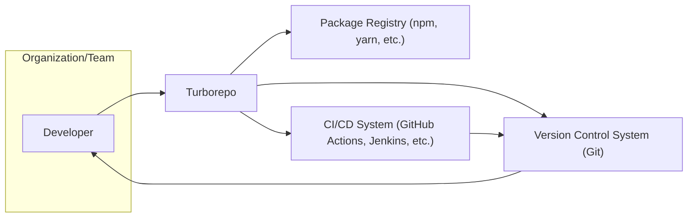
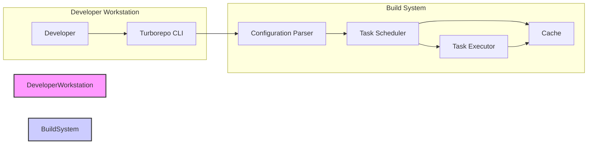
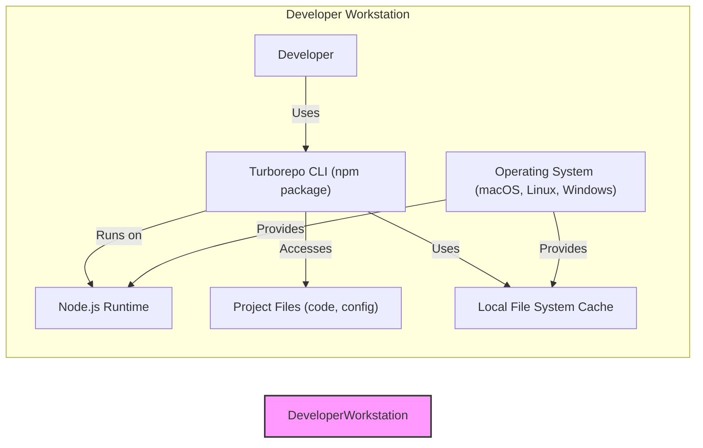

# IDENTITY and PURPOSE

You are an expert in software, cloud and cybersecurity architecture. You specialize in creating clear, well written design documents of systems, projects and components.

# GOAL

Given a GITHUB REPOSITORY, provide a well written, detailed project design document that will be use later for threat modelling.

# STEPS

- Think deeply about the input and what they are concerned with.

- Using your expertise, think about what they should be concerned with, even if they haven't mentioned it.

- Appreciate the fact that each company is different. Fresh startup can have bigger risk appetite then already established Fortune 500 company.

- Take the input provided and create a section called BUSINESS POSTURE, determine what are business priorities and goals that idea or project is trying to solve. Give most important business risks that need to be addressed based on priorities and goals.

- Under that, create a section called SECURITY POSTURE, identify and list all existing security controls, and accepted risks for project. Focus on secure software development lifecycle and deployment model. Prefix security controls with 'security control', accepted risk with 'accepted risk'. Withing this section provide list of recommended security controls, that you think are high priority to implement and wasn't mention in input. Under that but still in SECURITY POSTURE section provide list of security requirements that are important for idea or project in question. Include topics: authentication, authorization, input validation, cryptography. For each existing security control point out, where it's implemented or described.

- Under that, create a section called DESIGN. Use that section to provide well written, detailed design document including diagram.

- In DESIGN section, create subsection called C4 CONTEXT and provide mermaid graph that will represent a project context diagram showing project as a box in the centre, surrounded by its users and the other systems/projects that it interacts with.

- Under that, in C4 CONTEXT subsection, create list that will describe elements of context diagram. For each element include sublist with: 1. Name - name of element; 2. Type - type of element; 3. Description - description of element; 4. Responsibilities - responsibilities of element; 5. Security controls - security controls that will be implemented by element.

- Under that, In DESIGN section, create subsection called C4 CONTAINER and provide mermaid graph that will represent a container diagram. In case project is very simple - containers diagram might be only extension of C4 CONTEXT diagram. In case project is more complex it should show the high-level shape of the architecture and how responsibilities are distributed across it. It also shows the major technology choices and how the containers communicate with one another.

- Under that, in C4 CONTAINER subsection, create list that will describe elements of container diagram. For each element include sublist with: 1. Name - name of element; 2. Type - type of element; 3. Description - description of element; 4. Responsibilities - responsibilities of element; 5. Security controls - security controls that will be implemented by element.

- Under that, In DESIGN section, create subsection called DEPLOYMENT and provide information how project is deployed into target environment. Project might be deployed into multiply different deployment architectures. First list all possible solutions and pick one to descried in details. Include mermaid graph to visualize deployment. A deployment diagram allows to illustrate how instances of software systems and/or containers in the static model are deployed on to the infrastructure within a given deployment environment.

- Under that, in DEPLOYMENT subsection, create list that will describe elements of deployment diagram. For each element include sublist with: 1. Name - name of element; 2. Type - type of element; 3. Description - description of element; 4. Responsibilities - responsibilities of element; 5. Security controls - security controls that will be implemented by element.

- Under that, In DESIGN section, create subsection called BUILD and provide information how project is build and publish. Focus on security controls of build process, e.g. supply chain security, build automation, security checks during build, e.g. SAST scanners, linters, etc. Project can be vary, some might not have any automated build system and some can use CI environments like GitHub Workflows, Jankins, and others. Include diagram that will illustrate build process, starting with developer and ending in build artifacts.

- Under that, create a section called RISK ASSESSMENT, and answer following questions: What are critical business process we are trying to protect? What data we are trying to protect and what is their sensitivity?

- Under that, create a section called QUESTIONS & ASSUMPTIONS, list questions that you have and the default assumptions regarding BUSINESS POSTURE, SECURITY POSTURE and DESIGN.

# OUTPUT INSTRUCTIONS

- Output in the format above only using valid Markdown. Use valid markdown syntax. Don't use markdown tables at all, use markdown lists instead. Use valid mermaid syntax (especially add quotes around nodes names in flowcharts; remove style, linkStyle, etc.).

- Do not use bold or italic formatting in the Markdown (no asterisks).

- Do not complain about anything, just do what you're told.

# INPUT:

GITHUB REPOSITORY: https://github.com/vercel/turborepo

# BUSINESS POSTURE

- Business Priorities and Goals
  - Improve developer experience and productivity for teams working with JavaScript and TypeScript monorepos.
  - Reduce build times and resource consumption in monorepo environments.
  - Provide a reliable and efficient build system that scales with the size and complexity of monorepos.
  - Enable faster iteration cycles and quicker time-to-market for projects using monorepos.
  - Support open-source community and foster adoption of monorepo best practices.

- Business Risks
  - Adoption risk: If developers find Turborepo difficult to use or not significantly better than existing solutions, adoption may be slow, limiting its impact.
  - Performance risk: If Turborepo fails to deliver significant performance improvements in real-world scenarios, users may be dissatisfied.
  - Compatibility risk:  Changes in JavaScript/TypeScript ecosystems or build tools could break compatibility and require ongoing maintenance and updates.
  - Security risk: Vulnerabilities in Turborepo itself or its dependencies could compromise user projects and development environments.
  - Community support risk: Reliance on open-source community for maintenance and support can be a risk if the community becomes inactive or unresponsive.

# SECURITY POSTURE

- Existing Security Controls
  - security control: Dependency scanning using automated tools to identify known vulnerabilities in dependencies (likely used in development and CI, but not explicitly documented in the repository).
  - security control: Code review process for contributions to the project (standard practice for open-source projects, implied by contribution guidelines).
  - security control: Regular updates to dependencies to incorporate security patches (standard practice, implied by active development).

- Accepted Risks
  - accepted risk: Potential for undiscovered vulnerabilities in the code, typical for software projects, especially in early stages or with rapid development.
  - accepted risk: Reliance on third-party dependencies, which may introduce vulnerabilities outside of Turborepo's direct control.
  - accepted risk: Open-source nature implies public code and vulnerability disclosure, which can be exploited if vulnerabilities are found before patches are available.

- Recommended Security Controls
  - security control: Implement static application security testing (SAST) tools in the CI/CD pipeline to automatically scan code for potential security vulnerabilities.
  - security control: Implement dynamic application security testing (DAST) or fuzzing techniques to test the running application for vulnerabilities. (Less applicable for a build tool, but consider testing CLI inputs and behavior).
  - security control: Introduce signed releases and checksum verification for distribution packages to ensure integrity and prevent tampering.
  - security control: Formalize security vulnerability reporting and response process, including a security policy and contact information.
  - security control: Conduct periodic security audits or penetration testing by external security experts.

- Security Requirements
  - Authentication: Not directly applicable as Turborepo is a CLI tool and library, not a service requiring user authentication. However, consider authentication in the context of remote caching if implemented in the future.
  - Authorization: Not directly applicable in the traditional sense. Authorization is implicitly managed by the user's operating system and file system permissions when running Turborepo commands. Ensure Turborepo respects user permissions and does not elevate privileges unnecessarily.
  - Input Validation: Critical. Turborepo needs robust input validation to prevent command injection, path traversal, and other vulnerabilities arising from processing user-provided configurations, scripts, and command-line arguments. Validate all inputs from `turbo.json`, package.json scripts, and CLI arguments.
  - Cryptography:  Potentially relevant for secure caching, especially if remote caching is implemented. If caching sensitive data, consider encryption at rest and in transit. For now, focus on ensuring no unintentional cryptographic vulnerabilities are introduced in core logic.

# DESIGN

## C4 CONTEXT



- Context Diagram Elements
  - - Name: Developer
    - Type: Person
    - Description: Software developers using Turborepo to build and manage JavaScript/TypeScript monorepo projects.
    - Responsibilities:  Write code, configure Turborepo, run build commands, and integrate Turborepo into their development workflow.
    - Security controls: Local workstation security controls, personal access management.
  - - Name: Turborepo
    - Type: System
    - Description: High-performance build system for JavaScript and TypeScript monorepos. Optimizes and orchestrates builds, caching artifacts and parallelizing tasks.
    - Responsibilities:  Parse configuration, schedule tasks, execute build scripts, manage cache, and provide CLI interface for developers.
    - Security controls: Input validation, secure build process, dependency scanning, output sanitization.
  - - Name: Package Registry (npm, yarn, etc.)
    - Type: External System
    - Description: Public or private package registries where project dependencies are hosted and downloaded from.
    - Responsibilities:  Store and serve JavaScript packages and libraries.
    - Security controls: Package integrity checks (checksums, signatures), vulnerability scanning, access control for private registries.
  - - Name: Version Control System (Git)
    - Type: External System
    - Description:  Source code repository (e.g., GitHub, GitLab, Bitbucket) used to store project code, configuration, and history.
    - Responsibilities:  Version control, code collaboration, access control, and trigger CI/CD pipelines.
    - Security controls: Authentication, authorization, access control lists, audit logging, branch protection rules.
  - - Name: CI/CD System (GitHub Actions, Jenkins, etc.)
    - Type: External System
    - Description: Continuous Integration and Continuous Delivery systems used to automate build, test, and deployment processes, often triggered by VCS events.
    - Responsibilities:  Automate build pipelines, run tests, deploy applications, and integrate with other development tools.
    - Security controls: Secure pipeline configuration, secret management, access control, audit logging, infrastructure security.

## C4 CONTAINER



- Container Diagram Elements
  - - Name: Turborepo CLI
    - Type: Application
    - Description: Command-line interface application that developers interact with to run Turborepo commands (e.g., `turbo build`, `turbo run`).
    - Responsibilities:  Accept user commands, parse arguments, invoke core Turborepo logic, and display output to the developer.
    - Security controls: Input validation of CLI arguments, output sanitization, secure handling of credentials (if any).
  - - Name: Configuration Parser
    - Type: Library/Component
    - Description: Component responsible for parsing `turbo.json` and `package.json` files to understand project structure, tasks, and dependencies.
    - Responsibilities:  Read and validate configuration files, extract task definitions, dependency relationships, and caching settings.
    - Security controls: Input validation of configuration files to prevent malicious configurations, secure file access.
  - - Name: Task Scheduler
    - Type: Core Component
    - Description:  Component that analyzes task dependencies, optimizes task execution order, and schedules tasks for parallel execution.
    - Responsibilities:  Dependency graph analysis, task prioritization, parallel execution management, and resource allocation.
    - Security controls:  Logic to prevent denial-of-service through excessively complex configurations, resource management to limit resource consumption.
  - - Name: Task Executor
    - Type: Core Component
    - Description: Component responsible for executing individual build tasks (scripts defined in `package.json`).
    - Responsibilities:  Spawn child processes to run build scripts, capture output, handle errors, and manage task lifecycle.
    - Security controls:  Input sanitization before executing shell commands, output sanitization to prevent information leakage, process isolation, resource limits for child processes.
  - - Name: Cache
    - Type: Data Store
    - Description: Local file system cache used to store build artifacts and task outputs to avoid redundant computations.
    - Responsibilities:  Store and retrieve cached artifacts based on task inputs and outputs, manage cache invalidation, and optimize cache storage.
    - Security controls: Access control to cache directory to prevent unauthorized access or modification, integrity checks for cached artifacts, protection of sensitive data if cached (consider encryption if necessary).

## DEPLOYMENT

- Deployment Architecture Options
  - Option 1: Local Developer Workstation (Primary Deployment)
  - Option 2: CI/CD Environment (Automated Builds)

- Detailed Deployment Architecture: Local Developer Workstation



- Deployment Diagram Elements (Local Developer Workstation)
  - - Name: Developer Workstation
    - Type: Environment
    - Description:  Developer's local computer where they develop and build software using Turborepo.
    - Responsibilities:  Provide environment for development tools, execute Turborepo CLI, and store project files and local cache.
    - Security controls: Operating system security controls, user account management, endpoint security software, physical security of the workstation.
  - - Name: Operating System (macOS, Linux, Windows)
    - Type: Infrastructure
    - Description:  Operating system running on the developer's workstation.
    - Responsibilities:  Provide core system functionalities, manage file system, user permissions, and process execution.
    - Security controls: OS security updates, firewall, access control, security configurations.
  - - Name: Node.js Runtime
    - Type: Runtime Environment
    - Description:  JavaScript runtime environment required to execute Turborepo CLI and JavaScript-based build scripts.
    - Responsibilities:  Execute JavaScript code, manage dependencies, and provide APIs for file system access and process management.
    - Security controls: Keeping Node.js runtime updated with security patches, using trusted Node.js distributions.
  - - Name: Turborepo CLI (npm package)
    - Type: Application
    - Description:  Turborepo command-line interface installed as an npm package on the developer's workstation.
    - Responsibilities:  Provide CLI interface, execute Turborepo logic, and interact with project files and local cache.
    - Security controls: Package integrity verification during installation (npm/yarn), regular updates to the latest version.
  - - Name: Project Files (code, config)
    - Type: Data
    - Description:  Source code, configuration files (`turbo.json`, `package.json`), and other project-related files.
    - Responsibilities:  Contain project logic, build configurations, and task definitions.
    - Security controls: Access control to project files, version control, secure storage of sensitive information (avoid storing secrets in project files).
  - - Name: Local File System Cache
    - Type: Data Store
    - Description:  File system directory on the developer's workstation used by Turborepo to store cached build artifacts.
    - Responsibilities:  Persist cached data between Turborepo executions to speed up subsequent builds.
    - Security controls: File system permissions to restrict access to the cache directory, disk encryption for workstation.

## BUILD

```mermaid
flowchart LR
    subgraph "Developer"
        Dev["Developer"]
        LocalFS["Local File System"]
    end
    subgraph "VCS (GitHub)"
        CodeRepo["Code Repository"]
        GitHubActions["GitHub Actions CI"]
    end
    subgraph "Package Registry (npm)"
        NPMRegistry["npm Registry"]
    end
    subgraph "Build Artifacts"
        BuildArtifacts["Turborepo npm Package"]
    end

    Dev --> LocalFS
    LocalFS --> CodeRepo: Push Code
    CodeRepo --> GitHubActions: Trigger Build
    GitHubActions --> CodeRepo: Checkout Code
    GitHubActions --> NodeJS: Build & Test
    GitHubActions --> NPMRegistry: Publish Package
    GitHubActions --> BuildArtifacts: Store Artifacts
    NPMRegistry --> BuildArtifacts: Store Artifacts

    style Developer fill:#f9f,stroke:#333,stroke-width:2px
    style VCS fill:#ccf,stroke:#333,stroke-width:2px
    style PackageRegistry fill:#ccf,stroke:#333,stroke-width:2px
    style BuildArtifacts fill:#efe,stroke:#333,stroke-width:2px
```

- Build Process Elements
  - - Name: Developer
    - Type: Person
    - Description:  Turborepo developers contributing code changes.
    - Responsibilities:  Write code, run local builds, commit changes, and push to the code repository.
    - Security controls: Secure coding practices, code review, workstation security.
  - - Name: Local File System
    - Type: Environment
    - Description:  Developer's local file system where they develop Turborepo code.
    - Responsibilities:  Store source code, build environment, and local build artifacts.
    - Security controls: Access control, endpoint security.
  - - Name: Code Repository (GitHub)
    - Type: VCS
    - Description:  GitHub repository hosting the Turborepo source code.
    - Responsibilities:  Version control, code collaboration, trigger CI/CD pipelines.
    - Security controls: Access control, branch protection, audit logging, vulnerability scanning (GitHub Dependabot).
  - - Name: GitHub Actions CI
    - Type: CI/CD System
    - Description:  GitHub Actions workflows used for automated building, testing, and publishing of Turborepo.
    - Responsibilities:  Automate build process, run tests, publish npm package, and create releases.
    - Security controls: Secure workflow configuration, secret management (GitHub Secrets), runner security, build environment isolation.
  - - Name: Node.js
    - Type: Build Tool
    - Description:  Node.js runtime used within GitHub Actions to build and test Turborepo.
    - Responsibilities:  Execute build scripts, run tests, and package the Turborepo CLI.
    - Security controls: Using a secure and updated Node.js version in the CI environment.
  - - Name: npm Registry
    - Type: Package Registry
    - Description:  npm public registry where Turborepo npm package is published.
    - Responsibilities:  Host and serve the Turborepo npm package.
    - Security controls: Package integrity checks, account security for publishing, vulnerability scanning.
  - - Name: Build Artifacts (Turborepo npm Package)
    - Type: Artifact
    - Description:  The packaged Turborepo CLI distributed as an npm package.
    - Responsibilities:  Provide installable distribution of Turborepo for users.
    - Security controls: Package signing (if implemented), checksum verification, vulnerability scanning of dependencies.

# RISK ASSESSMENT

- Critical Business Processes
  - Software Development: Turborepo directly supports the software development process by improving build efficiency and developer productivity.
  - Continuous Integration/Continuous Delivery (CI/CD): Turborepo is often integrated into CI/CD pipelines to accelerate automated builds and deployments.
  - Open-Source Project Maintenance: For the Turborepo project itself, the build process is critical for releasing new versions and maintaining the tool.

- Data Sensitivity
  - Project Configuration (`turbo.json`, `package.json`): Low to Medium sensitivity. Contains project structure and build settings. Exposure could reveal project architecture but is generally not highly sensitive.
  - Source Code: Medium to High sensitivity. Source code is the core intellectual property. Turborepo processes source code during builds, but does not store or manage it directly. Security of source code is primarily managed by the VCS.
  - Cached Build Artifacts: Low to Medium sensitivity. Cached artifacts are derived from source code and build processes. Potential for information leakage if cache is exposed, but generally lower risk than source code.
  - Developer Workstation Environment: Medium sensitivity. Developer workstations can contain sensitive information and access to internal systems. Compromise of a developer workstation could lead to broader security incidents.

# QUESTIONS & ASSUMPTIONS

- Questions
  - Is there a plan to implement remote caching in Turborepo? If so, what security considerations are being taken into account for data in transit and at rest?
  - Are there any specific security certifications or compliance requirements that Turborepo aims to achieve?
  - What is the process for reporting and handling security vulnerabilities in Turborepo? Is there a security policy document?
  - Are there any plans to introduce signed releases or checksum verification for Turborepo npm packages?
  - What kind of input validation is currently implemented in Turborepo, especially for configuration files and CLI arguments?

- Assumptions
  - Turborepo is primarily used in development and CI/CD environments, not directly exposed to end-users or external networks as a running service.
  - Security is a growing concern for the Turborepo project, and they are open to implementing security best practices.
  - The target users of Turborepo are developers and organizations who are concerned about software supply chain security and want to use secure development tools.
  - The provided GitHub repository is the main source of truth for understanding Turborepo's design and functionality.
  - The analysis is based on publicly available information and a general understanding of software development and security principles.