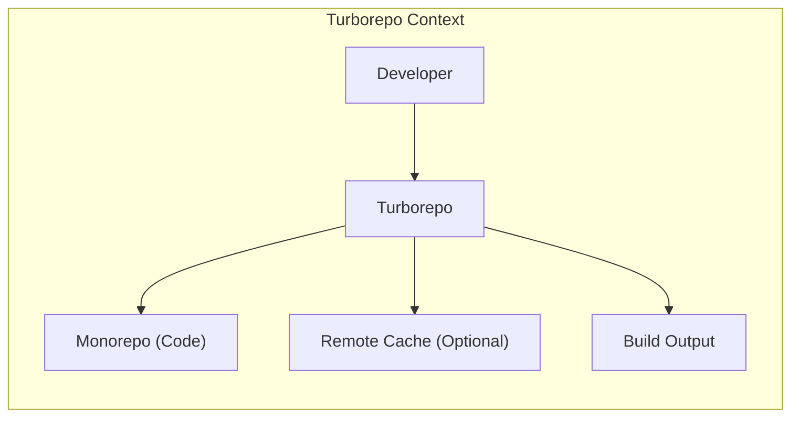
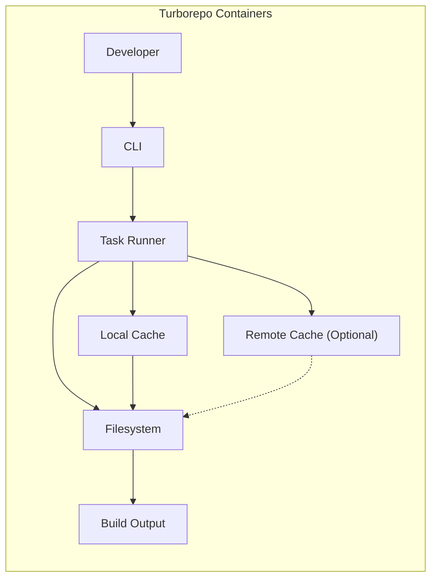
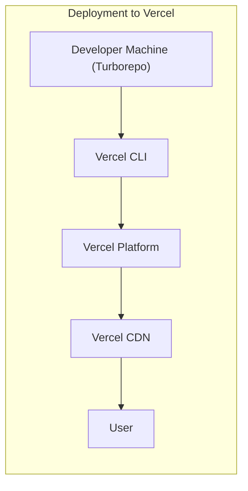
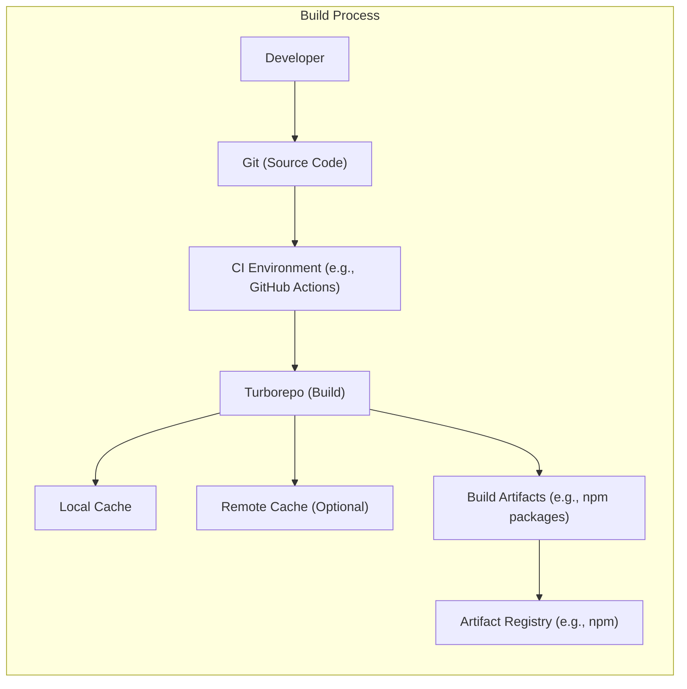

Okay, let's create a design document for Turborepo based on the provided GitHub repository.

# BUSINESS POSTURE

Turborepo is a high-performance build system for JavaScript and TypeScript monorepos.  It's designed to speed up build times and improve developer productivity, particularly in large, complex projects.  It's developed by Vercel, a company focused on frontend development and deployment.  Given Vercel's business model, the following are likely priorities:

*   Priorities:
    *   Developer Experience:  Making builds fast and efficient is paramount.  This directly impacts developer productivity and satisfaction.
    *   Scalability:  Turborepo must handle very large monorepos with many interconnected projects.
    *   Reliability:  Builds must be consistent and dependable.  Incorrect caching or build failures can significantly disrupt workflows.
    *   Adoption:  Wider adoption of Turborepo increases Vercel's market presence and potentially drives users to their other services.
    *   Maintainability: As an open-source project, maintainability and community contributions are important.
    *   Integration: Seamless integration with popular frameworks and tools within the JavaScript/TypeScript ecosystem.

*   Goals:
    *   Reduce build times for monorepo projects.
    *   Improve developer productivity.
    *   Provide a reliable and consistent build system.
    *   Become a standard tool for monorepo development.

*   Business Risks:
    *   Incorrect Builds:  The most critical risk is that Turborepo produces incorrect builds due to caching errors or other bugs. This could lead to deployment of faulty software.
    *   Performance Degradation:  If Turborepo fails to scale or its performance degrades, it loses its primary value proposition.
    *   Security Vulnerabilities:  Vulnerabilities in Turborepo could be exploited to compromise build processes or inject malicious code.  This is particularly concerning given its role in the software supply chain.
    *   Lack of Adoption:  If developers don't adopt Turborepo, the project's goals won't be met.
    *   Compatibility Issues:  Incompatibility with key tools or frameworks could limit adoption and usefulness.
    *   Community Disengagement:  Failure to foster a healthy open-source community could hinder long-term maintenance and development.

# SECURITY POSTURE

Based on the repository and Vercel's likely stance, here's a likely security posture:

*   Existing Security Controls:
    *   security control: Code Reviews:  Pull requests on GitHub are used, implying a code review process before merging changes. (Visible in the GitHub repository's contribution guidelines and pull request history).
    *   security control: Static Analysis:  Likely use of linters (e.g., ESLint) and type checking (TypeScript) to identify potential code quality and security issues. (Inferred from the project's use of TypeScript and common practices in the JavaScript ecosystem).
    *   security control: Dependency Management: Use of package managers (like npm, yarn, or pnpm) to manage dependencies. (Visible in `package.json` files).
    *   security control: Testing:  Presence of unit and integration tests to ensure code correctness and prevent regressions. (Visible in the `test` directories and CI configuration).
    *   security control: CI/CD: Use of GitHub Actions (or similar) for continuous integration and potentially continuous delivery. (Visible in the `.github/workflows` directory).

*   Accepted Risks:
    *   accepted risk: Supply Chain Attacks:  Reliance on third-party dependencies (npm packages) introduces the risk of supply chain attacks. While dependency management tools help, they don't eliminate this risk.
    *   accepted risk: Local Build Environment Vulnerabilities:  Turborepo executes code in the user's local development environment.  Vulnerabilities in that environment (e.g., compromised developer machine) could impact build integrity.
    *   accepted risk: Limited Remote Build Verification: While Turborepo supports remote caching, the verification mechanisms for remote caches might have limitations, potentially allowing for tampered artifacts.

*   Recommended Security Controls:
    *   security control: Software Bill of Materials (SBOM) Generation:  Integrate tools to automatically generate SBOMs during the build process. This provides transparency into dependencies and helps with vulnerability management.
    *   security control: Static Application Security Testing (SAST):  Incorporate SAST tools into the CI pipeline to automatically scan for security vulnerabilities in the Turborepo codebase itself.
    *   security control: Dynamic Application Security Testing (DAST): Although more challenging for a build tool, consider ways to perform DAST-like checks, perhaps by analyzing the behavior of Turborepo during test builds.
    *   security control: Code Signing:  Digitally sign released artifacts (e.g., npm packages) to ensure their integrity and authenticity.
    *   security control: Enhanced Remote Cache Verification: Implement stronger verification mechanisms for remote caches, such as cryptographic signatures and checksums, to prevent tampering.
    *   security control: Secrets Management: If Turborepo interacts with any secrets (e.g., API keys for remote caching), ensure secure storage and handling of those secrets.

*   Security Requirements:

    *   Authentication:
        *   Not directly applicable to Turborepo itself, as it's a local build tool. However, if integrating with remote caching services, secure authentication to those services is required.

    *   Authorization:
        *   If integrating with remote caching services, ensure appropriate authorization controls are in place to restrict access to authorized users and projects.

    *   Input Validation:
        *   Configuration Files:  Thoroughly validate and sanitize inputs from configuration files (e.g., `turbo.json`) to prevent injection attacks or unexpected behavior.
        *   Command-Line Arguments:  Properly handle and validate command-line arguments to prevent injection vulnerabilities.
        *   File Paths:  Sanitize file paths used within Turborepo to prevent path traversal vulnerabilities.

    *   Cryptography:
        *   Hashing:  Use strong cryptographic hashing algorithms (e.g., SHA-256 or better) for caching and artifact verification.
        *   Remote Cache Communication:  If using remote caching, ensure secure communication (e.g., HTTPS) and potentially encryption of cached artifacts.
        *   Signing: Use cryptographic signing for released artifacts.

# DESIGN

## C4 CONTEXT

*   Elements:
    *   Element:
        *   Name: Developer
        *   Type: Person
        *   Description: A software developer using Turborepo to build their project.
        *   Responsibilities: Writes code, configures Turborepo, runs build commands.
        *   Security controls: Uses a secure development environment, follows secure coding practices.
    *   Element:
        *   Name: Turborepo
        *   Type: Software System
        *   Description: The high-performance build system for JavaScript/TypeScript monorepos.
        *   Responsibilities: Manages build tasks, caches build outputs, orchestrates parallel execution.
        *   Security controls: Input validation, secure handling of configuration, secure communication with remote cache (if used).
    *   Element:
        *   Name: Monorepo
        *   Type: Code Repository
        *   Description: The source code of the project being built, organized as a monorepo.
        *   Responsibilities: Contains the source code, build scripts, and configuration files.
        *   Security controls: Code reviews, static analysis, dependency management.
    *   Element:
        *   Name: Remote Cache (Optional)
        *   Type: External System
        *   Description: An optional remote caching service (e.g., Vercel Remote Caching).
        *   Responsibilities: Stores and retrieves cached build artifacts.
        *   Security controls: Authentication, authorization, secure communication, data encryption (at rest and in transit), integrity checks.
    *   Element:
        *   Name: Build Output
        *   Type: Artifacts
        *   Description: The result of the build process (e.g., compiled code, packaged applications).
        *   Responsibilities: Represents the deployable units of the project.
        *   Security controls: Code signing (recommended), SBOM generation (recommended).

## C4 CONTAINER

*   Elements:
    *   Element:
        *   Name: Developer
        *   Type: Person
        *   Description: A software developer using Turborepo to build their project.
        *   Responsibilities: Writes code, configures Turborepo, runs build commands.
        *   Security controls: Uses a secure development environment, follows secure coding practices.
    *   Element:
        *   Name: CLI
        *   Type: Command-Line Interface
        *   Description: The command-line interface for interacting with Turborepo.
        *   Responsibilities: Parses command-line arguments, validates user input, initiates build processes.
        *   Security controls: Input validation, secure handling of command-line arguments.
    *   Element:
        *   Name: Task Runner
        *   Type: Process
        *   Description: The core component that orchestrates the build process.
        *   Responsibilities: Executes build tasks, manages dependencies between tasks, handles parallel execution.
        *   Security controls: Secure handling of configuration, process isolation (if applicable).
    *   Element:
        *   Name: Local Cache
        *   Type: Data Store
        *   Description: A local cache that stores build artifacts on the developer's machine.
        *   Responsibilities: Stores and retrieves cached build outputs.
        *   Security controls: File system permissions, data integrity checks.
    *   Element:
        *   Name: Remote Cache (Optional)
        *   Type: External System/Data Store
        *   Description: An optional remote caching service.
        *   Responsibilities: Stores and retrieves cached build artifacts.
        *   Security controls: Authentication, authorization, secure communication, data encryption (at rest and in transit), integrity checks.
    *   Element:
        *   Name: Filesystem
        *   Type: Data Store
        *   Description: The local filesystem where the monorepo and build output reside.
        *   Responsibilities: Stores source code, build artifacts, and configuration files.
        *   Security controls: File system permissions.
    *   Element:
        *   Name: Build Output
        *   Type: Artifacts
        *   Description: The result of the build process.
        *   Responsibilities: Represents the deployable units of the project.
        *   Security controls: Code signing (recommended), SBOM generation (recommended).

## DEPLOYMENT

Turborepo itself is not "deployed" in the traditional sense, as it's a build tool that runs locally on a developer's machine or within a CI/CD environment. However, the *output* of Turborepo (the built artifacts) can be deployed in various ways.

*   Possible Deployment Solutions:
    *   Vercel:  Deploying frontend applications and serverless functions to Vercel's platform.
    *   Cloud Providers (AWS, GCP, Azure):  Deploying to various services on major cloud providers (e.g., AWS S3 + CloudFront, Google Cloud Storage + Cloud CDN, Azure Blob Storage + CDN).
    *   Traditional Servers:  Deploying to traditional web servers (e.g., Nginx, Apache).
    *   Containerized Environments:  Deploying containerized applications to Kubernetes or other container orchestration platforms.

*   Chosen Solution (Example: Vercel):

*   Elements:
    *   Element:
        *   Name: Developer Machine (Turborepo)
        *   Type: Infrastructure
        *   Description: The developer's local machine where Turborepo is used to build the project.
        *   Responsibilities: Runs Turborepo to generate build artifacts.
        *   Security controls: Secure development environment.
    *   Element:
        *   Name: Vercel CLI
        *   Type: Tool
        *   Description: The command-line interface for interacting with the Vercel platform.
        *   Responsibilities: Handles authentication, initiates deployments, manages projects on Vercel.
        *   Security controls: Secure communication with Vercel API, secure handling of authentication tokens.
    *   Element:
        *   Name: Vercel Platform
        *   Type: Platform
        *   Description: Vercel's cloud platform for frontend development and deployment.
        *   Responsibilities: Hosts applications, manages deployments, provides serverless functions, and other services.
        *   Security controls: Platform-level security controls provided by Vercel (e.g., DDoS protection, network security).
    *   Element:
        *   Name: Vercel CDN
        *   Type: Content Delivery Network
        *   Description: Vercel's global content delivery network.
        *   Responsibilities: Caches and serves static assets to users, improving performance and reducing latency.
        *   Security controls: Network security, DDoS protection, HTTPS.
    *   Element:
        *   Name: User
        *   Type: Person
        *   Description: The end-user accessing the deployed application.
        *   Responsibilities: Interacts with the application.
        *   Security controls: Browser security features.

## BUILD

Turborepo's build process is central to its functionality.  It leverages caching and parallel execution to speed up builds.

*   Security Controls in Build Process:
    *   Source Code Management (Git):  Version control with Git allows tracking changes and reverting to previous states.
    *   CI Environment:  Automated builds in a controlled environment (e.g., GitHub Actions) ensure consistency and repeatability.
    *   Dependency Management:  Using package managers (npm, yarn, pnpm) with lock files ensures consistent dependency resolution.
    *   Static Analysis:  Linters and type checking (TypeScript) are used to identify potential code quality and security issues during the build.
    *   Testing:  Automated tests (unit, integration) are run as part of the build process to verify code correctness.
    *   Caching:  Turborepo's caching mechanism (local and remote) speeds up builds, but requires careful verification to prevent using tampered artifacts.
    *   Artifact Registry:  Publishing build artifacts to a registry (e.g., npm) allows for distribution and reuse.
    *   Recommended: SAST, SBOM generation, code signing.

# RISK ASSESSMENT

*   Critical Business Processes:
    *   Software Development Lifecycle: Turborepo is directly integrated into the SDLC, making its reliability and security critical.
    *   Deployment Pipeline:  Build failures or compromised builds can directly impact deployments.

*   Data We Are Trying to Protect:
    *   Source Code:  The primary data being handled is the source code of the projects being built.  The sensitivity of this data depends on the specific project.  For open-source projects, the source code is public, but integrity is still important.  For closed-source projects, confidentiality is also a major concern.
    *   Build Artifacts:  These are the compiled outputs of the build process.  Protecting their integrity is crucial to prevent deploying compromised software.
    *   Configuration Files:  Files like `turbo.json` may contain sensitive information or configurations that could be exploited if modified maliciously.
    *   Cached Data (Local and Remote):  Cached build artifacts need to be protected from tampering to ensure build integrity.
    *   Credentials (if used for remote caching): Any credentials used to access remote caching services must be protected.

*   Data Sensitivity:
    *   Source Code:  Variable (Public to Highly Confidential).
    *   Build Artifacts:  High (integrity is paramount).
    *   Configuration Files:  Potentially Sensitive.
    *   Cached Data:  Medium (integrity is the primary concern).
    *   Credentials:  Highly Sensitive.

# QUESTIONS & ASSUMPTIONS

*   Questions:
    *   What specific remote caching services are officially supported, and what are their security features?
    *   What are the exact mechanisms used for verifying the integrity of cached artifacts (both local and remote)?
    *   Are there any plans to implement code signing or SBOM generation?
    *   What level of detail is logged during the build process, and are those logs monitored for security events?
    *   What is the process for handling security vulnerabilities reported in Turborepo or its dependencies?

*   Assumptions:
    *   BUSINESS POSTURE: Assumes Vercel prioritizes developer experience, scalability, and reliability for Turborepo. Assumes a moderate risk appetite, balancing speed and security.
    *   SECURITY POSTURE: Assumes basic security practices (code reviews, testing, CI/CD) are in place. Assumes reliance on third-party dependencies introduces supply chain risks.
    *   DESIGN: Assumes the core components are accurately represented in the C4 diagrams. Assumes the deployment process can vary widely depending on the target environment. Assumes the build process leverages caching and parallel execution.