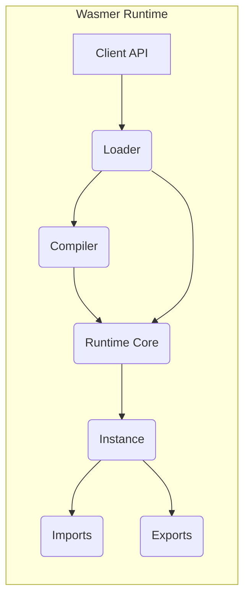
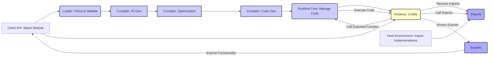

# Project Design Document: Wasmer Runtime

**Version:** 1.1
**Date:** October 26, 2023
**Author:** AI Software Architect

## 1. Introduction

This document provides a detailed design overview of the Wasmer runtime environment, a leading WebAssembly (Wasm) runtime that enables executing Wasm code in various environments. This document aims to provide a comprehensive understanding of Wasmer's architecture, components, and data flow, which will serve as the foundation for subsequent threat modeling activities. This revision includes more granular detail and clarifies potential security implications within each component.

## 2. Goals

The primary goals of this design document are to:

*   Clearly articulate the architecture and key components of the Wasmer runtime, providing a more granular view where appropriate.
*   Describe the interactions and data flow between these components in detail.
*   Identify potential trust boundaries and security-relevant areas within the system, with more specific examples.
*   Provide a robust foundation for conducting thorough threat modeling of the Wasmer project.

## 3. Scope

This document focuses on the core architecture and functionality of the Wasmer runtime itself. It covers the process of loading, compiling, and executing Wasm modules. While Wasmer offers various integrations and embedding options, this document primarily focuses on the core runtime engine. Specific integrations (e.g., Wasmer Edge, Wasmer Python) are out of scope for this initial design document but may be addressed in future iterations. This includes the core mechanisms for handling imports and exports.

## 4. High-Level Architecture

The Wasmer runtime can be broadly divided into the following key components:

*   **Client API:** The primary interface through which users interact with Wasmer. This API allows loading, compiling, instantiating, and executing Wasm modules.
*   **Loader:**  Handles the process of reading and parsing the Wasm module bytecode, verifying its structure and semantics.
*   **Compiler:** Responsible for translating Wasm bytecode into native machine code. Wasmer supports multiple compiler backends (e.g., Cranelift, LLVM). This can be further broken down into stages.
*   **Runtime Core:** The central execution engine that manages the execution of compiled Wasm code. This includes managing memory, function calls, and interactions with the host environment.
*   **Instance:** Represents a loaded and instantiated Wasm module. It contains the module's memory, tables, globals, and function instances.
*   **Imports:** Mechanisms for Wasm modules to interact with the host environment by importing functions, memories, globals, and tables. This involves resolving and managing these imports.
*   **Exports:** Mechanisms for a Wasm module to expose its functionality to the host environment. This involves making the module's functionalities accessible.

## 5. Component Details

This section provides a more detailed description of each component and its responsibilities, with a greater focus on potential security implications.

### 5.1. Client API

*   **Description:** The primary entry point for interacting with the Wasmer runtime. It provides functions for loading Wasm modules from various sources (files, bytes), compiling them, instantiating them, and executing exported functions.
*   **Responsibilities:**
    *   Providing a user-friendly interface to Wasmer's functionality.
    *   Managing the lifecycle of Wasm modules and instances.
    *   Handling errors and exceptions originating from various parts of the runtime.
    *   Facilitating the configuration of the runtime environment (e.g., setting compiler options, memory limits).
*   **Security Considerations:** This is a critical interface as it directly interacts with user-provided Wasm code.
    *   **Threat:** Malicious actors could attempt to exploit API vulnerabilities to bypass security checks or cause unexpected behavior.
    *   **Mitigation:** Robust input validation on all API calls, proper error handling to prevent information leaks, and potentially rate limiting to prevent abuse.

### 5.2. Loader

*   **Description:** Responsible for taking the raw bytes of a Wasm module and parsing them according to the Wasm specification. It performs validation to ensure the module is well-formed and adheres to the rules of the Wasm format.
*   **Responsibilities:**
    *   Reading and parsing the Wasm binary format, including sections like code, data, and imports.
    *   Verifying the structural integrity of the Wasm module (e.g., correct section ordering, valid magic number).
    *   Validating the semantics of the Wasm code (e.g., type checking, instruction validity).
    *   Preparing the module's internal representation for compilation.
*   **Security Considerations:** Vulnerabilities in the loader could allow malicious Wasm modules to bypass security checks or cause crashes.
    *   **Threat:** A malformed Wasm module could exploit parsing vulnerabilities leading to denial of service or even arbitrary code execution within the loader process.
    *   **Mitigation:**  Rigorous adherence to the Wasm specification, fuzzing the loader with various malformed inputs, and implementing bounds checks during parsing.

### 5.3. Compiler

*   **Description:** Translates the validated Wasm bytecode into native machine code that can be executed directly by the processor. Wasmer supports pluggable compiler backends, allowing for different optimization strategies and target architectures. This process typically involves several stages.
*   **Responsibilities:**
    *   Receiving the parsed Wasm module from the loader.
    *   **Intermediate Representation (IR) Generation:** Converting the Wasm bytecode into an internal representation suitable for optimization.
    *   **Optimization:** Applying various optimization passes to improve the performance of the generated code.
    *   **Code Generation:** Translating the optimized IR into native machine code for the target architecture.
    *   Ensuring the generated code adheres to security constraints and the Wasm sandbox.
*   **Security Considerations:** Compiler vulnerabilities could lead to the generation of unsafe code, potentially allowing sandbox escapes or other security breaches.
    *   **Threat:** A compiler bug could lead to the generation of native code that bypasses intended security restrictions, allowing the Wasm module to access memory it shouldn't.
    *   **Mitigation:** Thorough testing of compiler backends, static analysis of the compiler code, and potentially using memory-safe languages for compiler implementation. Employing techniques like sandboxing the compilation process itself.

### 5.4. Runtime Core

*   **Description:** The heart of the Wasmer runtime, responsible for managing the execution of compiled Wasm code. It handles function calls, memory access, and interactions with the host environment through imports and exports.
*   **Responsibilities:**
    *   Executing the generated native code in a sandboxed environment.
    *   Managing the Wasm instance's linear memory, tables, and global variables.
    *   Handling function calls within the Wasm module and between the module and the host (via the Imports mechanism).
    *   Enforcing the Wasm sandbox by preventing unauthorized access to host resources.
    *   Managing resource limits (e.g., memory usage, execution time) to prevent denial-of-service attacks.
*   **Security Considerations:** This component is responsible for enforcing the security boundaries of the Wasm sandbox.
    *   **Threat:** Vulnerabilities in the runtime core could allow a malicious Wasm module to escape the sandbox and gain access to host system resources or compromise other Wasm instances.
    *   **Mitigation:**  Careful implementation of memory management, strict enforcement of Wasm semantics, and isolation techniques between Wasm instances. Regular security audits and vulnerability scanning are crucial.

### 5.5. Instance

*   **Description:** Represents a specific instantiation of a loaded Wasm module. Each instance has its own isolated memory space, tables, and global variables.
*   **Responsibilities:**
    *   Holding the runtime state of a Wasm module, including its memory, tables, and globals.
    *   Providing access to the module's memory, tables, and globals in a controlled manner.
    *   Managing the execution context for the module, including the call stack.
*   **Security Considerations:** Isolation between instances is crucial for security.
    *   **Threat:**  If instance isolation is compromised, one malicious Wasm module could potentially access or manipulate the data of another instance.
    *   **Mitigation:**  Memory isolation techniques enforced by the runtime core, ensuring that each instance operates within its designated memory region.

### 5.6. Imports

*   **Description:**  Allows Wasm modules to call functions, access memory, and interact with resources provided by the host environment. Imports are declared in the Wasm module and resolved by the host during instantiation. This involves looking up and validating the provided import implementations.
*   **Responsibilities:**
    *   Defining the interface between the Wasm module and the host.
    *   Providing a mechanism for the host to supply functionality to the Wasm module.
    *   Resolving import requests from the Wasm module to the corresponding host functions or resources.
    *   Enabling communication and data exchange between the Wasm module and the host.
*   **Security Considerations:** Imports represent a significant potential attack surface if the host provides insecure or improperly validated functions.
    *   **Threat:** A malicious Wasm module could exploit vulnerabilities in imported host functions to gain unauthorized access to host resources or execute arbitrary code on the host.
    *   **Mitigation:**  Strict validation of arguments passed to imported functions, implementing secure coding practices in host function implementations, and carefully considering the trust level of the Wasm modules being executed. Consider using capability-based security for imports.

### 5.7. Exports

*   **Description:**  Allows a Wasm module to expose its functions, memory, tables, and globals to the host environment. The host can then interact with the module's functionality through these exports. This involves making the module's internal functionalities accessible to the outside.
*   **Responsibilities:**
    *   Defining the interface through which the host can interact with the Wasm module.
    *   Providing a mechanism for the Wasm module to expose its capabilities to the host.
    *   Managing access to the exported functionalities.
*   **Security Considerations:**  Exports define the public interface of the Wasm module.
    *   **Threat:**  A poorly designed or implemented export could expose internal vulnerabilities or sensitive information to the host environment.
    *   **Mitigation:**  Careful design of exported interfaces, ensuring that exported functions do not inadvertently expose internal state or allow for unintended side effects. Thorough testing of exported functionalities.

## 6. Data Flow

The typical data flow for loading and executing a Wasm module in Wasmer is as follows:

1. The **Client API** receives a Wasm module (e.g., from a file or byte array).
2. The **Client API** passes the raw byte stream to the **Loader**.
3. The **Loader** parses the byte stream, verifying the Wasm module's structure and semantics.
4. The **Loader** produces a validated internal representation of the Wasm module.
5. The validated module is passed to the **Compiler**.
6. The **Compiler** performs **IR Generation**, creating an intermediate representation.
7. The **Compiler** applies **Optimization** passes to the IR.
8. The **Compiler** performs **Code Generation**, translating the optimized IR into native machine code.
9. The generated native code is managed by the **Runtime Core**.
10. The **Client API** requests instantiation of the module.
11. The **Runtime Core** creates a new **Instance** of the module, allocating memory, tables, and initializing globals.
12. If the module declares **Imports**, the **Runtime Core** (or a related component) resolves these imports by looking up and linking to host-provided implementations.
13. The host environment provides the necessary import implementations to the **Imports** mechanism.
14. The **Client API** can then call exported functions on the **Instance** through the **Exports** mechanism.
15. The call is routed to the **Runtime Core**.
16. The **Runtime Core** executes the compiled native code within the context of the **Instance**, managing memory access and function calls.
17. During execution, the Wasm module may interact with the host environment by calling imported functions through the **Imports** mechanism.
18. The Wasm module may expose results or functionalities back to the host through the **Exports** mechanism.

## 7. Security Considerations

Based on the architecture described above, several key areas require careful security consideration:

*   **Wasm Module Validation (Loader):**
    *   Ensuring strict adherence to the Wasm specification to prevent malformed modules from causing issues.
    *   Checking for resource exhaustion vulnerabilities within the module's structure (e.g., excessively large sections).
    *   Validating import and export declarations to prevent type mismatches or unexpected behavior.
*   **Compiler Security:**
    *   Protecting against code injection vulnerabilities during the code generation phase.
    *   Ensuring proper memory safety in the generated native code to prevent buffer overflows or other memory corruption issues.
    *   Mitigating potential side-channel attacks that could leak information through timing or resource usage.
*   **Runtime Sandboxing (Runtime Core):**
    *   Strictly preventing access to host system resources (file system, network, etc.) without explicit permission granted through imports.
    *   Enforcing memory isolation between different Wasm instances to prevent cross-instance interference.
    *   Implementing and enforcing resource limits (memory, CPU time, stack size) to prevent denial-of-service attacks.
*   **Host Interface Security (Imports):**
    *   Thoroughly validating inputs passed to imported host functions to prevent vulnerabilities in the host code.
    *   Preventing imported functions from performing actions that violate the intended security policies of the host environment.
    *   Carefully considering the trust level of the host environment providing the import implementations.
*   **API Security (Client API):**
    *   Implementing proper authentication and authorization mechanisms if the Wasmer runtime is exposed in a multi-user environment.
    *   Sanitizing and validating inputs received through the API to prevent injection attacks.
    *   Implementing rate limiting and other protective measures to prevent denial-of-service attacks against the API.
*   **Export Security:**
    *   Ensuring that exported functions do not inadvertently expose sensitive internal state or allow for unintended or insecure operations.
    *   Carefully designing the interfaces of exported functionalities to minimize the attack surface.

## 8. Technologies Used

*   **Programming Language:** Primarily Rust, leveraging its memory safety features.
*   **Compiler Backends:** Cranelift (default, focused on speed and security), LLVM (for more aggressive optimizations). The pluggable architecture allows for adding other backends.
*   **WebAssembly Specification:** Strict adherence to the official Wasm standards ensures compatibility and predictable behavior.

## 9. Future Considerations

Future development and architectural changes may include:

*   **Enhanced Sandboxing Techniques:** Exploring hardware-assisted virtualization or other advanced sandboxing mechanisms for increased isolation.
*   **Improved Compiler Security Audits:**  Regular and thorough security audits of the compiler backends to identify and address potential vulnerabilities.
*   **Formal Verification of Core Components:** Applying formal verification techniques to critical components like the runtime core to mathematically prove their correctness and security properties.
*   **More Granular Resource Control:** Implementing finer-grained control over resource consumption by Wasm modules.
*   **Standardized WASI (WebAssembly System Interface) Support:** Expanding and hardening support for WASI to provide secure access to host system functionalities.

This document provides a more detailed and refined understanding of the Wasmer runtime architecture, specifically tailored for threat modeling. The added granularity and explicit security considerations for each component should facilitate a more comprehensive and effective threat analysis.