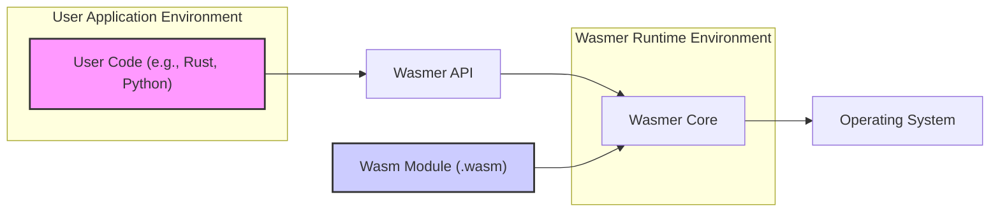

# Project Design Document: Wasmer

**Version:** 1.1
**Date:** October 26, 2023
**Author:** AI Software Architect

## 1. Introduction

This document outlines the design of the Wasmer project, a blazing-fast, secure, and embeddable WebAssembly runtime environment. It provides a detailed and comprehensive overview of the system's architecture, core components, and the flow of data within the system. This document is intended to serve as a foundational resource for subsequent threat modeling and security analysis.

## 2. Goals and Objectives

*   **Portability:** Enable the execution of WebAssembly modules across a wide range of operating systems (Linux, macOS, Windows) and hardware architectures (x86\_64, AArch64, etc.).
*   **Embeddability:** Design the runtime to be easily integrated into existing applications and systems, offering a flexible API for interaction.
*   **Performance:** Provide high-performance execution of WebAssembly through optimized compilation strategies, including Just-In-Time (JIT) compilation.
*   **Security:** Ensure the secure execution of untrusted WebAssembly code through robust sandboxing and validation mechanisms.
*   **Extensibility:** Allow for the extension of Wasmer's functionality through plugins and custom integrations.
*   **Developer Experience:** Offer a user-friendly API and tooling to simplify the process of working with WebAssembly.
*   **Ecosystem Growth:**  Contribute to and foster a thriving ecosystem around WebAssembly by providing a reliable and feature-rich runtime.

## 3. System Architecture

### 3.1. High-Level Architecture



*   **User Application Environment:** This represents the context where the application utilizing Wasmer resides. This could be a standalone application, a server process, or an embedded system.
*   **Wasmer API:** The public interface exposed by the Wasmer library. This API provides functions for loading, compiling, instantiating, and interacting with WebAssembly modules. It acts as the primary entry point for user applications.
*   **Wasmer Runtime Environment:**  The core of Wasmer, responsible for the entire lifecycle of a WebAssembly module, from loading to execution. It encapsulates the Wasmer Core.
*   **Wasm Module (.wasm):** The WebAssembly binary file containing the compiled code to be executed by Wasmer.
*   **Operating System:** The underlying operating system providing resources and services to the Wasmer runtime.

### 3.2. Detailed Architecture

```mermaid
graph LR
    subgraph "Wasmer Core"
        direction LR
        A["Wasm Module (.wasm)"] --> B{"Loader"}
        B --> C{"Parser"}
        C --> D{"Validator"}
        D --> E{"Compiler Interface"}
        subgraph "Compiler Backends"
            E -- "Cranelift" --> EA["Cranelift Compiler"]
            E -- "LLVM" --> EB["LLVM Compiler"]
            E -- "Singlepass" --> EC["Singlepass Compiler"]
        end
        EA -- "Native Code" --> F{"Runtime Environment"}
        EB -- "Native Code" --> F
        EC -- "Native Code" --> F
        F -- "Module Instance" --> G{"Linear Memory"}
        F -- "Module Instance" --> H{"Function Tables"}
        F -- "Module Instance" --> I{"Global Variables"}
        F -- "Module Instance" --> J{"Compiled Functions"}
        K["Imports (Host Functions, Memory, etc.)"] --> F
        L["Exports (Functions, Memory, etc.)"] <-- F
    end
    N["Wasmer API"] --> B
    N --> E
    N --> F
    O["User Application"] --> N

    style A fill:#f9f,stroke:#333,stroke-width:2px
    style K fill:#ccf,stroke:#333,stroke-width:2px
    style L fill:#ccf,stroke:#333,stroke-width:2px
```

*   **Wasm Module (.wasm):** The input WebAssembly bytecode representing the program to be executed.
*   **Loader:** Responsible for reading the `.wasm` file from disk or memory and providing the raw bytecode to the Parser.
*   **Parser:** Analyzes the binary format of the WebAssembly module, verifying its structure and extracting information about its sections, including code, data, imports, and exports.
*   **Validator:** Enforces the WebAssembly specification's rules, ensuring the module is well-formed and safe to execute. This includes type checking, control flow analysis, and validation of memory access patterns.
*   **Compiler Interface:** An abstraction layer that allows Wasmer to utilize different compiler backends. This component receives the validated WebAssembly intermediate representation.
*   **Compiler Backends:**  Implementations of different compilation strategies:
    *   **Cranelift Compiler:** A fast, lightweight JIT compiler focused on quick startup times and reasonable performance.
    *   **LLVM Compiler:** A more optimizing compiler that can produce highly performant native code, but typically with longer compilation times.
    *   **Singlepass Compiler:** A very fast, non-optimizing compiler ideal for scenarios where compilation speed is paramount, even at the cost of runtime performance.
*   **Runtime Environment:** Manages the execution of the compiled WebAssembly code. This includes:
    *   **Linear Memory:**  The contiguous block of memory allocated for the WebAssembly instance. Access to this memory is carefully controlled to maintain isolation.
    *   **Function Tables:**  Tables holding indirect function calls, used for implementing function pointers and dynamic dispatch.
    *   **Global Variables:**  Global variables defined within the WebAssembly module.
    *   **Compiled Functions:** The native machine code generated by the chosen compiler backend for the WebAssembly functions.
*   **Imports (Host Functions, Memory, etc.):** External resources or functionalities that the WebAssembly module requires from the host environment. These are resolved and provided during instantiation. Examples include functions for interacting with the operating system or accessing external data.
*   **Exports (Functions, Memory, etc.):** Functionalities or resources provided by the WebAssembly module that can be accessed and utilized by the host environment after instantiation.
*   **Wasmer API:** The set of functions and data structures that user applications use to interact with the Wasmer runtime.
*   **User Application:** The external application or system that embeds and utilizes the Wasmer runtime to execute WebAssembly modules.

## 4. Components

*   **Wasmer CLI (`wasmer`):** A command-line tool that allows users to compile, run, and inspect WebAssembly modules directly from the terminal. It provides functionalities like running a `.wasm` file, inspecting its imports and exports, and managing Wasmer's cache.
*   **Wasmer Core (Rust Crate):** The foundational library written in Rust that implements the core functionality of the WebAssembly runtime, including loading, parsing, validation, compilation, and runtime execution.
*   **Wasmer API Bindings (Various Languages):** Libraries that provide language-specific interfaces to the Wasmer Core, allowing developers to embed Wasmer in applications written in languages like Python, Go, C/C++, and JavaScript. These bindings typically use Foreign Function Interface (FFI) to interact with the Rust core.
*   **Compiler Backends (Cranelift, LLVM, Singlepass):**  Independent libraries or modules responsible for translating the WebAssembly intermediate representation into native machine code for different target architectures. Each backend offers different trade-offs between compilation speed and runtime performance.
*   **Wasmer Store:** A persistent storage mechanism (typically on the filesystem) used to cache the compiled output of WebAssembly modules. This significantly reduces the time required to load and run modules that have been executed previously.
*   **Wasmer Plugins:** A system that allows developers to extend Wasmer's functionality by creating and loading dynamic libraries. Plugins can provide custom imports, modify runtime behavior, or integrate with external systems.
*   **Wasmer Registry (Future):** A planned component for discovering, sharing, and managing WebAssembly packages and modules, similar to package managers for other programming languages.
*   **Wasmer SDK:** A collection of tools and libraries aimed at simplifying the development and deployment of WebAssembly applications using Wasmer.

## 5. Data Flow

The process of executing a WebAssembly module within Wasmer involves the following data flow:

1. **Module Loading:** The user application provides the path to a `.wasm` file or a byte array containing the WebAssembly module to the Wasmer API. This data is passed to the **Loader**.
2. **Parsing and Decoding:** The **Loader** reads the raw bytes of the module, and the **Parser** analyzes its structure, decoding the binary format and building an internal representation of the module's components (sections, functions, types, etc.).
3. **Validation:** The parsed module representation is passed to the **Validator**, which performs a series of checks to ensure the module conforms to the WebAssembly specification and is safe to execute. This involves type checking, validating instruction sequences, and verifying memory access patterns.
4. **Compilation:** The validated module is then handed off to the **Compiler Interface**. Based on the configured compiler backend (Cranelift, LLVM, or Singlepass), the corresponding compiler translates the WebAssembly bytecode into native machine code specific to the target architecture. The compiled code is then stored.
5. **Instantiation:** When the user application requests to instantiate the module, the **Runtime Environment** creates an instance of the compiled code. This involves allocating memory for the module's linear memory, initializing function tables, and setting up global variables. **Imports** are resolved at this stage, linking the module to external functionalities provided by the host.
6. **Function Execution:** The user application can then call exported functions of the instantiated module through the Wasmer API. This triggers the execution of the **Compiled Functions** within the **Runtime Environment**. Input data is passed to the WebAssembly function as arguments.
7. **Interaction with Host:** During execution, the WebAssembly module may invoke imported **Host Functions**. The **Runtime Environment** facilitates these calls, transferring control and data to the host environment. Similarly, the module might access imported **Linear Memory** or other imported resources.
8. **Return Values:** When a WebAssembly function completes its execution, any return values are passed back to the calling user application through the Wasmer API.

## 6. Security Considerations (Detailed)

*   **WebAssembly Sandboxing:** Wasmer relies on the inherent security model of WebAssembly, which provides strong isolation between the guest WebAssembly code and the host environment. Memory access is strictly controlled within the module's linear memory space, preventing access to the host's memory or other processes.
*   **Module Validation:** The **Validator** component plays a critical role in security by ensuring that the WebAssembly module adheres to the specification and does not contain potentially harmful constructs. This includes verifying type safety, preventing out-of-bounds memory access, and ensuring valid control flow.
*   **Capability-Based Security (Imports):** The import mechanism in WebAssembly enforces a capability-based security model. WebAssembly modules can only interact with the host environment through explicitly declared imports. The host application has complete control over which functionalities and resources are exposed to the module, limiting its potential impact.
*   **Resource Limits:** Wasmer allows the host application to configure resource limits for WebAssembly modules, such as maximum memory usage, stack size, and execution time. This helps prevent denial-of-service attacks or resource exhaustion by malicious or poorly written modules.
*   **Compiler Security:**  The security of the compiler backends is crucial. Vulnerabilities in the compiler could potentially lead to the generation of unsafe native code. Wasmer utilizes well-established and actively maintained compiler projects like Cranelift and LLVM, which undergo their own security scrutiny.
*   **Control Flow Integrity:** The WebAssembly specification and Wasmer's implementation enforce control flow integrity, making it difficult for malicious code to hijack the execution flow and deviate from the intended program logic.
*   **Mitigation of Common Vulnerabilities:** Wasmer's design and the underlying WebAssembly specification aim to mitigate common vulnerabilities such as buffer overflows, stack overflows, and arbitrary code execution within the sandbox.
*   **Supply Chain Security:**  While Wasmer provides a secure runtime environment, the security of the WebAssembly modules themselves is also important. Verifying the source and integrity of WebAssembly modules is a crucial aspect of overall security.
*   **Runtime Monitoring and Auditing:**  Future enhancements could include more sophisticated runtime monitoring and auditing capabilities to detect and respond to suspicious behavior within WebAssembly modules.

## 7. Technologies Used

*   **Primary Programming Language:** Rust (for the core Wasmer runtime and primary API).
*   **Compiler Backends:**
    *   Cranelift (written in Rust).
    *   LLVM (written in C++).
    *   Singlepass (written in Rust).
*   **API Bindings Languages:**
    *   C/C++
    *   Python
    *   Go
    *   JavaScript (via WASI on Node.js or other runtimes)
    *   PHP
    *   Ruby
    *   And more...
*   **Build System:** Cargo (Rust's package manager and build tool).
*   **Operating System Support:**
    *   Linux (various distributions)
    *   macOS
    *   Windows
    *   WebAssembly System Interface (WASI) compatible environments.
*   **Architecture Support:**
    *   x86\_64
    *   AArch64 (ARM64)
    *   Other architectures supported by the chosen compiler backends.

## 8. Deployment Considerations

Wasmer's flexible design allows for deployment in diverse scenarios:

*   **Desktop Applications:** Embedding Wasmer directly into desktop applications (written in various languages through API bindings) to enable plugin architectures, scripting capabilities, or the execution of portable application logic.
*   **Server-Side Applications:** Utilizing Wasmer in server environments to run WebAssembly workloads for various purposes, such as:
    *   **Serverless Functions:** Executing individual functions or microservices packaged as WebAssembly modules.
    *   **Backend Logic:** Implementing parts of the backend application logic in WebAssembly for performance or portability reasons.
    *   **Plugin Systems:** Creating extensible server applications where plugins are distributed as WebAssembly modules.
*   **Embedded Systems and IoT Devices:** Deploying Wasmer on resource-constrained embedded devices to execute application logic, leveraging WebAssembly's small footprint and portability.
*   **Edge Computing:** Running WebAssembly modules on edge devices to process data locally and reduce latency.
*   **Web Browsers (Indirectly via WASI on the Server):** While Wasmer doesn't run directly in the browser sandbox, it can be used on the server-side to execute WebAssembly code that may have originated from a browser context, enabling full-stack WebAssembly applications.
*   **Command-Line Tools:** Using the `wasmer` CLI to execute WebAssembly modules as standalone command-line utilities.

## 9. Future Considerations

*   **Enhanced Security Features:**
    *   Implementing more granular control over import capabilities.
    *   Exploring advanced sandboxing techniques and security hardening measures.
    *   Integrating with security auditing and monitoring tools.
*   **Performance Optimizations:**
    *   Further optimizing the compiler backends for specific use cases and architectures.
    *   Exploring techniques like ahead-of-time (AOT) compilation for faster startup times in certain scenarios.
    *   Improving runtime performance through techniques like tiered compilation.
*   **Expanded Language and Platform Support:**
    *   Adding API bindings for more programming languages.
    *   Improving support for emerging WebAssembly standards and proposals.
    *   Exploring support for new hardware architectures.
*   **Ecosystem Development:**
    *   Developing and promoting the Wasmer Registry for discovering and managing WebAssembly packages.
    *   Creating more comprehensive tooling and documentation for developers.
    *   Fostering a vibrant community of Wasmer users and contributors.
*   **Improved Debugging and Observability:**
    *   Providing better debugging tools for WebAssembly modules running in Wasmer.
    *   Enhancing observability features for monitoring the performance and resource usage of WebAssembly instances.
*   **Standardization Efforts:** Actively participating in and contributing to the ongoing development and standardization of WebAssembly and related technologies.
