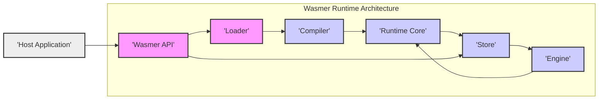
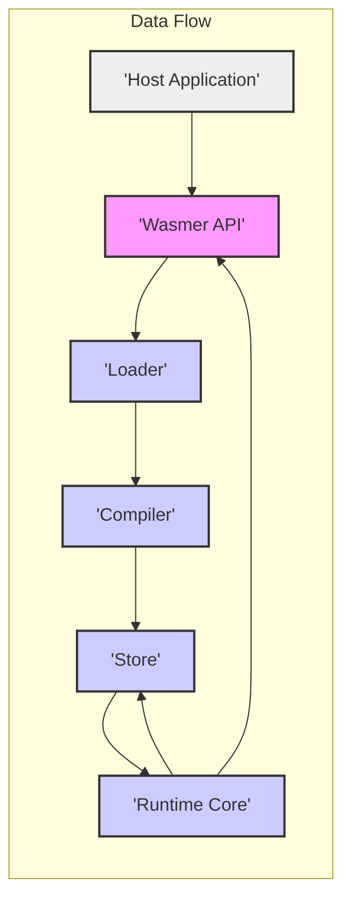

# Project Design Document: Wasmer WebAssembly Runtime

## 1. Project Overview

Wasmer is a fast and secure WebAssembly runtime designed to execute WebAssembly modules across diverse operating systems and architectures, outside the confines of web browsers. Its embeddable nature allows integration into various applications, offering a range of compilation strategies to optimize for performance and startup speed. This document details the architectural design of Wasmer, emphasizing its components, interactions, and data flow to facilitate comprehensive threat modeling and security analysis.

## 2. Architecture Overview

Wasmer's architecture is built upon modularity, prioritizing both flexibility and performance. The core components are:

- **Loader**: Responsible for parsing, validating, and preparing WebAssembly modules.
- **Compiler**: Translates WebAssembly bytecode into optimized native machine code.
- **Runtime Core**: Manages the execution environment for compiled WebAssembly code, including memory management, function invocation, and instruction processing.
- **Store**:  Centralized management of WebAssembly entities like instances, modules, memories, and tables, ensuring isolation and resource control.
- **Engine**: An abstraction layer defining the execution strategy, supporting options like JIT, AOT, and potentially interpreters.
- **API (Wasmer API)**: The public interface for host applications to interact with the Wasmer runtime.

## 3. Component Details

### 3.1. Loader

- **Functionality**:
    - **Module Acquisition**: Reads WebAssembly modules from diverse sources (files, byte arrays, network streams).
    - **Parsing**: Decodes the WebAssembly bytecode according to the WebAssembly specification.
    - **Validation**: Verifies the module's structural and semantic correctness, ensuring adherence to WebAssembly standards and safety protocols.
    - **Preparation**: Initializes the module for subsequent compilation and runtime operations.
- **Inputs**:
    - Raw WebAssembly bytecode stream.
- **Outputs**:
    - Parsed and validated in-memory representation of the WebAssembly module.
- **Key Security Responsibilities**:
    - **Rigorous Input Validation**: Implement comprehensive validation checks to reject malformed or potentially malicious WebAssembly modules, preventing exploitation of parsing vulnerabilities.
    - **Strict Specification Adherence**: Maintain unwavering compliance with the WebAssembly specification to avoid unexpected behaviors and security loopholes arising from deviations.
    - **Denial of Service Prevention**: Protect against denial-of-service attacks by limiting resource consumption during parsing and validation, preventing excessive memory allocation or CPU usage from malicious modules.

### 3.2. Compiler

- **Functionality**:
    - **Translation**: Converts the validated WebAssembly module into native machine code tailored for the target architecture.
    - **Optimization**: Applies various optimization techniques to enhance the performance of the generated native code.
    - **Backend Support**: Supports multiple compiler backends (e.g., Cranelift, LLVM), offering flexibility in performance characteristics and target architectures.
- **Inputs**:
    - Parsed and validated WebAssembly module representation from the Loader.
- **Outputs**:
    - Native machine code representation of the WebAssembly module, ready for execution.
- **Key Security Responsibilities**:
    - **Safe Code Generation**: Ensure the generated native code is correct, secure, and free from vulnerabilities. Compiler flaws can introduce exploitable weaknesses.
    - **Sandbox Enforcement in Compiled Code**: Guarantee that the generated code strictly adheres to the WebAssembly sandbox, preventing unauthorized access to host system resources or memory outside the instance's allocated space.
    - **Security of Optimizations**: Verify that compiler optimizations do not inadvertently introduce security vulnerabilities, such as timing attacks or memory corruption issues.
    - **Protection Against Code Injection**: Prevent any possibility of code injection or manipulation during the compilation process itself.

### 3.3. Runtime Core

- **Functionality**:
    - **Execution Management**: Orchestrates the execution of compiled WebAssembly code.
    - **Instruction Processing**: Interprets and executes individual WebAssembly instructions.
    - **Memory Management**: Manages the linear memory allocated to WebAssembly instances, enforcing memory safety rules.
    - **Function Call Handling**: Manages both internal WebAssembly function calls and calls to imported/exported functions.
    - **Interaction with Store**: Communicates with the Store to access and manage WebAssembly instances, memories, and other entities.
- **Inputs**:
    - Compiled native code from the Compiler.
    - Instructions to initiate and control WebAssembly function execution.
- **Outputs**:
    - Results of WebAssembly function executions, including return values and side effects.
    - Interactions with the Store to update or retrieve WebAssembly state.
- **Key Security Responsibilities**:
    - **Strict Memory Safety Enforcement**: Enforce WebAssembly's memory safety guarantees rigorously, preventing out-of-bounds memory accesses, use-after-free vulnerabilities, and other memory-related exploits.
    - **Control Flow Integrity Maintenance**: Preserve control flow integrity during WebAssembly execution, preventing hijacking or unauthorized redirection of program execution.
    - **Resource Accounting and Limits**: Accurately track and limit resource consumption (memory, CPU time, etc.) by WebAssembly instances to prevent resource exhaustion and denial-of-service attacks.
    - **Trap Handling**: Securely handle WebAssembly traps (runtime errors), preventing them from being exploited to gain unauthorized access or leak sensitive information.

### 3.4. Store

- **Functionality**:
    - **Object Lifecycle Management**: Manages the creation, access, and destruction of WebAssembly modules, instances, memories, tables, and globals.
    - **Instance Isolation**: Provides strong isolation between different WebAssembly instances, preventing interference and data leakage.
    - **Resource Allocation and Deallocation**: Handles the allocation and deallocation of resources associated with WebAssembly objects.
    - **State Repository**: Serves as a central repository for managing the runtime state of WebAssembly entities.
- **Inputs**:
    - Requests to create, access, modify, and destroy WebAssembly objects.
- **Outputs**:
    - Handles and references to WebAssembly objects, enabling access and manipulation.
    - Management operations related to object lifecycle and resource allocation.
- **Key Security Responsibilities**:
    - **Robust Instance Isolation**: Guarantee strong isolation between WebAssembly instances to prevent cross-instance attacks, data breaches, or unauthorized information sharing.
    - **Resource Limit Enforcement**: Enforce resource limits (e.g., maximum memory per instance, maximum number of instances) to prevent resource exhaustion and ensure fair resource allocation.
    - **Secure Object Access Control**: Implement secure access control mechanisms to protect WebAssembly objects from unauthorized access, modification, or deletion.
    - **Garbage Collection and Memory Safety**: Implement secure garbage collection or memory management to prevent memory leaks and ensure memory safety within the Store.

### 3.5. Engine

- **Functionality**:
    - **Execution Strategy Abstraction**: Provides an abstract interface for different WebAssembly execution strategies, allowing Wasmer to support various performance and security trade-offs.
    - **Strategy Implementations**: Currently supports engines like JIT (Just-In-Time compilation) and potentially AOT (Ahead-Of-Time compilation) or interpreters in the future.
    - **Engine Selection and Configuration**: Manages the selection and configuration of the active execution engine based on runtime requirements or user preferences.
- **Inputs**:
    - Compiled native code (or WebAssembly bytecode for interpreters).
    - Execution requests from the Runtime Core.
- **Outputs**:
    - Execution of WebAssembly code according to the chosen engine strategy.
- **Key Security Responsibilities**:
    - **Strategy-Specific Security Hardening**: Ensure that each execution engine strategy is implemented with appropriate security measures to mitigate vulnerabilities specific to that approach (e.g., JIT-specific code generation security, AOT compilation process security).
    - **Secure Engine Switching and Configuration**: Securely manage the selection and configuration of execution engines to prevent malicious engine switching or configuration manipulation that could compromise security.
    - **Defense in Depth**: Employ defense-in-depth strategies across different engine implementations to provide multiple layers of security protection.

### 3.6. API (Wasmer API)

- **Functionality**:
    - **Host Application Interface**: Provides a public API for host applications to interact with the Wasmer runtime.
    - **Module Loading and Instantiation**: Enables loading WebAssembly modules from various sources and creating instances of those modules.
    - **Function Invocation**: Allows host applications to call exported functions of WebAssembly instances.
    - **Instance Management**: Provides mechanisms for managing the lifecycle of WebAssembly instances.
    - **Import/Export Handling**: Facilitates the import of host functions and resources into WebAssembly modules and the export of WebAssembly entities to the host.
- **Inputs**:
    - API calls from host applications (e.g., load module, instantiate, call function, set imports).
    - WebAssembly modules, import definitions, and function arguments.
- **Outputs**:
    - Results of API calls (e.g., instance handles, function return values, error codes).
    - Interactions with underlying Wasmer runtime components to fulfill API requests.
- **Key Security Responsibilities**:
    - **Secure API Design**: Design and implement a secure API that prevents misuse, abuse, or unintended side effects by host applications.
    - **Robust Input Validation at API Boundary**: Perform thorough input validation on all API calls and parameters to prevent injection attacks or other API-level vulnerabilities.
    - **Secure Import/Export Management**: Implement secure mechanisms for managing imports and exports between the host and WebAssembly modules, preventing unauthorized access, privilege escalation, or data leakage.
    - **Host-Wasm Boundary Security**: Establish and enforce a clear and secure boundary between the host application and the WebAssembly runtime, preventing vulnerabilities arising from interactions across this boundary.
    - **Principle of Least Privilege**: Design the API to operate on the principle of least privilege, granting only necessary permissions to host applications interacting with the runtime.

## 4. Data Flow

The typical data flow for executing a WebAssembly module in Wasmer is as follows:

1. **Module Loading Phase**:
    - The host application initiates module loading via the **Wasmer API**.
    - The API forwards the module data to the **Loader**.
    - The **Loader** parses and validates the WebAssembly module.
    - The validated module representation is passed to the **Compiler**.

2. **Compilation Phase**:
    - The **Compiler** receives the validated module from the Loader.
    - It translates the WebAssembly bytecode into optimized native machine code.
    - The compiled code is stored and associated with the module within the **Store**.

3. **Instance Instantiation Phase**:
    - The host application requests module instantiation through the **Wasmer API**.
    - The API interacts with the **Store** to create a new instance of the module.
    - The **Runtime Core** is initialized for the new instance, setting up its memory space and execution context.

4. **Function Execution Phase**:
    - The host application calls an exported function of a WebAssembly instance using the **Wasmer API**.
    - The API invokes the **Runtime Core** to execute the compiled code corresponding to the function.
    - The **Runtime Core** manages the execution, interacting with the **Store** for memory access, function calls, and resource management.
    - Results of the function execution are returned to the host application via the API.

## 5. Execution Modes

Wasmer's Engine abstraction enables different execution modes, each with its own security and performance characteristics:

- **JIT (Just-In-Time) Compilation Engine**:
    - **Description**: Compiles WebAssembly code to native machine code dynamically at runtime, immediately before execution.
    - **Pros**: High performance due to native code execution, potential for runtime optimizations based on execution patterns.
    - **Cons**: Compilation overhead at startup, increased memory usage for compiled code, potential security risks associated with runtime code generation if not carefully managed.
    - **Security Considerations**:
        - **JIT Spraying**: Mitigation against JIT spraying attacks where attackers attempt to place malicious code in memory regions used by the JIT engine.
        - **Code Generation Vulnerabilities**: Prevention of vulnerabilities in the JIT compiler itself that could lead to the generation of unsafe or exploitable native code.
        - **Memory Protection**: Robust memory protection mechanisms to isolate JIT-generated code and prevent unauthorized access or modification.
        - **Code Caching Security**: Secure management of JIT code caches to prevent tampering or injection of malicious code.

- **AOT (Ahead-Of-Time) Compilation Engine**:
    - **Description**: Compiles WebAssembly code to native machine code offline, typically during module loading or build time, before runtime execution.
    - **Pros**: Faster startup time as compilation is done upfront, potentially simpler runtime environment, reduced runtime compilation overhead.
    - **Cons**: Less flexibility for runtime optimizations, potentially larger binary size due to pre-compiled code, compilation process itself needs to be secure.
    - **Security Considerations**:
        - **Compilation Process Security**: Securing the AOT compilation pipeline to prevent injection of malicious code during the compilation phase.
        - **Pre-compiled Code Integrity**: Ensuring the integrity and authenticity of pre-compiled code to prevent tampering or substitution with malicious versions.
        - **Static Analysis for Security**: Opportunity for more extensive static analysis and security checks during the AOT compilation phase.

- **Interpreter Engine (Potential Future Engine)**:
    - **Description**: Executes WebAssembly bytecode directly, instruction by instruction, without compiling to native code.
    - **Pros**: Simpler implementation, potentially easier to audit for security vulnerabilities, eliminates runtime code generation complexities.
    - **Cons**: Significantly lower performance compared to JIT or AOT, may not be suitable for performance-critical applications.
    - **Security Considerations**:
        - **Interpreter Vulnerabilities**: Prevention of vulnerabilities in the interpreter implementation itself, such as instruction handling errors or boundary condition issues.
        - **Reduced Attack Surface from Code Generation**: Eliminates the attack surface associated with runtime code generation present in JIT engines.
        - **Performance vs. Security Trade-off**:  Accepting the performance penalty in exchange for potentially enhanced security and auditability.

## 6. Host System Interaction

WebAssembly modules within Wasmer interact with the host system through well-defined mechanisms:

- **Imports**:
    - WebAssembly modules declare imports, representing functions, memories, tables, or globals provided by the host environment.
    - Host applications, via the Wasmer API, supply concrete implementations for these imports during instance instantiation.
    - **Security Considerations**:
        - **Import Validation and Sandboxing**: Rigorously validate and sandbox imported functions to prevent WebAssembly code from gaining unauthorized access to host resources or performing malicious actions.
        - **Principle of Least Privilege for Imports**: Provide only the necessary imports to WebAssembly modules, adhering to the principle of least privilege to minimize potential attack surface.
        - **Secure Import Implementation**: Ensure that the host-provided implementations of imported functions are themselves secure and do not introduce vulnerabilities.

- **Exports**:
    - WebAssembly modules can export functions, memories, tables, or globals, making them accessible to the host application through the Wasmer API.
    - **Security Considerations**:
        - **Export Access Control**: Implement access control mechanisms for exports to prevent unintended information leakage or unauthorized access to WebAssembly module internals by the host application.
        - **Secure Export Handling**: Ensure that the host application handles exported entities securely and does not introduce vulnerabilities when interacting with them.

- **System Calls (Indirect via Imports)**:
    - WebAssembly itself does not directly invoke system calls. System calls are mediated exclusively through imported functions provided by the host.
    - **Security Considerations**:
        - **Secure System Call Mediation**: The security of system calls is entirely dependent on the security and sandboxing of the imported functions provided by the host application.
        - **Auditing and Monitoring System Call Usage**: Implement auditing and monitoring mechanisms to track system call usage by WebAssembly modules (via imports) for security analysis and anomaly detection.

## 7. Security Considerations for Threat Modeling

This section outlines key areas for threat modeling in Wasmer, categorized by component and interaction points:

- **7.1. WebAssembly Module Validation (Loader)**:
    - **Threats**:
        - **Malicious Module Injection**: Attackers providing crafted WebAssembly modules designed to exploit parsing vulnerabilities or bypass validation checks.
        - **Denial of Service via Malformed Modules**: Modules designed to consume excessive resources during parsing and validation, leading to denial of service.
    - **Mitigations and Considerations**:
        - **Fuzzing the Loader**: Extensive fuzzing of the Loader component with a wide range of valid and invalid WebAssembly modules to identify parsing vulnerabilities.
        - **Strict Specification Compliance Checks**: Implement thorough checks to ensure strict adherence to the WebAssembly specification during parsing and validation.
        - **Resource Limits during Validation**: Enforce resource limits (e.g., memory, CPU time) during parsing and validation to prevent denial-of-service attacks.

- **7.2. Compiler Security**:
    - **Threats**:
        - **Compiler Bugs Leading to Unsafe Code**: Compiler flaws resulting in the generation of native code with vulnerabilities (e.g., buffer overflows, incorrect memory access).
        - **Code Injection during Compilation**: Attackers attempting to inject malicious code into the compilation process.
        - **Optimization-Induced Vulnerabilities**: Compiler optimizations inadvertently introducing security vulnerabilities (e.g., timing attacks, side-channel leaks).
    - **Mitigations and Considerations**:
        - **Security Audits of Compiler Code**: Regular security audits and code reviews of the Compiler component, especially critical code paths related to code generation and optimization.
        - **Memory-Safe Languages for Compiler Implementation**: Utilizing memory-safe programming languages for compiler implementation to reduce the risk of memory-related vulnerabilities.
        - **Compiler Hardening Techniques**: Employing compiler hardening techniques to mitigate potential vulnerabilities in generated code.
        - **Testing with Malicious WebAssembly Modules**: Rigorous testing of the compiler with a diverse set of potentially malicious WebAssembly modules to detect code generation flaws.

- **7.3. Runtime Core Security**:
    - **Threats**:
        - **Memory Safety Violations**: Exploiting weaknesses in memory safety enforcement to perform out-of-bounds memory access, use-after-free, or other memory corruption attacks.
        - **Control Flow Hijacking**: Attackers attempting to manipulate control flow within WebAssembly execution to redirect execution to malicious code.
        - **Resource Exhaustion**: WebAssembly modules designed to consume excessive resources (memory, CPU) leading to denial of service.
        - **Trap Handling Vulnerabilities**: Exploiting vulnerabilities in trap handling mechanisms to gain unauthorized access or leak information.
    - **Mitigations and Considerations**:
        - **Memory Safety Mechanisms**: Robust memory safety enforcement mechanisms, such as bounds checking and memory isolation techniques.
        - **Control Flow Integrity (CFI)**: Implement CFI techniques to prevent control flow hijacking attacks.
        - **Resource Limits and Quotas**: Enforce resource limits and quotas for WebAssembly instances to prevent resource exhaustion.
        - **Secure Trap Handling**: Securely handle WebAssembly traps, preventing them from being exploited for malicious purposes.

- **7.4. Store Isolation and Security**:
    - **Threats**:
        - **Cross-Instance Interference**: Attackers attempting to break isolation between WebAssembly instances to access data or interfere with other instances.
        - **Information Leakage**: Data leakage between instances due to weak isolation boundaries.
        - **Unauthorized Object Access**: Attackers gaining unauthorized access to WebAssembly objects (modules, instances, memories) managed by the Store.
        - **Resource Exhaustion via Store Abuse**: Exploiting weaknesses in Store management to exhaust resources or cause denial of service.
    - **Mitigations and Considerations**:
        - **Strong Instance Isolation Mechanisms**: Implement robust isolation mechanisms to prevent cross-instance interference and information leakage.
        - **Access Control for Store Objects**: Implement access control mechanisms to restrict access to WebAssembly objects based on authorization and privilege levels.
        - **Resource Quotas and Limits in Store**: Enforce resource quotas and limits within the Store to prevent resource exhaustion and ensure fair resource allocation.
        - **Secure Object Lifecycle Management**: Implement secure object lifecycle management to prevent dangling pointers, use-after-free vulnerabilities, and other object-related security issues.

- **7.5. Engine Security (JIT, AOT, Interpreter)**:
    - **Threats**:
        - **Engine-Specific Vulnerabilities**: Vulnerabilities specific to the chosen execution engine (e.g., JIT compiler bugs, interpreter flaws).
        - **Runtime Code Generation Vulnerabilities (JIT)**: Vulnerabilities related to runtime code generation in JIT engines, such as JIT spraying or code injection.
        - **Insecure Engine Switching/Configuration**: Attackers manipulating engine selection or configuration to bypass security measures or exploit engine-specific vulnerabilities.
    - **Mitigations and Considerations**:
        - **Engine-Specific Security Audits**: Conduct security audits and code reviews for each supported execution engine, focusing on engine-specific security risks.
        - **Secure JIT Code Generation Practices**: Implement secure JIT code generation practices to mitigate runtime code generation vulnerabilities.
        - **Secure Engine Selection and Configuration Management**: Securely manage engine selection and configuration to prevent unauthorized engine switching or configuration manipulation.
        - **Defense in Depth across Engines**: Employ defense-in-depth strategies across different engine implementations to provide multiple layers of security protection.

- **7.6. API Security and Host-Wasm Boundary**:
    - **Threats**:
        - **API Misuse and Abuse**: Host applications misusing or abusing the Wasmer API to perform unauthorized actions or bypass security controls.
        - **Import/Export Vulnerabilities**: Vulnerabilities in import/export mechanisms allowing unauthorized access to host resources or privilege escalation.
        - **Host-Wasm Boundary Crossing Vulnerabilities**: Vulnerabilities arising from insecure interactions across the host-WebAssembly boundary.
        - **Injection Attacks via API Inputs**: Injection attacks (e.g., command injection, code injection) through API input parameters.
    - **Mitigations and Considerations**:
        - **Secure API Design Principles**: Adhere to secure API design principles, such as least privilege, input validation, and output encoding.
        - **Robust Input Validation at API Boundary**: Implement thorough input validation for all API calls and parameters to prevent injection attacks and other API-level vulnerabilities.
        - **Secure Import/Export Mechanisms**: Design and implement secure import/export mechanisms with robust validation, sandboxing, and access control.
        - **Clear Host-Wasm Security Boundary**: Establish and enforce a clear security boundary between the host application and the WebAssembly runtime, with well-defined and secure interaction points.

- **7.7. Supply Chain Security**:
    - **Threats**:
        - **Compromised Dependencies**: Vulnerabilities or malicious code introduced through compromised dependencies.
        - **Build Process Vulnerabilities**: Vulnerabilities in the build process leading to the inclusion of malicious code or insecure configurations in Wasmer releases.
        - **Malicious Code Injection during Build/Distribution**: Attackers injecting malicious code during the build or distribution process.
    - **Mitigations and Considerations**:
        - **Dependency Management and Security Scanning**: Implement robust dependency management practices and regularly scan dependencies for known vulnerabilities.
        - **Secure Build Pipelines**: Secure build pipelines with integrity checks and access controls to prevent unauthorized modifications.
        - **Code Signing and Verification of Releases**: Code signing of Wasmer releases and mechanisms for users to verify the authenticity and integrity of downloaded binaries.

This detailed design document and security considerations provide a solid foundation for conducting a comprehensive threat model of the Wasmer WebAssembly runtime. Further in-depth analysis, penetration testing, and security audits are recommended to identify and mitigate specific vulnerabilities and enhance the overall security posture of Wasmer.