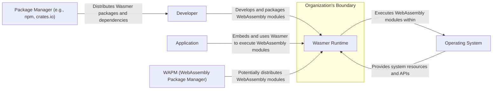
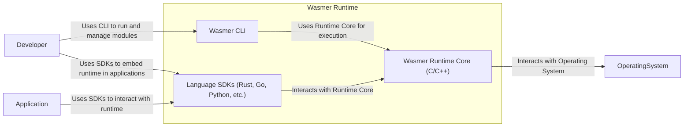
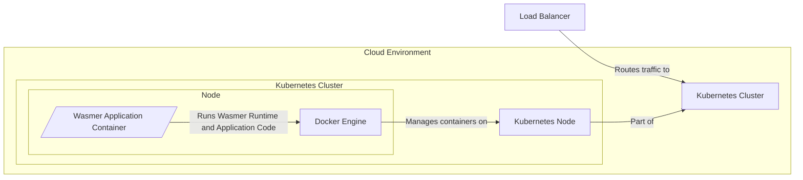

# BUSINESS POSTURE

- Business Priorities and Goals:
  - Goal: To provide a fast, secure, and portable WebAssembly runtime that can be used in various environments, from local development to server-side applications and embedded systems.
  - Priority: Performance and portability are key priorities to attract developers and businesses looking for efficient and cross-platform execution of code. Security is also a high priority to ensure safe execution of potentially untrusted WebAssembly modules. Developer experience and ease of integration are important for adoption.
- Business Risks:
  - Risk: Security vulnerabilities in the runtime could lead to execution of malicious WebAssembly code, compromising the host system or application.
  - Risk: Performance bottlenecks could hinder adoption if Wasmer is not significantly faster or more efficient than alternative solutions.
  - Risk: Lack of portability or compatibility issues across different operating systems and architectures could limit its reach and usefulness.
  - Risk: Complex integration or poor developer experience could deter developers from using Wasmer.
  - Risk: Supply chain attacks targeting dependencies or build process could introduce vulnerabilities into Wasmer releases.

# SECURITY POSTURE

- Existing Security Controls:
  - security control: Memory safety provided by WebAssembly itself. WebAssembly is designed to be memory-safe, preventing common vulnerabilities like buffer overflows. Implemented by WebAssembly specification and runtime enforcement.
  - security control: Permissions-based execution model. WebAssembly modules run in a sandboxed environment with limited access to host system resources. Implemented by Wasmer runtime.
  - security control: Code review process for contributions to the open-source project. Implemented via GitHub pull request reviews.
  - security control: Use of standard build tools and processes. Implemented via project's build scripts and CI/CD pipelines.
  - security control: Static analysis and linters used in development. Implemented via project's development practices and CI/CD pipelines.
- Accepted Risks:
  - accepted risk: Vulnerabilities in dependencies. Wasmer relies on external libraries, and vulnerabilities in these dependencies could affect Wasmer. Mitigation is through dependency updates and vulnerability scanning.
  - accepted risk: Bugs in the Wasmer runtime itself. Despite best efforts, complex software like a runtime can have bugs, including security-related bugs. Mitigation is through thorough testing, code reviews, and security audits.
  - accepted risk: Misconfiguration by users. Users might misconfigure Wasmer or the environment it runs in, leading to security issues. Mitigation is through clear documentation and secure defaults.
- Recommended Security Controls:
  - security control: Implement automated security scanning of dependencies to detect known vulnerabilities.
  - security control: Conduct regular security audits and penetration testing of the Wasmer runtime.
  - security control: Implement fuzz testing to discover potential vulnerabilities in the WebAssembly parsing and execution engine.
  - security control: Provide secure configuration guidelines and best practices for users deploying Wasmer in different environments.
  - security control: Implement a vulnerability disclosure and response process to handle reported security issues effectively.
- Security Requirements:
  - Authentication:
    - requirement: Not directly applicable to Wasmer runtime itself, as it's not an application with user accounts. However, if Wasmer is used in a context where modules are loaded from external sources, the source of modules might need authentication.
  - Authorization:
    - requirement: Wasmer's permission model should enforce strict authorization controls, limiting WebAssembly modules' access to host resources based on defined policies. This is already a core feature of WebAssembly and Wasmer.
    - requirement: If Wasmer is extended with features that require access control (e.g., a module registry or management API), appropriate authorization mechanisms should be implemented.
  - Input Validation:
    - requirement: Wasmer must rigorously validate WebAssembly modules during loading and execution to prevent malformed or malicious modules from causing crashes or security breaches. Implemented by Wasmer's module parsing and validation logic.
    - requirement: Input to WebAssembly modules from the host environment should be validated to prevent injection attacks or unexpected behavior. Application developers using Wasmer are responsible for this.
  - Cryptography:
    - requirement: Wasmer should support WebAssembly modules that utilize cryptography securely. This includes providing access to secure random number generation and potentially cryptographic primitives if needed (though WebAssembly itself aims to be minimal and might delegate crypto to host environments).
    - requirement: If Wasmer itself handles sensitive data (e.g., configuration, keys for future features), it should use appropriate cryptography for storage and transmission.

# DESIGN

## C4 CONTEXT

- Context Diagram Elements:
  - - Name: Wasmer Runtime
    - Type: Software System
    - Description: The Wasmer WebAssembly runtime, responsible for compiling and executing WebAssembly modules.
    - Responsibilities:
      - Compiling WebAssembly bytecode to native code.
      - Executing WebAssembly modules in a sandboxed environment.
      - Providing APIs for embedding Wasmer into applications.
      - Managing module instances and memory.
    - Security controls:
      - WebAssembly memory safety enforcement.
      - Permissions-based execution model.
      - Input validation of WebAssembly modules.
  - - Name: Developer
    - Type: Person
    - Description: Software developers who use Wasmer to run WebAssembly modules, either for local development, application embedding, or server-side execution.
    - Responsibilities:
      - Developing WebAssembly modules.
      - Packaging and distributing WebAssembly modules.
      - Integrating Wasmer into applications.
      - Configuring Wasmer runtime settings.
    - Security controls:
      - Secure development practices for WebAssembly modules.
      - Code signing of WebAssembly modules (optional, future).
  - - Name: Application
    - Type: Software System
    - Description: Applications that embed the Wasmer runtime to execute WebAssembly modules, extending their functionality or providing plugin capabilities.
    - Responsibilities:
      - Loading and initializing the Wasmer runtime.
      - Providing WebAssembly modules to Wasmer for execution.
      - Interacting with WebAssembly modules through Wasmer APIs.
      - Managing the lifecycle of Wasmer instances.
    - Security controls:
      - Input validation of data passed to WebAssembly modules.
      - Resource management for WebAssembly execution.
      - Secure configuration of Wasmer runtime within the application.
  - - Name: Operating System
    - Type: Infrastructure
    - Description: The host operating system (e.g., Linux, macOS, Windows) on which Wasmer is executed, providing system resources and APIs.
    - Responsibilities:
      - Providing CPU, memory, and I/O resources to Wasmer.
      - Enforcing operating system-level security policies.
      - Providing system libraries and APIs used by Wasmer.
    - Security controls:
      - Operating system access controls and permissions.
      - Kernel-level security features (e.g., sandboxing, process isolation).
      - System-level security monitoring and logging.
  - - Name: Package Manager (e.g., npm, crates.io)
    - Type: Software System
    - Description: Package managers used by developers to download and manage Wasmer packages and dependencies during development and build processes.
    - Responsibilities:
      - Distributing Wasmer CLI tools and SDKs.
      - Managing dependencies for Wasmer projects.
      - Providing package integrity verification (checksums, signatures).
    - Security controls:
      - Package integrity verification mechanisms.
      - Vulnerability scanning of packages in repositories.
      - Repository access controls.
  - - Name: WAPM (WebAssembly Package Manager)
    - Type: Software System
    - Description: A dedicated package manager for WebAssembly modules, potentially used to distribute and discover WebAssembly modules for use with Wasmer.
    - Responsibilities:
      - Hosting and distributing WebAssembly packages.
      - Providing a registry for WebAssembly modules.
      - Managing package versions and dependencies for WebAssembly modules.
    - Security controls:
      - Package integrity verification for WebAssembly modules.
      - Access controls for publishing and downloading modules.
      - Vulnerability scanning of hosted modules (future).

## C4 CONTAINER

- Container Diagram Elements:
  - - Name: Wasmer CLI
    - Type: Application
    - Description: Command-line interface for interacting with the Wasmer runtime. Allows developers to run WebAssembly modules, manage packages, and configure the runtime.
    - Responsibilities:
      - Providing a command-line interface for Wasmer.
      - Parsing user commands and options.
      - Invoking the Wasmer Runtime Core to execute modules.
      - Managing WebAssembly packages (potentially via WAPM integration).
    - Security controls:
      - Input validation of command-line arguments.
      - Secure handling of user credentials or configuration files (if any).
      - Least privilege execution.
  - - Name: Wasmer Runtime Core (C/C++)
    - Type: Application
    - Description: The core runtime engine of Wasmer, written in C/C++. Responsible for compiling and executing WebAssembly bytecode.
    - Responsibilities:
      - WebAssembly module parsing and validation.
      - Compilation of WebAssembly to native code (using different compiler backends).
      - Execution of compiled WebAssembly code in a sandboxed environment.
      - Memory management for WebAssembly modules.
      - Implementation of WebAssembly system interfaces (WASI).
    - Security controls:
      - WebAssembly memory safety enforcement.
      - Permissions-based execution model.
      - Input validation of WebAssembly modules.
      - Sandboxing and isolation of WebAssembly execution.
      - Protection against runtime vulnerabilities (buffer overflows, etc.).
  - - Name: Language SDKs (Rust, Go, Python, etc.)
    - Type: Library
    - Description: Software Development Kits (SDKs) in various programming languages that allow developers to embed and interact with the Wasmer runtime from their applications.
    - Responsibilities:
      - Providing language-specific APIs for embedding Wasmer.
      - Bridging between host application code and the Wasmer Runtime Core.
      - Simplifying the integration of Wasmer into different programming environments.
    - Security controls:
      - Secure API design to prevent misuse.
      - Input validation of data passed to and from the Runtime Core.
      - Memory safety in SDK implementations.

## DEPLOYMENT

- Deployment Options:
  - Local Development Environment: Developers use Wasmer CLI and SDKs on their local machines for testing and development.
  - Server-Side Applications: Wasmer is embedded in server applications to execute WebAssembly modules for backend services, plugins, or serverless functions.
  - Embedded Systems: Wasmer is deployed on embedded devices and IoT devices to run WebAssembly modules for edge computing and device logic.
  - Cloud Environments: Wasmer can be deployed in cloud environments (e.g., containers, serverless platforms) to provide WebAssembly runtime capabilities in the cloud.

- Detailed Deployment Scenario: Server-Side Application Deployment (using containers)

- Deployment Diagram Elements:
  - - Name: Wasmer Application Container
    - Type: Container
    - Description: A Docker container image that packages the server-side application along with the Wasmer runtime and necessary dependencies.
    - Responsibilities:
      - Running the server-side application.
      - Hosting the embedded Wasmer runtime.
      - Executing WebAssembly modules within the application context.
    - Security controls:
      - Container image vulnerability scanning.
      - Least privilege container user.
      - Resource limits for container.
  - - Name: Docker Engine
    - Type: Software
    - Description: The container runtime environment (Docker Engine in this case) responsible for running and managing containers.
    - Responsibilities:
      - Pulling container images.
      - Creating and starting containers.
      - Isolating containers from each other and the host system.
      - Managing container resources (CPU, memory, network).
    - Security controls:
      - Container isolation and namespaces.
      - Resource limits enforcement.
      - Docker security configurations.
  - - Name: Kubernetes Node
    - Type: Infrastructure
    - Description: A physical or virtual machine that runs containers within a Kubernetes cluster.
    - Responsibilities:
      - Providing compute resources for containers.
      - Running the Docker Engine.
      - Participating in the Kubernetes cluster.
    - Security controls:
      - Operating system security hardening.
      - Network security policies.
      - Node access controls.
  - - Name: Kubernetes Cluster
    - Type: Infrastructure
    - Description: A cluster of Kubernetes nodes that orchestrates and manages containerized applications.
    - Responsibilities:
      - Container orchestration and scheduling.
      - Service discovery and load balancing.
      - Application scaling and management.
    - Security controls:
      - Kubernetes RBAC (Role-Based Access Control).
      - Network policies for container communication.
      - Secrets management.
      - Kubernetes security audits and monitoring.
  - - Name: Load Balancer
    - Type: Infrastructure
    - Description: A load balancer that distributes incoming traffic across multiple instances of the Wasmer application running in the Kubernetes cluster.
    - Responsibilities:
      - Distributing traffic to backend application instances.
      - Providing high availability and scalability.
      - Potentially handling TLS termination.
    - Security controls:
      - DDoS protection.
      - TLS/SSL encryption.
      - Access control lists.

## BUILD

```mermaid
graph LR
    Developer["Developer"] -- "Code Changes, Pull Requests" --> GitHub["GitHub Repository"]
    GitHub -- "Webhook, Triggers" --> CI["CI/CD System (GitHub Actions)"]
    CI -- "Build, Test, Scan" --> BuildEnvironment["Build Environment"]
    BuildEnvironment -- "Build Artifacts (Binaries, Libraries)" --> ArtifactRepository["Artifact Repository (GitHub Releases, Package Registries)"]
    ArtifactRepository -- "Distribution" --> User["User / Developer / Application"]
    subgraph "Build Environment"
        SourceCodeCheckout["Source Code Checkout"]
        BuildTools["Build Tools (Rust toolchain, C/C++ compilers)"]
        DependencyManagement["Dependency Management (Cargo, etc.)"]
        SecurityScanners["Security Scanners (SAST, Dependency Scanning)"]
        TestSuites["Test Suites (Unit, Integration)"]
    end
    CI --> SourceCodeCheckout
    SourceCodeCheckout --> BuildTools
    BuildTools --> DependencyManagement
    DependencyManagement --> SecurityScanners
    SecurityScanners --> TestSuites
    TestSuites --> BuildArtifacts["Build Artifacts"]
    BuildEnvironment --> ArtifactRepository
```

- Build Process Elements:
  - - Name: Developer
    - Type: Person
    - Description: Software developers who contribute code to the Wasmer project.
    - Responsibilities:
      - Writing and committing code changes.
      - Creating pull requests for code contributions.
      - Reviewing code changes from other developers.
    - Security controls:
      - Secure coding practices.
      - Code review process.
      - Access control to the GitHub repository.
  - - Name: GitHub Repository
    - Type: Software System
    - Description: The GitHub repository hosting the Wasmer source code.
    - Responsibilities:
      - Version control of source code.
      - Collaboration platform for development.
      - Triggering CI/CD pipelines.
    - Security controls:
      - Access control and permissions management.
      - Branch protection rules.
      - Audit logging of repository activities.
  - - Name: CI/CD System (GitHub Actions)
    - Type: Software System
    - Description: Continuous Integration and Continuous Delivery system (e.g., GitHub Actions) that automates the build, test, and release process for Wasmer.
    - Responsibilities:
      - Automating the build process.
      - Running automated tests.
      - Performing security scans.
      - Publishing build artifacts.
    - Security controls:
      - Secure configuration of CI/CD pipelines.
      - Secrets management for CI/CD workflows.
      - Access control to CI/CD system.
      - Audit logging of CI/CD activities.
  - - Name: Build Environment
    - Type: Infrastructure
    - Description: The environment where the Wasmer build process is executed, including tools, dependencies, and configurations.
    - Responsibilities:
      - Providing a consistent and reproducible build environment.
      - Executing build scripts and commands.
      - Running tests and security scans.
    - Security controls:
      - Secure build environment configuration.
      - Isolation of build environment.
      - Access control to build environment.
  - - Name: Source Code Checkout
    - Type: Process
    - Description: Step in the build process where the source code is retrieved from the GitHub repository.
    - Responsibilities:
      - Cloning the repository.
      - Checking out the correct branch or commit.
    - Security controls:
      - Secure connection to GitHub repository (HTTPS, SSH).
      - Verification of code integrity (e.g., Git commit signatures).
  - - Name: Build Tools (Rust toolchain, C/C++ compilers)
    - Type: Software
    - Description: Tools used to compile and build the Wasmer runtime (e.g., Rust toolchain, C/C++ compilers, linkers).
    - Responsibilities:
      - Compiling source code to binaries.
      - Linking libraries and dependencies.
      - Generating build artifacts.
    - Security controls:
      - Using trusted and verified build tools.
      - Keeping build tools up-to-date with security patches.
  - - Name: Dependency Management (Cargo, etc.)
    - Type: Software
    - Description: Tools and processes for managing project dependencies (e.g., Cargo for Rust, package managers for C/C++ dependencies).
    - Responsibilities:
      - Downloading and managing dependencies.
      - Resolving dependency versions.
      - Ensuring dependency integrity.
    - Security controls:
      - Dependency vulnerability scanning.
      - Using secure dependency repositories.
      - Dependency lock files for reproducible builds.
  - - Name: Security Scanners (SAST, Dependency Scanning)
    - Type: Software
    - Description: Static Application Security Testing (SAST) tools and dependency scanners used to identify potential vulnerabilities in the source code and dependencies.
    - Responsibilities:
      - Scanning source code for security flaws.
      - Scanning dependencies for known vulnerabilities.
      - Reporting security findings.
    - Security controls:
      - Regularly updated vulnerability databases.
      - Accurate and reliable scanning tools.
      - Integration of scanning into the CI/CD pipeline.
  - - Name: Test Suites (Unit, Integration)
    - Type: Software
    - Description: Automated test suites (unit tests, integration tests) used to verify the functionality and stability of Wasmer.
    - Responsibilities:
      - Executing automated tests.
      - Reporting test results.
      - Ensuring code quality and reliability.
    - Security controls:
      - Security-focused test cases (e.g., fuzzing, negative testing).
      - Regular execution of test suites in CI/CD.
  - - Name: Build Artifacts (Binaries, Libraries)
    - Type: Data
    - Description: The output of the build process, including compiled binaries, libraries, and other distributable files.
    - Responsibilities:
      - Packaging build artifacts.
      - Signing build artifacts (optional).
      - Storing build artifacts in the artifact repository.
    - Security controls:
      - Integrity verification of build artifacts (checksums, signatures).
      - Secure storage of build artifacts.
  - - Name: Artifact Repository (GitHub Releases, Package Registries)
    - Type: Software System
    - Description: Repositories used to store and distribute Wasmer build artifacts (e.g., GitHub Releases, package registries like crates.io, npm).
    - Responsibilities:
      - Hosting build artifacts.
      - Providing download access to users.
      - Versioning and release management.
    - Security controls:
      - Access control to artifact repository.
      - Integrity verification of downloaded artifacts.
      - Secure distribution channels (HTTPS).
  - - Name: User / Developer / Application
    - Type: Person / Software System
    - Description: End users, developers, or applications that download and use Wasmer build artifacts.
    - Responsibilities:
      - Downloading Wasmer artifacts.
      - Verifying artifact integrity.
      - Using Wasmer in their projects or environments.
    - Security controls:
      - Verifying artifact integrity before use.
      - Following secure usage guidelines for Wasmer.

# RISK ASSESSMENT

- Critical Business Processes:
  - Process: Execution of WebAssembly modules. This is the core functionality of Wasmer. Protecting the integrity and security of this process is critical to prevent malicious code execution and system compromise.
  - Process: Build and release process. Ensuring the integrity of the build and release process is crucial to prevent supply chain attacks and ensure users are downloading legitimate and secure versions of Wasmer.
- Data Sensitivity:
  - Data: WebAssembly Modules. Sensitivity depends on the source and content of the modules. Modules can contain sensitive logic or access sensitive data within their execution environment. Need to protect against unauthorized modification or execution of malicious modules. Sensitivity: Medium to High (context-dependent).
  - Data: Source Code of Wasmer. Contains intellectual property and potential vulnerabilities if exposed or modified maliciously. Sensitivity: High.
  - Data: Build Artifacts (Binaries, Libraries). If compromised, can lead to widespread distribution of malicious software. Sensitivity: High.
  - Data: Configuration and Runtime State. Could contain sensitive information depending on how Wasmer is used and configured. Sensitivity: Low to Medium (context-dependent).

# QUESTIONS & ASSUMPTIONS

- Questions:
  - What is the intended use case for this design document? Is it primarily for threat modeling, or are there other purposes?
  - What is the risk appetite of the organization using Wasmer? Is it a startup with a higher risk tolerance or a large enterprise with strict security requirements?
  - Are there specific compliance requirements (e.g., SOC 2, PCI DSS, HIPAA) that Wasmer or applications using Wasmer need to adhere to?
  - Are there any existing security policies or standards within the organization that should be considered in this design?
  - What is the process for vulnerability disclosure and incident response for Wasmer?
- Assumptions:
  - Assumption: Wasmer is intended to be used in environments where security is a significant concern, even though it's an open-source project.
  - Assumption: The primary users of this design document are security professionals and developers involved in deploying or using Wasmer.
  - Assumption: The organization using Wasmer is concerned about supply chain security and wants to ensure the integrity of the Wasmer build and release process.
  - Assumption: The deployment scenario described (server-side application in containers) is a representative example, but Wasmer can be deployed in various other environments.
  - Assumption: GitHub Actions is used as the CI/CD system for Wasmer, based on common open-source project practices, but other CI/CD systems could also be used.