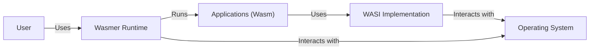
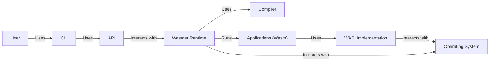
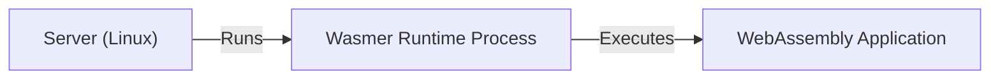
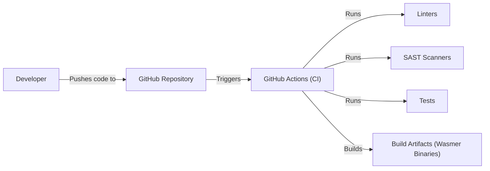

# BUSINESS POSTURE

Wasmer is a fast and secure WebAssembly runtime that enables lightweight containers to run anywhere: from desktop to the cloud, Edge and IoT devices.

Business Priorities:

*   Enable developers to run WebAssembly modules in various environments.
*   Provide a secure and performant runtime for WebAssembly.
*   Support a wide range of programming languages that can be compiled to WebAssembly.
*   Foster a vibrant community and ecosystem around WebAssembly.
*   Offer commercial support and services for enterprise users.

Business Goals:

*   Become the leading WebAssembly runtime.
*   Drive the adoption of WebAssembly as a universal runtime.
*   Generate revenue through commercial offerings.

Business Risks:

*   Security vulnerabilities in the runtime could compromise user applications and data.
*   Performance issues could hinder the adoption of Wasmer.
*   Lack of compatibility with certain WebAssembly modules or features could limit its usefulness.
*   Competition from other WebAssembly runtimes could erode market share.
*   Failure to attract and retain a strong community could slow down development and adoption.

# SECURITY POSTURE

Existing Security Controls:

*   security control: Sandboxed execution of WebAssembly modules. (Implemented in the Wasmer runtime)
*   security control: Memory safety guarantees provided by WebAssembly. (Enforced by the WebAssembly specification and implemented in the runtime)
*   security control: Regular security audits and code reviews. (Mentioned in the repository and assumed to be part of the development process)
*   security control: Use of Rust, a memory-safe language, for the majority of the runtime's codebase. (Visible in the repository's code)
*   security control: Support for WASI (WebAssembly System Interface), which provides a secure and portable way for WebAssembly modules to interact with the operating system. (Implemented in the Wasmer runtime)

Accepted Risks:

*   accepted risk: Potential for unknown vulnerabilities in the runtime or its dependencies.
*   accepted risk: Reliance on the security of the underlying operating system and hardware.
*   accepted risk: The possibility of side-channel attacks, although mitigated by design.

Recommended Security Controls:

*   security control: Implement a comprehensive fuzzing strategy to identify potential vulnerabilities.
*   security control: Integrate with security vulnerability scanners to automatically detect known vulnerabilities in dependencies.
*   security control: Provide a clear and accessible security reporting process.
*   security control: Offer a bug bounty program to incentivize security researchers to find and report vulnerabilities.
*   security control: Develop and maintain a detailed threat model for the runtime.

Security Requirements:

*   Authentication:
    *   Not directly applicable to the runtime itself, but Wasmer should support secure authentication mechanisms for applications running within it. This might involve integrating with existing identity providers or supporting standard authentication protocols.
*   Authorization:
    *   Wasmer should provide mechanisms for controlling access to resources and capabilities within the runtime. This could involve implementing role-based access control (RBAC) or other authorization models. WASI provides a capability-based security model.
*   Input Validation:
    *   Wasmer should validate all inputs from WebAssembly modules to prevent malicious code from exploiting vulnerabilities in the runtime. This is crucial for maintaining the integrity and security of the host system.
*   Cryptography:
    *   Wasmer should provide access to cryptographic primitives for WebAssembly modules, allowing them to perform secure operations such as encryption, decryption, and digital signatures. This could be achieved through WASI or custom extensions.

# DESIGN

## C4 CONTEXT

Context Diagram Element List:

*   User:
    *   Name: User
    *   Type: Person
    *   Description: A developer or user interacting with the Wasmer runtime.
    *   Responsibilities: Deploying and running WebAssembly applications, managing the runtime.
    *   Security controls: Authentication and authorization mechanisms provided by the application or operating system.
*   Wasmer Runtime:
    *   Name: Wasmer Runtime
    *   Type: Software System
    *   Description: The core component that executes WebAssembly modules.
    *   Responsibilities: Loading, compiling, and executing WebAssembly code, managing memory, providing access to WASI.
    *   Security controls: Sandboxed execution, memory safety, input validation, WASI capability-based security.
*   Operating System:
    *   Name: Operating System
    *   Type: Software System
    *   Description: The underlying operating system on which Wasmer runs (e.g., Linux, macOS, Windows).
    *   Responsibilities: Providing resources and services to Wasmer, managing hardware.
    *   Security controls: OS-level security features, such as process isolation, user permissions, and security updates.
*   Applications (Wasm):
    *   Name: Applications (Wasm)
    *   Type: Software System
    *   Description: WebAssembly applications running within the Wasmer runtime.
    *   Responsibilities: Performing specific tasks defined by the application logic.
    *   Security controls: Application-specific security measures, adherence to WebAssembly security model.
*   WASI Implementation:
    *   Name: WASI Implementation
    *   Type: Software System
    *   Description: The implementation of the WebAssembly System Interface.
    *   Responsibilities: Providing a secure and portable way for WebAssembly modules to interact with the operating system.
    *   Security controls: Capability-based security model, strict control over system resources.

## C4 CONTAINER

Container Diagram Element List:

*   User:
    *   Name: User
    *   Type: Person
    *   Description: A developer or user interacting with the Wasmer runtime.
    *   Responsibilities: Deploying and running WebAssembly applications, managing the runtime.
    *   Security controls: Authentication and authorization mechanisms provided by the application or operating system.
*   CLI:
    *   Name: CLI
    *   Type: Container: Command Line Interface
    *   Description: Command-line interface for interacting with Wasmer.
    *   Responsibilities: Providing user-friendly commands for managing the runtime and applications.
    *   Security controls: Input validation, secure communication with the API.
*   API:
    *   Name: API
    *   Type: Container: Application Programming Interface
    *   Description: Programmatic interface for interacting with Wasmer.
    *   Responsibilities: Exposing functionality for managing the runtime and applications.
    *   Security controls: Authentication, authorization, input validation, secure communication.
*   Wasmer Runtime:
    *   Name: Wasmer Runtime
    *   Type: Container: WebAssembly Runtime
    *   Description: The core component that executes WebAssembly modules.
    *   Responsibilities: Loading, compiling, and executing WebAssembly code, managing memory, providing access to WASI.
    *   Security controls: Sandboxed execution, memory safety, input validation, WASI capability-based security.
*   Compiler:
    *   Name: Compiler
    *   Type: Container: Compiler
    *   Description: Component responsible for compiling WebAssembly modules into native code.
    *   Responsibilities: Translating WebAssembly bytecode into executable machine code.
    *   Security controls: Secure compilation process, protection against compiler vulnerabilities.
*   Applications (Wasm):
    *   Name: Applications (Wasm)
    *   Type: Container: WebAssembly Application
    *   Description: WebAssembly applications running within the Wasmer runtime.
    *   Responsibilities: Performing specific tasks defined by the application logic.
    *   Security controls: Application-specific security measures, adherence to WebAssembly security model.
*   WASI Implementation:
    *   Name: WASI Implementation
    *   Type: Container: WASI Implementation
    *   Description: The implementation of the WebAssembly System Interface.
    *   Responsibilities: Providing a secure and portable way for WebAssembly modules to interact with the operating system.
    *   Security controls: Capability-based security model, strict control over system resources.
*   Operating System:
    *   Name: Operating System
    *   Type: Software System
    *   Description: The underlying operating system on which Wasmer runs (e.g., Linux, macOS, Windows).
    *   Responsibilities: Providing resources and services to Wasmer, managing hardware.
    *   Security controls: OS-level security features, such as process isolation, user permissions, and security updates.

## DEPLOYMENT

Wasmer can be deployed in several ways:

1.  Standalone executable: Downloaded and run directly on the host operating system.
2.  Embedded library: Integrated into other applications.
3.  Via package managers: Installed using system package managers (e.g., apt, brew).
4.  Containers: Wasmer itself can be run inside containers, for example, Docker.

Chosen deployment solution: Standalone executable.

Deployment Diagram Element List:

*   Server:
    *   Name: Server
    *   Type: Infrastructure Node: Server
    *   Description: A physical or virtual server running a Linux operating system.
    *   Responsibilities: Hosting the Wasmer runtime.
    *   Security controls: OS-level security measures, firewall, intrusion detection/prevention systems.
*   Wasmer Runtime Process:
    *   Name: Wasmer Runtime Process
    *   Type: Software Node: Process
    *   Description: An instance of the Wasmer runtime running as a process on the server.
    *   Responsibilities: Executing WebAssembly applications.
    *   Security controls: Sandboxed execution, memory safety, WASI capability-based security.
*   WebAssembly Application:
    *   Name: WebAssembly Application
    *   Type: Software Node: Application
    *   Description: A WebAssembly application running within the Wasmer runtime process.
    *   Responsibilities: Performing specific tasks defined by the application logic.
    *   Security controls: Application-specific security measures, adherence to WebAssembly security model.

## BUILD

Wasmer's build process leverages Rust's Cargo build system and GitHub Actions for continuous integration.

Build Process Description:

1.  Developers write code and push it to the GitHub repository.
2.  GitHub Actions workflows are triggered on push and pull requests.
3.  The workflows perform the following steps:
    *   Linting: Code style and formatting checks using tools like `rustfmt` and `clippy`.
    *   Static Analysis (SAST): Security scanners are run to identify potential vulnerabilities in the code.
    *   Testing: Unit tests, integration tests, and potentially fuzzing are executed.
    *   Building: The Wasmer runtime is compiled for various target platforms using Cargo.
4.  Build artifacts (Wasmer binaries) are produced and potentially published.

Security Controls in Build Process:

*   security control: Use of a memory-safe language (Rust) minimizes memory safety vulnerabilities.
*   security control: Automated build process ensures consistency and repeatability.
*   security control: Linting tools enforce code style and identify potential errors.
*   security control: SAST scanners detect known vulnerabilities in the code.
*   security control: Comprehensive testing helps ensure the correctness and security of the runtime.
*   security control: GitHub Actions provide a secure and auditable build environment.

# RISK ASSESSMENT

Critical Business Processes:

*   Execution of WebAssembly applications: The core function of Wasmer is to run WebAssembly code securely and efficiently.
*   Providing a stable and reliable runtime: Users depend on Wasmer to be a stable platform for their applications.
*   Maintaining compatibility with WebAssembly standards: Wasmer needs to stay up-to-date with the evolving WebAssembly specifications.

Data to Protect:

*   User application code (Wasm modules): Sensitivity: Varies depending on the application, potentially high.
*   User application data: Sensitivity: Varies depending on the application, potentially high.
*   Wasmer runtime configuration: Sensitivity: Medium.
*   Internal Wasmer data structures: Sensitivity: Low to Medium.

# QUESTIONS & ASSUMPTIONS

Questions:

*   What specific SAST tools are used in the build process?
*   What is the fuzzing strategy, if any?
*   Are there any specific performance benchmarks or targets?
*   What is the process for handling security vulnerabilities reported by external researchers?
*   What are the plans for supporting future WebAssembly features?
*   Are there any specific compliance requirements (e.g., GDPR, HIPAA) that need to be considered?

Assumptions:

*   BUSINESS POSTURE: The primary business goal is to promote the adoption of WebAssembly and establish Wasmer as a leading runtime.
*   SECURITY POSTURE: Security is a high priority for the Wasmer project. Regular security audits and code reviews are conducted. The development team is responsive to security reports.
*   DESIGN: The provided design diagrams are a simplified representation of the actual architecture. The runtime has internal components and complexities not shown here. The build process is fully automated using GitHub Actions.