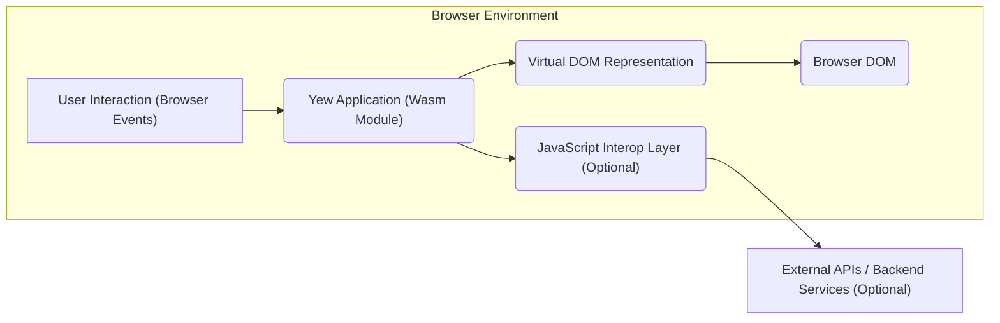
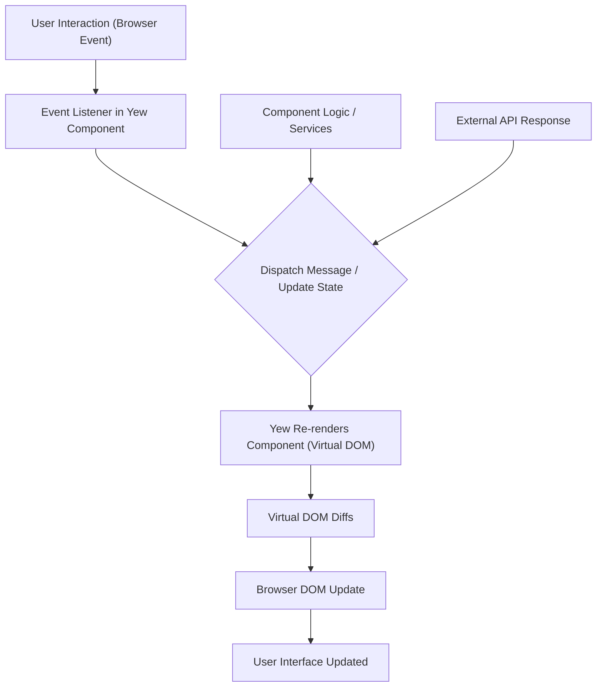

## Project Design Document: Yew - A Rust Framework for Client-Side Web Applications

**Version:** 1.1
**Date:** October 26, 2023
**Author:** AI Software Architect

### 1. Introduction

This document provides an enhanced design overview of the Yew project, a modern Rust framework for building performant and safe multi-threaded front-end web applications using WebAssembly. This document aims to clearly articulate the architecture, key components, and data flow within a typical Yew application, with a specific focus on providing the necessary information for effective threat modeling.

### 2. Project Overview

Yew is a framework that empowers developers to construct client-side web applications using the Rust programming language. By leveraging WebAssembly (Wasm), Yew enables the execution of Rust code directly within the browser, offering significant performance and safety advantages compared to traditional JavaScript-based frameworks. Yew's component-based architecture, inspired by frameworks like React, and its efficient virtual DOM implementation simplify the development of complex and interactive user interfaces.

**Key Goals of Yew:**

*   To facilitate the creation of high-performance web applications using the Rust language.
*   To offer a component-centric architecture that promotes code reusability and maintainability.
*   To provide a familiar and intuitive development experience for developers acquainted with component-based UI frameworks.
*   To harness the inherent safety and performance benefits of Rust and WebAssembly in the browser environment.
*   To enable seamless interoperability with existing JavaScript code and libraries when necessary.

### 3. Architectural Design

A standard Yew application adheres to a client-side architecture, where the entirety of the application logic is executed within the user's web browser.

**3.1. High-Level Architecture Diagram:**

**3.2. Component Breakdown:**

*   **Browser Environment:** The user's web browser, serving as the runtime environment for the Yew application.
    *   Responsible for interpreting and rendering the user interface based on the Browser DOM.
    *   Provides the WebAssembly execution environment necessary to run the compiled Rust code.
*   **Yew Application (Wasm Module):** The core of the application, resulting from the compilation of Rust source code into a WebAssembly module.
    *   Encapsulates the application's business logic, state management mechanisms, and definitions of UI components.
    *   Reacts to user-initiated events and manages updates to the application's internal state.
*   **Virtual DOM Representation:** An in-memory representation of the actual Browser DOM structure.
    *   Yew utilizes the virtual DOM to optimize updates to the Browser DOM by calculating the minimal set of changes required.
    *   This approach significantly enhances performance by minimizing direct manipulations of the potentially expensive Browser DOM.
*   **Browser DOM:** The Document Object Model of the web page, as interpreted and rendered by the browser.
    *   Represents the live structure of the web page that users directly interact with.
*   **JavaScript Interop Layer (Optional):**  Provides mechanisms for Yew components to interact with existing JavaScript code and libraries within the browser.
    *   Enables the integration of existing JavaScript functionality or the utilization of third-party JavaScript libraries.
*   **External APIs / Backend Services (Optional):**  External services or APIs that the Yew application might communicate with to retrieve or transmit data.
    *   Communication typically occurs over standard web protocols like HTTP or HTTPS.

**3.3. Key Components within the Yew Application (Wasm Module):**

*   **Components:** Reusable and self-contained building blocks for constructing the user interface.
    *   Each component encapsulates its own state, rendering logic, and behavior.
    *   Components communicate and interact with each other through well-defined interfaces using properties (props) and events (callbacks).
*   **Services:**  Reusable units of application logic that are independent of specific UI components.
    *   Handle cross-cutting concerns such as making HTTP requests, managing browser local storage, or providing access to global application state.
*   **Contexts:** A mechanism for sharing state and functionality across the component tree without the need to explicitly pass props through intermediate components.
*   **Routes:** Define the different logical views or pages within the application and manage navigation transitions between them.
*   **Properties (Props):** Data passed unidirectionally from parent components to their child components, influencing the child component's rendering and behavior.
*   **Messages:**  Enumerated types representing events or actions that components can dispatch to trigger state updates within themselves or initiate actions elsewhere in the application.
*   **Hooks:** Functions that allow functional components to access Yew's state management and lifecycle features, providing a more concise way to manage component logic.

### 4. Data Flow

The typical data flow within a Yew application involves user interactions triggering events, leading to component state updates, and ultimately resulting in UI re-rendering.

**4.1. Data Flow Diagram:**

**4.2. Detailed Data Flow Description:**

1. **User Interaction (Browser Event):** A user interacts with the application through the browser (e.g., clicking a button, submitting a form, typing in an input field). This generates a corresponding browser event.
2. **Event Listener in Yew Component:** The browser event is captured by an event listener attached to a specific Yew component.
3. **Dispatch Message / Update State:** The event listener triggers a function within the component, which typically dispatches a message or directly updates the component's internal state.
4. **Yew Re-renders Component (Virtual DOM):** Upon a state change, Yew triggers a re-rendering process for the affected component. This involves creating a new virtual DOM representation of the component.
5. **Virtual DOM Diffs:** Yew's virtual DOM implementation compares the newly rendered virtual DOM with the previous version to identify the minimal set of changes required to update the actual Browser DOM.
6. **Browser DOM Update:** Yew efficiently applies the calculated differences to the Browser DOM, updating only the necessary elements.
7. **User Interface Updated:** The browser re-renders the user interface to reflect the changes made to the Browser DOM, providing visual feedback to the user.
8. **Component Logic / Services:** Component logic or external services can also initiate state updates based on internal computations, timers, or other asynchronous operations.
9. **External API Response:** When the application interacts with external APIs, the responses received can trigger state updates in components, leading to UI updates.

### 5. Security Considerations

While Yew benefits from the memory safety of Rust and the sandboxed execution environment of WebAssembly, several security considerations remain crucial for developers:

*   **Cross-Site Scripting (XSS):**  Improper handling of user-provided content or data retrieved from external sources can lead to XSS vulnerabilities. Ensure all dynamic content is properly sanitized and escaped before being rendered to prevent the execution of malicious scripts.
*   **Dependency Vulnerabilities:** Yew applications rely on external Rust crates. Vulnerabilities in these dependencies can introduce security risks. Employ dependency scanning tools and regularly update dependencies to their latest secure versions.
*   **Client-Side Data Handling:** Exercise caution when handling sensitive data on the client-side. Avoid storing sensitive information in browser storage mechanisms (like local storage or cookies) without robust encryption. Consider the implications of storing any PII client-side.
*   **Build Process Security:** A compromised build process can introduce malicious code into the application. Secure your development environment and build pipeline to prevent unauthorized modifications. Utilize checksums and signing for build artifacts.
*   **JavaScript Interoperability Security:** When interacting with JavaScript code, be aware of potential security vulnerabilities in the JavaScript code being called. Carefully validate and sanitize any data passed between the Rust/Wasm and JavaScript layers to prevent injection attacks.
*   **Denial of Service (DoS) on the Client:** While Wasm provides some isolation, poorly optimized component rendering logic or excessive resource consumption can lead to client-side DoS, making the application unresponsive.
*   **Code Injection via `dangerously_set_inner_html`:**  The `dangerously_set_inner_html` API should be used with extreme caution, as it bypasses Yew's built-in sanitization and can introduce code injection vulnerabilities if used with untrusted data.
*   **State Management Vulnerabilities:** Improperly managed application state can lead to security issues. Ensure state updates are handled securely and prevent unintended data exposure or manipulation.
*   **Server-Side Rendering (SSR) Considerations (if applicable):** If implementing SSR, ensure the server-side environment is also secure and protected against vulnerabilities.

### 6. Deployment Model

Yew applications are typically deployed as static files (HTML, CSS, JavaScript/Wasm) that can be served by any standard web server or Content Delivery Network (CDN). This simplifies deployment and scaling.

**Deployment Steps:**

*   **Build:** The Rust source code is compiled into a WebAssembly module and associated JavaScript glue code using tools like `wasm-pack` or `trunk`.
*   **Optimization:**  Optimize the generated Wasm module and other assets for size and performance.
*   **Packaging:** The generated Wasm file, JavaScript files, HTML, CSS, and other static assets are packaged into a deployable directory.
*   **Deployment:** The packaged files are uploaded to a web server or CDN for distribution.

### 7. Dependencies

Key dependencies commonly used in Yew projects include:

*   **Rust:** The core programming language for Yew development.
*   **wasm-bindgen:** Facilitates seamless communication and data exchange between Rust/Wasm and JavaScript.
*   **web-sys:** Provides Rust bindings to Web APIs, allowing interaction with browser functionalities.
*   **Cargo:** Rust's package manager and build tool, used for managing dependencies and building the project.
*   **Trunk:** A popular asset bundler, development server, and build tool specifically designed for Rust WebAssembly projects.
*   **yew-router (optional):**  A routing library for managing navigation within Yew applications.
*   **reqwest (optional):** An asynchronous HTTP client library for making requests to external APIs.

### 8. Threat Modeling Focus Areas

Based on the architectural design and data flow, the following areas should be prioritized during threat modeling activities:

*   **Component Communication and Data Handling:**  Scrutinize how components exchange data through props and messages, focusing on potential vulnerabilities related to data injection, manipulation, or exposure.
*   **JavaScript Interoperability Boundaries:**  Thoroughly examine the interfaces where Yew interacts with JavaScript code, paying close attention to data validation, sanitization, and potential injection points.
*   **Interactions with External APIs:**  Assess the security of communication with external APIs, including authentication mechanisms, authorization controls, data validation on both request and response, and protection against man-in-the-middle attacks.
*   **Client-Side Data Storage Mechanisms:**  Evaluate the security of any data stored on the client-side, considering encryption requirements and the potential impact of data breaches.
*   **Security of the Build Pipeline and Development Environment:** Analyze the security of the tools and processes used to build and deploy the application to prevent the introduction of malicious code.
*   **Event Handling and Input Validation:**  Investigate potential vulnerabilities related to how user inputs and browser events are handled, ensuring proper validation and sanitization to prevent injection attacks.
*   **State Management Security:**  Analyze how application state is managed and updated, looking for potential vulnerabilities that could lead to unauthorized data modification or exposure.
*   **Server-Side Rendering (SSR) Security (if implemented):** If SSR is used, conduct a separate threat model for the server-side rendering environment.

### 9. Conclusion

This enhanced design document provides a detailed overview of the Yew project's architecture, components, and data flow, with a strong emphasis on aspects relevant to security analysis. The identified security considerations and threat modeling focus areas serve as a guide for conducting thorough security assessments and building robust and secure Yew applications. Continuous attention to these areas throughout the development lifecycle is crucial for mitigating potential risks.