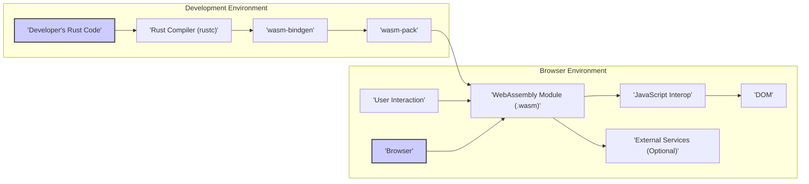
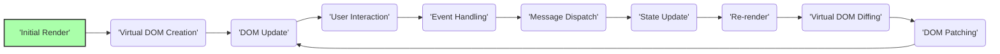

# Project Design Document: Yew - A Rust Framework for Web Applications

**Version:** 1.1
**Date:** October 26, 2023
**Author:** AI Software Architect

## 1. Introduction

This document provides an enhanced design overview of the Yew project, a modern Rust framework for crafting client-side web applications leveraging WebAssembly. It aims to offer a more detailed understanding of the project's architecture, the roles of its core components, and the intricacies of data flow. This refined document is specifically intended to serve as a robust foundation for subsequent threat modeling activities.

## 2. Goals

* Deliver a precise and in-depth architectural explanation of the Yew framework.
* Clearly define the roles and interactions of the key components within the framework.
* Provide a detailed explanation of the data flow within a typical Yew application, including specific examples.
* Emphasize potential areas of security vulnerability based on the design, with more specific examples.
* Serve as a comprehensive and actionable reference document for threat modeling exercises.

## 3. Scope

This document delves into the core architectural aspects of the Yew framework, as represented in the project repository at [https://github.com/yewstack/yew](https://github.com/yewstack/yew). The focus remains on client-side execution and interaction within the browser environment. While acknowledging their existence, server-side considerations, backend APIs, and specific application logic built *using* Yew are excluded unless directly pertinent to the framework's inherent operation.

## 4. Architectural Overview

Yew is a component-centric framework empowering developers to construct interactive web user interfaces using the Rust programming language. It harnesses the power of WebAssembly to execute compiled Rust code directly within the web browser. Yew's architectural principles draw inspiration from established JavaScript frameworks like React and Elm, emphasizing a declarative and reactive approach.

The high-level architecture can be visualized as follows:

## 5. Key Components

The Yew framework is built upon several essential components that collaborate to facilitate web application development:

* **Components:** These are the fundamental, reusable building blocks of a Yew application's user interface. Each component encapsulates its own UI logic, rendering behavior, and internal state. They are designed for modularity and reusability.
    * **Functional Components:** Simpler components defined as functions that receive properties as input and return rendered HTML.
    * **Struct Components:** More complex components defined as structs, allowing for internal state management and lifecycle methods.
* **Virtual DOM:** Yew employs a virtual DOM, an in-memory representation of the actual browser DOM. This abstraction enables efficient updates by calculating the differences between the previous and current virtual DOM states and applying only the necessary changes to the real DOM, minimizing expensive DOM manipulations.
* **Properties (Props):**  Props are the mechanism for passing data downwards from parent components to their child components. They are immutable from the perspective of the child component, ensuring a unidirectional data flow.
* **State:**  State represents the internal data managed by a component that directly influences its rendering output and behavior. Changes to a component's state trigger a re-rendering process.
* **Messages:** Messages are events or actions that components can dispatch to signal the need for a state update. This pattern, often associated with the Elm Architecture, promotes a clear and predictable way to manage asynchronous operations and user interactions.
* **Services:** Services provide abstractions for interacting with browser APIs or external resources. Yew offers built-in services like `FetchService` for making HTTP requests, and developers can create custom services to encapsulate specific functionalities.
* **Context API:** This feature allows for sharing data between components without explicitly passing props through each level of the component tree. It's useful for providing application-wide data or services.
* **Hooks:** Hooks are functions that enable functional components to "hook into" Yew's state and lifecycle features, providing a way to manage state and side effects within functional components.
* **Router:** The Router component manages navigation within a single-page application. It maps URLs to specific components, allowing different parts of the application to be displayed based on the current route.
* **WebAssembly (Wasm):**  WebAssembly is the compilation target for Rust code in Yew. The Rust code is compiled into a Wasm module that can be efficiently executed by the browser's Wasm engine, offering near-native performance.
* **`wasm-bindgen`:** This crucial tool facilitates seamless communication between Rust/WebAssembly code and JavaScript. It automatically generates the necessary glue code for interoperability, allowing Rust code to interact with browser APIs and JavaScript libraries.
* **`wasm-pack`:** `wasm-pack` is a command-line tool designed to simplify the process of building, testing, and publishing Rust-generated WebAssembly modules specifically for the web. It handles tasks like compiling to Wasm, generating JavaScript bindings, and creating packages for distribution.

## 6. Data Flow

The data flow within a Yew application adheres to a unidirectional pattern, commonly referred to as "data down, actions up." This pattern promotes predictability and makes it easier to reason about the application's behavior:

1. **Initial Render:** When a Yew application starts, the root component is initially rendered based on its initial state and any properties passed to it. This process creates the initial virtual DOM representation of the UI.
2. **Virtual DOM Creation:** Yew constructs a virtual DOM representing the desired state of the user interface based on the component's render function.
3. **DOM Update:** Yew compares the newly created virtual DOM with the actual browser DOM (or a previous virtual DOM). It then calculates the minimal set of changes required to bring the actual DOM into sync with the virtual DOM, applying these changes efficiently.
4. **User Interaction:** User actions within the browser (e.g., clicking a button, typing in an input field, submitting a form) trigger corresponding DOM events.
5. **Event Handling:** Yew components define event handlers that are associated with specific DOM events. When an event occurs on an element managed by a Yew component, the associated handler function is invoked.
6. **Message Dispatch:**  Event handlers typically dispatch messages. These messages are data structures that describe an action or a request for a state change. For example, a button click might dispatch a message indicating that a counter should be incremented.
7. **State Update:** Messages are received and processed by the component's `update` function (for struct components) or within the component's logic (for functional components using hooks). This function modifies the component's internal state based on the received message.
8. **Re-render:** When a component's state is updated, Yew triggers a re-rendering process for that component and its affected children. This involves creating a new virtual DOM based on the updated state.
9. **Virtual DOM Diffing:** Yew compares the newly rendered virtual DOM with the previous virtual DOM to identify the differences.
10. **DOM Patching:** Only the necessary changes (patches) are applied to the actual browser DOM to reflect the updated virtual DOM. This efficient patching mechanism minimizes direct DOM manipulation, improving performance.
11. **Property Updates:** Parent components can pass new properties down to their child components. If a child component's props change, it will trigger a re-render of that child component.
12. **Service Interactions:** Components can utilize services to interact with external resources, such as making API calls to a backend server. The results of these interactions can then be dispatched as messages to update the component's state, triggering a re-render.

This flow can be visualized using a Mermaid diagram:

## 7. Security Considerations (Potential Areas for Threat Modeling)

Given the architectural overview and data flow, several areas require careful scrutiny during threat modeling exercises:

* **Client-Side Vulnerabilities:** As a framework for building client-side applications, Yew applications are inherently exposed to common client-side security risks:
    * **Cross-Site Scripting (XSS):**  Failure to properly sanitize user-provided data before rendering it into the DOM can create opportunities for XSS attacks. Malicious scripts injected into the DOM can steal user credentials, redirect users, or perform other harmful actions.
        * **Example:** Displaying unsanitized user comments or rendering content from external sources without proper encoding.
    * **Cross-Site Request Forgery (CSRF):** If the application interacts with external APIs without proper CSRF protection, malicious websites can trick authenticated users into making unintended requests on the application.
        * **Example:** A user logged into their banking application visits a malicious forum, and a hidden form on the forum triggers a funds transfer on the banking site.
    * **Client-Side Data Injection:**  Improperly constructed queries or interactions with client-side data stores (if used) based on user input can lead to injection vulnerabilities.
        * **Example:**  Constructing a client-side database query by directly embedding user input without sanitization.
    * **Open Redirects:** If the application uses user-controlled input to determine redirection URLs without proper validation, attackers can redirect users to malicious sites.
* **WebAssembly Security:** While WebAssembly provides a sandboxed execution environment, security considerations still apply:
    * **Logic Bugs in Rust Code:**  Vulnerabilities can arise from logical flaws in the Rust application code itself, even within the Wasm sandbox.
        * **Example:**  Incorrect access control logic or flawed data validation routines.
    * **Unsafe Code Blocks (`unsafe`):** While Rust's memory safety features mitigate many memory-related vulnerabilities, the use of `unsafe` blocks requires careful auditing as they bypass Rust's safety guarantees.
    * **Denial of Service (DoS):**  Resource exhaustion within the Wasm environment could potentially lead to DoS.
* **Dependency Management:** Yew applications rely on external Rust crates. Security vulnerabilities in these dependencies can be a significant risk.
    * **Supply Chain Attacks:** Malicious actors could compromise dependencies to inject malicious code into the application.
    * **Known Vulnerabilities:**  Outdated dependencies may contain known security vulnerabilities that can be exploited. Regular dependency audits and updates are crucial.
* **State Management Security:** Improper handling of sensitive data within the component's state can lead to information disclosure.
    * **Storing Sensitive Data in Client-Side State:** Avoid storing highly sensitive information directly in the client-side state if possible.
    * **Exposure through Debugging Tools:**  Data in the component's state might be visible through browser developer tools.
* **Communication with External Services:** Security considerations are paramount when the application interacts with backend APIs or other external services:
    * **Insecure API Endpoints:**  Vulnerabilities in the backend APIs can be exploited through the Yew application.
    * **Insecure Data Transmission (HTTP):**  Transmitting sensitive data over unencrypted HTTP connections exposes it to eavesdropping and manipulation. Always use HTTPS.
    * **Insufficient Authentication and Authorization:**  Ensure robust authentication and authorization mechanisms are in place to protect access to sensitive resources and API endpoints.
    * **Exposure of API Keys or Secrets:** Avoid embedding API keys or other secrets directly in the client-side code.
* **Build Process Security:** The security of the build pipeline is crucial to prevent the introduction of malicious code.
    * **Compromised Build Environment:**  A compromised build environment could inject malicious code into the final Wasm module.
    * **Dependency Vulnerabilities in Build Tools:**  Ensure the build tools themselves (e.g., `rustc`, `wasm-pack`) are up-to-date and free from known vulnerabilities.
* **JavaScript Interoperability Security:** While `wasm-bindgen` aims for safe interaction, potential vulnerabilities can arise:
    * **Vulnerabilities in Hand-Written JavaScript Interop Code:** If custom JavaScript code is used for interoperability, it needs to be carefully reviewed for security flaws.
    * **Data Type Mismatches:**  Improper handling of data types when crossing the Wasm/JavaScript boundary could lead to unexpected behavior or vulnerabilities.

## 8. Future Considerations

This design document reflects the current architecture of the Yew framework. As the framework evolves, new features and functionalities may be introduced, potentially bringing new security considerations. Regular reviews and updates to this document are essential to maintain its relevance. Specific areas to monitor for future impact include:

* **Server-Side Rendering (SSR):** If SSR capabilities are added to Yew, new security considerations related to server-side execution and potential vulnerabilities would need to be addressed.
* **Advanced State Management Solutions:**  The adoption of more complex state management patterns or libraries might introduce new security implications related to data handling and access control.
* **New Browser APIs and Web Standards:**  As Yew integrates with new browser APIs and web standards, the security implications of these integrations will need to be evaluated.

## 9. Conclusion

This enhanced design document provides a more detailed and nuanced understanding of the Yew framework's architecture, component interactions, and data flow. By explicitly outlining potential security considerations with concrete examples, this document serves as a valuable resource for conducting thorough and effective threat modeling. A deep understanding of these architectural aspects is crucial for developers and security professionals to proactively identify and mitigate potential vulnerabilities, ultimately leading to the development of more secure and resilient web applications using the Yew framework.
