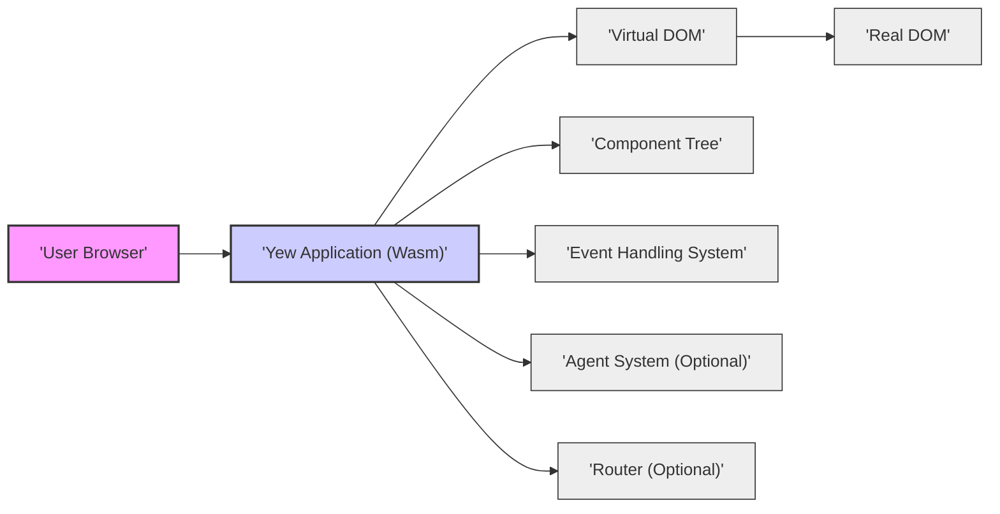
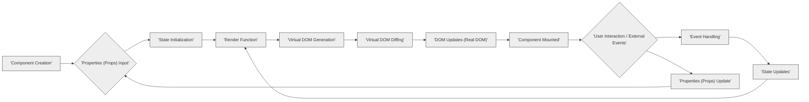

# Project Design Document: Yew Framework - Improved Version

## 1. Introduction

### 1.1. Project Overview

Yew is a cutting-edge Rust framework designed for building performant and robust front-end web applications using WebAssembly. Drawing inspiration from established JavaScript frameworks like React and Elm, Yew offers a component-centric architecture, a virtual DOM for optimized UI rendering, and a powerful macro system for declarative UI definition. By leveraging the inherent safety and speed of Rust and WebAssembly, Yew empowers developers to create highly efficient and secure web applications.

### 1.2. Purpose of this Document

This document provides a comprehensive and detailed design specification for the Yew framework. It meticulously outlines the framework's architecture, core components, data flow mechanisms, underlying technology stack, and crucial initial security considerations. The primary purpose of this document is to serve as a robust foundation for subsequent threat modelling activities. By providing a deep understanding of Yew's internal workings and potential attack surfaces, this document aims to facilitate a thorough and effective security analysis of applications built with Yew. This document is intended for security professionals, developers, and anyone involved in assessing or improving the security posture of Yew-based projects.

## 2. System Architecture

### 2.1. High-Level Architecture

Yew applications are inherently client-side applications, executing within the user's web browser. They are compiled from Rust source code into WebAssembly bytecode. The fundamental architecture is structured around a component-based model and a virtual DOM, ensuring efficient and performant UI updates.

**Components of the High-Level Architecture:**

*   **User Browser:** The end-user's web browser, acting as the runtime environment for the Yew application. It provides the necessary APIs and execution context for WebAssembly.
*   **Yew Application (Wasm):** The compiled Yew application, represented as WebAssembly code, running directly within the browser. This is the core of the application, encompassing all application logic, UI rendering, and interactions.
*   **Virtual DOM:** An in-memory representation of the user interface. Yew utilizes the virtual DOM to optimize DOM updates by calculating the minimal set of changes required to synchronize the virtual DOM with the real DOM. This significantly enhances performance.
*   **Real DOM:** The actual Document Object Model of the web page, manipulated by the browser to visually display the UI to the user. Yew interacts with the Real DOM through the browser's Web APIs.
*   **Component Tree:** The hierarchical structure of components that constitute the Yew application's UI. Components are nested and interact with each other to build complex user interfaces.
*   **Event Handling System:** The mechanism within Yew for capturing and processing user interactions (e.g., mouse clicks, keyboard input, touch events) and browser events. This system allows components to react to user actions and update the UI accordingly.
*   **Agent System (Optional):** An optional but powerful system for managing background tasks, inter-component communication beyond direct parent-child relationships, and interactions with external services. Agents enable more complex application architectures and functionalities.
*   **Router (Optional):** An optional component that facilitates navigation within single-page applications (SPAs). It maps URLs to specific components or views, managing browser history and enabling a seamless user experience within the SPA.

### 2.2. Component Details

Yew's architecture is fundamentally built upon several key components, each with specific functionalities and security considerations:

*   **2.2.1. Virtual DOM:**
    *   Purpose: To achieve efficient and performant updates to the browser's Document Object Model (DOM). By working with an in-memory representation, Yew minimizes direct and costly manipulations of the real DOM.
    *   Functionality:
        *   Maintains a lightweight, in-memory representation of the UI structure.
        *   Implements a diffing algorithm to compare the current virtual DOM with the previous state, identifying only the necessary changes.
        *   Applies these minimal changes to the real DOM through batch updates, significantly improving rendering performance.
    *   Key aspects for threat modelling:
        *   **Potential Vulnerabilities in Diffing Algorithm:** While less probable in a mature framework like Yew, theoretical vulnerabilities in the diffing algorithm could lead to unexpected UI states or denial-of-service if crafted inputs cause excessive computation.
        *   **Memory Management:**  Inefficient memory management of the virtual DOM could lead to client-side denial-of-service if an application creates excessively large or complex UIs, exhausting browser memory.
        *   **DOM Clobbering (though mitigated by Virtual DOM):** While the virtual DOM helps prevent direct DOM clobbering vulnerabilities, incorrect component rendering logic could still inadvertently manipulate DOM elements in unexpected ways, potentially leading to security issues if user-controlled data influences rendering paths.

*   **2.2.2. Component Model:**
    *   Purpose: To structure the application into modular, reusable, and maintainable units of UI and logic. Components promote code organization and encapsulation.
    *   Functionality:
        *   Components are self-contained entities encapsulating UI rendering logic, internal state, and event handling.
        *   Components are defined with:
            *   `Properties` (Props): Immutable input data passed from parent components to configure child components.
            *   `State`: Mutable internal data managed by the component, representing its dynamic state.
            *   `Render Function`: A function that defines how the component's UI is rendered based on its current props and state, producing a virtual DOM representation.
            *   `Lifecycle Methods`: Hooks that allow components to execute code at specific points in their lifecycle (e.g., creation, mounting, updating, destruction), enabling side effects and resource management.
        *   Components can be composed and nested to create complex and hierarchical UIs.
    *   Key aspects for threat modelling:
        *   **Component Lifecycle Vulnerabilities:** Improper handling of component lifecycle methods, especially state updates within lifecycle hooks, could lead to race conditions, unexpected side effects, or denial-of-service if not carefully managed. For example, infinite loops in `should_render` or resource leaks in `destroy` methods.
        *   **Data Flow Security (Props and Callbacks):**  Unvalidated or unsanitized data passed as props from parent to child components could lead to XSS vulnerabilities if child components render this data directly into the DOM without proper encoding. Similarly, callbacks passed as props should be carefully designed to prevent unintended privilege escalation or access to sensitive data.
        *   **Security of Component Implementations (Developer Responsibility):** The security of individual components heavily relies on the developer's secure coding practices. Vulnerabilities can be introduced through insecure state management, improper event handling, or rendering logic that is susceptible to injection attacks if not carefully implemented.

*   **2.2.3. Renderer:**
    *   Purpose: To bridge the gap between the virtual DOM and the real DOM, translating virtual DOM changes into concrete DOM manipulations that the browser can understand and display.
    *   Functionality:
        *   Receives the diff (changeset) calculated by the virtual DOM diffing algorithm.
        *   Applies these changes to the real DOM using browser-provided Web APIs (e.g., `document.createElement`, `element.setAttribute`, `element.appendChild`).
        *   Manages event delegation, efficiently attaching event listeners to the root of the component tree and dispatching events to the appropriate components.
        *   Handles component mounting and unmounting, managing the lifecycle of DOM elements associated with components.
    *   Key aspects for threat modelling:
        *   **Renderer Engine Vulnerabilities:** While highly unlikely in a well-established framework, theoretical vulnerabilities in the rendering engine itself could lead to DOM corruption, XSS if the renderer incorrectly handles certain virtual DOM structures, or denial-of-service if rendering logic becomes excessively slow or resource-intensive due to crafted inputs.
        *   **Interaction with Browser APIs:**  Vulnerabilities could arise from incorrect or insecure usage of browser Web APIs within the renderer. For example, improper handling of DOM attributes or event listeners could potentially be exploited.
        *   **Browser-Specific Issues:**  Subtle differences in browser implementations of Web APIs could lead to inconsistencies or vulnerabilities if the renderer does not account for these browser-specific behaviors.

*   **2.2.4. Agent System (Optional):**
    *   Purpose: To enable decoupled communication between different parts of the application, manage background tasks without blocking the main UI thread, and facilitate interactions with external services or browser APIs that are asynchronous or require dedicated processing.
    *   Functionality:
        *   Agents are independent entities that operate outside the component tree and can run in separate threads (e.g., using Web Workers).
        *   Agents communicate with components and other agents through asynchronous message passing.
        *   Agents can be used for:
            *   Offloading computationally intensive tasks to Web Workers, preventing UI freezes.
            *   Managing shared application state across multiple components in a decoupled manner.
            *   Handling communication with backend APIs or WebSocket servers.
            *   Implementing features like background synchronization or push notifications.
    *   Key aspects for threat modelling:
        *   **Agent Communication Channel Security:**  The message passing mechanism between agents and components needs to be secure. If messages are not properly serialized or deserialized, or if the communication channel is vulnerable to interception (less likely within the browser context but relevant in more complex scenarios), it could lead to information disclosure or message manipulation.
        *   **Security of Background Tasks:**  Background tasks running within agents, especially in Web Workers, need to be carefully secured. If these tasks process sensitive data or interact with external resources, vulnerabilities in the agent's logic could lead to data breaches or unauthorized access.
        *   **Shared State Management Vulnerabilities:** If agents are used for shared state management, concurrency issues like race conditions or data corruption become potential threats if state updates are not properly synchronized and protected.
        *   **Cross-Agent Communication Security:** If multiple agents communicate with each other, the security of these inter-agent communication channels needs to be considered, especially if agents are handling different security domains or levels of data sensitivity.

*   **2.2.5. Router (Optional):**
    *   Purpose: To manage navigation and routing within single-page applications (SPAs), providing a structured way to map URLs to different application views or components and manage browser history.
    *   Functionality:
        *   Defines routes that map URL paths to specific components or views within the application.
        *   Parses URLs and extracts route parameters.
        *   Manages browser history, allowing users to navigate back and forward through application states.
        *   Provides mechanisms for programmatic navigation within the application.
    *   Key aspects for threat modelling:
        *   **Route Definition Vulnerabilities:** Incorrectly defined routes or overly permissive route matching could lead to unauthorized access to certain application sections or functionalities if not properly secured.
        *   **Client-Side Routing Logic Vulnerabilities:** Vulnerabilities in the client-side routing logic itself could potentially be exploited to bypass access controls or manipulate application state in unintended ways.
        *   **Parameter Injection Vulnerabilities:** If route parameters are not properly validated and sanitized before being used to render components or access data, they could be susceptible to injection attacks (e.g., if parameters are used in database queries or API calls on the backend).
        *   **Server-Side Rendering (SSR) Routing Considerations:** If SSR is used in conjunction with routing, additional security considerations arise on the server-side, such as ensuring that routing logic is consistent between client and server and that server-side route handling is secure.

*   **2.2.6. Macros:**
    *   Purpose: To provide a declarative and concise syntax for defining UI structures, simplifying common patterns, and improving developer productivity. Yew's `html!` macro is a prime example.
    *   Functionality:
        *   Yew leverages Rust's macro system to create domain-specific languages (DSLs) like `html!` that allow developers to write HTML-like syntax directly within Rust code.
        *   Macros are expanded at compile time into Rust code that constructs the virtual DOM.
        *   Macros enhance code readability, reduce boilerplate, and enforce certain patterns, potentially improving code safety and maintainability.
    *   Key aspects for threat modelling:
        *   **Macro Expansion Vulnerabilities:** While Rust's macro system is generally considered safe, theoretical vulnerabilities in macro expansion logic could potentially lead to unexpected code generation or compilation errors. However, this is highly unlikely in well-vetted macros like Yew's `html!`.
        *   **Misuse of Macros Leading to Insecure Code Patterns:**  While macros themselves are not inherently insecure, incorrect usage or over-reliance on macros could potentially lead to developers overlooking underlying security considerations or creating code that is harder to audit for security vulnerabilities. For example, if macros abstract away important security-related details, developers might inadvertently introduce vulnerabilities.
        *   **Potential for Complex Macro Logic:**  Highly complex macros could become difficult to understand and audit, potentially hiding subtle security flaws within their expansion logic. However, Yew's macros are generally designed to be relatively straightforward and focused on UI construction.

## 3. Data Flow

### 3.1. Component Lifecycle and Data Flow

Data flow in Yew applications is primarily unidirectional and driven by component lifecycle events and user interactions. Data typically flows down the component tree via props and events flow up via callbacks.

**Data Flow Steps (Detailed):**

1.  **Component Creation:** A new instance of a component class is created in memory.
2.  **Properties (Props) Input:** The parent component passes data to the newly created component instance as properties (props). These props are immutable for the child component.
3.  **State Initialization:** The component initializes its internal state. This state is mutable and managed by the component itself. Initial state can be derived from props or set to default values.
4.  **Render Function:** The component's `render` function is invoked. This function takes the current props and state as input and returns a virtual DOM representation of the component's UI.
5.  **Virtual DOM Generation:** The `render` function executes and generates a virtual DOM tree, describing the desired UI structure based on the current props and state.
6.  **Virtual DOM Diffing:** Yew's virtual DOM diffing algorithm compares the newly generated virtual DOM with the previous virtual DOM (if one exists). It identifies the minimal set of changes required to update the real DOM.
7.  **DOM Updates (Real DOM):** The renderer applies the calculated changes to the real DOM, updating the browser's displayed UI to reflect the new virtual DOM state.
8.  **Component Mounted:** After the initial render and DOM updates, the component is considered "mounted" in the DOM. The `mounted` lifecycle method is invoked, allowing the component to perform actions after being added to the DOM (e.g., setting up timers, fetching initial data).
9.  **User Interaction / External Events:** User actions (e.g., clicks, form submissions, keyboard input) or external events (e.g., network responses, agent messages, browser events) occur.
10. **Event Handling:** Event listeners attached to DOM elements (either directly or via event delegation) trigger event handlers defined within the component. These event handlers are Rust functions that receive event data.
11. **State Updates:** Event handlers typically update the component's state using `self.set_state()` or similar methods. State updates are the primary mechanism for triggering UI re-renders in response to user interactions or events.
12. **Properties (Props) Update:** Parent components may re-render and pass new props to child components. This can happen in response to parent component state changes or external events.
13. **Re-render Cycle (back to step 2 or 4):** When a component's state is updated or new props are received, Yew triggers a re-render cycle. This cycle starts again from step 2 (if props are updated) or step 4 (if only state is updated), ensuring the UI reflects the latest data.

### 3.2. Inter-Component Communication

Components in Yew communicate with each other through well-defined mechanisms, primarily to maintain unidirectional data flow and component isolation:

*   **Props (Properties):** Parent components pass data downwards to child components as immutable properties. This is the primary mechanism for data flow in Yew, enforcing a unidirectional data flow pattern. Props are used to configure and customize child components.
    *   **Security Consideration:** Ensure that data passed as props is properly validated and sanitized by the parent component before being passed to the child. Child components should also be designed to handle potentially untrusted data received as props defensively to prevent vulnerabilities like XSS if props are rendered directly into the DOM.
*   **Callbacks:** Parent components can pass functions (callbacks) as props to child components. Child components can then invoke these callbacks to send data or signals upwards to the parent component in response to events or internal state changes. Callbacks enable communication from child to parent components.
    *   **Security Consideration:** Callbacks should be carefully designed to prevent unintended side effects or privilege escalation. Ensure that callbacks only expose necessary functionality to child components and that the data passed back via callbacks is validated and sanitized by the parent component upon receipt. Avoid passing callbacks that grant excessive control to child components.
*   **Agent System (for decoupled communication):** For more complex communication patterns, especially between components that are not directly related in the component tree, or for managing shared application state, the agent system provides a decoupled message-passing mechanism. Agents act as intermediaries, allowing components to communicate indirectly without direct dependencies.
    *   **Security Consideration:** Secure agent communication channels by properly serializing and deserializing messages to prevent data corruption or injection attacks. If agents manage shared state, implement appropriate concurrency control mechanisms to prevent race conditions and data integrity issues. Carefully consider access control for agents and the messages they handle, especially if agents are used to manage sensitive data or perform privileged operations.

### 3.3. External Data Interaction (e.g., APIs)

Yew applications frequently interact with external data sources, typically through REST APIs or other network services. This interaction introduces potential security considerations related to network communication and data handling:

*   **Fetching Data (using `fetch` API or libraries):** Yew applications use browser APIs like `fetch` or higher-level libraries built on top of it (often within agents) to make HTTP requests to backend servers or external APIs.
    *   **Security Consideration:** Implement secure communication protocols (HTTPS) for all API requests to protect data in transit. Be mindful of Cross-Origin Resource Sharing (CORS) policies and ensure that API requests are made to authorized origins. Protect API keys and credentials and avoid hardcoding them in client-side code. Consider using environment variables or secure configuration mechanisms.
*   **Data Serialization/Deserialization (using `serde`):** Data received from APIs is often in JSON or other formats and needs to be deserialized into Rust data structures for use within the Yew application. Libraries like `serde` are commonly used for this. Similarly, data sent to APIs needs to be serialized.
    *   **Security Consideration:** Be cautious when deserializing data from external sources, especially if the data format is complex or allows for arbitrary code execution vulnerabilities (though less likely with JSON and `serde`). Validate and sanitize data received from APIs after deserialization to prevent injection attacks or other vulnerabilities if this data is used in rendering or further processing.
*   **State Management (handling API responses):** Fetched data is typically stored and managed within component state or using state management patterns (potentially with agents). Proper state management is crucial for security and application correctness.
    *   **Security Consideration:** Securely store and manage sensitive data fetched from APIs. Avoid storing sensitive data in easily accessible client-side storage (like `localStorage`) unless absolutely necessary and with proper encryption. Implement appropriate access control mechanisms to protect sensitive data within the application's state. Be mindful of data leakage through client-side logging or debugging tools.
*   **Error Handling (network and API errors):** Robust error handling is essential when interacting with external APIs. Applications need to gracefully handle network errors, API errors (e.g., HTTP status codes), and data parsing errors.
    *   **Security Consideration:** Implement proper error handling to prevent information disclosure through error messages. Avoid exposing sensitive details about the backend system or API in client-side error messages. Log errors appropriately for debugging and security monitoring purposes, but ensure that logs do not contain sensitive user data. Handle API rate limiting and implement retry mechanisms to prevent denial-of-service vulnerabilities due to excessive API requests.

## 4. Technology Stack

### 4.1. Core Technologies

*   **Rust:** The primary programming language for developing Yew applications. Rust's memory safety, performance, and strong type system contribute to building more secure and reliable web applications.
    *   **Security Benefit:** Rust's memory safety features (borrow checker, ownership system) significantly reduce the risk of memory-related vulnerabilities like buffer overflows, use-after-free, and dangling pointers, which are common sources of security issues in other languages.
*   **WebAssembly (Wasm):** The compilation target for Yew applications, enabling them to run in modern web browsers with near-native performance and enhanced security compared to traditional JavaScript. Wasm provides a sandboxed execution environment.
    *   **Security Benefit:** WebAssembly code runs in a sandboxed environment within the browser, limiting its access to system resources and browser APIs. This sandbox helps to contain potential vulnerabilities within the Wasm module and prevents malicious code from directly accessing the user's operating system or other sensitive data.
*   **HTML, CSS, JavaScript (Interoperability):** While Yew minimizes direct JavaScript usage, interoperability with JavaScript and standard web technologies is essential for accessing certain browser APIs or integrating with existing JavaScript libraries. CSS is used for styling Yew applications.
    *   **Security Consideration:** When interoperating with JavaScript, be mindful of potential security risks associated with JavaScript code, especially if integrating with third-party libraries. Carefully review and audit any JavaScript code used in conjunction with Yew to ensure it does not introduce vulnerabilities. When manipulating the DOM directly through JavaScript interop, be extra cautious about XSS vulnerabilities.
*   **Virtual DOM:** Yew's core rendering mechanism for efficient UI updates. The virtual DOM helps mitigate certain types of DOM-based vulnerabilities by abstracting away direct DOM manipulation.
    *   **Security Benefit:** The virtual DOM helps to prevent certain types of DOM-based vulnerabilities, such as DOM clobbering, by providing a layer of abstraction and control over DOM updates. It encourages safer UI rendering practices by promoting declarative UI definitions and minimizing direct DOM manipulation.

### 4.2. Dependencies

Yew relies on a number of Rust crates (libraries) for its functionality. Managing these dependencies securely is crucial for the overall security of Yew applications.

*   **wasm-bindgen:** Facilitates seamless communication between Rust/WebAssembly code and JavaScript.
    *   **Security Consideration:** Vulnerabilities in `wasm-bindgen` could potentially compromise the security of the Wasm-JavaScript bridge. Regularly update `wasm-bindgen` to the latest version to patch any known vulnerabilities.
*   **web-sys:** Provides Rust bindings to Web APIs, allowing Yew to interact with browser functionalities.
    *   **Security Consideration:** Vulnerabilities in `web-sys` could expose Yew applications to security risks related to browser API interactions. Keep `web-sys` updated to benefit from security patches and bug fixes.
*   **serde:** For efficient serialization and deserialization of data, commonly used for API interactions and state management.
    *   **Security Consideration:** While `serde` itself is generally considered secure, vulnerabilities in `serde` or in specific `serde` serializers/deserializers could potentially lead to data corruption or denial-of-service if processing untrusted data. Use `serde` with caution when handling data from external sources and consider using security-focused serialization formats if necessary.
*   **gloo:** A collection of Web platform APIs for Rust and WebAssembly, providing utilities for timers, events, and more.
    *   **Security Consideration:** Vulnerabilities in `gloo` could impact the security of Yew applications that rely on its utilities. Keep `gloo` updated to address any security issues.
*   **Optional Dependencies (Routing, State Management, CSS Frameworks, etc.):** Depending on the application's features, various other dependencies might be used.
    *   **Security Consideration:**  Thoroughly evaluate the security posture of all third-party dependencies used in Yew applications. Regularly audit dependencies for known vulnerabilities using tools like `cargo audit`. Keep dependencies updated to patch security vulnerabilities. Follow secure dependency management practices, such as using dependency lock files (`Cargo.lock`) to ensure reproducible builds and prevent supply chain attacks.

## 5. Deployment Model

### 5.1. Client-Side Rendering (CSR)

Yew applications are primarily designed for client-side rendering, which is the most common deployment model.

1.  **Compilation:** Rust source code is compiled into WebAssembly bytecode using the Rust toolchain targeting WebAssembly.
2.  **Static File Hosting:** The compiled Wasm file (`.wasm`), along with associated static assets (HTML, CSS, JavaScript, images, etc.), are served as static files from a web server (e.g., Nginx, Apache) or a Content Delivery Network (CDN).
3.  **Browser Execution:** When a user accesses the application URL, the browser downloads the static files, including the HTML and the Wasm module. The HTML is parsed, and the browser begins executing the Wasm code within the sandboxed WebAssembly environment. The Yew application then takes over, rendering the UI in the browser and handling all subsequent user interactions client-side.

    *   **Security Considerations for CSR:**
        *   **Exposure of Client-Side Code:** All application code is downloaded to the client's browser, making it potentially visible to users. Avoid storing sensitive business logic or secrets directly in client-side code.
        *   **Client-Side Security Vulnerabilities:** CSR applications are susceptible to client-side vulnerabilities like XSS, CSRF (Cross-Site Request Forgery), and client-side DoS. Implement appropriate security measures to mitigate these risks (e.g., input sanitization, output encoding, CSRF protection tokens, rate limiting).
        *   **Dependency Security:**  The security of client-side dependencies (Rust crates and potentially JavaScript libraries) is crucial. Regularly audit and update dependencies to address known vulnerabilities.
        *   **Content Security Policy (CSP):** Implement a strong Content Security Policy (CSP) to mitigate XSS attacks by controlling the sources from which the browser is allowed to load resources.
        *   **Subresource Integrity (SRI):** Use Subresource Integrity (SRI) to ensure that resources fetched from CDNs or external sources have not been tampered with.

### 5.2. Pre-rendering/Server-Side Rendering (SSR) Considerations

Yew has experimental support for server-side rendering (SSR) or pre-rendering, which can improve initial load times, SEO, and accessibility in some cases. However, SSR introduces additional complexity and security considerations.

1.  **Server-Side Execution:** A Yew application is executed on a server environment (e.g., using a Rust server runtime or a Node.js environment with Wasm support).
2.  **HTML Generation on Server:** The server executes the Yew application's `render` function to generate the initial HTML markup for the requested page.
3.  **HTML Delivery to Browser:** The server sends the pre-rendered HTML to the user's browser as the initial response. This allows the browser to display content quickly, even before the Wasm code is fully loaded and executed.
4.  **Client-Side Hydration:** After the browser receives the pre-rendered HTML, the Yew application's Wasm code is loaded and executed. The client-side Yew application then "hydrates" the pre-rendered HTML, attaching event listeners and taking over interactivity.

    *   **Security Considerations for SSR (in addition to CSR considerations):**
        *   **Server-Side Vulnerabilities:** SSR introduces server-side execution of Yew code, which can expose the application to server-side vulnerabilities if not implemented securely. Ensure that the server environment is properly secured and that server-side Yew code is protected against injection attacks or other server-side vulnerabilities.
        *   **Data Serialization and Deserialization on Server:** SSR often involves data serialization and deserialization on the server-side to pass data from the server to the client. Securely handle data serialization and deserialization to prevent vulnerabilities.
        *   **State Management in SSR:** Managing application state consistently between server-side rendering and client-side hydration can be complex and requires careful consideration to avoid security issues or data inconsistencies.
        *   **Server-Side Resource Consumption:** SSR can increase server-side resource consumption (CPU, memory) compared to CSR. Implement appropriate resource management and rate limiting to prevent server-side denial-of-service attacks.
        *   **Secrets Management on Server:** If SSR involves accessing backend services or databases, secrets management on the server becomes crucial. Securely store and manage API keys, database credentials, and other secrets used in server-side Yew code.
        *   **Cross-Site Scripting (XSS) in SSR:** Be extra cautious about XSS vulnerabilities in SSR applications, as vulnerabilities in server-side rendering logic could lead to XSS attacks that are harder to detect and mitigate. Ensure proper output encoding and sanitization of data rendered on the server-side.

## 6. Security Considerations (Detailed)

This section expands on the initial security considerations, providing more specific details and potential mitigation strategies for Yew applications.

### 6.1. Client-Side Security

*   **Cross-Site Scripting (XSS):**
    *   **Threat:** XSS attacks occur when malicious scripts are injected into a web application and executed in a user's browser. In Yew applications, XSS can arise from:
        *   Rendering user-provided content directly into the DOM without proper sanitization or encoding.
        *   Using `dangerously_set_inner_html` or similar APIs to insert raw HTML without careful validation.
        *   Vulnerabilities in third-party JavaScript libraries integrated with Yew.
    *   **Mitigation:**
        *   **Output Encoding:** Yew's `html!` macro generally provides automatic output encoding, which helps prevent XSS by escaping HTML special characters. Ensure that you are using `html!` correctly and avoid bypassing its encoding mechanisms.
        *   **Input Sanitization:** Sanitize user-provided input before rendering it into the DOM. Use a robust HTML sanitization library (if needed for rich text input) or carefully validate and escape input data.
        *   **Avoid `dangerously_set_inner_html`:** Minimize or eliminate the use of `dangerously_set_inner_html` and similar APIs that bypass Yew's safety mechanisms. If you must use them, carefully validate and sanitize the HTML content before insertion.
        *   **Content Security Policy (CSP):** Implement a strict Content Security Policy (CSP) to limit the sources from which the browser can load resources, significantly reducing the impact of XSS attacks.
        *   **Regular Security Audits:** Conduct regular security audits of your Yew application's code to identify and fix potential XSS vulnerabilities.

*   **Client-Side Data Storage:**
    *   **Threat:** If Yew applications store sensitive data locally in the browser (e.g., using `localStorage`, `sessionStorage`, `IndexedDB`, cookies), this data can be vulnerable to:
        *   Access by malicious scripts running on the same domain (XSS attacks).
        *   Access by users with physical access to the browser or device.
        *   Data breaches if browser storage mechanisms are compromised.
    *   **Mitigation:**
        *   **Minimize Client-Side Storage of Sensitive Data:** Avoid storing sensitive data client-side whenever possible. If sensitive data must be stored client-side, consider alternative approaches like storing only non-sensitive identifiers and fetching sensitive data from the server on demand.
        *   **Encryption:** If sensitive data must be stored client-side, encrypt it using strong client-side encryption techniques (e.g., using the Web Crypto API). However, client-side encryption keys themselves need to be managed securely, which can be challenging.
        *   **Secure Cookies:** If using cookies to store sensitive information (e.g., session tokens), set appropriate cookie attributes: `HttpOnly` (to prevent JavaScript access), `Secure` (to ensure transmission only over HTTPS), and `SameSite` (to mitigate CSRF attacks).
        *   **Clear Sensitive Data:** Implement mechanisms to clear sensitive data from client-side storage when it is no longer needed or when the user logs out.

*   **Dependency Management (Client-Side):**
    *   **Threat:** Client-side dependencies (Rust crates and potentially JavaScript libraries) can contain known security vulnerabilities. Outdated or vulnerable dependencies can be exploited by attackers. Supply chain attacks targeting dependencies are also a concern.
    *   **Mitigation:**
        *   **Regular Dependency Audits:** Use tools like `cargo audit` to regularly scan your Rust dependencies for known security vulnerabilities.
        *   **Dependency Updates:** Keep your dependencies up-to-date to patch security vulnerabilities. Automate dependency updates where possible, but carefully test updates before deploying them to production.
        *   **Dependency Lock Files:** Use dependency lock files (`Cargo.lock`) to ensure reproducible builds and prevent unexpected dependency updates that could introduce vulnerabilities.
        *   **Vulnerability Monitoring:** Subscribe to security advisories and vulnerability databases related to your dependencies to stay informed about new vulnerabilities.
        *   **Supply Chain Security Practices:**  Verify the integrity and trustworthiness of your dependencies. Consider using dependency scanning and software composition analysis (SCA) tools to detect and manage supply chain risks.

*   **Denial of Service (DoS) - Client-Side:**
    *   **Threat:** Client-side DoS attacks aim to exhaust browser resources or crash the browser, making the application unusable for legitimate users. This can be achieved through:
        *   Excessive resource consumption (CPU, memory) due to complex UI rendering logic or inefficient algorithms in Yew components.
        *   Maliciously crafted inputs that trigger computationally expensive operations or infinite loops in client-side code.
        *   Large DOM manipulations that overwhelm the browser's rendering engine.
    *   **Mitigation:**
        *   **Performance Optimization:** Optimize Yew component rendering logic and algorithms to minimize resource consumption. Use efficient data structures and algorithms. Profile your application to identify performance bottlenecks.
        *   **Input Validation and Rate Limiting:** Validate user inputs to prevent malicious inputs from triggering computationally expensive operations. Implement client-side rate limiting or throttling to prevent excessive requests or actions that could lead to DoS.
        *   **Resource Limits:** Be mindful of browser resource limits (e.g., memory limits, execution time limits). Design your application to stay within these limits.
        *   **Error Handling and Graceful Degradation:** Implement robust error handling to prevent application crashes due to unexpected errors or resource exhaustion. Consider graceful degradation strategies to maintain basic functionality even under resource constraints.

### 6.2. Server-Side Security (if using SSR)

*   **Server-Side Vulnerabilities (Injection, Authentication, Authorization, etc.):**
    *   **Threat:** If using SSR, Yew applications become susceptible to typical server-side vulnerabilities, including:
        *   Injection vulnerabilities (SQL injection, command injection, etc.) if server-side Yew code interacts with databases or external systems without proper input validation and output encoding.
        *   Authentication and authorization vulnerabilities if server-side Yew code handles user authentication and access control.
        *   Session management vulnerabilities if server-side Yew code manages user sessions.
        *   Server-side code execution vulnerabilities if server-side Yew code processes untrusted data or executes external commands.
    *   **Mitigation:**
        *   **Secure Server-Side Coding Practices:** Follow secure coding practices for server-side development. Implement robust input validation, output encoding, secure authentication and authorization mechanisms, and secure session management.
        *   **Framework-Specific Security Measures:** Utilize security features provided by the server-side runtime environment or framework used for SSR (e.g., security middleware, input validation libraries).
        *   **Regular Security Testing:** Conduct regular security testing (penetration testing, vulnerability scanning) of your server-side Yew application to identify and fix server-side vulnerabilities.
        *   **Secure Server Configuration:** Securely configure the server environment hosting your SSR application. Harden the operating system, web server, and other server components.

*   **Data Serialization and Deserialization (Server-Side):**
    *   **Threat:** Data serialization and deserialization on the server-side, especially when handling data from external sources or client requests, can introduce vulnerabilities if not done securely.
        *   Deserialization vulnerabilities (e.g., insecure deserialization) if using serialization formats that are susceptible to such attacks.
        *   Data corruption or injection attacks if serialization/deserialization logic is flawed.
    *   **Mitigation:**
        *   **Secure Serialization Formats:** Use secure serialization formats that are less prone to deserialization vulnerabilities (e.g., JSON, Protocol Buffers). Avoid using formats like XML or YAML if possible, as they have a history of deserialization vulnerabilities.
        *   **Input Validation and Sanitization:** Validate and sanitize data received from external sources or client requests before deserializing it on the server-side.
        *   **Secure Deserialization Libraries:** Use well-vetted and up-to-date deserialization libraries. Keep these libraries updated to patch any known vulnerabilities.
        *   **Minimize Deserialization of Untrusted Data:** Minimize the deserialization of untrusted data on the server-side. If possible, process data in its serialized form or use safer data processing techniques.

*   **Secrets Management (Server-Side):**
    *   **Threat:** Server-side applications often need to manage secrets, such as API keys, database credentials, encryption keys, etc. Improper secrets management can lead to:
        *   Exposure of secrets in code repositories, configuration files, or logs.
        *   Unauthorized access to backend systems or data if secrets are compromised.
    *   **Mitigation:**
        *   **Avoid Hardcoding Secrets:** Never hardcode secrets directly in code or configuration files.
        *   **Environment Variables:** Use environment variables to store secrets outside of the application code.
        *   **Secrets Management Systems:** Use dedicated secrets management systems (e.g., HashiCorp Vault, AWS Secrets Manager, Azure Key Vault) to securely store, manage, and access secrets.
        *   **Least Privilege Access:** Grant only the necessary permissions to access secrets.
        *   **Secrets Rotation:** Regularly rotate secrets to limit the impact of compromised secrets.

## 7. Conclusion

This improved design document provides a more in-depth and security-focused overview of the Yew framework. By detailing the architecture, components, data flow, technology stack, and security considerations, this document aims to be a valuable resource for threat modelling Yew applications.  A thorough threat model, building upon this document, is crucial for identifying and mitigating potential security risks and ensuring the development of secure and robust web applications using the Yew framework. Future threat modelling activities should leverage this document to systematically analyze potential attack surfaces, identify relevant threats, and define appropriate security controls for Yew-based projects.