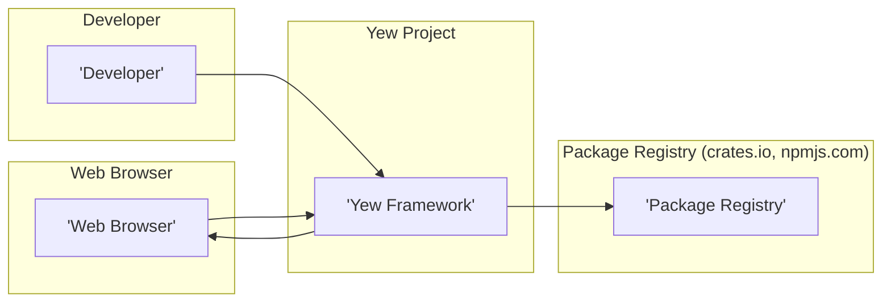
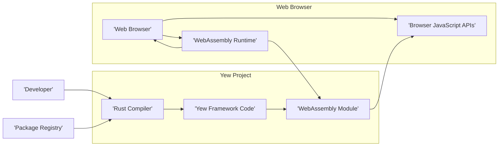
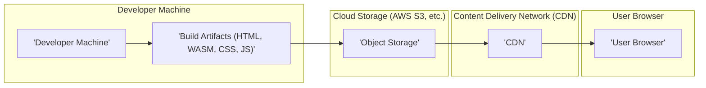
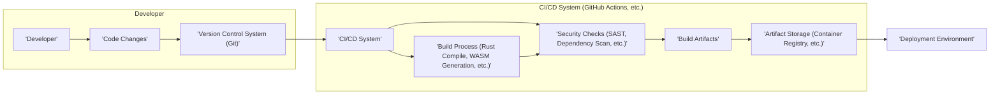

# BUSINESS POSTURE

- Business Priorities and Goals:
  - Enable developers to build high-performance, client-side web applications using Rust and WebAssembly.
  - Provide a component-based framework that promotes code reusability and maintainability.
  - Offer a modern and efficient alternative to JavaScript frameworks for web development.
  - Foster a strong community and ecosystem around Rust-based web development.
  - Facilitate the creation of web applications that can run across different platforms due to WebAssembly's portability.

- Business Risks:
  - Adoption risk: Developers may be hesitant to adopt a new framework, especially one based on Rust, which has a steeper learning curve compared to JavaScript.
  - Ecosystem maturity risk: The Rust WebAssembly ecosystem, while growing, might not be as mature as the JavaScript ecosystem in terms of available libraries and tooling.
  - Security risks inherent in web applications: Web applications built with Yew are still susceptible to common web security vulnerabilities like XSS, CSRF, and others if not developed securely.
  - Performance risks: While WebAssembly is generally performant, inefficient Rust or Yew code can still lead to performance issues in the browser.
  - Dependency risk: Reliance on Rust toolchain, WebAssembly standards, and browser compatibility.

# SECURITY POSTURE

- Existing Security Controls:
  - security control: Rust's memory safety features inherently reduce vulnerabilities like buffer overflows and dangling pointers. Implemented in: Rust compiler and language design.
  - security control: WebAssembly's sandboxed environment in the browser limits the access of Yew applications to system resources. Implemented in: Web browsers and WebAssembly runtime.
  - security control: Standard web security practices are applicable to Yew applications, such as HTTPS for communication security and Content Security Policy (CSP) for mitigating XSS. Implemented in: Web server configuration and application code.
  - security control: Open source nature of the project allows for community review and identification of potential vulnerabilities. Implemented in: GitHub repository and community contributions.
  - accepted risk: Reliance on third-party Rust crates (libraries) introduces supply chain risks. Accepted risk is mitigated by community review and crate ecosystem practices.
  - accepted risk: Security vulnerabilities in the Rust compiler or WebAssembly runtime could impact Yew applications. Accepted risk is managed by the Rust and WebAssembly communities' security efforts.

- Recommended Security Controls:
  - security control: Implement automated security scanning (SAST/DAST) in the CI/CD pipeline for Yew applications to detect potential vulnerabilities early in the development lifecycle.
  - security control: Conduct regular security audits and penetration testing of Yew applications, especially before major releases or when handling sensitive data.
  - security control: Provide security guidelines and best practices for Yew developers to build secure applications, including input validation, output encoding, and secure state management.
  - security control: Establish a process for reporting and handling security vulnerabilities in Yew framework and related crates.

- Security Requirements:
  - Authentication:
    - Requirement: Yew applications that require user authentication should integrate with standard web authentication mechanisms (e.g., OAuth 2.0, OpenID Connect, session-based authentication).
    - Requirement: Securely store and manage user credentials or tokens if authentication is handled within the Yew application.
  - Authorization:
    - Requirement: Implement role-based or attribute-based access control to manage user permissions and access to different parts of the application.
    - Requirement: Enforce the principle of least privilege, granting users only the necessary permissions to perform their tasks.
  - Input Validation:
    - Requirement: Validate all user inputs on the client-side (Yew application) and server-side (if applicable) to prevent injection attacks (e.g., XSS, SQL injection if backend is involved).
    - Requirement: Sanitize user inputs before displaying them in the UI to prevent XSS vulnerabilities.
  - Cryptography:
    - Requirement: Use HTTPS for all communication between the browser and the server to protect data in transit.
    - Requirement: Employ appropriate cryptographic techniques for storing sensitive data at rest, if applicable (e.g., encryption of local storage or IndexedDB data).
    - Requirement: When using cryptography in Yew applications, leverage well-vetted and secure Rust crates for cryptographic operations.

# DESIGN

## C4 CONTEXT

- Context Diagram Elements:
  - - Name: Developer
    - Type: Person
    - Description: Software developers who use the Yew framework to build web applications.
    - Responsibilities: Writes code using Yew framework, builds and deploys Yew applications.
    - Security controls: Secure development practices, code review, using secure development environments.
  - - Name: Yew Framework
    - Type: Software System
    - Description: A Rust framework for building client-side web applications compiled to WebAssembly.
    - Responsibilities: Provides components and tools for building interactive web UIs, manages application state, renders UI in the browser.
    - Security controls: Memory safety of Rust, WebAssembly sandbox, adherence to web security standards.
  - - Name: Web Browser
    - Type: Software System
    - Description: User's web browser that executes the Yew application (WebAssembly code).
    - Responsibilities: Executes WebAssembly code, renders UI, interacts with the user, provides WebAssembly runtime environment.
    - Security controls: Browser security features (same-origin policy, CSP, etc.), WebAssembly sandbox, regular browser updates.
  - - Name: Package Registry
    - Type: External System
    - Description: Repositories like crates.io (for Rust crates) and npmjs.com (for JavaScript packages) that Yew and Yew applications depend on.
    - Responsibilities: Hosts and distributes libraries and dependencies used by Yew and Yew applications.
    - Security controls: Package registry security measures, dependency scanning, vulnerability databases.

## C4 CONTAINER

- Container Diagram Elements:
  - - Name: Rust Compiler
    - Type: Software Container
    - Description: The Rust toolchain component responsible for compiling Rust code into WebAssembly.
    - Responsibilities: Compiles Yew framework code and application code into WebAssembly modules. Manages dependencies from package registries.
    - Security controls: Secure compilation process, dependency vulnerability scanning, using trusted compiler versions.
  - - Name: Yew Framework Code
    - Type: Software Container
    - Description: The source code of the Yew framework, written in Rust.
    - Responsibilities: Provides the core functionalities of the Yew framework, including component model, virtual DOM, and routing.
    - Security controls: Code reviews, static analysis, vulnerability scanning of framework code, community security audits.
  - - Name: WebAssembly Module
    - Type: Software Container
    - Description: The compiled output of Yew application and framework code, in WebAssembly binary format.
    - Responsibilities: Contains the executable code of the Yew application that runs in the browser.
    - Security controls: WebAssembly sandbox enforced by the browser, minimal surface area for vulnerabilities in compiled code.
  - - Name: WebAssembly Runtime
    - Type: Software Container
    - Description: The environment within the web browser that executes WebAssembly modules.
    - Responsibilities: Executes WebAssembly code, manages memory and resources for WebAssembly applications, provides access to browser APIs.
    - Security controls: WebAssembly sandbox, browser security policies, regular browser updates to patch runtime vulnerabilities.
  - - Name: Browser JavaScript APIs
    - Type: Software Container
    - Description: JavaScript APIs provided by the web browser that WebAssembly modules can interact with.
    - Responsibilities: Provides functionalities like DOM manipulation, network requests, local storage, and other browser features accessible from WebAssembly.
    - Security controls: Browser security policies governing API access, permission prompts for sensitive APIs, regular browser updates.

## DEPLOYMENT

- Deployment Options:
  - Static File Hosting: Deploying the compiled WebAssembly, HTML, CSS, and JavaScript files to a static file server (e.g., AWS S3, Netlify, Vercel).
  - CDN: Using a Content Delivery Network (CDN) to distribute the static files globally for faster loading times.
  - Web Server: Serving the static files through a traditional web server (e.g., Nginx, Apache).

- Detailed Deployment (Static File Hosting with CDN):

- Deployment Diagram Elements:
  - - Name: Developer Machine
    - Type: Infrastructure
    - Description: The local computer used by the developer to build the Yew application.
    - Responsibilities: Development environment, building the application, generating build artifacts.
    - Security controls: Developer machine security practices, access control, malware protection.
  - - Name: Build Artifacts (HTML, WASM, CSS, JS)
    - Type: Artifact
    - Description: The output of the Yew build process, including HTML, WebAssembly module, CSS, and JavaScript files.
    - Responsibilities: Contains the deployable application code.
    - Security controls: Integrity checks during build and deployment, secure storage of artifacts.
  - - Name: Object Storage
    - Type: Infrastructure
    - Description: Cloud storage service (e.g., AWS S3, Google Cloud Storage, Azure Blob Storage) used to host the static files.
    - Responsibilities: Stores and serves the static files of the Yew application.
    - Security controls: Access control policies, encryption at rest, versioning, audit logging.
  - - Name: Content Delivery Network (CDN)
    - Type: Infrastructure
    - Description: A network of geographically distributed servers that cache and deliver the static files to users.
    - Responsibilities: Caches and serves the application files to users with low latency, provides DDoS protection, and potentially TLS termination.
    - Security controls: CDN security features (DDoS protection, TLS/HTTPS, access controls), secure CDN configuration.
  - - Name: User Browser
    - Type: Infrastructure
    - Description: The end-user's web browser that requests and executes the Yew application.
    - Responsibilities: Requests application files from the CDN, executes the WebAssembly code, renders the UI.
    - Security controls: Browser security features, user awareness of web security risks.

## BUILD

- Build Diagram Elements:
  - - Name: Developer
    - Type: Person
    - Description: Software developer writing and committing code changes.
    - Responsibilities: Writes code, performs local testing, commits code to version control.
    - Security controls: Secure coding practices, code review, secure development environment.
  - - Name: Version Control System (Git)
    - Type: Tool
    - Description: System for tracking and managing code changes (e.g., GitHub, GitLab).
    - Responsibilities: Stores code, manages versions, facilitates collaboration.
    - Security controls: Access control, branch protection, audit logging, secure hosting of VCS.
  - - Name: CI/CD System (GitHub Actions, etc.)
    - Type: Automation System
    - Description: Continuous Integration and Continuous Delivery system that automates the build, test, and deployment process.
    - Responsibilities: Automates build process, runs tests, performs security checks, creates build artifacts, manages deployments.
    - Security controls: Secure CI/CD pipeline configuration, access control, secret management, audit logging.
  - - Name: Build Process (Rust Compile, WASM Generation, etc.)
    - Type: Process
    - Description: Steps involved in compiling Rust code to WebAssembly and creating deployable artifacts.
    - Responsibilities: Compiles code, generates WebAssembly, packages artifacts.
    - Security controls: Using trusted build tools, secure build environment, reproducible builds.
  - - Name: Security Checks (SAST, Dependency Scan, etc.)
    - Type: Process
    - Description: Automated security checks performed during the build process, such as Static Application Security Testing (SAST) and dependency vulnerability scanning.
    - Responsibilities: Identifies potential security vulnerabilities in code and dependencies.
    - Security controls: Using up-to-date security scanning tools, configuring scans effectively, acting on scan results.
  - - Name: Build Artifacts
    - Type: Artifact
    - Description: The output of the build process, ready for deployment.
    - Responsibilities: Deployable application code.
    - Security controls: Integrity checks, secure storage, access control.
  - - Name: Artifact Storage (Container Registry, etc.)
    - Type: Storage
    - Description: Secure storage for build artifacts (e.g., container registry, artifact repository).
    - Responsibilities: Stores and manages build artifacts.
    - Security controls: Access control, encryption at rest, audit logging, vulnerability scanning of stored artifacts.
  - - Name: Deployment Environment
    - Type: Environment
    - Description: Target environment where the application is deployed (e.g., cloud storage, web server).
    - Responsibilities: Hosts and runs the application.
    - Security controls: Environment-specific security controls (see Deployment section).

# RISK ASSESSMENT

- Critical Business Processes:
  - For Yew framework itself: Ensuring the integrity and availability of the framework for developers. Maintaining the open-source community and project health.
  - For applications built with Yew: The critical business processes depend on the specific application. Generally, these include providing intended functionality to users, maintaining data integrity and confidentiality, and ensuring application availability.

- Data Sensitivity:
  - For Yew framework itself: Primarily code and project metadata, which is publicly available on GitHub. Sensitivity is low in terms of confidentiality, but integrity and availability are important for the developer community.
  - For applications built with Yew: Data sensitivity depends entirely on the application. It can range from publicly accessible data to highly sensitive personal or financial information. The sensitivity level needs to be assessed for each specific Yew application.

# QUESTIONS & ASSUMPTIONS

- Questions:
  - What type of applications are being built with Yew? (e.g., public websites, internal dashboards, e-commerce platforms). This would help to refine the security requirements and risk assessment.
  - What is the intended deployment environment for Yew applications? (e.g., static hosting, server-side rendering, specific cloud providers). This impacts deployment security considerations.
  - Are there any specific compliance requirements for applications built with Yew (e.g., GDPR, HIPAA, PCI DSS)? This would dictate additional security controls.
  - What is the organization's risk appetite regarding open-source software and supply chain security? This influences the level of scrutiny applied to dependencies and build processes.

- Assumptions:
  - BUSINESS POSTURE: The primary goal is to provide a secure and reliable framework for building web applications. Adoption and community growth are important business drivers.
  - SECURITY POSTURE: Standard web security best practices are applicable to Yew applications. Security is a concern, but performance and developer experience are also high priorities. Open-source security principles are followed.
  - DESIGN: Yew applications are primarily client-side rendered and deployed as static files. The build process involves standard Rust and WebAssembly toolchains. CI/CD practices are assumed for automated builds and deployments.