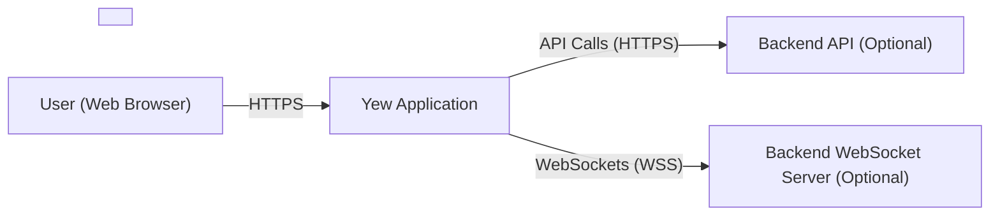
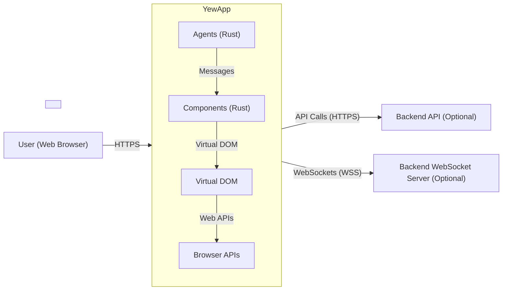
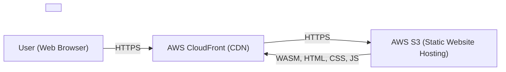
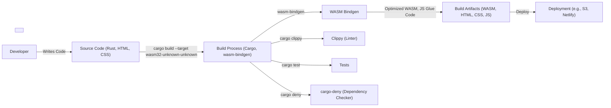

Okay, let's create a design document for the Yew project, focusing on aspects relevant to threat modeling.

# BUSINESS POSTURE

Yew is a modern Rust framework for creating multi-threaded front-end web apps with WebAssembly.  It appears to be targeted at individual developers and organizations looking to build performant and reliable web applications using Rust's strong safety guarantees.  The project is open-source, suggesting a community-driven development model.

Business Priorities:

*   Enable developers to build robust and efficient web applications using Rust.
*   Provide a compelling alternative to JavaScript-based front-end frameworks.
*   Foster a strong community around the project.
*   Maintain a high level of code quality and security.
*   Ensure the framework is easy to learn and use.

Business Goals:

*   Increase adoption of the Yew framework.
*   Attract contributors to the project.
*   Establish Yew as a leading choice for Rust-based web development.

Most Important Business Risks:

*   Malicious code injection into the framework itself (supply chain attack).
*   Vulnerabilities in the framework that could be exploited in applications built with Yew.
*   Lack of adoption due to complexity or perceived instability.
*   Inability to keep up with evolving web standards and browser compatibility.
*   Reputational damage due to security incidents.

# SECURITY POSTURE

Existing Security Controls:

*   security control: Use of Rust: Rust's memory safety features (ownership, borrowing) inherently mitigate many common web vulnerabilities like buffer overflows, use-after-free, and data races. (Described in Rust documentation and Yew's design).
*   security control: WebAssembly: Running in a sandboxed environment within the browser provides a layer of isolation. (Described in WebAssembly specifications).
*   security control: Community Code Review: As an open-source project, Yew benefits from community scrutiny of the codebase. (Visible on GitHub).
*   security control: Automated Tests: The repository contains tests, which help to identify and prevent regressions. (Visible in the `tests` directory on GitHub).
*   security control: Dependencies Management: Cargo, Rust's package manager, helps manage dependencies and their versions. (Visible in `Cargo.toml` files).
*   security control: Clippy: Rust's linter, Clippy, is used to enforce coding best practices and catch potential errors. (Likely used, but needs confirmation in CI configuration).

Accepted Risks:

*   accepted risk: Reliance on third-party crates (libraries): While Cargo helps manage dependencies, vulnerabilities in third-party crates could impact Yew.
*   accepted risk: Potential for undiscovered vulnerabilities: Despite Rust's safety features, complex systems like Yew may still contain subtle bugs that could lead to security vulnerabilities.
*   accepted risk: Browser compatibility issues: While Yew aims for broad compatibility, differences in browser implementations of WebAssembly and related APIs could lead to unexpected behavior or vulnerabilities.

Recommended Security Controls:

*   security control: Implement a robust vulnerability disclosure program.
*   security control: Conduct regular security audits and penetration testing.
*   security control: Integrate Static Application Security Testing (SAST) tools into the CI/CD pipeline.
*   security control: Integrate Dynamic Application Security Testing (DAST) tools, particularly focused on testing the generated WebAssembly.
*   security control: Implement Software Composition Analysis (SCA) to track and manage vulnerabilities in third-party dependencies.
*   security control: Consider using a Content Security Policy (CSP) to mitigate XSS risks in applications built with Yew (guidance for developers).
*   security control: Provide clear documentation and examples on secure coding practices for Yew developers.

Security Requirements:

*   Authentication: Yew itself does not handle authentication. Applications built with Yew must implement their own authentication mechanisms, leveraging secure libraries and protocols (e.g., OAuth 2.0, OpenID Connect).  Yew should provide guidance and potentially helper libraries for common authentication scenarios.
*   Authorization: Similar to authentication, authorization is the responsibility of the application developer. Yew should provide mechanisms for securely managing user roles and permissions within the application's state.
*   Input Validation: Yew applications must carefully validate all user inputs to prevent injection attacks (e.g., XSS, SQL injection if interacting with a backend). Yew should provide utilities or guidance for input sanitization and validation.
*   Cryptography: Yew applications should use established cryptographic libraries (e.g., `ring`, `sodiumoxide`) for any sensitive operations like password hashing, encryption, or digital signatures. Yew should not attempt to implement its own cryptographic primitives.

# DESIGN

## C4 CONTEXT

Element Descriptions:

*   Element:
    *   Name: User (Web Browser)
    *   Type: Person
    *   Description: A person interacting with the Yew application through a web browser.
    *   Responsibilities: Initiates interactions with the application, provides input, views output.
    *   Security controls: Browser's built-in security mechanisms (same-origin policy, sandbox, etc.).

*   Element:
    *   Name: Yew Application
    *   Type: Software System
    *   Description: The web application built using the Yew framework, running as WebAssembly in the user's browser.
    *   Responsibilities: Handles user interface, manages application state, communicates with backend services (if any).
    *   Security controls: Rust's memory safety, WebAssembly sandbox, input validation, (potentially) CSP.

*   Element:
    *   Name: Backend API (Optional)
    *   Type: Software System
    *   Description: An optional backend API that the Yew application may interact with.
    *   Responsibilities: Provides data and services to the Yew application.
    *   Security controls: Authentication, authorization, input validation, secure communication (HTTPS).

*   Element:
    *   Name: Backend WebSocket Server (Optional)
    *   Type: Software System
    *   Description: An optional backend WebSocket server for real-time communication.
    *   Responsibilities: Maintains persistent connections with Yew application clients.
    *   Security controls: Authentication, authorization, secure communication (WSS), input validation.

## C4 CONTAINER

Element Descriptions:

*   Element:
    *   Name: Components (Rust)
    *   Type: Container
    *   Description:  Rust code defining the UI elements and their behavior.
    *   Responsibilities:  Rendering UI, handling user interactions, managing local state.
    *   Security controls: Rust's memory safety, input validation.

*   Element:
    *   Name: Virtual DOM
    *   Type: Container
    *   Description:  An in-memory representation of the UI.
    *   Responsibilities:  Efficiently updating the actual DOM.
    *   Security controls:  Indirectly contributes to security by minimizing direct DOM manipulation (reducing XSS risk).

*   Element:
    *   Name: Browser APIs
    *   Type: Container
    *   Description:  The standard web APIs provided by the browser (DOM, Fetch, WebSockets, etc.).
    *   Responsibilities:  Interacting with the browser's rendering engine and network stack.
    *   Security controls: Browser's built-in security mechanisms.

*   Element:
    *   Name: Agents (Rust)
    *   Type: Container
    *   Description: Rust code for background tasks and communication with external services.
    *   Responsibilities: Handling asynchronous operations, communicating with backend APIs.
    *   Security controls: Rust's memory safety, secure communication (HTTPS/WSS).

*   Element:
    *   Name: Yew Application
    *   Type: Software System
    *   Description: The web application built using the Yew framework, running as WebAssembly in the user's browser.
    *   Responsibilities: Handles user interface, manages application state, communicates with backend services (if any).
    *   Security controls: Rust's memory safety, WebAssembly sandbox, input validation, (potentially) CSP.

*   Element:
    *   Name: Backend API (Optional)
    *   Type: Software System
    *   Description: An optional backend API that the Yew application may interact with.
    *   Responsibilities: Provides data and services to the Yew application.
    *   Security controls: Authentication, authorization, input validation, secure communication (HTTPS).

*   Element:
    *   Name: Backend WebSocket Server (Optional)
    *   Type: Software System
    *   Description: An optional backend WebSocket server for real-time communication.
    *   Responsibilities: Maintains persistent connections with Yew application clients.
    *   Security controls: Authentication, authorization, secure communication (WSS), input validation.

*   Element:
    *   Name: User (Web Browser)
    *   Type: Person
    *   Description: A person interacting with the Yew application through a web browser.
    *   Responsibilities: Initiates interactions with the application, provides input, views output.
    *   Security controls: Browser's built-in security mechanisms (same-origin policy, sandbox, etc.).

## DEPLOYMENT

Yew applications, being primarily client-side, can be deployed in several ways:

1.  **Static Web Hosting:**  Services like Netlify, Vercel, AWS S3 + CloudFront, Google Cloud Storage + Cloud CDN, GitHub Pages, etc. This is the most common and recommended approach.
2.  **Traditional Web Server:**  Apache, Nginx, etc., serving the compiled WebAssembly, HTML, CSS, and JavaScript files.
3.  **Embedded in a Server-Side Application:**  The Yew application could be served as static assets from a backend application (e.g., a Rust Rocket or Actix-web server).

We'll describe the **Static Web Hosting** approach using AWS S3 and CloudFront as an example:

Element Descriptions:

*   Element:
    *   Name: User (Web Browser)
    *   Type: Person
    *   Description:  The end-user accessing the application.
    *   Responsibilities:  Initiates requests to the application.
    *   Security controls: Browser security mechanisms.

*   Element:
    *   Name: AWS CloudFront (CDN)
    *   Type: Infrastructure Node
    *   Description:  Content Delivery Network for caching and distributing the application's static assets.
    *   Responsibilities:  Serving content from edge locations, improving performance and reducing latency.
    *   Security controls: HTTPS termination, DDoS protection, WAF integration (optional).

*   Element:
    *   Name: AWS S3 (Static Website Hosting)
    *   Type: Infrastructure Node
    *   Description:  Object storage service hosting the compiled Yew application files.
    *   Responsibilities:  Storing and serving the application's static assets.
    *   Security controls:  Access control lists (ACLs), bucket policies, server-side encryption.

## BUILD

The build process for a Yew application typically involves the following steps:

1.  **Development:**  Developers write Rust code for components and agents, along with HTML templates and CSS.
2.  **Compilation:**  The `cargo build` command, with the `wasm32-unknown-unknown` target, compiles the Rust code to WebAssembly.
3.  **`wasm-bindgen`:**  This tool generates the necessary JavaScript glue code to interface between the WebAssembly module and the browser's JavaScript environment.
4.  **Optimization:**  Tools like `wasm-opt` can be used to further optimize the size and performance of the WebAssembly module.
5.  **Packaging:**  The compiled WebAssembly, generated JavaScript, HTML, and CSS files are packaged together for deployment.
6.  **CI/CD:** Ideally, this entire process is automated using a CI/CD system like GitHub Actions, Travis CI, CircleCI, etc.

Security Controls in the Build Process:

*   security control: **`cargo clippy`:**  Rust's linter helps enforce coding best practices and identify potential errors.
*   security control: **`cargo test`:**  Runs unit and integration tests to ensure code correctness.
*   security control: **`cargo deny`:** This tool (or similar) can be used to check for known vulnerabilities in dependencies and enforce security policies (e.g., disallowing certain crates or versions).
*   security control: **CI/CD Pipeline:**  Automating the build process ensures consistency and allows for the integration of security checks at each stage.
*   security control: **Signed Commits:** Developers should sign their commits to ensure the integrity of the codebase.
*   security control: **Least Privilege:** Build systems should operate with the least necessary privileges.

# RISK ASSESSMENT

Critical Business Processes:

*   Serving web applications to users.
*   Maintaining the integrity and availability of the Yew framework.
*   Protecting the reputation of the Yew project and its community.

Data to Protect:

*   **Source Code (High Sensitivity):**  The Yew framework's source code is highly sensitive, as vulnerabilities could impact all applications built with it.
*   **Build Artifacts (High Sensitivity):**  The compiled WebAssembly modules are also sensitive, as they represent the executable code delivered to users.
*   **User Data (Variable Sensitivity):**  Applications built with Yew may handle user data, the sensitivity of which depends on the specific application. Yew itself does not directly handle user data, but it's crucial for Yew applications to protect any user data they manage.
*   **Dependencies (Medium Sensitivity):** Vulnerabilities in dependencies can be exploited.

# QUESTIONS & ASSUMPTIONS

Questions:

*   What is the specific CI/CD pipeline used by the Yew project?  (This will help determine the exact security controls in place.)
*   Are there any plans for formal security audits or penetration testing?
*   What is the process for handling vulnerability reports?
*   What specific guidance is provided to Yew developers regarding secure coding practices?
*   Are there any plans to integrate more advanced security tools (e.g., SAST, DAST, SCA) into the development workflow?

Assumptions:

*   BUSINESS POSTURE: The Yew project prioritizes security and aims to provide a secure framework for building web applications.
*   SECURITY POSTURE: The Yew project uses standard Rust development tools and practices, including Cargo, Clippy, and automated tests.
*   DESIGN: The design of Yew follows common WebAssembly application patterns, with a clear separation between client-side and (optional) server-side components. The deployment model is assumed to be static web hosting, but other options are possible. The build process is assumed to be automated, but the specific CI/CD system needs confirmation.