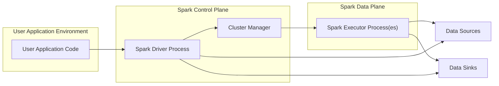
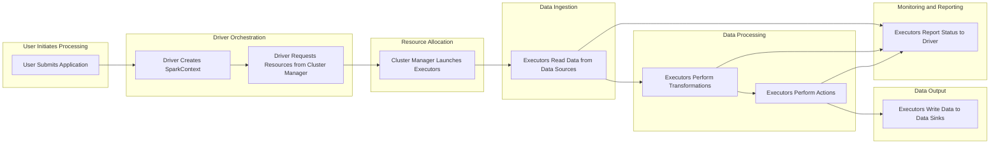

# Project Design Document: Apache Spark

**Version:** 1.1
**Date:** October 26, 2023
**Author:** AI Software Architect

## 1. Introduction

This document provides an enhanced architectural design of the Apache Spark project, focusing on aspects relevant to security analysis and threat modeling. It offers a detailed understanding of the system's components, their interactions, and data flow, with a stronger emphasis on potential security implications.

## 2. Goals and Objectives

The primary goal of this document is to provide a robust and detailed architectural overview of Apache Spark specifically tailored for security analysis and threat modeling activities. The objectives are to:

*   Clearly identify and describe the major components of the Spark architecture with a security-focused lens.
*   Detail the interactions and data flow between these components, highlighting potential security touchpoints.
*   Elaborate on key security considerations within the architecture, providing specific examples and potential risks.
*   Provide clear and informative visual representations of the system's structure and data flow.

## 3. High-Level Architecture

Apache Spark is a powerful, open-source distributed processing system used for big data workloads. Its architecture is designed for speed, ease of use, and sophisticated analytics. The core involves a driver process coordinating tasks across multiple executor processes.

**Explanation of Components:**

*   **User Application Code:** The program written by the user utilizing Spark APIs to define data processing logic. This is the entry point and can introduce vulnerabilities if not written securely.
*   **Spark Driver Process:** The central coordinator of the Spark application. Key responsibilities include:
    *   Maintaining application state.
    *   Translating user code into execution plans.
    *   Scheduling tasks on executors.
    *   Interacting with the Cluster Manager to acquire resources.
    *   This is a critical component from a security perspective as it controls the entire application.
*   **Cluster Manager:** An external service responsible for managing cluster resources and allocating them to Spark applications. Examples include:
    *   "YARN (Yet Another Resource Negotiator)"
    *   "Mesos"
    *   "Standalone Spark Cluster Manager"
    *   "Kubernetes"
    *   The security of the Cluster Manager directly impacts the security of Spark.
*   **Spark Executor Process(es):** Processes that execute the tasks assigned by the driver. Each executor runs on a worker node and is responsible for:
    *   Executing individual tasks on data partitions.
    *   Storing intermediate results in memory or disk.
    *   Communicating with the driver about task status.
    *   Executors handle sensitive data and are potential targets for attacks.
*   **Data Sources:** External systems from which Spark reads data. Examples include:
    *   "HDFS (Hadoop Distributed File System)"
    *   "S3 (Amazon Simple Storage Service)"
    *   "Databases (e.g., PostgreSQL, MySQL)"
    *   Security considerations include authentication and authorization to access these sources.
*   **Data Sinks:** External systems to which Spark writes processed data. Examples are similar to Data Sources. Security involves ensuring data integrity and authorized access.

## 4. Key Components and Their Interactions

This section provides a more detailed breakdown of the core Spark components and their interactions, highlighting security-relevant aspects.

*   **Spark Core:** The foundational layer providing core functionalities:
    *   Task scheduling and dispatching.
    *   Memory management and data partitioning.
    *   Fault recovery mechanisms.
    *   APIs for interacting with storage systems.
    *   Security implications involve the robustness of these core mechanisms and potential vulnerabilities in I/O operations.
*   **Spark SQL and DataFrames:** A module for structured data processing:
    *   Provides a distributed SQL query engine.
    *   Offers DataFrames and Datasets APIs for working with structured and semi-structured data.
    *   Integrates with various data sources via JDBC/ODBC.
    *   Security considerations include preventing SQL injection attacks and ensuring proper access control to data sources.
*   **Spark Streaming and Structured Streaming:** Enables real-time data stream processing:
    *   Receives data from sources like Kafka, Kinesis, and TCP sockets.
    *   Processes data in micro-batches or continuously.
    *   Security is crucial for protecting the integrity and confidentiality of streaming data.
*   **MLlib (Machine Learning Library):** Provides a library of machine learning algorithms:
    *   Algorithms for classification, regression, clustering, and more.
    *   Security concerns include potential biases in training data and vulnerabilities in model deployment.
*   **GraphX:** Spark's API for graph computation:
    *   Allows for building and manipulating graph structures.
    *   Provides algorithms for graph analysis.
    *   Security considerations involve protecting sensitive graph data and preventing malicious graph manipulations.
*   **Cluster Manager Integration:** Spark's interaction with the Cluster Manager involves:
    *   Resource requests and allocation.
    *   Executor lifecycle management.
    *   Security depends on the security posture of the underlying Cluster Manager.
*   **Storage Layer Interaction:** Spark interacts with various storage systems for data persistence:
    *   Authentication and authorization mechanisms.
    *   Data serialization and deserialization.
    *   Data transfer protocols.
    *   Security measures must be in place to protect data at rest and in transit.

## 5. Data Flow with Security Touchpoints

The data flow within a Spark application involves several stages, each presenting potential security considerations.

**Detailed Data Flow and Security Touchpoints:**

*   **User Submits Application:** The user submits their Spark application.
    *   **Security Touchpoint:** Authentication and authorization of the user submitting the application. Input validation of application parameters to prevent injection attacks.
*   **Driver Creates SparkContext:** The driver initializes the Spark environment.
    *   **Security Touchpoint:** Configuration of security settings for the SparkContext, including authentication mechanisms and encryption settings.
*   **Driver Requests Resources from Cluster Manager:** The driver requests resources.
    *   **Security Touchpoint:** Secure communication channels between the driver and the Cluster Manager. Authentication of the driver to the Cluster Manager.
*   **Cluster Manager Launches Executors:** The Cluster Manager allocates and starts executor processes.
    *   **Security Touchpoint:** Secure provisioning of executor environments. Isolation between executors belonging to different applications.
*   **Executors Read Data from Data Sources:** Executors access and read data.
    *   **Security Touchpoint:** Authentication and authorization of executors to access data sources. Encryption of data in transit from data sources. Input validation of data read from sources.
*   **Executors Perform Transformations:** Executors process the data.
    *   **Security Touchpoint:** Secure handling of sensitive data within executors. Protection against data leakage or unauthorized access within the executor environment.
*   **Executors Perform Actions:** Executors perform actions like saving data or triggering computations.
    *   **Security Touchpoint:** Authorization checks before performing actions. Secure handling of credentials required for actions.
*   **Executors Write Data to Data Sinks:** Executors write the processed data.
    *   **Security Touchpoint:** Authentication and authorization to write to data sinks. Encryption of data in transit to data sinks and at rest in the sinks.
*   **Executors Report Status to Driver:** Executors communicate status back to the driver.
    *   **Security Touchpoint:** Integrity and confidentiality of communication between executors and the driver.

## 6. Security Considerations (Expanded)

This section elaborates on key security considerations within the Spark architecture, providing more specific examples and potential risks.

*   **Authentication and Authorization:**
    *   **User Authentication:** Mechanisms like Kerberos, LDAP, or custom authentication schemes to verify user identities submitting applications or accessing Spark UIs. Risk: Unauthorized access to Spark resources and data.
    *   **Service Authentication (Inter-component):** Secure communication protocols (e.g., mutual TLS) and shared secrets for authentication between driver and executors, and with the Cluster Manager. Risk: Spoofing and unauthorized control of Spark components.
    *   **Authorization:** Role-Based Access Control (RBAC) or Access Control Lists (ACLs) to manage permissions for accessing data, executing jobs, and managing Spark resources. Risk: Data breaches and unauthorized operations.
*   **Data Encryption:**
    *   **Data at Rest:** Encryption of data stored in underlying storage systems (HDFS, S3, databases) using technologies like Transparent Data Encryption (TDE) or file system encryption. Risk: Unauthorized access to sensitive data stored persistently.
    *   **Data in Transit:** Encryption of data exchanged between Spark components over the network using TLS/SSL. Configuration of secure communication channels. Risk: Eavesdropping and data interception.
*   **Network Security:**
    *   **Firewall Rules:** Restricting network access to Spark master and worker nodes, and between components, based on the principle of least privilege. Risk: Unauthorized network access and potential attacks.
    *   **Network Segmentation:** Isolating Spark components within different network segments to limit the impact of a security breach. Risk: Lateral movement of attackers within the network.
*   **Input Validation and Sanitization:**
    *   Validating data read from external sources to prevent injection attacks (e.g., SQL injection, command injection) and data corruption. Risk: Compromising Spark applications and underlying systems.
*   **Dependency Management:**
    *   Regularly scanning and updating Spark dependencies to patch known vulnerabilities. Using secure repositories for dependency management. Risk: Exploitation of known vulnerabilities in third-party libraries.
*   **Auditing and Logging:**
    *   Comprehensive logging of Spark activities, including user actions, system events, and security-related events, for monitoring and incident response. Risk: Difficulty in detecting and responding to security incidents.
*   **Secure Configuration:**
    *   Properly configuring Spark settings to enforce security policies, disable unnecessary features, and set strong passwords/secrets. Risk: Weak security posture due to misconfigurations.
*   **Secrets Management:**
    *   Securely storing and managing sensitive information like passwords, API keys, and encryption keys using dedicated secrets management tools. Risk: Exposure of sensitive credentials leading to unauthorized access.
*   **Spark UI Security:**
    *   Securing access to the Spark UI using authentication and authorization to prevent unauthorized monitoring and control. Risk: Information disclosure and potential manipulation of Spark applications.
*   **Container Security (if deployed on containers):**
    *   Using secure container images, implementing container runtime security, and enforcing resource limits. Risk: Container escape and compromise of the underlying host.

## 7. Deployment Considerations and Security Implications

The deployment mode of Spark significantly impacts its security profile.

*   **Standalone Mode:**
    *   Security relies heavily on network configurations and basic authentication.
    *   **Security Implications:** Limited built-in security features, making it more vulnerable if not properly secured at the network level.
*   **Hadoop YARN:**
    *   Leverages YARN's security features, including Kerberos for authentication and authorization.
    *   **Security Implications:** Stronger security posture due to integration with Hadoop's security framework. Requires proper configuration of Kerberos and YARN ACLs.
*   **Apache Mesos:**
    *   Utilizes Mesos's authentication and authorization mechanisms.
    *   **Security Implications:** Security depends on the configuration and security features enabled in the Mesos cluster.
*   **Kubernetes:**
    *   Offers robust security features like RBAC, network policies, and secrets management.
    *   **Security Implications:** Provides a strong foundation for securing Spark deployments, but requires careful configuration of Kubernetes security features.
*   **Cloud Environments (AWS EMR, Azure HDInsight, Google Cloud Dataproc):**
    *   Leverage the cloud provider's security infrastructure and integrated security services.
    *   **Security Implications:** Benefit from the cloud provider's security measures, but responsibility for configuring and managing certain security aspects remains with the user.

## 8. Future Considerations

The security landscape is constantly evolving, and future developments in Spark will need to address emerging threats and incorporate new security best practices.

*   **Enhanced Integration with Security Tools:**  Deeper integration with security information and event management (SIEM) systems and vulnerability scanning tools.
*   **Improved Data Governance and Lineage Tracking:**  Features to track data flow and access for compliance and security auditing.
*   **Federated Security Models:**  Support for more complex security models in distributed and multi-tenant environments.
*   **Homomorphic Encryption and Secure Multi-party Computation:**  Exploring advanced cryptographic techniques to enable computation on encrypted data.
*   **AI-Powered Security Monitoring:**  Leveraging machine learning to detect and respond to security threats in Spark environments.

This enhanced design document provides a more detailed and security-focused overview of Apache Spark's architecture, serving as a valuable resource for subsequent threat modeling activities.