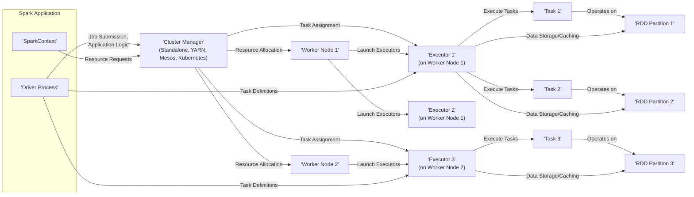
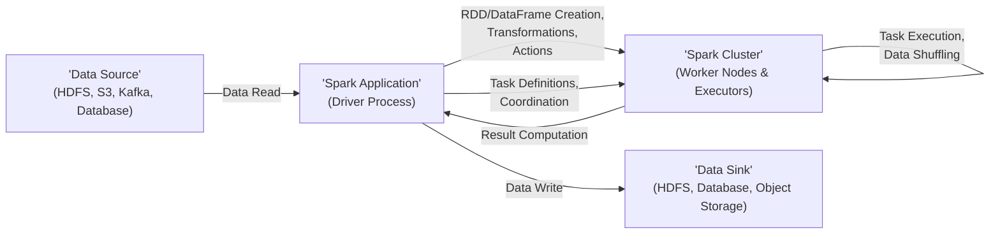

# Project Design Document: Apache Spark (Improved)

**Version:** 1.1
**Date:** October 26, 2023
**Author:** AI Software Architect

## 1. Introduction

This document provides an enhanced architectural overview of the Apache Spark project, specifically tailored for threat modeling. It details the key components, their interactions, data flow, and deployment models with a strong focus on security considerations. This document serves as a comprehensive foundation for identifying potential security vulnerabilities and designing appropriate mitigation strategies.

## 2. Project Overview

Apache Spark is a powerful, open-source, distributed processing system used for big data workloads. It leverages in-memory caching and optimized query execution for fast analytic queries against data of any size. Spark offers high-level APIs in Scala, Java, Python, and R, supporting a wide range of data processing tasks including batch processing, stream processing, machine learning, and graph computation.

## 3. Architectural Overview

Spark employs a master-worker architecture where a central coordinator (Driver) manages the execution of tasks across a distributed set of workers (Executors).

*   **Driver Process:** The central coordinating process of a Spark application. It's where the `main` method of the application runs. The Driver creates the `SparkContext` and is responsible for:
    *   **Maintaining application state.**
    *   **Interpreting user code and building the execution plan (DAG - Directed Acyclic Graph).**
    *   **Negotiating resources with the Cluster Manager.**
    *   **Scheduling tasks to run on the Executors.**
*   **SparkContext:** Represents the connection to the Spark cluster. It's the entry point for Spark functionality, used to create RDDs, broadcast variables, and accumulators.
*   **Cluster Manager:**  The external service responsible for allocating cluster resources to Spark applications. Supported cluster managers include:
    *   **Standalone:** A simple, built-in cluster manager for testing or small deployments.
    *   **Mesos:** A general-purpose cluster manager that can run various frameworks.
    *   **YARN (Yet Another Resource Negotiator):** The resource management layer in Hadoop, commonly used in Hadoop deployments.
    *   **Kubernetes:** A container orchestration platform that can manage Spark deployments in containers.
*   **Worker Nodes:** Machines in the cluster where the Executors run. Each worker node hosts one or more Executors.
*   **Executor:** A JVM process launched on a Worker Node that executes tasks on data partitions. Key responsibilities include:
    *   **Running tasks assigned by the Driver.**
    *   **Storing computed data in memory (or disk) for caching.**
    *   **Reporting task status and results back to the Driver.**
*   **Task:** The smallest unit of work in Spark, representing the processing of a single partition of an RDD.
*   **RDD (Resilient Distributed Dataset):** The fundamental data abstraction in Spark – an immutable, partitioned collection of records that can be operated on in parallel.
*   **Spark SQL:** A Spark module for working with structured data. It provides a DataFrame API and allows querying data using SQL. It includes:
    *   **Catalyst Optimizer:** A query optimizer that improves the efficiency of SQL queries.
    *   **Data Sources API:** Enables Spark SQL to connect to various data sources.
*   **Spark Streaming:** An extension of Spark that enables processing of real-time data streams. It divides the stream into small batches or uses continuous processing.
*   **MLlib (Machine Learning Library):** Spark's library for scalable machine learning algorithms.
*   **GraphX:** Spark's API for graph computation and graph-parallel algorithms.

## 4. Data Flow

The processing of data in Spark typically follows these stages:

*   **Data Ingestion:** Data is loaded into Spark from various sources:
    *   File systems: Hadoop Distributed File System (HDFS), local file systems, cloud object stores (Amazon S3, Azure Blob Storage, Google Cloud Storage).
    *   Databases: Relational databases (using JDBC), NoSQL databases (e.g., Cassandra, MongoDB).
    *   Streaming sources: Apache Kafka, Apache Flume, Kinesis.
*   **RDD/DataFrame Creation:** The ingested data is transformed into RDDs or DataFrames, the core data structures for processing.
*   **Transformations:** A series of operations are applied to the RDDs/DataFrames to manipulate and transform the data. These are lazy operations and don't execute immediately. Examples include `map`, `filter`, `groupBy`, `join`.
*   **Actions:** Operations that trigger the execution of the transformations. Examples include `count`, `collect`, `save`, `foreach`.
*   **Job Submission & Planning:** When an action is invoked, the Driver creates a job, breaks it down into stages, and then into tasks. It builds a DAG representing the execution plan.
*   **Task Scheduling:** The Driver communicates with the Cluster Manager to request resources and schedules tasks to available Executors.
*   **Task Execution:** Executors receive tasks from the Driver and execute them on their assigned data partitions. This often involves reading data from storage, performing computations, and potentially writing intermediate results.
*   **Data Shuffling:** For certain transformations (e.g., `groupBy`, `reduceByKey`), data needs to be redistributed across the cluster. This "shuffle" operation involves transferring data between Executors over the network.
*   **Result Aggregation:** The results from the executed tasks are aggregated and returned to the Driver or written to an external data sink.

## 5. Key Component Details and Security Considerations

### 5.1. Driver Process

*   **Detailed Responsibilities:**
    *   User code execution and application logic.
    *   `SparkContext` initialization and management.
    *   DAG construction and optimization.
    *   Communication with the Cluster Manager for resource negotiation.
    *   Task scheduling and monitoring.
    *   Maintaining application metadata and state.
*   **Security Considerations:**
    *   **Threats:**
        *   **Code Injection:** Malicious code injected into the application logic could be executed by the Driver.
        *   **Unauthorized Job Submission:**  Attackers could submit malicious jobs to consume resources or compromise data.
        *   **Credential Theft:** The Driver might hold credentials for accessing data sources or other services.
        *   **Denial of Service (DoS):**  Overwhelming the Driver with requests or resource-intensive tasks.
    *   **Mitigations:**
        *   Secure coding practices to prevent code injection.
        *   Authentication and authorization mechanisms to control job submissions.
        *   Secure storage and handling of credentials (e.g., using secrets management).
        *   Resource quotas and monitoring to prevent DoS attacks.

### 5.2. Executors

*   **Detailed Responsibilities:**
    *   Execution of tasks assigned by the Driver.
    *   In-memory caching of data partitions.
    *   Data serialization and deserialization.
    *   Communication with the Driver for status updates.
*   **Security Considerations:**
    *   **Threats:**
        *   **Data Exfiltration:** Attackers gaining access to an Executor could steal sensitive data.
        *   **Malicious Task Execution:** Compromised Executors could execute malicious code on data partitions.
        *   **Memory Exploitation:** Vulnerabilities in the JVM or Spark code could be exploited to gain control of the Executor.
        *   **Resource Exhaustion:**  Malicious tasks could consume excessive resources, impacting other tasks.
    *   **Mitigations:**
        *   Strong isolation between Executors (e.g., using containerization).
        *   Secure communication channels between Driver and Executors (e.g., using encryption).
        *   Regular security patching of the JVM and Spark.
        *   Resource limits and monitoring for Executors.

### 5.3. Cluster Manager

*   **Detailed Responsibilities:**
    *   Resource allocation and management across the cluster.
    *   Launching and monitoring Executors.
    *   Providing a framework for running Spark applications.
*   **Security Considerations:**
    *   **Threats:**
        *   **Unauthorized Access:** Attackers gaining access to the Cluster Manager could control the entire cluster.
        *   **Resource Hijacking:** Malicious actors could steal resources allocated to legitimate applications.
        *   **Spoofing:** Attackers could impersonate legitimate applications or nodes.
    *   **Mitigations:**
        *   Robust authentication and authorization mechanisms (e.g., Kerberos, RBAC).
        *   Secure communication protocols.
        *   Regular security audits and vulnerability scanning.
        *   Proper configuration and hardening of the Cluster Manager.

### 5.4. Spark SQL

*   **Detailed Responsibilities:**
    *   Processing structured data using SQL and DataFrame APIs.
    *   Query optimization using the Catalyst Optimizer.
    *   Connecting to various data sources through the Data Sources API.
*   **Security Considerations:**
    *   **Threats:**
        *   **SQL Injection:**  Vulnerabilities in applications using Spark SQL could allow attackers to execute arbitrary SQL commands.
        *   **Data Access Control Bypass:**  Improperly configured access controls could allow unauthorized access to data.
        *   **Information Disclosure:**  Errors or verbose logging could expose sensitive information.
    *   **Mitigations:**
        *   Parameterized queries to prevent SQL injection.
        *   Fine-grained access control mechanisms for data sources.
        *   Secure configuration of data source connections.
        *   Careful handling of error messages and logging.

### 5.5. Spark Streaming

*   **Detailed Responsibilities:**
    *   Real-time processing of data streams.
    *   Windowing and aggregation of streaming data.
    *   Fault tolerance and exactly-once processing guarantees.
*   **Security Considerations:**
    *   **Threats:**
        *   **Data Tampering:** Attackers could inject malicious data into the stream.
        *   **Stream Interruption:**  DoS attacks could disrupt the flow of streaming data.
        *   **Unauthorized Access to Streams:**  Attackers could gain access to sensitive streaming data.
    *   **Mitigations:**
        *   Authentication and authorization for accessing streaming sources.
        *   Data validation and sanitization.
        *   Secure communication channels for stream ingestion and processing.

## 6. Deployment Models and Security Implications

*   **Standalone Mode:**
    *   **Security Implications:** Least secure option, typically used for development or testing. Relies on basic password-based authentication, which is vulnerable to brute-force attacks.
*   **Hadoop YARN:**
    *   **Security Implications:** Inherits security features from Hadoop, including Kerberos for authentication and authorization, and HDFS permissions for data access control. Requires proper configuration of Hadoop security.
*   **Apache Mesos:**
    *   **Security Implications:** Relies on Mesos for authentication and authorization. Requires careful configuration of Mesos security features.
*   **Kubernetes:**
    *   **Security Implications:** Leverages Kubernetes security features like RBAC, network policies, secrets management, and container security contexts. Requires proper configuration of Kubernetes security.
*   **Cloud-based Deployments (AWS EMR, Azure HDInsight, Google Cloud Dataproc):**
    *   **Security Implications:** Security is a shared responsibility. Cloud providers handle infrastructure security, while users are responsible for configuring access controls, data encryption, and application security within the Spark environment.

## 7. Security Architecture

Key security mechanisms and principles within a Spark deployment:

*   **Authentication:** Verifying the identity of users and applications accessing the Spark cluster. Common methods include Kerberos, password-based authentication, and cloud provider IAM roles.
*   **Authorization:** Controlling what actions authenticated users and applications are allowed to perform. This includes access to data, cluster resources, and administrative functions.
*   **Encryption:** Protecting data confidentiality and integrity.
    *   **Data at Rest Encryption:** Encrypting data stored in HDFS, object stores, and local disks used by Spark.
    *   **Data in Transit Encryption:** Using TLS/SSL to encrypt communication between Spark components and with external systems.
*   **Network Security:** Securing network communication and access to the Spark cluster using firewalls, network segmentation, and VPNs.
*   **Auditing and Logging:** Recording security-relevant events for monitoring, analysis, and incident response.
*   **Secrets Management:** Securely storing and managing sensitive credentials and API keys.

## 8. External Dependencies and Security Considerations

Spark interacts with various external systems, each with its own security considerations:

*   **Hadoop (HDFS, YARN):**
    *   **Security Considerations:** Vulnerabilities in Hadoop can impact Spark. Proper configuration of Hadoop security (Kerberos, ACLs) is crucial.
*   **Object Stores (AWS S3, Azure Blob Storage, Google Cloud Storage):**
    *   **Security Considerations:** Secure access key management, proper IAM policies, and encryption of data at rest are essential.
*   **Message Queues (Kafka, RabbitMQ):**
    *   **Security Considerations:** Authentication and authorization for accessing topics, encryption of data in transit, and secure broker configurations are important.
*   **Databases (Relational and NoSQL):**
    *   **Security Considerations:** Secure connection strings, proper authentication and authorization for database access, and protection against SQL injection or NoSQL injection attacks.
*   **Key Management Systems (KMS):**
    *   **Security Considerations:** The KMS itself needs to be highly secure, with strong access controls and auditing.
*   **Authentication and Authorization Services (Kerberos, LDAP, OAuth):**
    *   **Security Considerations:** The security of these services directly impacts the security of the Spark cluster. Proper configuration and regular updates are necessary.

## 9. Conclusion

This enhanced design document provides a more detailed and security-focused overview of Apache Spark. By outlining the architecture, data flow, component responsibilities, deployment models, and external dependencies, along with their respective security considerations, this document serves as a robust foundation for conducting comprehensive threat modeling activities. This will enable the identification of potential vulnerabilities and the design of effective security controls to protect the Spark environment and the data it processes.