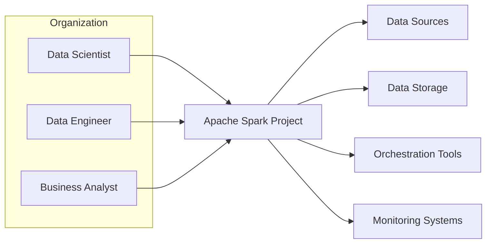
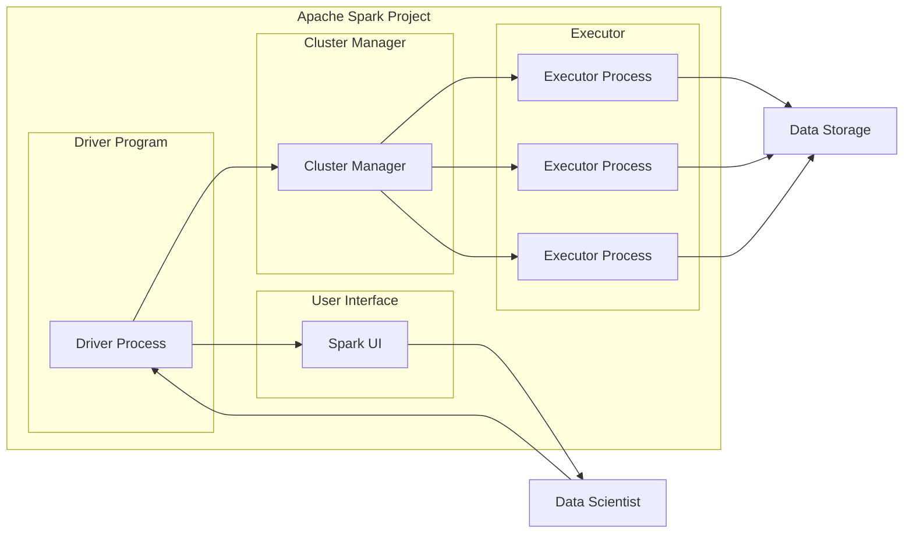
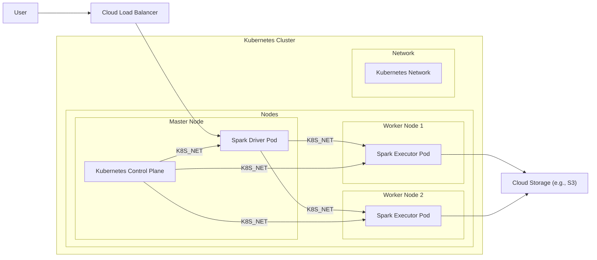
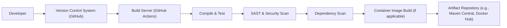

# BUSINESS POSTURE

- Business Priorities and Goals:
  - Apache Spark is designed to provide a unified analytics engine for large-scale data processing.
  - Key business priorities include:
    - Performance: Process large datasets quickly and efficiently.
    - Scalability: Handle increasing data volumes and user demands.
    - Reliability: Ensure stable and fault-tolerant data processing.
    - Ease of Use: Provide user-friendly APIs for various data processing tasks.
    - Versatility: Support diverse workloads including batch processing, stream processing, machine learning, and graph processing.
    - Open Source Community: Foster a vibrant and active community for continuous improvement and innovation.
- Business Risks:
  - Data breaches and unauthorized access to sensitive data processed by Spark.
  - Service disruptions due to vulnerabilities or misconfigurations in Spark deployments.
  - Performance degradation impacting business operations relying on timely data processing.
  - Complexity in managing and securing large-scale Spark deployments.
  - Supply chain risks associated with dependencies and third-party libraries used by Spark.
  - Compliance risks related to data privacy regulations (e.g., GDPR, HIPAA) when processing regulated data.

# SECURITY POSTURE

- Existing Security Controls:
  - security control: Access Control Lists (ACLs) for data access authorization within Spark clusters. Implemented in Spark SQL and DataFrame APIs.
  - security control: Authentication mechanisms like Kerberos and Pluggable Authentication Modules (PAM) for cluster access. Configured during Spark cluster setup.
  - security control: Encryption in transit using TLS/SSL for communication between Spark components and external clients. Configured in Spark configuration settings.
  - security control: Encryption at rest for data stored in persistent storage used by Spark (e.g., HDFS, cloud storage). Implemented at the storage layer, outside of Spark itself.
  - security control: Security auditing and logging of Spark operations and user activities. Configured in Spark and integrated with external logging systems.
  - security control: Role-Based Access Control (RBAC) for managing permissions within Spark clusters. Implemented in Spark SQL and DataFrame APIs.
  - security control: Secure software development lifecycle practices within the Apache Spark project, including code reviews and vulnerability scanning. Described in Apache Software Foundation security guidelines and project development processes.
- Accepted Risks:
  - accepted risk: Potential vulnerabilities in third-party libraries used by Spark, which require ongoing monitoring and patching.
  - accepted risk: Misconfigurations of Spark clusters by users, leading to security weaknesses.
  - accepted risk: Performance overhead associated with enabling strong security features like encryption.
- Recommended Security Controls:
  - security control: Implement automated security vulnerability scanning as part of the Spark build and release process.
  - security control: Provide more comprehensive and user-friendly documentation and tools for secure Spark cluster configuration and management.
  - security control: Enhance input validation and sanitization within Spark core components to prevent injection attacks.
  - security control: Explore and implement data masking and anonymization techniques within Spark to protect sensitive data during processing.
  - security control: Integrate with centralized security information and event management (SIEM) systems for enhanced security monitoring and incident response.
- Security Requirements:
  - Authentication:
    - Requirement: Securely authenticate users and services accessing Spark clusters and data.
    - Requirement: Support multiple authentication mechanisms to integrate with existing enterprise identity providers.
  - Authorization:
    - Requirement: Implement fine-grained authorization controls to manage access to data and Spark resources based on user roles and permissions.
    - Requirement: Enforce least privilege principle for all users and services interacting with Spark.
  - Input Validation:
    - Requirement: Validate and sanitize all external inputs to Spark applications to prevent injection attacks (e.g., SQL injection, command injection).
    - Requirement: Implement robust error handling for invalid inputs to avoid exposing sensitive information or causing unexpected behavior.
  - Cryptography:
    - Requirement: Use strong encryption algorithms and protocols for data in transit and at rest to protect confidentiality and integrity.
    - Requirement: Securely manage cryptographic keys used for encryption and authentication.

# DESIGN

## C4 CONTEXT

- Context Diagram Elements:
  - - Name: Data Scientist
    - Type: User
    - Description: Professionals who use Spark to analyze data, build machine learning models, and derive insights.
    - Responsibilities: Develop and execute data analysis and machine learning workloads using Spark APIs.
    - Security controls: Authentication to access Spark clusters, authorization to access specific datasets and resources.
  - - Name: Data Engineer
    - Type: User
    - Description: Professionals responsible for building and maintaining data pipelines and infrastructure, including Spark clusters.
    - Responsibilities: Deploy, configure, and manage Spark clusters; develop data ingestion and processing pipelines.
    - Security controls: Authentication and authorization to manage Spark infrastructure, access to configuration and monitoring tools.
  - - Name: Business Analyst
    - Type: User
    - Description: Professionals who use Spark-powered dashboards and reports to monitor business performance and trends.
    - Responsibilities: Consume data insights generated by Spark applications, often through reporting and visualization tools.
    - Security controls: Authentication to access reporting systems that consume Spark data, authorization to view specific reports and dashboards.
  - - Name: Apache Spark Project
    - Type: System
    - Description: Unified analytics engine for large-scale data processing, providing APIs for batch, streaming, machine learning, and graph processing.
    - Responsibilities: Process and analyze large datasets, provide data transformation and computation capabilities, manage distributed computing resources.
    - Security controls: Authentication, authorization, input validation, encryption, auditing, secure configuration management.
  - - Name: Data Sources
    - Type: External System
    - Description: Various systems that provide data to be processed by Spark, such as databases, message queues, cloud storage, and APIs.
    - Responsibilities: Provide data to Spark for processing, ensure data availability and integrity.
    - Security controls: Authentication and authorization for Spark to access data sources, data encryption in transit.
  - - Name: Data Storage
    - Type: External System
    - Description: Systems used to store data processed by Spark, including distributed file systems (e.g., HDFS), cloud object storage (e.g., S3, Azure Blob Storage), and databases.
    - Responsibilities: Persist processed data, provide data storage and retrieval capabilities.
    - Security controls: Access control lists, encryption at rest, data backup and recovery.
  - - Name: Orchestration Tools
    - Type: External System
    - Description: Tools used to schedule and manage Spark workflows and data pipelines, such as Apache Airflow, Apache NiFi, and cloud-based workflow services.
    - Responsibilities: Orchestrate Spark jobs, manage dependencies, schedule execution, monitor workflow status.
    - Security controls: Authentication and authorization for Spark to interact with orchestration tools, secure job submission and management.
  - - Name: Monitoring Systems
    - Type: External System
    - Description: Systems used to monitor the health, performance, and security of Spark clusters and applications, such as Prometheus, Grafana, and cloud monitoring services.
    - Responsibilities: Collect and visualize metrics, logs, and events from Spark clusters, provide alerts and dashboards for monitoring.
    - Security controls: Secure access to monitoring dashboards and data, secure data transmission from Spark to monitoring systems.

## C4 CONTAINER

- Container Diagram Elements:
  - - Name: Cluster Manager
    - Type: Container
    - Description: Component responsible for managing cluster resources and allocating tasks to executors. Examples include Standalone Cluster Manager, YARN, and Kubernetes.
    - Responsibilities: Resource management, task scheduling, executor lifecycle management, cluster monitoring.
    - Security controls: Authentication and authorization for cluster management operations, secure communication with executors and driver, resource isolation.
  - - Name: Driver Process
    - Type: Container
    - Description: Runs the user application code, creates SparkContext, submits jobs to the Cluster Manager, and coordinates executors.
    - Responsibilities: Application execution, job scheduling, task distribution, result aggregation.
    - Security controls: Authentication and authorization for application submission, input validation for application code, secure communication with Cluster Manager and executors.
  - - Name: Executor Process
    - Type: Container
    - Description: Worker processes that execute tasks assigned by the Driver, process data partitions, and store results in memory or disk.
    - Responsibilities: Task execution, data processing, data caching, data persistence.
    - Security controls: Resource isolation, secure data handling, access control to local resources, secure communication with Driver and Cluster Manager.
  - - Name: Spark UI
    - Type: Container
    - Description: Web-based user interface for monitoring Spark applications, jobs, stages, tasks, and cluster resources.
    - Responsibilities: Application monitoring, job progress visualization, cluster status display, logging and metrics access.
    - Security controls: Authentication and authorization to access Spark UI, secure communication with Driver for monitoring data, protection against cross-site scripting (XSS) and other web vulnerabilities.

## DEPLOYMENT

- Deployment Options:
  - On-Premise Deployment: Deploying Spark on physical servers or virtual machines within an organization's own data center.
  - Cloud Deployment (IaaS): Deploying Spark on cloud infrastructure as a service (IaaS) like AWS EC2, Azure VMs, or Google Compute Engine.
  - Cloud Deployment (PaaS/Managed Services): Using managed Spark services provided by cloud platforms, such as AWS EMR, Azure HDInsight, or Google Dataproc.
  - Containerized Deployment (Kubernetes): Deploying Spark on container orchestration platforms like Kubernetes for scalability and portability.

- Detailed Deployment (Cloud Deployment on Kubernetes):

- Deployment Diagram Elements:
  - - Name: Kubernetes Cluster
    - Type: Environment
    - Description: Container orchestration platform used to deploy and manage Spark components.
    - Responsibilities: Container management, resource scheduling, service discovery, scaling, health monitoring.
    - Security controls: Kubernetes RBAC, network policies, pod security policies, secrets management, security audits.
  - - Name: Worker Node 1, Worker Node 2
    - Type: Infrastructure (Compute)
    - Description: Virtual machines or physical servers in the Kubernetes cluster that run Spark Executor Pods.
    - Responsibilities: Provide compute resources for Spark executors, execute tasks, store intermediate data.
    - Security controls: Operating system hardening, security patching, network segmentation, access control, monitoring.
  - - Name: Master Node
    - Type: Infrastructure (Control Plane)
    - Description: Virtual machine or physical server in the Kubernetes cluster that runs the Kubernetes Control Plane and Spark Driver Pod.
    - Responsibilities: Kubernetes control plane functions (API server, scheduler, controller manager, etcd), run Spark Driver process.
    - Security controls: Kubernetes security best practices, secure access to control plane components, hardening, monitoring.
  - - Name: Spark Executor Pod
    - Type: Container (Spark Executor)
    - Description: Kubernetes Pod running a Spark Executor process.
    - Responsibilities: Execute Spark tasks, process data partitions, communicate with Driver.
    - Security controls: Container security context, resource limits, network policies, secure communication within the cluster.
  - - Name: Spark Driver Pod
    - Type: Container (Spark Driver)
    - Description: Kubernetes Pod running the Spark Driver process.
    - Responsibilities: Run Spark application, coordinate executors, submit tasks to Kubernetes.
    - Security controls: Container security context, resource limits, network policies, secure communication within the cluster.
  - - Name: Kubernetes Network
    - Type: Network
    - Description: Network infrastructure within the Kubernetes cluster enabling communication between pods and services.
    - Responsibilities: Network connectivity, service discovery, load balancing within the cluster.
    - Security controls: Network policies to control traffic flow, network segmentation, encryption in transit within the cluster (optional).
  - - Name: Cloud Load Balancer
    - Type: Network (Load Balancer)
    - Description: Cloud provider's load balancer to distribute traffic to the Spark Driver Pod (Spark UI, application submission).
    - Responsibilities: Load balancing, external access point to Spark UI and application submission.
    - Security controls: TLS/SSL termination, access control lists, DDoS protection, security monitoring.
  - - Name: Cloud Storage (e.g., S3)
    - Type: Data Storage
    - Description: Cloud-based object storage used by Spark for input and output data.
    - Responsibilities: Persistent data storage, data retrieval, data sharing.
    - Security controls: Access control lists (IAM policies), encryption at rest, data versioning, audit logging.

## BUILD

- Build Process Elements:
  - - Name: Developer
    - Type: Actor
    - Description: Software developers contributing code to the Apache Spark project.
    - Responsibilities: Write code, commit changes to version control, create pull requests.
    - Security controls: Secure development environment, code review process, authentication to version control system.
  - - Name: Version Control System (GitHub)
    - Type: System
    - Description: Central repository for source code, managing code changes and collaboration.
    - Responsibilities: Source code management, version control, collaboration platform.
    - Security controls: Access control, branch protection, audit logging, vulnerability scanning of repository.
  - - Name: Build Server (GitHub Actions)
    - Type: System
    - Description: Automated build and CI/CD system used to compile, test, and package Spark.
    - Responsibilities: Automated build process, continuous integration, testing, packaging, release management.
    - Security controls: Secure build environment, access control to build system, secrets management, build process isolation.
  - - Name: Compile & Test
    - Type: Build Step
    - Description: Compilation of source code and execution of unit and integration tests.
    - Responsibilities: Code compilation, test execution, quality assurance.
    - Security controls: Secure compilation environment, test case coverage, static code analysis (linters).
  - - Name: SAST & Security Scan
    - Type: Build Step
    - Description: Static Application Security Testing (SAST) tools to identify potential security vulnerabilities in the code.
    - Responsibilities: Static code analysis, vulnerability detection, security code review guidance.
    - Security controls: SAST tool configuration, vulnerability reporting, integration with build pipeline.
  - - Name: Dependency Scan
    - Type: Build Step
    - Description: Scanning dependencies for known vulnerabilities and license compliance issues.
    - Responsibilities: Dependency vulnerability management, license compliance checks, supply chain security.
    - Security controls: Dependency scanning tool configuration, vulnerability database updates, reporting and alerting.
  - - Name: Container Image Build (if applicable)
    - Type: Build Step
    - Description: Building container images for Spark components (e.g., Docker images for executors, driver).
    - Responsibilities: Container image creation, image optimization, security hardening of images.
    - Security controls: Base image selection, vulnerability scanning of container images, image signing, secure registry access.
  - - Name: Artifact Repository (e.g., Maven Central, Docker Hub)
    - Type: System
    - Description: Repository for storing and distributing build artifacts (e.g., JAR files, container images).
    - Responsibilities: Artifact storage, versioning, distribution, access control.
    - Security controls: Access control to repository, artifact signing, vulnerability scanning of artifacts, secure repository configuration.

# RISK ASSESSMENT

- Critical Business Processes:
  - Data Analytics and Reporting: Providing timely and accurate data insights for business decision-making.
  - Machine Learning Model Training and Inference: Enabling development and deployment of ML models for various business applications.
  - Data Warehousing and ETL: Supporting data integration and transformation for data warehousing and business intelligence.
  - Real-time Stream Processing: Processing and analyzing streaming data for immediate insights and actions.
- Data Sensitivity:
  - Data processed by Spark can vary widely in sensitivity depending on the use case.
  - Potential data types include:
    - Personally Identifiable Information (PII): Highly sensitive, requires strong protection to comply with privacy regulations.
    - Financial Data: Sensitive, requires protection against fraud and financial loss.
    - Healthcare Data (PHI): Highly sensitive, subject to strict regulations like HIPAA.
    - Business Confidential Data: Sensitive, requires protection to maintain competitive advantage.
    - Public Data: Less sensitive, but integrity and availability are still important.
  - Data sensitivity should be assessed on a per-application basis and appropriate security controls implemented accordingly.

# QUESTIONS & ASSUMPTIONS

- Questions:
  - What specific authentication and authorization mechanisms are currently enforced in Apache Spark deployments across different environments (on-premise, cloud, Kubernetes)?
  - Are there any specific security hardening guidelines or best practices documented and actively promoted for Spark cluster deployments?
  - What is the current process for vulnerability management and patching of Apache Spark and its dependencies?
  - Are there any ongoing initiatives to enhance data masking, anonymization, or differential privacy capabilities within Spark?
  - What are the typical network security configurations recommended for Spark clusters in different deployment scenarios?
- Assumptions:
  - Assumption: Apache Spark project follows secure software development lifecycle practices, including code reviews and security testing.
  - Assumption: Organizations deploying Apache Spark are responsible for configuring and managing security controls within their own environments.
  - Assumption: Security features in Apache Spark are configurable and can be adapted to meet different security requirements and risk appetites.
  - Assumption: Data processed by Spark may contain sensitive information, and security is a critical consideration for deployments.
  - Assumption: The provided GitHub repository represents the core Apache Spark project and its functionalities.