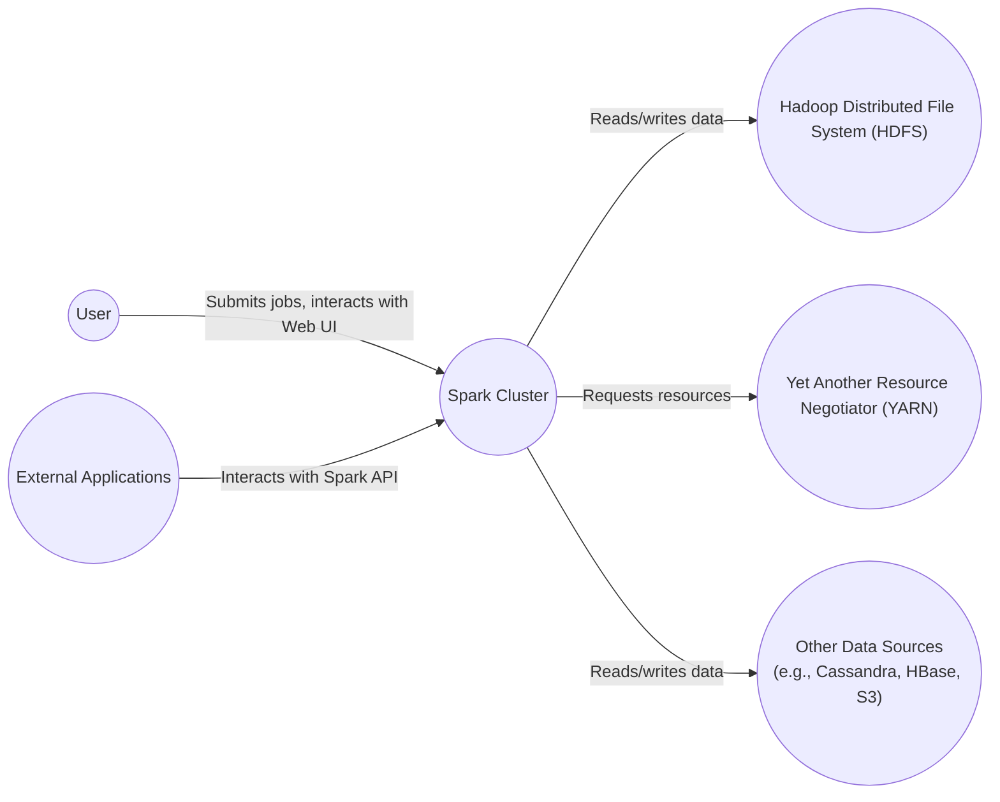
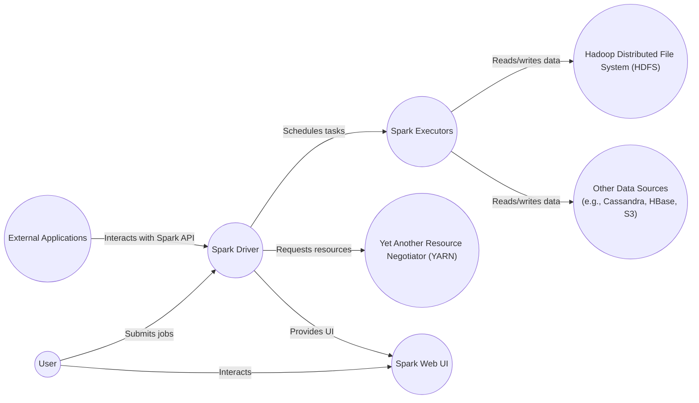
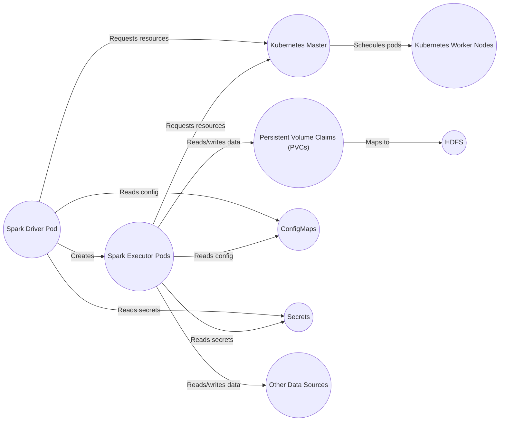
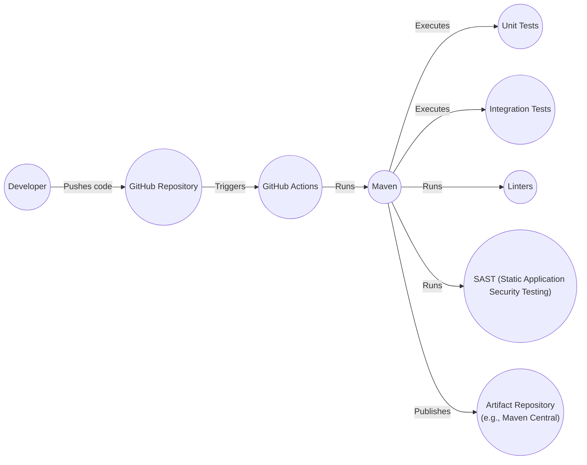

# BUSINESS POSTURE

Apache Spark is a mature, widely-used open-source project. It's a unified analytics engine for large-scale data processing.  The business priorities revolve around:

*   Performance:  Spark's core value proposition is speed and efficiency in processing large datasets.  Any design consideration must prioritize performance.
*   Scalability:  Spark needs to handle ever-increasing data volumes and user concurrency.  Designs must be inherently scalable.
*   Reliability:  Spark is often used in mission-critical data pipelines.  The system must be robust and fault-tolerant.
*   Extensibility:  Spark supports multiple languages (Scala, Java, Python, R) and provides various libraries (SQL, MLlib, GraphX, Streaming).  The design must accommodate new features and integrations.
*   Usability:  Spark should be relatively easy to use and deploy, despite its underlying complexity.
*   Community:  Maintaining a vibrant and active open-source community is crucial for Spark's continued success.
*   Security: While performance is key, security cannot be an afterthought. Protecting data and ensuring the integrity of computations is paramount, especially as Spark is used in increasingly sensitive contexts.

Business risks that need to be addressed:

*   Data Breaches: Unauthorized access to sensitive data processed by Spark is a major risk.
*   Data Corruption:  Malicious or accidental modification of data during processing can have severe consequences.
*   Denial of Service:  Attacks that prevent legitimate users from accessing or using Spark can disrupt critical operations.
*   Code Injection:  Vulnerabilities that allow attackers to inject malicious code into Spark jobs can compromise the entire system.
*   Supply Chain Attacks: Compromised dependencies or build processes can introduce vulnerabilities into Spark.
*   Configuration Errors: Misconfigured Spark deployments can expose data or create security loopholes.
*   Insider Threats: Malicious or negligent insiders with access to Spark clusters can pose a significant risk.

# SECURITY POSTURE

Existing security controls (based on the repository and general knowledge of Spark):

*   security control: Authentication: Spark supports various authentication mechanisms, including Kerberos, TLS/SSL, and SASL. (Described in Spark Security documentation).
*   security control: Authorization: Spark provides Access Control Lists (ACLs) to manage user permissions for viewing and modifying applications. (Described in Spark Security documentation).
*   security control: Event Logging: Spark logs various events, which can be used for auditing and security monitoring. (Described in Spark Configuration documentation).
*   security control: Encryption: Spark supports encryption of data in transit (using TLS/SSL) and at rest (using various mechanisms depending on the storage backend). (Described in Spark Security documentation).
*   security control: Web UI Security: Spark's Web UI can be secured using HTTPS and authentication. (Described in Spark Security documentation).
*   security control: Network Security: Spark deployments often rely on network security measures (firewalls, network segmentation) to protect cluster nodes. (Implementation depends on the deployment environment).

Accepted risks:

*   accepted risk: Complexity: Spark is a complex system, and securing it requires significant expertise. There's an inherent risk of misconfiguration or overlooked vulnerabilities.
*   accepted risk: Open Source: While open source promotes transparency, it also means that vulnerabilities are publicly disclosed, potentially giving attackers a window of opportunity before patches are applied.
*   accepted risk: Dependency Management: Spark relies on numerous third-party libraries, each with its own potential vulnerabilities. Managing these dependencies and keeping them up-to-date is an ongoing challenge.
*   accepted risk: Performance Trade-offs: Some security measures (e.g., strong encryption) can impact performance. There's a need to balance security and performance requirements.

Recommended security controls:

*   security control: Input Validation: Implement rigorous input validation for all data sources and user-provided code to prevent code injection vulnerabilities.
*   security control: Secrets Management: Use a secure secrets management solution (e.g., HashiCorp Vault) to store and manage sensitive credentials (passwords, API keys).
*   security control: Regular Security Audits: Conduct regular security audits and penetration testing to identify and address vulnerabilities.
*   security control: Least Privilege: Enforce the principle of least privilege, granting users and components only the minimum necessary permissions.
*   security control: Containerization Security: If deploying Spark in containers (e.g., Docker, Kubernetes), implement container security best practices (e.g., image scanning, runtime security monitoring).
*   security control: Supply Chain Security: Implement measures to secure the software supply chain, such as code signing, dependency scanning, and software bill of materials (SBOM).

Security Requirements:

*   Authentication:
    *   Support strong authentication mechanisms (e.g., Kerberos, multi-factor authentication).
    *   Integrate with existing enterprise identity providers (e.g., Active Directory, LDAP).
    *   Securely manage user credentials.

*   Authorization:
    *   Implement fine-grained access control based on roles and permissions.
    *   Support attribute-based access control (ABAC) for more dynamic authorization policies.
    *   Audit all authorization decisions.

*   Input Validation:
    *   Validate all user inputs and data sources to prevent code injection and other injection attacks.
    *   Use a whitelist approach to allow only known-good inputs.
    *   Sanitize inputs to remove potentially harmful characters or code.

*   Cryptography:
    *   Use strong encryption algorithms and key lengths.
    *   Protect data in transit using TLS/SSL with strong cipher suites.
    *   Protect data at rest using encryption mechanisms appropriate for the storage backend.
    *   Securely manage cryptographic keys.

# DESIGN

## C4 CONTEXT

Element Descriptions:

*   Element:
    *   Name: User
    *   Type: Person
    *   Description: Represents a user interacting with the Spark cluster. This could be a data scientist, data engineer, or an application submitting jobs to Spark.
    *   Responsibilities: Submitting Spark jobs, monitoring job progress, interacting with the Spark Web UI, accessing data processed by Spark.
    *   Security controls: Authentication (Kerberos, TLS/SSL, SASL), Authorization (ACLs), Input Validation.

*   Element:
    *   Name: Spark Cluster
    *   Type: Software System
    *   Description: The core Apache Spark system, including the driver and executors.
    *   Responsibilities: Processing data, executing user code, managing resources, coordinating tasks.
    *   Security controls: Authentication, Authorization, Event Logging, Encryption (in transit and at rest), Web UI Security, Input Validation, Secrets Management.

*   Element:
    *   Name: Hadoop Distributed File System (HDFS)
    *   Type: Software System
    *   Description: A distributed file system commonly used as a storage backend for Spark.
    *   Responsibilities: Storing data, providing data access to Spark.
    *   Security controls: HDFS Authentication (Kerberos), HDFS Authorization (ACLs), Data Encryption (at rest and in transit).

*   Element:
    *   Name: Yet Another Resource Negotiator (YARN)
    *   Type: Software System
    *   Description: A resource manager commonly used to manage resources for Spark clusters.
    *   Responsibilities: Allocating resources (CPU, memory) to Spark applications.
    *   Security controls: YARN Authentication (Kerberos), YARN Authorization (ACLs).

*   Element:
    *   Name: Other Data Sources (e.g., Cassandra, HBase, S3)
    *   Type: Software System
    *   Description: Represents other data sources that Spark can interact with.
    *   Responsibilities: Storing data, providing data access to Spark.
    *   Security controls: Dependent on the specific data source (e.g., Cassandra authentication, S3 access keys).

*   Element:
    *   Name: External Applications
    *   Type: Software System
    *   Description: Represents external applications that interact with the Spark API.
    *   Responsibilities: Programmatically interacting with Spark, submitting jobs, retrieving results.
    *   Security controls: Authentication, Authorization, Input Validation.

## C4 CONTAINER

Element Descriptions:

*   Element:
    *   Name: User
    *   Type: Person
    *   Description: Represents a user interacting with the Spark cluster.
    *   Responsibilities: Submitting Spark jobs, monitoring job progress, interacting with the Spark Web UI.
    *   Security controls: Authentication, Authorization, Input Validation.

*   Element:
    *   Name: Spark Driver
    *   Type: Container
    *   Description: The main process that runs the user's Spark application. It coordinates the execution of tasks across the executors.
    *   Responsibilities: Parsing user code, creating a DAG of tasks, scheduling tasks on executors, monitoring task progress, returning results to the user.
    *   Security controls: Authentication, Authorization, Input Validation, Secrets Management.

*   Element:
    *   Name: Spark Executors
    *   Type: Container
    *   Description: Processes that run individual tasks assigned by the Spark Driver.
    *   Responsibilities: Executing tasks, reading and writing data, caching data, reporting task status to the driver.
    *   Security controls: Authentication, Authorization, Encryption (in transit and at rest).

*   Element:
    *   Name: Spark Web UI
    *   Type: Container
    *   Description: A web-based interface for monitoring Spark applications.
    *   Responsibilities: Displaying job progress, resource usage, and other metrics.
    *   Security controls: Web UI Security (HTTPS, authentication).

*   Element:
    *   Name: HDFS
    *   Type: Software System
    *   Description: A distributed file system commonly used as a storage backend for Spark.
    *   Responsibilities: Storing data, providing data access to Spark.
    *   Security controls: HDFS Authentication (Kerberos), HDFS Authorization (ACLs), Data Encryption (at rest and in transit).

*   Element:
    *   Name: YARN
    *   Type: Software System
    *   Description: A resource manager commonly used to manage resources for Spark clusters.
    *   Responsibilities: Allocating resources (CPU, memory) to Spark applications.
    *   Security controls: YARN Authentication (Kerberos), YARN Authorization (ACLs).

*   Element:
    *   Name: Other Data Sources
    *   Type: Software System
    *   Description: Represents other data sources that Spark can interact with.
    *   Responsibilities: Storing data, providing data access to Spark.
    *   Security controls: Dependent on the specific data source.

*   Element:
    *   Name: External Applications
    *   Type: Software System
    *   Description: Represents external applications that interact with the Spark API.
    *   Responsibilities: Programmatically interacting with Spark, submitting jobs, retrieving results.
    *   Security controls: Authentication, Authorization, Input Validation.

## DEPLOYMENT

Possible deployment solutions:

1.  Standalone: Spark's built-in cluster manager. Simple to set up but less feature-rich than other options.
2.  YARN:  Hadoop's resource manager.  A common choice for Spark deployments in Hadoop clusters.
3.  Kubernetes:  A container orchestration platform.  Becoming increasingly popular for Spark deployments due to its scalability and flexibility.
4.  Mesos:  Another cluster manager. Less common than YARN or Kubernetes for Spark.
5.  Cloud Provider Solutions: AWS EMR, Azure HDInsight, Google Dataproc. Managed Spark services offered by cloud providers.

Chosen solution for detailed description: Kubernetes

Element Descriptions:

*   Element:
    *   Name: Spark Driver Pod
    *   Type: Kubernetes Pod
    *   Description: A Kubernetes pod running the Spark driver.
    *   Responsibilities: Running the Spark driver process.
    *   Security controls: Kubernetes RBAC, Network Policies, Pod Security Policies, Secrets Management.

*   Element:
    *   Name: Spark Executor Pods
    *   Type: Kubernetes Pod
    *   Description: Kubernetes pods running Spark executors.
    *   Responsibilities: Running Spark executor processes.
    *   Security controls: Kubernetes RBAC, Network Policies, Pod Security Policies, Secrets Management.

*   Element:
    *   Name: Kubernetes Master
    *   Type: Kubernetes Node
    *   Description: The control plane of the Kubernetes cluster.
    *   Responsibilities: Managing the cluster, scheduling pods, enforcing policies.
    *   Security controls: Kubernetes API Server Security, etcd Security, RBAC.

*   Element:
    *   Name: Kubernetes Worker Nodes
    *   Type: Kubernetes Node
    *   Description: Nodes in the Kubernetes cluster where pods are scheduled.
    *   Responsibilities: Running pods, providing compute resources.
    *   Security controls: Node Security (OS hardening, network security).

*   Element:
    *   Name: Persistent Volume Claims (PVCs)
    *   Type: Kubernetes Resource
    *   Description: Requests for persistent storage used by Spark executors.
    *   Responsibilities: Providing persistent storage for data.
    *   Security controls: Storage-level encryption, access controls.

*   Element:
    *   Name: ConfigMaps
    *   Type: Kubernetes Resource
    *   Description: Kubernetes objects used to store configuration data.
    *   Responsibilities: Providing configuration to Spark pods.
    *   Security controls: Access controls.

*   Element:
    *   Name: Secrets
    *   Type: Kubernetes Resource
    *   Description: Kubernetes objects used to store sensitive credentials.
    *   Responsibilities: Providing secrets to Spark pods.
    *   Security controls: Encryption, access controls.

*   Element:
    *   Name: HDFS
    *   Type: Software System
    *   Description: Hadoop Distributed File System.
    *   Responsibilities: Providing distributed storage.
    *   Security controls: HDFS security controls.

*   Element:
    *   Name: Other Data Sources
    *   Type: Software System
    *   Description: Other data sources used by Spark.
    *   Responsibilities: Providing data to Spark.
    *   Security controls: Data source-specific security controls.

## BUILD

Spark uses a multi-module Maven build. The build process is automated using CI environments, including GitHub Actions.

Security Controls in Build Process:

*   security control: GitHub Actions: Automates the build process, ensuring consistency and repeatability. Security features of GitHub Actions (e.g., access controls, audit logs) are utilized.
*   security control: Maven: Manages dependencies and builds the project. Dependency scanning tools (e.g., OWASP Dependency-Check) can be integrated into the Maven build to identify vulnerable dependencies.
*   security control: Unit Tests: Verify the correctness of individual components.
*   security control: Integration Tests: Verify the interaction between different components.
*   security control: Linters: Enforce coding standards and identify potential code quality issues.
*   security control: SAST (Static Application Security Testing): Analyzes the source code for security vulnerabilities. Tools like SpotBugs, Find Security Bugs can be integrated.
*   security control: Artifact Repository: A secure repository (e.g., Maven Central with appropriate access controls) is used to store build artifacts.

# RISK ASSESSMENT

Critical Business Processes:

*   Large-scale data processing and analytics: Spark's primary function is to process large datasets efficiently and reliably. Any disruption to this capability would have a significant impact.
*   Real-time data streaming: Spark Streaming enables real-time data processing, which is critical for many applications (e.g., fraud detection, real-time dashboards).
*   Machine learning: Spark MLlib provides a scalable machine learning library, used for various tasks like model training and prediction.

Data Sensitivity:

*   Spark can process a wide range of data, from publicly available datasets to highly sensitive personal information, financial data, and proprietary business data. The sensitivity of the data depends on the specific use case.
*   Data classifications should be established and enforced:
    *   Public: Data that can be freely shared.
    *   Internal: Data that is only accessible within the organization.
    *   Confidential: Data that is restricted to specific individuals or groups.
    *   Highly Confidential/Restricted: Data with the highest level of sensitivity, requiring strict access controls and encryption.

# QUESTIONS & ASSUMPTIONS

Questions:

*   What specific security certifications or compliance requirements (e.g., SOC 2, HIPAA, GDPR) are relevant to Spark deployments in different contexts?
*   What are the specific threat models used by the Spark community or major users of Spark?
*   What are the detailed procedures for incident response and vulnerability management for Spark?
*   What are the specific configurations and best practices for securing Spark in different cloud environments (AWS, Azure, GCP)?
*   Are there any specific performance benchmarks related to security features (e.g., encryption overhead)?

Assumptions:

*   BUSINESS POSTURE: The primary business goals are performance, scalability, reliability, extensibility, usability, community, and security.
*   SECURITY POSTURE: Basic security controls (authentication, authorization, logging, encryption) are in place, but there's room for improvement, especially in areas like input validation, secrets management, and supply chain security.
*   DESIGN: Spark is deployed in a distributed environment, often using YARN or Kubernetes, and interacts with various data sources. The build process is automated and includes some security checks.