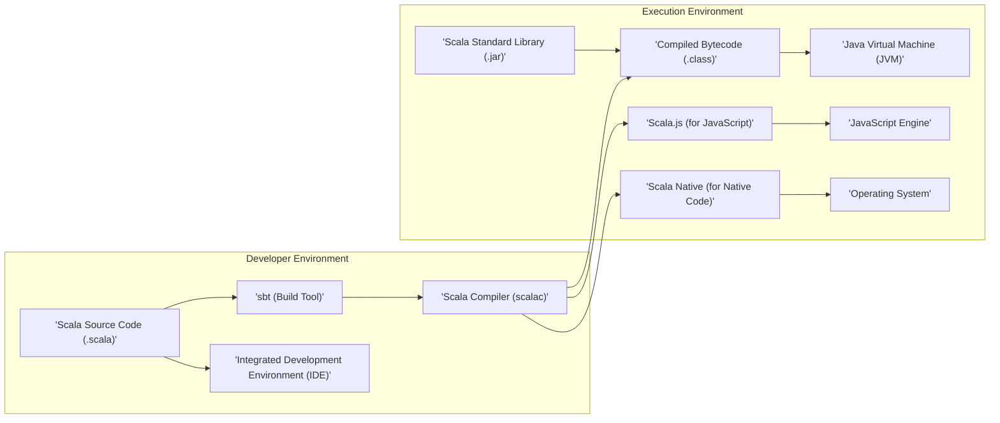
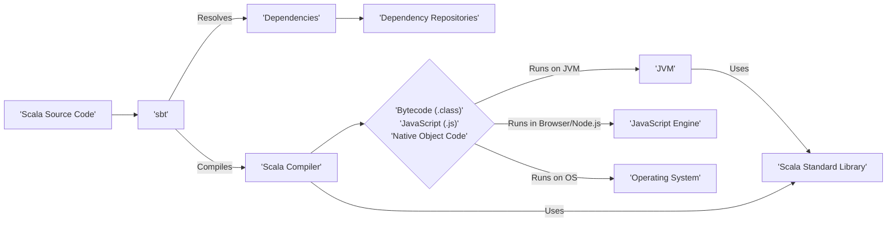
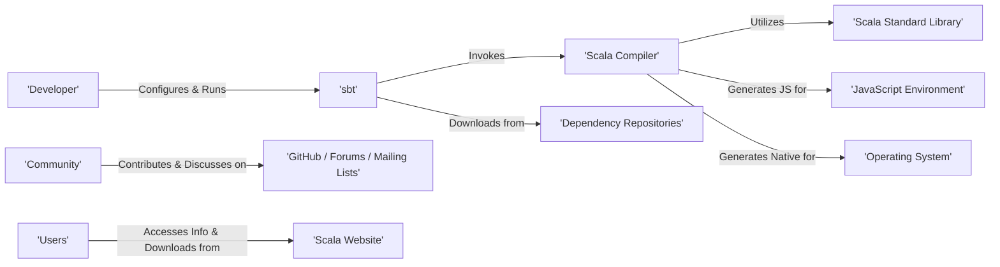

## Project Design Document: Scala Language and Ecosystem (Improved)

**Project Name:** Scala Language and Ecosystem

**Project Repository:** [https://github.com/scala/scala](https://github.com/scala/scala)

**Document Version:** 1.1

**Date:** October 26, 2023

**Prepared By:** AI Software Architecture Expert

---

### 1. Introduction

This document provides an enhanced design overview of the Scala programming language and its associated ecosystem, as represented by the `scala/scala` repository on GitHub. This improved document aims to provide a more detailed foundation for subsequent threat modeling activities. It elaborates on the key components, their interactions, and the overall architecture of the Scala project, highlighting potential areas of interest for security analysis.

### 2. Goals

The primary goals of the Scala project are:

* To design and implement a modern multi-paradigm programming language seamlessly integrating object-oriented and functional programming paradigms.
* To provide a robust and highly optimizing compiler (`scalac`) that translates Scala source code into efficient bytecode executable on various platforms, primarily the Java Virtual Machine (JVM), but also supporting JavaScript (via Scala.js) and native code (via Scala Native).
* To develop and maintain a comprehensive and well-designed standard library offering essential functionalities and abstractions for common programming tasks, ensuring both performance and ease of use.
* To foster a vibrant, inclusive, and active open-source community around the language, encouraging contributions and collaboration.
* To provide high-quality tools and infrastructure for building, testing, debugging, and managing Scala projects efficiently, with `sbt` as the primary build tool.
* To maintain a balance between language evolution and backward compatibility, ensuring that existing codebases can be migrated and updated with reasonable effort.

### 3. High-Level Architecture

The Scala project comprises a set of tightly integrated components that facilitate the development and execution of Scala applications. The core elements include the compiler, standard library, build tools, documentation infrastructure, and the language specification.

### 4. Key Components

This section provides a more detailed description of the major components within the Scala project.

* **Scala Compiler (`scalac`):**
    * **Functionality:** Parses Scala source code, performs detailed semantic analysis (including type checking and inference), applies various optimization techniques, and generates platform-specific bytecode.
    * **Key Aspects:**  Handles complex type system features, macro expansions, and language features like implicits. It's a central point for ensuring code correctness and performance.
    * **Sub-components:** Includes a parser, type checker, optimizer, and code generator for different target platforms.

* **Scala Standard Library:**
    * **Functionality:** Offers a rich collection of fundamental classes, interfaces, and data structures (e.g., collections, futures, streams, I/O utilities). Provides core abstractions used by most Scala applications.
    * **Key Aspects:** Designed for immutability and concurrency safety. Includes specialized libraries for XML processing, JSON handling, and more.
    * **Examples:** `scala.collection`, `scala.io`, `scala.concurrent`.

* **sbt (Simple Build Tool):**
    * **Functionality:** Automates the build process for Scala projects, including dependency management, compilation, testing, packaging, and publishing. Manages project structure and build configurations.
    * **Key Aspects:** Uses a declarative build definition. Extensible through plugins for adding custom build logic and integrations. Handles dependency resolution from repositories like Maven Central.
    * **Core Features:** Dependency management, incremental compilation, testing framework integration, packaging into JAR/WAR files.

* **Scala Language Specification:**
    * **Functionality:** A formal and detailed document defining the syntax, semantics, and type system of the Scala language. Serves as the ultimate reference for language implementers and users seeking precise understanding.
    * **Key Aspects:**  Maintained and updated to reflect changes and additions to the language. Provides a basis for compiler correctness and interoperability.

* **Scala Documentation:**
    * **Functionality:** Provides comprehensive resources for learning and using Scala, including API documentation (Scaladoc), tutorials, guides, and language references.
    * **Key Aspects:**  Generated from source code comments and dedicated documentation files. Crucial for developer productivity and understanding.

* **Scala Website (scala-lang.org):**
    * **Functionality:** Serves as the central online hub for the Scala community, providing information about the language, downloads, documentation access, community resources, and news.
    * **Key Aspects:**  A critical point for distributing official releases and communicating with the user base.

* **Scala Improvement Process (SIP):**
    * **Functionality:** A structured and transparent process for proposing, reviewing, and accepting changes to the Scala language and standard library. Ensures community involvement and careful consideration of language evolution.
    * **Key Aspects:** Involves public discussions, formal proposals, and review by a language committee.

* **Scala.js:**
    * **Functionality:** A compiler that translates Scala code into highly optimized JavaScript code, enabling the development of front-end web applications and Node.js applications using Scala.
    * **Key Aspects:**  Provides interoperability with existing JavaScript libraries and frameworks.

* **Scala Native:**
    * **Functionality:** An optimizing ahead-of-time compiler that translates Scala code into native machine code, allowing for high-performance applications without the overhead of a virtual machine.
    * **Key Aspects:**  Offers fine-grained control over memory management and interaction with system resources.

* **Community Build:**
    * **Functionality:** A systematic process where a large and diverse set of open-source Scala projects are regularly built against the latest versions of the Scala compiler. This helps identify potential regressions and compatibility issues early in the development cycle.
    * **Key Aspects:**  Provides valuable feedback to the compiler development team.

### 5. Data Flow

The typical data flow within the Scala development and execution lifecycle can be broken down into the following stages:

* **Source Code Creation & Editing:** Developers write and modify Scala source code files (`.scala`) using text editors or IDEs.
* **Build Definition:** Developers define project structure, dependencies, and build settings using `sbt`'s build definition language (typically in `build.sbt` files).
* **Dependency Resolution:** `sbt` analyzes the build definition and resolves project dependencies, downloading required libraries (JAR files) from configured repositories (e.g., Maven Central).
* **Compilation:** The `sbt` build tool invokes the `scalac` compiler, passing the source code files and compiler options.
    * **Input:** Scala source code files (`.scala`).
    * **Processing:** The compiler performs lexical analysis, parsing, semantic analysis (including type checking), optimization, and code generation.
    * **Output:** Compiled bytecode files (`.class` for JVM), JavaScript files (`.js` for Scala.js), or native object files (for Scala Native).
* **Packaging:** `sbt` packages the compiled bytecode and any necessary resources into distributable artifacts, such as JAR files for JVM applications.
* **Execution (JVM):** For JVM-based applications, the compiled bytecode (`.class` files) is loaded and executed by the Java Virtual Machine (JVM). The Scala Standard Library (`.jar`) is also loaded and used during execution.
    * **Input:** Compiled bytecode (`.class`) and required libraries.
    * **Processing:** The JVM interprets or performs just-in-time (JIT) compilation of the bytecode.
    * **Output:** The results of the application's execution.
* **Execution (Scala.js):** For Scala.js projects, the generated JavaScript code is executed within a JavaScript engine, typically in a web browser or Node.js environment.
    * **Input:** Generated JavaScript code (`.js`).
    * **Processing:** The JavaScript engine interprets and executes the code.
    * **Output:** The behavior and output of the web application.
* **Execution (Scala Native):** For Scala Native projects, the compiled native code is executed directly by the operating system.
    * **Input:** Compiled native executable.
    * **Processing:** The operating system loads and executes the native code.
    * **Output:** The results of the application's execution.

### 6. Interactions

The components of the Scala project interact in various ways to facilitate the development and execution of Scala applications:

* **Developer - sbt - Compiler:** Developers use `sbt` to trigger the compilation process. `sbt` configures and invokes the Scala compiler (`scalac`) with the necessary source files and options.
* **Compiler - Standard Library:** The Scala compiler relies on the Scala Standard Library for type information, core classes, and language features. The standard library is implicitly linked during compilation.
* **sbt - Dependency Repositories:** `sbt` interacts with remote dependency repositories (like Maven Central) to download and manage project dependencies.
* **Scala.js Compiler - JavaScript Environment:** The Scala.js compiler generates JavaScript code that is designed to interact seamlessly with the JavaScript environment, including browser APIs and Node.js modules.
* **Scala Native Compiler - Operating System:** The Scala Native compiler generates native code that interacts directly with the underlying operating system's APIs and hardware.
* **Community - GitHub/Forums/Mailing Lists:** The Scala community interacts through platforms like GitHub for code contributions and issue tracking, and through forums and mailing lists for discussions and support.
* **Website - Users:** The Scala website provides information, downloads, and documentation to users and developers.

### 7. Security Considerations (Preliminary)

This section expands on the initial security considerations, providing more specific examples of potential threats.

* **Compiler Vulnerabilities:**
    * **Malicious Code Injection:** Exploits in the compiler could allow attackers to inject malicious code into the generated bytecode.
    * **Denial of Service:** Carefully crafted malicious code could cause the compiler to crash or consume excessive resources.
    * **Information Disclosure:** Compiler bugs might inadvertently reveal sensitive information during the compilation process.

* **Dependency Management (Supply Chain Attacks):**
    * **Compromised Dependencies:** Malicious actors could inject vulnerabilities or backdoors into publicly available libraries that Scala projects depend on.
    * **Dependency Confusion:** Attackers could upload packages with the same name as internal dependencies to public repositories, leading to their inclusion in builds.
    * **Vulnerable Transitive Dependencies:** Projects might indirectly depend on vulnerable libraries through their direct dependencies.

* **Standard Library Vulnerabilities:**
    * **Bugs in Core Functionality:** Security flaws in standard library classes (e.g., handling of input, network operations) could be exploited by applications.
    * **Deserialization Issues:** Vulnerabilities related to object deserialization could allow for remote code execution.

* **Build Tool Vulnerabilities (`sbt`):**
    * **Code Execution through Plugins:** Malicious `sbt` plugins could execute arbitrary code during the build process.
    * **Build Definition Manipulation:** Attackers could potentially manipulate build definitions to introduce malicious dependencies or alter the build process.

* **Website Security (scala-lang.org):**
    * **Malware Distribution:** A compromised website could be used to distribute malicious versions of the Scala compiler or other tools.
    * **Phishing Attacks:** Attackers could use the website to trick developers into revealing credentials or downloading malicious software.

* **Scala.js Security:**
    * **Cross-Site Scripting (XSS):** Vulnerabilities in Scala.js applications could allow attackers to inject malicious scripts into web pages.
    * **Client-Side Data Manipulation:** Attackers could manipulate client-side data or logic to compromise the application.

* **Scala Native Security:**
    * **Memory Safety Issues:** Lack of automatic memory management in certain contexts could lead to buffer overflows or other memory corruption vulnerabilities.
    * **Direct System Call Vulnerabilities:** Improper handling of system calls could expose the application to security risks.

* **Community Infrastructure Security:**
    * **Compromised GitHub Repository:** Attackers gaining control of the `scala/scala` repository could introduce malicious code into the official codebase.
    * **Build Server Compromise:** If build servers are compromised, attackers could inject malicious code into official releases.

### 8. Diagrams

The diagrams included in the previous sections provide visual representations of the architecture and data flow.

### 9. Conclusion

This improved design document provides a more detailed and nuanced understanding of the Scala language and its ecosystem's architecture, specifically tailored for threat modeling purposes. By elaborating on the functionalities and interactions of key components, and by providing more concrete examples of potential security considerations, this document serves as a stronger foundation for identifying and mitigating potential vulnerabilities within the Scala platform and the applications built upon it. Further threat modeling activities should leverage this detailed understanding to systematically analyze potential attack vectors and develop appropriate security measures.