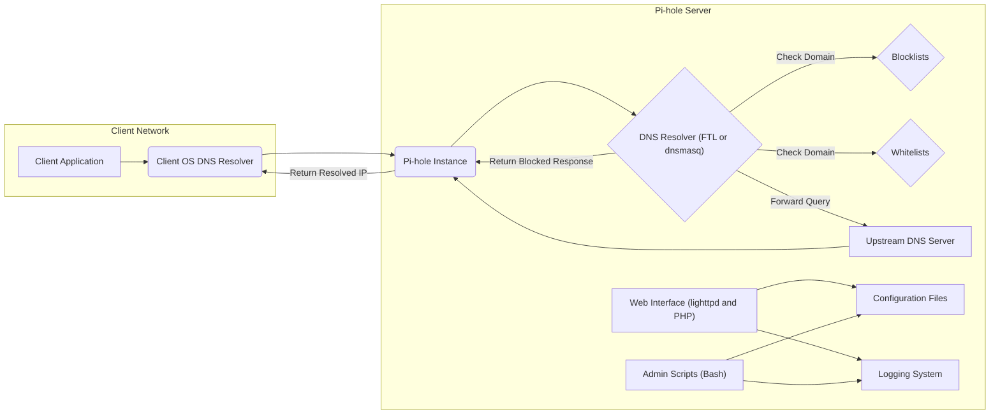

# Project Design Document: Pi-hole

**Version:** 1.1
**Date:** October 26, 2023
**Author:** AI Software Architect

## 1. Project Overview

Pi-hole is a free and open-source DNS sinkhole that operates as a network-wide ad blocker and privacy enhancer. By functioning as a local DNS server, Pi-hole intercepts DNS queries and prevents connections to domains known for serving advertisements, trackers, and potentially malicious content. This document details the architecture and key components of Pi-hole to facilitate comprehensive threat modeling and security analysis.

## 2. Goals

* To provide a clear, concise, and comprehensive description of Pi-hole's architecture and functionality.
* To explicitly identify the key components of Pi-hole and their interactions within the system.
* To clearly illustrate the flow of DNS queries and responses within the Pi-hole environment.
* To highlight the core technologies underpinning Pi-hole's operation and common deployment strategies.
* To establish a solid foundation for subsequent threat modeling exercises and security assessments.

## 3. Target Audience

* Security engineers and analysts responsible for conducting threat modeling and security audits.
* Software developers contributing to the Pi-hole project, requiring a high-level understanding of the system.
* System administrators involved in the deployment, configuration, and maintenance of Pi-hole instances.

## 4. Scope

This document focuses on the essential functionalities of Pi-hole as a DNS sinkhole and its associated web interface for management. The scope includes:

* The process of DNS query reception, processing, and blocking.
* The functionality and components of the web interface used for administration and configuration.
* Mechanisms for data storage and persistence of Pi-hole's configuration and logs.
* The primary dependencies and technologies that Pi-hole relies upon.
* Common and recommended deployment scenarios for Pi-hole.

This document explicitly excludes:

* Detailed specifications of individual blocklists and their maintenance.
* Highly customized or advanced configurations beyond standard operation.
* Specifics of the development environment and build processes.
* In-depth, code-level implementation details of Pi-hole's components.

## 5. High-Level Architecture

**Description:**

* **Client Network:** Represents the network segment where devices initiating DNS requests reside.
    * **Client Application:** Any software on a client device that requires domain name resolution (e.g., web browser, email client).
    * **Client OS DNS Resolver:** The operating system component responsible for handling DNS resolution requests from applications.
* **Pi-hole Instance:** The server or device running the Pi-hole software.
    * **DNS Resolver (FTL or dnsmasq):** The core component responsible for receiving DNS queries, evaluating them against blocklists and whitelists, and either forwarding them to upstream servers or returning a blocked response. FTL (Faster Than Light) is the newer, more performant DNS/DHCP server implementation.
    * **Blocklists:** Regularly updated lists of domains known for serving advertisements, trackers, and malware. These are the primary source of blocking decisions.
    * **Whitelists:** Lists of domains that are explicitly allowed, bypassing the blocklists. This is used to prevent false positives.
    * **Upstream DNS Server:** External DNS servers (e.g., those provided by internet service providers or public DNS services like Cloudflare or Google) used to resolve DNS queries for domains not present on the blocklists.
    * **Web Interface (lighttpd and PHP):** Provides a graphical user interface for managing Pi-hole settings, viewing statistics, updating blocklists, and performing other administrative tasks. `lighttpd` serves as the web server, and `PHP` provides the server-side scripting.
    * **Configuration Files:** Stores Pi-hole's settings, including upstream DNS server configurations, blocklist sources, whitelist entries, and web interface settings.
    * **Logging System:** Records DNS queries, blocked domains, administrative actions, and other system events for monitoring and analysis.
    * **Admin Scripts (Bash):** Shell scripts used for installation, updates, maintenance, and other administrative functions of Pi-hole.

## 6. Detailed Component Breakdown

### 6.1. DNS Resolver (FTL or dnsmasq)

* **Functionality:**
    * Accepts DNS queries from client devices on the network.
    * Consults locally stored blocklists and whitelists to determine if a queried domain should be blocked or allowed.
    * Forwards allowed DNS queries to the configured upstream DNS servers for resolution.
    * Caches resolved DNS records to improve response times for subsequent requests.
    * Optionally provides DHCP server functionality for the local network.
* **Key Features:**
    * High-performance DNS resolution.
    * Supports a wide range of DNS record types.
    * Seamless integration with blocklists and whitelists for filtering.
    * Comprehensive logging of DNS queries and responses.
* **Technology:** Primarily implemented in C/C++ (FTL) or C (dnsmasq).

### 6.2. Web Interface (lighttpd and PHP)

* **Functionality:**
    * Presents a user-friendly web-based interface for managing and monitoring Pi-hole.
    * Enables users to view real-time statistics, manage blocklists and whitelists, configure DNS and DHCP settings, and update the Pi-hole software.
    * Interacts with the DNS resolver and configuration files to apply user-defined settings.
* **Key Features:**
    * Secure user authentication and authorization mechanisms.
    * Interactive dashboards displaying key performance indicators and statistics.
    * Intuitive interfaces for managing blocklists and whitelists (adding, removing, updating).
    * Configuration panels for customizing DNS settings, DHCP server options, and other parameters.
* **Technology:** `lighttpd` (lightweight web server), PHP (server-side scripting language).

### 6.3. Blocklists

* **Functionality:**
    * Serve as the primary data source for identifying domains to be blocked.
    * Consist of lists of domain names known for serving advertisements, tracking scripts, or malware.
    * Are typically updated regularly from various publicly available sources.
    * Allow users to add custom blocklists or individual domains.
* **Key Features:**
    * Large and continuously updated databases of malicious and unwanted domains.
    * Highly customizable, allowing users to tailor blocking to their specific needs.
    * Support for various list formats and update mechanisms.
* **Technology:** Stored as plain text files, often in a simple domain-per-line format.

### 6.4. Whitelists

* **Functionality:**
    * Provide a mechanism to explicitly allow specific domains, overriding entries in the blocklists.
    * Used to prevent legitimate websites or services from being inadvertently blocked (false positives).
    * Can be managed through the web interface or by directly editing configuration files.
* **Key Features:**
    * Essential for maintaining the usability of the network by preventing over-blocking.
    * User-configurable, allowing for fine-grained control over allowed domains.
* **Technology:** Stored as plain text files.

### 6.5. Configuration Files

* **Functionality:**
    * Store all of Pi-hole's configuration settings, ensuring persistence across reboots.
    * Include settings for upstream DNS servers, blocklist sources, web interface access parameters, DHCP configurations, and other system-level options.
    * Are modified by the web interface, admin scripts, and sometimes directly by the user.
* **Key Features:**
    * Provide a central repository for all Pi-hole settings.
    * Well-defined structure and parameters for easy configuration.
* **Technology:** Primarily plain text files in various formats (e.g., `.conf` files). Key configuration files include `/etc/pihole/pihole-FTL.conf` and files within `/etc/dnsmasq.d/`.

### 6.6. Logging System

* **Functionality:**
    * Records DNS queries, blocked domains, administrative actions, and system events.
    * Provides valuable data for monitoring network activity, troubleshooting issues, and generating statistics.
    * Logs can be viewed through the web interface or by accessing the log files directly.
* **Key Features:**
    * Detailed records of DNS activity, including timestamps, client IPs, and queried domains.
    * Essential for identifying blocked domains and diagnosing potential problems.
* **Technology:** Utilizes standard system logging mechanisms, with log files typically located in `/var/log/pihole.log`, `/var/log/lighttpd/error.log`, and `/var/log/lighttpd/access.log`.

### 6.7. Admin Scripts (Bash)

* **Functionality:**
    * Automate common administrative tasks such as installation, updates, backups, and debugging.
    * Interact with the operating system and Pi-hole's components to perform configuration changes and maintenance operations.
* **Key Features:**
    * Simplify the deployment and ongoing management of Pi-hole.
    * Ensure consistent configuration and reduce the risk of manual errors.
* **Technology:** Primarily implemented using Bash shell scripting.

## 7. Data Flow

The typical flow of a DNS query through a Pi-hole instance is as follows:

1. A client application on the network initiates a DNS query to resolve a domain name.
2. This query is directed to the Pi-hole instance, which is configured as the primary DNS server for the network.
3. Pi-hole's DNS resolver (either FTL or dnsmasq) receives the incoming DNS query.
4. The resolver first checks the queried domain against the locally stored blocklists.
5. If the domain is found on a blocklist:
    * The resolver immediately returns a "null" IP address (typically 0.0.0.0 or ::) or refuses the connection, effectively blocking access to the domain.
    * This blocking event is recorded in the Pi-hole's log files.
6. If the domain is not found on any blocklist, the resolver then checks the whitelists.
7. If the domain is present on a whitelist:
    * The resolver bypasses further checks and proceeds to resolve the domain using the configured upstream DNS servers.
8. If the domain is neither blocked nor explicitly whitelisted, the resolver forwards the DNS query to the configured upstream DNS server.
9. The upstream DNS server resolves the domain name and returns the corresponding IP address to the Pi-hole instance.
10. The Pi-hole instance caches this resolved IP address for a specified time-to-live (TTL).
11. The Pi-hole instance then returns the resolved IP address to the original requesting client device.
12. The client device can now establish a connection with the resolved IP address.

## 8. Key Technologies

* **Operating System:** Typically a lightweight Linux distribution, such as Raspberry Pi OS (formerly Raspbian), Ubuntu Server, or Debian.
* **DNS Resolver:** Either FTL (a custom, high-performance DNS/DHCP server) or the well-established `dnsmasq`.
* **Web Server:** `lighttpd`, a lightweight and efficient web server.
* **Server-side Scripting:** PHP, used for the dynamic elements of the web interface.
* **Database (Optional):** SQLite, used for storing long-term statistics and query data.
* **Scripting Language:** Bash, used extensively for administrative scripts and automation.

## 9. Deployment Model

Pi-hole is commonly deployed as a dedicated server or virtual machine within a local network. Typical deployment scenarios include:

* **Dedicated Hardware (e.g., Raspberry Pi):** A popular and energy-efficient option, especially for home networks.
* **Virtual Machine (VM):** Deployed on a hypervisor like VirtualBox, VMware, or Hyper-V, offering flexibility and isolation.
* **Containerized Deployment (Docker):** Using Docker containers for portability, scalability, and simplified management.
* **Cloud Instance (Less Common):** While possible, deploying Pi-hole directly in the cloud is less common for its primary use case as a local network ad blocker.

In most deployments, the Pi-hole instance is configured as the primary DNS server for the local network, either through the network's DHCP server settings or by manually configuring DNS settings on individual devices.

## 10. Security Considerations (Initial)

This section provides an initial overview of potential security considerations relevant to Pi-hole. A more detailed threat model will expand upon these points.

* **Web Interface Security:**
    * **Authentication and Authorization:** Vulnerabilities in the authentication mechanisms could allow unauthorized access to the Pi-hole's settings and data.
    * **Cross-Site Scripting (XSS):** Input validation flaws could allow attackers to inject malicious scripts into the web interface, potentially compromising user sessions.
    * **Cross-Site Request Forgery (CSRF):** Attackers could potentially trick authenticated users into performing unintended actions on the Pi-hole instance.
    * **Command Injection:** Improper handling of user inputs in the web interface could lead to the execution of arbitrary commands on the server.
* **DNS Resolver Security:**
    * **DNS Spoofing/Cache Poisoning:** If not properly secured, the DNS resolver could be vulnerable to attacks that inject false DNS records into its cache.
    * **Vulnerabilities in dnsmasq/FTL:** Security flaws in the underlying DNS resolver software could be exploited.
    * **Denial of Service (DoS):** The DNS resolver could be targeted with DoS attacks, disrupting network connectivity.
* **Blocklist Integrity and Availability:**
    * **Compromised Blocklist Sources:** If the sources for blocklists are compromised, malicious domains could be inadvertently allowed.
    * **Availability of Blocklists:** Reliance on external sources means potential disruptions if those sources become unavailable.
* **Configuration File Security:**
    * **Sensitive Information:** Configuration files may contain sensitive information, such as API keys for external services.
    * **Access Control:** Improper file permissions could allow unauthorized modification of Pi-hole's configuration.
* **Logging Security:**
    * **Sensitive Data in Logs:** Logs may contain information about visited websites, which could be considered sensitive.
    * **Log Tampering:** Attackers might try to modify or delete logs to cover their tracks.
* **Admin Script Security:**
    * **Privilege Escalation:** Vulnerabilities in admin scripts could be exploited to gain elevated privileges on the system.
* **Network Security:**
    * **Firewall Configuration:** The Pi-hole instance should be protected by a firewall to restrict unauthorized access.
    * **Web Interface Access:** Access to the web interface should be limited to trusted networks or users.

This design document provides a foundational understanding of the Pi-hole project's architecture and components. This information is essential for conducting a thorough threat model to identify potential security vulnerabilities and risks associated with its deployment and operation.