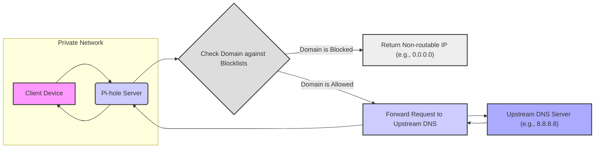

# Project Design Document: Pi-hole

**Version:** 1.1
**Date:** October 26, 2023
**Author:** AI Software Architecture Expert

## 1. Introduction

This document provides an enhanced and detailed design overview of the Pi-hole project, an open-source network-level advertisement and Internet tracker blocking application. This document aims to provide a comprehensive and easily understandable explanation of the system's architecture, core components, data pathways, and crucial interactions. It is specifically designed to serve as a strong foundation for subsequent threat modeling activities.

## 2. Goals and Objectives

The primary goals driving the development and operation of Pi-hole are:

*   **Network-Wide Ad Blocking:**  Preventing advertisements from being displayed on any device connected to the network.
*   **Internet Tracker Blocking:** Blocking requests to known tracking domains, enhancing user privacy.
*   **Improved Network Performance:** Reducing unnecessary network traffic associated with ads and trackers, potentially leading to faster page load times.
*   **Centralized DNS Filtering:** Providing a single point of control for managing DNS-based blocking for an entire network.
*   **Insightful Network Activity Monitoring:** Offering users clear statistics and logs detailing network requests and blocking activity.

## 3. Target Audience

This document is specifically intended for:

*   Security engineers and analysts tasked with performing threat modeling and security assessments of Pi-hole deployments.
*   Software developers actively contributing to the ongoing development and maintenance of the Pi-hole project.
*   System administrators responsible for the deployment, configuration, and ongoing management of Pi-hole instances.
*   Anyone seeking a deep and technically accurate understanding of Pi-hole's internal mechanisms and operational flow.

## 4. System Overview

Pi-hole functions primarily as a **DNS sinkhole**, intercepting and filtering DNS requests at the network level. It can also optionally act as a **DHCP server** for the private network. When a device on the network attempts to resolve a domain name (a DNS request), that request is first directed to Pi-hole. Pi-hole then checks if the requested domain is listed on one of its configured blocklists.

*   **Blocked Domain:** If the domain is on a blocklist, Pi-hole intentionally returns a non-routable IP address (typically `0.0.0.0` or `::`). This effectively prevents the client device from establishing a connection to that domain.
*   **Allowed Domain:** If the domain is not on a blocklist, Pi-hole forwards the DNS request to a designated **upstream DNS server** (e.g., Google Public DNS, Cloudflare DNS). The response from the upstream server is then relayed back to the requesting client device.

Here's a high-level architectural diagram illustrating this process:

## 5. Component Details

This section provides a detailed look at the key software components that make up the Pi-hole system:

*   **`dnsmasq`**:
    *   **Purpose:**  Acts as the central DNS resolver and optionally provides DHCP server functionality for the local network.
    *   **Functionality:**
        *   **Receives DNS Queries:** Listens for and receives DNS queries originating from client devices on the network.
        *   **Blocklist Filtering:**  Compares incoming DNS queries against the currently active blocklists.
        *   **Forwarding Allowed Queries:**  For DNS queries that are not on the blocklist, `dnsmasq` forwards them to the configured upstream DNS servers.
        *   **Returning Blocked Responses:** For blocked domains, `dnsmasq` returns a pre-configured IP address that effectively prevents the connection.
        *   **Optional DHCP Server:** Can assign IP addresses, DNS server information (pointing back to itself), and other network configuration details to client devices on the network.
    *   **Configuration:**  Primary configuration files are typically located at `/etc/dnsmasq.conf` and within the `/etc/dnsmasq.d/` directory. These files control its behavior, including upstream DNS servers and DHCP settings.

*   **`lighttpd`**:
    *   **Purpose:** A lightweight and efficient web server responsible for hosting the Pi-hole administration web interface.
    *   **Functionality:**
        *   **Serves Static Content:** Delivers the static files (HTML, CSS, JavaScript, images) that constitute the user interface.
        *   **Handles API Requests:**  Routes API requests from the web interface to the PHP backend for processing.
        *   **Manages Web Interface Access:**  Implements authentication mechanisms to control access to the administrative interface.
    *   **Configuration:** Configuration files are typically located in `/etc/lighttpd/lighttpd.conf` and within the `/etc/lighttpd/conf-enabled/` directory. These files define server settings, virtual hosts, and module configurations.

*   **PHP (processed by `php-fpm`)**:
    *   **Purpose:** The server-side scripting language used to implement the dynamic logic and functionality of the Pi-hole web interface. `php-fpm` (FastCGI Process Manager) is used to efficiently manage PHP processes.
    *   **Functionality:**
        *   **Dynamic Content Generation:** Generates dynamic HTML content for the web interface based on Pi-hole's current state and user interactions.
        *   **Processes User Input:** Handles data submitted through the web interface forms and actions.
        *   **Interacts with Pi-hole Core (FTL):** Communicates with the FTL daemon to retrieve statistics, manage settings, and control Pi-hole's behavior.
        *   **Configuration Management:**  Allows users to modify Pi-hole settings and configurations through the web interface.
    *   **Configuration:** PHP configuration files are typically found within the `/etc/php/` directory, controlling various aspects of PHP's execution environment.

*   **FTL (Faster Than Light)**:
    *   **Purpose:** The core Pi-hole daemon, responsible for the high-performance DNS blocking and logging functionalities.
    *   **Functionality:**
        *   **Blocklist Management:** Loads, parses, and efficiently manages the lists of domains to be blocked.
        *   **Real-time DNS Filtering:** Provides a rapid mechanism for checking incoming DNS queries against the active blocklists.
        *   **DNS Query Logging:** Collects and stores detailed logs of DNS queries processed by Pi-hole.
        *   **Statistics Generation:**  Aggregates and provides statistics on DNS queries, blocking activity, and client behavior for display in the web interface.
        *   **Inter-Process Communication:** Communicates with `dnsmasq` using shared memory or other inter-process communication methods to efficiently determine if a domain should be blocked.
    *   **Configuration:** The primary configuration file for FTL is typically located at `/etc/pihole/pihole-FTL.conf`, controlling logging behavior, blocking modes, and other core functionalities.

*   **Pi-hole Web Interface (Admin Console)**:
    *   **Purpose:** Provides a user-friendly graphical interface for managing, configuring, and monitoring the Pi-hole server.
    *   **Functionality:**
        *   **Dashboard:** Displays key statistics and visualizations of network activity and blocking performance.
        *   **Blocklist Management:** Allows users to add, remove, and manage their blocklists and whitelists.
        *   **Query Log Viewer:** Provides a searchable interface for examining the DNS query logs.
        *   **Settings and Configuration:** Enables users to configure various Pi-hole settings, including upstream DNS servers, DHCP settings, and privacy options.
        *   **Update Management:** Facilitates updating Pi-hole components and blocklists.
    *   **Implementation:** Primarily built using a combination of PHP for backend logic, and HTML, CSS, and JavaScript for the front-end user interface.

*   **Pi-hole CLI (Command-Line Interface)**:
    *   **Purpose:** Offers a command-line alternative for managing and configuring Pi-hole, suitable for scripting and automation.
    *   **Functionality:**
        *   **Administrative Tasks:** Allows users to perform various administrative tasks, such as updating blocklists, flushing the DNS cache, and managing settings, directly from the command line.
        *   **Scripting and Automation:** Enables integration with scripts and automation tools for tasks like scheduled updates or configuration management.
    *   **Implementation:** Primarily implemented using shell scripts, leveraging command-line utilities and interacting with Pi-hole's core components.

*   **Gravity**:
    *   **Purpose:** The process responsible for automatically updating and managing the blocklists used by Pi-hole.
    *   **Functionality:**
        *   **Blocklist Downloading:** Downloads blocklists from user-configured sources (URLs).
        *   **List Processing:** Merges, de-duplicates, and formats the downloaded blocklists into a consolidated and optimized format.
        *   **Whitelist/Blacklist Management:** Integrates user-defined whitelists and blacklists into the final blocklist.
        *   **Blocklist Optimization:**  Optimizes the blocklists for efficient lookup by the FTL daemon.
    *   **Configuration:** The primary configuration for Gravity, including the list of blocklist sources, is typically stored in `/etc/pihole/gravity.list` and other files within the `/etc/pihole/` directory.

*   **Update Scripts**:
    *   **Purpose:**  Automated scripts designed to update the Pi-hole software itself and the blocklists it uses.
    *   **Functionality:**
        *   **Pi-hole Updates:** Downloads and installs new versions of Pi-hole components.
        *   **Blocklist Updates:** Executes the Gravity process to fetch and update the blocklists.
        *   **Scheduling:** Typically configured to run periodically using system scheduling tools like `cron`.

*   **Operating System**:
    *   **Purpose:** The foundational operating system (typically a Linux distribution like Raspberry Pi OS, Ubuntu, or Debian) upon which Pi-hole is installed and runs.
    *   **Functionality:**
        *   **Provides Core Infrastructure:** Offers the necessary kernel, libraries, and system utilities for Pi-hole's components to function.
        *   **Manages Networking:** Handles network interfaces, routing, and other networking functionalities.
        *   **File System Management:** Provides access to the file system for storing configuration files, logs, and blocklists.
        *   **Security Features:**  Offers underlying security features that Pi-hole relies on, such as user permissions and process isolation.

## 6. Data Flow

This section describes the typical movement of data within the Pi-hole system for a standard DNS query and for other key operations:

**Data Flow for a DNS Query:**

1. **Client Initiates DNS Request:** A client device on the network sends a DNS query to the configured DNS server, which is the Pi-hole instance.
2. **`dnsmasq` Receives Query:** The `dnsmasq` service running on the Pi-hole server receives the incoming DNS query.
3. **Blocklist Lookup (via FTL):** `dnsmasq` (or FTL, depending on the specific configuration) checks if the requested domain name exists within the currently loaded blocklists.
4. **Domain is Blocked:**
    *   If the domain is found on a blocklist, `dnsmasq` generates a response containing a non-routable IP address (e.g., `0.0.0.0` or `::`).
    *   This response is sent back to the requesting client, preventing the client from connecting to the blocked domain.
    *   FTL logs this blocked query event.
5. **Domain is Allowed:**
    *   If the domain is not found on any blocklist, `dnsmasq` forwards the original DNS query to one or more pre-configured upstream DNS servers.
6. **Upstream DNS Resolution:** The upstream DNS server resolves the domain name to its corresponding IP address and sends the response back to `dnsmasq`.
7. **Response Relayed to Client:** `dnsmasq` receives the resolved IP address from the upstream server, caches it temporarily (based on the Time-To-Live or TTL value), and then forwards the IP address to the original requesting client device.
8. **Query Logging:** FTL records details of the DNS query, including the requested domain, the client IP address, the upstream server used (if applicable), and whether the query was blocked or allowed.

**Data Flow for Web Interface Interaction:**

1. **User Accesses Web Interface:** A user opens a web browser and navigates to the Pi-hole's web interface address.
2. **`lighttpd` Handles Request:** The `lighttpd` web server receives the incoming HTTP request.
3. **PHP Processing (if needed):** For requests to dynamic pages or API endpoints, `lighttpd` passes the request to the `php-fpm` service.
4. **PHP Logic Execution:** The PHP scripts process the request, which may involve:
    *   **Retrieving Statistics from FTL:** Querying FTL for real-time data on DNS queries and blocking activity.
    *   **Reading/Writing Configuration:** Accessing and modifying Pi-hole's configuration files.
    *   **Interacting with Pi-hole Core:**  Sending commands to the Pi-hole core to update settings or manage blocklists.
5. **Response Generation:** The PHP scripts generate the appropriate response, which could be HTML for web pages, JSON for API responses, or other data formats.
6. **`lighttpd` Sends Response:** `lighttpd` sends the generated response back to the user's web browser.

**Data Flow for Blocklist Updates (Gravity Process):**

1. **Gravity Execution:** The Gravity script is executed, either manually by a user or automatically via a scheduled task.
2. **Blocklist Download:** Gravity downloads the blocklists from the URLs specified in its configuration.
3. **List Processing and Merging:** Gravity processes the downloaded lists, removing duplicates, and merging them into a single consolidated list.
4. **Whitelist/Blacklist Application:** User-defined whitelists and blacklists are applied to refine the consolidated blocklist.
5. **Blocklist Optimization:** The blocklist is optimized for efficient lookup by the FTL daemon.
6. **FTL Update:** The updated blocklists are loaded and made available to the FTL daemon.
7. **`dnsmasq` Reload (if necessary):**  `dnsmasq` may be signaled or reloaded to ensure it is using the latest blocklist data.

## 7. Security Considerations

This section highlights important security considerations relevant to the Pi-hole project:

*   **Web Interface Security:**
    *   **Protection against Web Vulnerabilities:** Implementing measures to prevent common web application vulnerabilities such as Cross-Site Scripting (XSS), Cross-Site Request Forgery (CSRF), and SQL Injection attacks.
    *   **Secure Authentication and Authorization:** Employing robust authentication mechanisms to verify user identities and authorization controls to restrict access to sensitive features.
    *   **Regular Security Audits:** Conducting periodic security audits of the web interface codebase to identify and address potential vulnerabilities.
    *   **Input Sanitization:**  Carefully sanitizing user input to prevent injection attacks.
*   **DNS Security:**
    *   **Protection against DNS Spoofing/Poisoning:** Implementing safeguards to mitigate the risk of DNS spoofing and poisoning attacks.
    *   **DNSSEC Validation:** Considering the implementation of DNSSEC (Domain Name System Security Extensions) validation for upstream DNS servers to ensure the integrity of DNS responses.
    *   **Secure Upstream Communication:** Exploring the use of secure protocols like DNS over HTTPS (DoH) or DNS over TLS (DoT) for communication with upstream DNS servers to enhance privacy and security.
*   **Blocklist Integrity:**
    *   **Trustworthy Sources:**  Ensuring the reliability and trustworthiness of the sources from which blocklists are obtained.
    *   **Preventing Blocklist Poisoning:** Implementing mechanisms to prevent malicious actors from injecting harmful entries into blocklists.
    *   **Blocklist Curation:** Regularly reviewing and curating the default blocklists to ensure accuracy and minimize false positives.
*   **Update Security:**
    *   **Secure Update Mechanisms:** Utilizing secure protocols (HTTPS) and verification mechanisms (e.g., digital signatures) for updating Pi-hole components and blocklists.
    *   **Verification of Updates:** Verifying the integrity and authenticity of downloaded updates to prevent the installation of malicious software.
*   **Operating System Security:**
    *   **OS Hardening:**  Securing the underlying operating system by applying security patches, disabling unnecessary services, and configuring firewalls appropriately.
    *   **Regular OS Updates:**  Maintaining the operating system with the latest security updates and patches.
    *   **Firewall Configuration:**  Properly configuring the firewall to restrict network access to only necessary ports and services.
*   **Access Control:**
    *   **Restricting Access:** Limiting access to the Pi-hole web interface and configuration files to authorized users only.
    *   **Strong Authentication:** Enforcing the use of strong passwords or other multi-factor authentication methods.
*   **Logging and Monitoring:**
    *   **Secure Log Storage:**  Storing DNS query logs securely and implementing appropriate access controls.
    *   **Monitoring for Anomalies:** Implementing mechanisms for monitoring Pi-hole's performance and security, looking for suspicious activity.
*   **DHCP Security (if enabled):**
    *   **DHCP Starvation Prevention:** Implementing measures to prevent DHCP starvation attacks.
    *   **Rogue DHCP Server Prevention:**  Protecting against rogue DHCP servers on the network.

## 8. Dependencies

Pi-hole relies on the following external software components and services to function:

*   **Core OS Libraries:** Standard libraries provided by the underlying Linux distribution.
*   **`dnsmasq`**:  The core DNS resolver and optional DHCP server.
*   **`lighttpd`**:  The web server for the administration interface.
*   **PHP**: The scripting language for the web interface backend.
*   **`php-fpm`**:  The FastCGI Process Manager for PHP.
*   **`curl` or `wget`**: Command-line tools used for downloading blocklists and updates.
*   **`cron`**: A time-based job scheduler used for automating tasks like blocklist updates.
*   **Database (e.g., SQLite)**: Used for storing settings and potentially long-term query logs.
*   **JavaScript Libraries (e.g., jQuery, Chart.js)**:  Used within the web interface for enhanced functionality and visualizations.

## 9. Deployment Considerations

*   **Hardware Requirements:**  Generally minimal, allowing Pi-hole to run efficiently on low-resource devices like a Raspberry Pi.
*   **Supported Operating Systems:** Compatible with various Linux distributions, including Raspberry Pi OS, Ubuntu, and Debian.
*   **Network Configuration:** Requires configuring network devices (routers, clients) to use the Pi-hole instance as their primary DNS server.
*   **Installation Process:**  Typically involves a straightforward automated installation script.
*   **Configuration Flexibility:** Offers a wide range of configuration options accessible through both the web interface and the command-line interface.

## 10. Future Enhancements (Out of Scope)

Details of planned future enhancements are intentionally omitted from this document, as its primary focus is to provide a clear and detailed design of the current system for threat modeling purposes.

## 11. Glossary

*   **DNS:** Domain Name System - The system that translates human-readable domain names into IP addresses.
*   **DHCP:** Dynamic Host Configuration Protocol - A network protocol that automatically assigns IP addresses and other network configuration parameters to devices.
*   **FTL:** Faster Than Light - The name of the core Pi-hole daemon responsible for efficient DNS filtering and logging.
*   **CLI:** Command-Line Interface - A text-based interface for interacting with the system.
*   **API:** Application Programming Interface - A set of rules and specifications that software programs can follow to communicate with each other.
*   **XSS:** Cross-Site Scripting - A type of web security vulnerability that allows attackers to inject malicious scripts into web pages viewed by other users.
*   **CSRF:** Cross-Site Request Forgery - A type of web security vulnerability that allows an attacker to induce users to perform actions they do not intend to perform.
*   **SQL Injection:** A code injection technique used to attack data-driven applications, in which malicious SQL statements are inserted into an entry field for execution.
*   **DNSSEC:** Domain Name System Security Extensions - A suite of security extensions to the DNS protocol that provide authentication of DNS data, cryptographic signatures to ensure that DNS data hasn't been tampered with.
*   **TTL:** Time To Live - A mechanism that limits the lifespan of data in a network or system. In DNS, it specifies how long a DNS record can be cached.

This revised document provides a more comprehensive and clearly articulated design overview of the Pi-hole project. The enhanced descriptions, refined data flow explanations, and explicit security considerations aim to provide a robust foundation for effective threat modeling activities.