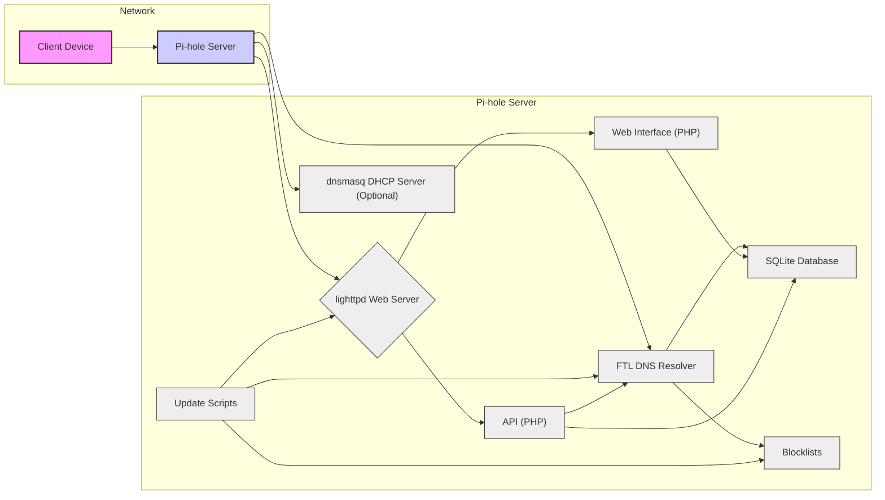
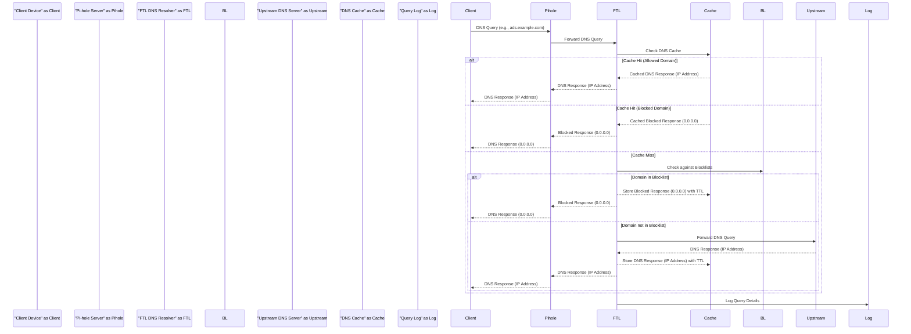

# Project Design Document: Pi-hole - Network-Wide Ad Blocker

**Version:** 1.1
**Date:** October 26, 2023
**Author:** AI Expert

## 1. Introduction

This document provides a detailed design overview of the Pi-hole project, an open-source network-wide ad blocker. This document is intended to serve as a foundation for subsequent threat modeling activities. It outlines the system architecture, key components, data flow, and deployment considerations.

Pi-hole acts as a DNS sinkhole and optionally a DHCP server, designed to block advertisements and tracking domains for all devices on a network. It operates at the DNS level, preventing devices from resolving the domain names of ad-serving servers, thus blocking ads before they are even requested.

This document focuses on the core components and functionalities of Pi-hole as described in the official GitHub repository: [https://github.com/pi-hole/pi-hole](https://github.com/pi-hole/pi-hole).

## 2. System Architecture Overview

Pi-hole's architecture can be broadly categorized into the following key components:

*   **Web Interface (Admin Console):**  A user-friendly web interface for managing Pi-hole settings, viewing statistics, and controlling blocklists. Provides an administrative user interface.
*   **DNS Resolver (FTL - Faster Than Light):** The core DNS resolution engine, responsible for processing DNS queries, applying blocking rules based on blocklists and whitelists, and caching DNS responses.
*   **Web Server (lighttpd):**  Serves the web interface, API endpoints, and static content.
*   **DHCP Server (dnsmasq - optional):**  Provides DHCP services to the network, optionally integrated with Pi-hole for DNS configuration. Can be enabled or disabled during installation and configuration.
*   **API (Web API):**  Provides programmatic access to Pi-hole functionalities for automation, integration with other systems, and mobile applications.
*   **Database (SQLite):** Stores configuration settings, query logs, statistics, whitelists, blacklists, and API keys.
*   **Blocklists (External Lists):**  Lists of domains to be blocked, sourced from external providers (URLs) and configurable by the user. These lists are periodically updated.
*   **Update Mechanism (Scripts):**  Automated scripts for updating blocklists, Pi-hole software, and related components. Ensures the system stays up-to-date with latest blocklists and software versions.

Below is a high-level architecture diagram illustrating the relationships between these components:

## 3. Component Details

This section provides a more detailed description of each component within the Pi-hole architecture.

### 3.1. Web Interface (Admin Console)

*   **Functionality:** Provides a web-based graphical user interface for administrators to manage and monitor Pi-hole. Key functionalities include:
    *   **Dashboard:** Displays real-time statistics such as total queries, queries blocked, percentage blocked, and top blocked domains.
    *   **Blocklist Management:** Allows users to add, remove, enable, disable, and update blocklists from configured URLs. Supports adding custom blocklists.
    *   **Whitelist and Blacklist Management:** Enables users to manually whitelist or blacklist specific domains, overriding blocklists.
    *   **DNS Settings:** Configuration of upstream DNS servers (e.g., Google, Cloudflare, custom), conditional forwarding for specific domains, and DNSSEC settings.
    *   **DHCP Server Configuration (if enabled):** Management of DHCP range, lease time, gateway, and other DHCP options.
    *   **Query Log Viewer:** Displays historical DNS query logs with filtering and search capabilities.
    *   **Settings:** Configuration of various Pi-hole settings, including privacy levels, interface settings, and API settings.
    *   **Update Functionality:** Initiates updates for Pi-hole software and blocklists.
    *   **API Key Management:** Generates and manages API keys for programmatic access.
    *   **User Roles:** Primarily designed for a single administrator user. No built-in role-based access control for multiple users.
*   **Technology:**
    *   Frontend: HTML, CSS, JavaScript.
    *   Backend: PHP.
    *   Web Server: Served by lighttpd.
    *   Uses AJAX for dynamic updates and interactions with the API.
*   **Interfaces:**
    *   **Web Browser (User Interface):** Accessed via standard web browsers (Chrome, Firefox, Safari, etc.) over HTTP or HTTPS.
    *   **API Client (Internal):** Interacts with the Pi-hole API (Section 3.5) to retrieve data and apply configuration changes.
    *   **Database (SQLite):** Reads and writes configuration data, statistics, and user settings to the SQLite database (Section 3.6).
    *   **FTL DNS Resolver (Inter-Process Communication):** Communicates with the FTL DNS resolver (Section 3.2) to fetch real-time statistics and trigger actions like flushing the DNS cache.

### 3.2. DNS Resolver (FTL - Faster Than Light)

*   **Functionality:** The core DNS resolution and ad-blocking engine. It performs the following actions:
    *   **Receives DNS Queries:** Listens for DNS queries on UDP and TCP port 53 from client devices.
    *   **Blocklist Filtering:** Checks incoming DNS queries against configured blocklists and whitelists. Blocklists are typically domain lists loaded from files.
    *   **Whitelist Exception:** Prioritizes whitelists over blocklists. Domains in the whitelist are always allowed, even if present in blocklists.
    *   **Sinkholing:** For blocked domains, returns a predefined IP address (typically 0.0.0.0 or ::0), effectively preventing connection to ad servers.
    *   **Upstream DNS Resolution:** For allowed domains, forwards the DNS query to configured upstream DNS servers (e.g., public DNS resolvers or ISP DNS).
    *   **DNS Caching:** Caches DNS responses (both blocked and allowed) to improve performance and reduce latency for subsequent queries. Caching respects TTL (Time-To-Live) values from DNS responses.
    *   **Query Logging:** Logs DNS queries, including timestamp, client IP, domain name, query type, and status (blocked/allowed/cached/forwarded). Logs are stored in the SQLite database.
    *   **Statistics Generation:** Tracks and aggregates DNS query statistics, such as total queries, blocked queries, forwarded queries, and query types.
*   **Technology:**
    *   Core: Written in C for performance and efficiency.
    *   Configuration: Reads configuration from the SQLite database and configuration files.
    *   Blocklist Storage: Blocklists are loaded into memory for fast lookups. Efficient data structures are used for domain matching.
*   **Interfaces:**
    *   **Network (DNS Queries):** Listens on UDP/TCP port 53 for incoming DNS queries from client devices.
    *   **Database (SQLite):** Reads configuration settings (blocklists, whitelists, upstream DNS servers) and writes query logs and statistics to the SQLite database (Section 3.6).
    *   **Upstream DNS Servers (Network):** Sends DNS queries to configured upstream DNS servers over UDP/TCP port 53.
    *   **Web Interface/API (Inter-Process Communication):** Provides real-time statistics and control interfaces to the web interface and API, likely through shared memory or sockets.

### 3.3. Web Server (lighttpd)

*   **Functionality:** A lightweight and efficient web server responsible for serving web content for Pi-hole.
    *   **Web Interface Hosting:** Serves the files for the Pi-hole admin web interface (HTML, CSS, JavaScript, PHP scripts).
    *   **API Endpoint Hosting:** Handles HTTP requests for the Pi-hole API (Section 3.5), executing PHP scripts to process API calls.
    *   **Static File Serving:** Serves static files such as images, stylesheets, and JavaScript files for the web interface.
    *   **HTTPS Support (Optional):** Can be configured to serve content over HTTPS for secure access to the web interface and API.
*   **Technology:**
    *   Web Server: lighttpd.
    *   Scripting: PHP interpreter for executing web interface and API logic.
    *   Configuration: lighttpd configuration files are managed by Pi-hole installation and update scripts.
*   **Interfaces:**
    *   **Network (HTTP/HTTPS Requests):** Listens on TCP ports 80 (HTTP) and optionally 443 (HTTPS) for incoming web requests from user browsers and API clients.
    *   **PHP Interpreter:** Executes PHP scripts for the web interface and API logic.
    *   **File System:** Accesses static files (HTML, CSS, JavaScript, images) from the web interface directory.

### 3.4. DHCP Server (dnsmasq - optional)

*   **Functionality:** An optional DHCP server that can be enabled to provide network configuration to devices. When enabled, it:
    *   **IP Address Assignment:** Dynamically assigns IP addresses to devices on the network using DHCP.
    *   **DNS Server Advertisement:**  Crucially, advertises the Pi-hole server's IP address as the primary DNS server to DHCP clients. This ensures that all devices using DHCP will automatically use Pi-hole for DNS resolution.
    *   **DHCP Options:** Can provide other DHCP options such as default gateway, subnet mask, and custom options.
    *   **Lease Management:** Manages DHCP leases, tracking which IP addresses are assigned to which devices and for how long.
    *   **Integration with DNS:** dnsmasq also includes a lightweight DNS forwarder, but in Pi-hole's context, its primary role is DHCP server.
*   **Technology:**
    *   DHCP Server: dnsmasq.
    *   Configuration: dnsmasq configuration is managed by Pi-hole scripts and settings.
*   **Interfaces:**
    *   **Network (DHCP Requests/Responses):** Listens on UDP port 67 for DHCP requests and sends DHCP responses on UDP port 68.
    *   **Configuration Files:** Reads configuration from dnsmasq configuration files, which are managed by Pi-hole.

### 3.5. API (Web API)

*   **Functionality:** Provides a programmatic interface (RESTful-like Web API) to interact with Pi-hole functionalities. Key functionalities accessible via the API include:
    *   **Statistics Retrieval:** Retrieve current statistics (query counts, blocked percentage, etc.) in JSON format.
    *   **Control Blocking:** Enable or disable ad blocking programmatically.
    *   **Whitelist/Blacklist Management:** Add, remove, and list domains in whitelists and blacklists.
    *   **DNS Cache Flushing:** Clear the DNS cache of the FTL DNS resolver.
    *   **Query Log Access:** Retrieve recent query logs (potentially limited for performance reasons).
    *   **System Control:** Reboot or shutdown the Pi-hole server (requires higher privileges/authentication).
    *   **Authentication:** API access is typically secured using API keys.
*   **Technology:**
    *   Implementation: PHP scripts served by lighttpd.
    *   Data Format: Primarily uses JSON for request and response bodies.
    *   Protocol: HTTP/HTTPS.
    *   Authentication: API keys are used for authentication. API keys are generated and managed through the web interface.
*   **Interfaces:**
    *   **Network (HTTP/HTTPS API Requests):** Accessible via HTTP/HTTPS requests to the lighttpd web server on standard ports (80/443) or custom ports.
    *   **FTL DNS Resolver (Internal API Calls):** Interacts with the FTL DNS resolver (Section 3.2) to retrieve statistics, flush cache, and control blocking status.
    *   **Database (SQLite):** Accesses the SQLite database (Section 3.6) to manage whitelists, blacklists, API keys, and retrieve configuration data.

### 3.6. Database (SQLite)

*   **Functionality:**  Provides persistent storage for Pi-hole's data.
    *   **Configuration Storage:** Stores Pi-hole configuration settings, such as upstream DNS servers, enabled blocklists, DHCP settings, and API keys.
    *   **Query Log Storage:** Stores historical DNS query logs for analysis and reporting.
    *   **Statistics Storage:** Stores aggregated statistics about DNS queries and blocking activity.
    *   **Whitelist/Blacklist Storage:** Persistently stores user-defined whitelists and blacklists.
*   **Technology:**
    *   Database Engine: SQLite, a lightweight file-based database.
    *   Data Storage: Data is stored in a single file on the Pi-hole server's file system.
    *   Access: Accessed directly by the FTL DNS resolver, web interface, API, and update scripts.
*   **Interfaces:**
    *   **File System (Database File):** The SQLite database is stored as a file on the local file system.
    *   **FTL DNS Resolver (Database Access Library):** FTL uses SQLite libraries to directly access and interact with the database.
    *   **Web Interface/API (Database Access Library):** Web interface and API PHP scripts use SQLite libraries to interact with the database.
    *   **Update Scripts (Database Access Library):** Update scripts may also interact with the database for configuration updates.

### 3.7. Blocklists (External Lists)

*   **Functionality:**  Provides the lists of domains that Pi-hole uses to identify and block ad-serving and tracking domains.
    *   **Domain Lists:** Contain lists of domain names, typically one domain per line in plain text files.
    *   **External Sources:** Blocklists are sourced from external providers via URLs. Users can configure multiple blocklist URLs.
    *   **Custom Blocklists:** Users can add custom blocklists by providing URLs to additional domain lists.
    *   **Update Mechanism:** Blocklists are periodically downloaded and updated by update scripts (Section 3.8).
    *   **Local Storage:** Downloaded blocklists are stored locally on the Pi-hole server's file system.
    *   **Format:** Typically plain text files with domains listed, but Pi-hole handles parsing and processing these lists.
*   **Technology:**
    *   Data Format: Plain text files.
    *   Storage: Stored on the local file system.
    *   Download Protocol: Typically downloaded via HTTP or HTTPS.
*   **Interfaces:**
    *   **Network (HTTP/HTTPS Downloads):** Downloaded from external URLs using HTTP/HTTPS by update scripts.
    *   **File System (Blocklist Files):** Stored as files on the local file system.
    *   **FTL DNS Resolver (Memory Access):** Blocklists are loaded into memory by the FTL DNS resolver for efficient lookup during query processing.
    *   **Web Interface/API (Configuration):** Blocklist URLs and settings are managed through the web interface and API, which updates the configuration in the database.

### 3.8. Update Mechanism (Scripts)

*   **Functionality:**  Automates the process of keeping Pi-hole up-to-date.
    *   **Blocklist Updates:** Downloads and updates blocklists from configured URLs on a scheduled basis (e.g., daily, weekly).
    *   **Software Updates:** Updates Pi-hole software components (FTL, web interface, API, scripts) to the latest versions.
    *   **Component Updates:** May update other related components, such as GeoIP databases or dependencies.
    *   **Scheduled Execution:** Updates are typically scheduled to run automatically using `cron` or systemd timers.
    *   **Error Handling:** Includes basic error handling for download failures and update issues.
    *   **Logging:** Logs update activities and any errors encountered.
*   **Technology:**
    *   Scripting Language: Primarily shell scripts (Bash).
    *   Scheduling: `cron` or systemd timers for scheduled execution.
    *   Download Utilities: `wget` or `curl` for downloading blocklists and software updates.
*   **Interfaces:**
    *   **Network (HTTP/HTTPS Downloads):** Downloads blocklists and software updates from remote servers via HTTP/HTTPS.
    *   **File System (File Modification):** Modifies local files, including blocklist files, configuration files, and software binaries, during updates.
    *   **Database (Configuration Updates):** Updates configuration settings in the SQLite database, such as blocklist versions and software versions.
    *   **System Services (Service Restart):** May restart system services (e.g., lighttpd, FTL) after software updates to apply changes.

## 4. Data Flow - DNS Query Resolution

The following describes the typical data flow when a client device on the network makes a DNS query:

**Detailed Steps:**

1.  **Client Device Initiates DNS Query:** A client device on the network attempts to resolve a domain name (e.g., `ads.example.com`). It sends a DNS query to the configured DNS server, which is the Pi-hole server.
2.  **Pi-hole Receives DNS Query:** The Pi-hole server, specifically the FTL DNS resolver component, receives the DNS query on port 53.
3.  **DNS Cache Check:** FTL checks its internal DNS cache for a previously resolved response for the queried domain.
4.  **Cache Hit (Allowed or Blocked):**
    *   If a cached response is found (either an IP address for an allowed domain or a blocked response for a blocked domain), FTL retrieves the cached response.
    *   FTL sends the cached DNS response back to the Pi-hole server.
    *   Pi-hole forwards the DNS response to the client device.
5.  **Cache Miss:** If no cached response is found for the domain:
    *   **Blocklist Check:** FTL checks the requested domain name against its configured blocklists and whitelists.
    *   **Domain Blocked:** If the domain is found in a blocklist and not in a whitelist:
        *   FTL stores a "blocked" response (0.0.0.0 or ::0) in the DNS cache with a TTL (Time-To-Live) to cache the blocked status for a period.
        *   FTL generates a "blocked" response and sends it back to the Pi-hole server.
        *   Pi-hole sends the blocked DNS response back to the client device.
    *   **Domain Allowed:** If the domain is not found in any blocklists (or is explicitly whitelisted):
        *   **Query Forwarded to Upstream DNS Server:** FTL forwards the original DNS query to one of the configured upstream DNS servers.
        *   **Upstream DNS Server Resolves Domain:** The upstream DNS server performs standard DNS resolution and returns the IP address associated with the requested domain.
        *   **Response Received from Upstream:** FTL receives the DNS response (containing the IP address) from the upstream DNS server.
        *   **Cache Response:** FTL caches the DNS response (with the resolved IP address) along with its TTL.
        *   **Response Sent to Client:** Pi-hole sends the DNS response (with the resolved IP address) back to the client device.
6.  **Query Logging:** FTL logs details of the DNS query, including the timestamp, client IP address, requested domain, query type, and the action taken (blocked, allowed, cached, forwarded). This log data is stored in the SQLite database.

## 5. Deployment Scenarios

Pi-hole is primarily designed for deployment in home or small office networks. Common deployment scenarios include:

*   **Home Network Router (Most Common):**
    *   **Hardware:** Typically installed on a low-power device like a Raspberry Pi, but can also be a VM, Docker container, or dedicated server.
    *   **Network Configuration:** The home router's DNS settings are configured to point to the Pi-hole server's IP address. All devices on the network then automatically use Pi-hole for DNS resolution.
    *   **DHCP:** Pi-hole's DHCP server can be optionally enabled to further simplify network configuration and ensure all DHCP clients use Pi-hole for DNS.
    *   **Considerations:** Simplicity, cost-effectiveness, centralized ad blocking for the entire home network.
*   **Small Office Network:**
    *   **Hardware:** May require more robust hardware than home deployments, depending on the number of devices and query load. Could be a dedicated server or a more powerful VM.
    *   **Network Configuration:** Similar to home networks, the office router or firewall's DNS settings are pointed to the Pi-hole server(s).
    *   **Redundancy (Optional):** For increased availability, multiple Pi-hole instances can be deployed with load balancing or failover mechanisms, although this is less common for typical small office setups.
    *   **Considerations:** Scalability for a larger number of devices, potential need for higher availability, centralized management of ad blocking for the office network.
*   **Cloud Deployment (Less Common, Advanced):**
    *   **Hardware:** Deployed on a cloud Virtual Private Server (VPS) or cloud instance.
    *   **Network Configuration:** Requires more complex network configuration, often involving VPNs or other tunneling mechanisms to route client DNS traffic through the cloud-based Pi-hole.
    *   **Use Cases:** Primarily for users who want ad blocking when outside their home network or for specific cloud-based applications.
    *   **Considerations:** Increased complexity, potential latency depending on network routing, cost of cloud resources, security considerations for exposing a DNS resolver to the public internet (if not properly secured).
*   **Docker Container Deployment (Flexible):**
    *   **Platform:** Can be deployed on any system that supports Docker (Linux, macOS, Windows with Docker Desktop).
    *   **Isolation:** Docker containers provide isolation and simplify management.
    *   **Portability:** Easy to move and deploy Pi-hole across different environments.
    *   **Considerations:** Requires Docker knowledge, potential overhead of containerization, but generally a very convenient deployment method.

In most scenarios, Pi-hole is deployed as a single instance for simplicity. For larger networks or higher availability requirements, more complex setups with redundancy and load balancing might be considered, but these are not standard configurations for typical Pi-hole use and add significant complexity.

## 6. Security Considerations (Detailed)

This section outlines security considerations relevant to Pi-hole, categorized by component. These points should be further explored during threat modeling.

*   **Web Interface Security:**
    *   **Cross-Site Scripting (XSS):** Vulnerabilities in the web interface code could allow attackers to inject malicious JavaScript into the admin dashboard, potentially stealing administrator sessions or performing actions on behalf of the administrator. *Mitigation: Strict input validation and output encoding in PHP code, Content Security Policy (CSP) headers.*
    *   **Cross-Site Request Forgery (CSRF):** Lack of CSRF protection could allow attackers to trick administrators into performing unintended actions (e.g., changing settings, disabling blocking) by visiting a malicious website while logged into the Pi-hole admin panel. *Mitigation: Implement CSRF tokens for all state-changing requests.*
    *   **Authentication and Authorization:** Weak authentication mechanisms or insufficient authorization checks could allow unauthorized access to the admin interface. *Mitigation: Strong password policies, secure session management, consider implementing two-factor authentication (2FA) in the future.*
    *   **Brute-Force Attacks:** Lack of rate limiting on login attempts could make the admin interface vulnerable to brute-force password attacks. *Mitigation: Implement login rate limiting and account lockout mechanisms.*
    *   **Session Hijacking:** Insecure session management (e.g., session IDs in URLs, lack of HTTPOnly/Secure flags on cookies) could allow attackers to hijack administrator sessions. *Mitigation: Use secure session management practices, HTTPOnly and Secure flags for session cookies, consider short session timeouts.*
    *   **Insecure HTTP:** Running the web interface over plain HTTP exposes login credentials and administrative actions to eavesdropping. *Mitigation: Enforce HTTPS for all web interface traffic. Use Let's Encrypt for easy certificate generation.*
    *   **Information Disclosure:** Verbose error messages or exposed debugging information in the web interface could reveal sensitive information to attackers. *Mitigation: Implement proper error handling and logging, avoid displaying sensitive information in error messages.*
*   **DNS Resolver (FTL) Security:**
    *   **DNS Amplification Attacks:** While Pi-hole acts as a sinkhole, misconfiguration or vulnerabilities could potentially be exploited for DNS amplification attacks if it were to improperly forward or respond to certain query types. *Mitigation: Rate limiting on DNS responses, proper handling of query types, ensure FTL adheres to DNS standards.*
    *   **DNS Cache Poisoning:** Although less directly vulnerable as it's primarily a caching resolver for local clients, vulnerabilities in FTL's caching mechanism or interaction with upstream resolvers could theoretically lead to cache poisoning. *Mitigation: Robust DNS cache implementation, consider DNSSEC validation for upstream queries (though this is more dependent on upstream DNS servers).*
    *   **Resource Exhaustion:** Denial-of-service attacks could attempt to overwhelm the FTL DNS resolver with a flood of queries, causing resource exhaustion and preventing legitimate DNS resolution. *Mitigation: Rate limiting on incoming DNS queries, resource limits for the FTL process, proper handling of malformed queries.*
    *   **Vulnerabilities in C Code:** As FTL is written in C, memory safety vulnerabilities (buffer overflows, etc.) are a potential risk. *Mitigation: Regular code audits, use of memory-safe coding practices, static and dynamic analysis tools, dependency updates for underlying libraries.*
*   **API Security:**
    *   **API Key Compromise:** If API keys are not securely stored or transmitted, they could be compromised, allowing unauthorized access to Pi-hole functionalities via the API. *Mitigation: Secure storage of API keys in the database (hashed and salted), HTTPS for API traffic, API key rotation mechanisms.*
    *   **Insufficient Authorization:** Lack of proper authorization checks for API endpoints could allow unauthorized users or scripts to perform actions they should not be allowed to (e.g., modifying blocklists without proper authentication). *Mitigation: Implement proper authorization checks for all API endpoints, ensure API keys are required for sensitive operations.*
    *   **Injection Vulnerabilities (Command Injection, SQL Injection):** Vulnerabilities in API endpoint code could allow attackers to inject malicious commands or SQL queries through API parameters. *Mitigation: Strict input validation and sanitization for all API parameters, use parameterized queries for database interactions to prevent SQL injection.*
    *   **CSRF in API Calls:** API endpoints that perform state-changing operations could be vulnerable to CSRF attacks if proper CSRF protection is not implemented. *Mitigation: Implement CSRF protection mechanisms for API endpoints, especially those that modify data.*
    *   **Lack of Rate Limiting:** API endpoints could be abused for denial-of-service attacks or brute-force attacks if rate limiting is not implemented. *Mitigation: Implement rate limiting on API endpoints to prevent abuse.*
*   **Blocklist Management Security:**
    *   **Malicious Blocklists:** Compromised or malicious blocklist sources could inject harmful domains into blocklists, potentially blocking access to legitimate websites or even redirecting traffic to malicious sites (though less likely in Pi-hole's sinkhole context). *Mitigation: Use reputable and trusted blocklist sources, implement mechanisms to verify blocklist integrity (e.g., checksums, signatures), allow users to review blocklist changes.*
    *   **Blocklist Download MITM Attacks:** If blocklists are downloaded over insecure HTTP, man-in-the-middle (MITM) attackers could potentially modify blocklists during download. *Mitigation: Enforce HTTPS for blocklist downloads, verify SSL/TLS certificates.*
    *   **Blocklist Parsing Vulnerabilities:** Vulnerabilities in the blocklist parsing logic could be exploited by specially crafted blocklist files. *Mitigation: Robust blocklist parsing implementation, input validation for blocklist files.*
*   **Update Mechanism Security:**
    *   **Compromised Update Server:** If the Pi-hole update server is compromised, attackers could distribute malicious software updates. *Mitigation: Secure the update server infrastructure, implement code signing for software updates, use HTTPS for update downloads.*
    *   **MITM Attacks during Updates:** If software updates are downloaded over insecure HTTP, MITM attackers could inject malicious updates. *Mitigation: Enforce HTTPS for software update downloads, verify SSL/TLS certificates.*
    *   **Vulnerabilities in Update Scripts:** Vulnerabilities in the update scripts themselves could be exploited to gain elevated privileges or compromise the system during the update process. *Mitigation: Secure coding practices for update scripts, regular security audits of update scripts, principle of least privilege for update scripts.*
*   **DHCP Server Security (if enabled):**
    *   **DHCP Starvation Attacks:** Attackers could flood the DHCP server with requests to exhaust the available IP address pool, preventing legitimate devices from obtaining IP addresses. *Mitigation: DHCP request rate limiting, DHCP lease time management, monitor DHCP server resource usage.*
    *   **Rogue DHCP Server Attacks:** If Pi-hole is not properly secured, a rogue DHCP server could be introduced on the network, potentially providing malicious network configurations to clients. *Mitigation: Network segmentation, DHCP snooping on network switches (if applicable), secure configuration of Pi-hole's DHCP server.*
    *   **DHCP Option Injection:** Attackers could potentially inject malicious DHCP options to clients, such as malicious DNS servers or default gateways. *Mitigation: Input validation for DHCP options, secure configuration of DHCP options.*
*   **Database Security:**
    *   **Database File Access Control:** The SQLite database file should be protected from unauthorized access to prevent data breaches or modification. *Mitigation: Proper file system permissions to restrict access to the database file to only the Pi-hole processes.*
    *   **Data Privacy (Query Logs):** Query logs may contain sensitive information about user browsing activity. *Mitigation: Implement data retention policies for query logs, provide options for users to control the level of query logging, consider data anonymization techniques.*
    *   **SQL Injection (Less Likely with SQLite):** While less common with SQLite, if database queries are not properly constructed, SQL injection vulnerabilities could theoretically be possible. *Mitigation: Use parameterized queries for all database interactions, input validation for data used in database queries.*
*   **Operating System Security:**
    *   **Unpatched OS Vulnerabilities:** The underlying operating system should be kept up-to-date with security patches to mitigate OS-level vulnerabilities. *Mitigation: Regular OS updates and patching, use a security-focused Linux distribution.*
    *   **Weak SSH Configuration:** If SSH access is enabled, weak SSH configurations (e.g., default passwords, password-based authentication) could be exploited for unauthorized access. *Mitigation: Strong SSH passwords or key-based authentication, disable password-based authentication, restrict SSH access to specific IP ranges, keep SSH software updated.*
    *   **Unnecessary Services Running:** Running unnecessary services on the Pi-hole server increases the attack surface. *Mitigation: Minimize the number of running services, disable or remove unnecessary services.*
    *   **Lack of Firewall:** A properly configured firewall is essential to restrict network access to only necessary ports and services. *Mitigation: Configure a firewall (e.g., `iptables`, `ufw`) to restrict access to Pi-hole services to only necessary ports (DNS, HTTP/HTTPS, SSH if needed) and from trusted networks.*

This detailed security considerations section provides a more comprehensive basis for threat modeling and security hardening of the Pi-hole project. It highlights potential vulnerabilities and suggests mitigation strategies for each component.