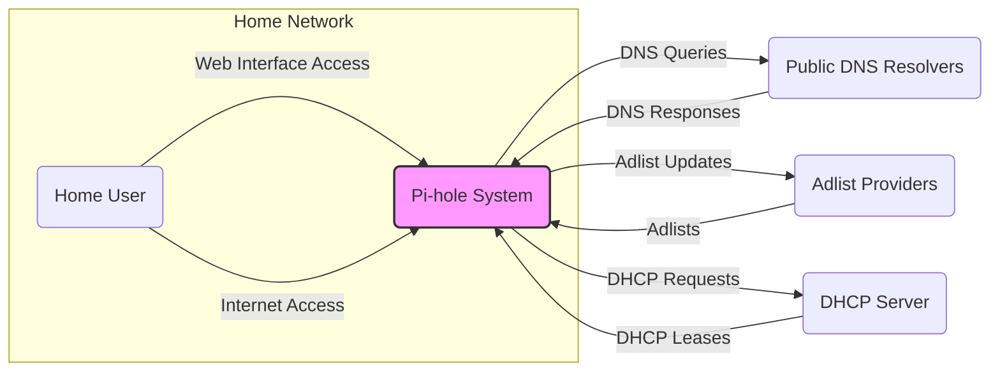

# BUSINESS POSTURE

- Business priorities and goals:
  - Provide network-wide ad blocking to improve user experience by reducing unwanted advertisements.
  - Enhance user privacy by blocking connections to known ad-serving and tracking domains.
  - Improve network performance by reducing the amount of ad traffic.
  - Offer an easy-to-use and configurable solution for ad blocking.
  - Maintain an open-source and community-driven project.
- Most important business risks:
  - Availability of the DNS service: If Pi-hole is unavailable, network DNS resolution is disrupted, impacting internet access.
  - Data privacy: Handling of DNS queries and user settings needs to be privacy-preserving and compliant with relevant regulations.
  - Reputation damage: Security vulnerabilities or data breaches could damage the project's reputation and user trust.
  - Blocklist accuracy and maintenance: Inaccurate or outdated blocklists can lead to either ineffective ad blocking or blocking of legitimate content.

# SECURITY POSTURE

- Existing security controls:
  - security control: Open source code - publicly available for review and community contributions. Implemented in: GitHub repository.
  - security control: Regular updates - project actively maintained with regular updates and bug fixes. Described in: GitHub repository release notes and commit history.
  - security control: Web interface authentication - password-based authentication for accessing the web administration panel. Implemented in: Pi-hole web interface code.
  - security control: HTTPS support for web interface - option to enable HTTPS for secure communication with the web interface. Described in: Pi-hole documentation and web interface settings.
  - security control: Input sanitization in web interface - measures to prevent common web vulnerabilities like XSS and SQL injection. Implemented in: Pi-hole web interface code.
- Accepted risks:
  - accepted risk: Reliance on community contributions for security vulnerability identification and patching.
  - accepted risk: Potential vulnerabilities in third-party dependencies used by Pi-hole.
  - accepted risk: Default configurations might not be hardened for all environments, requiring user configuration.
- Recommended security controls:
  - security control: Automated vulnerability scanning - implement automated scanning of the codebase and dependencies for known vulnerabilities.
  - security control: Penetration testing - conduct regular penetration testing to identify potential security weaknesses.
  - security control: Security awareness training for developers - provide security training to developers to promote secure coding practices.
  - security control: Implement Content Security Policy (CSP) for web interface to mitigate XSS risks.
  - security control: Regularly review and update third-party dependencies to address known vulnerabilities.
- Security requirements:
  - Authentication:
    - Requirement: Web interface access should be protected by strong password-based authentication.
    - Requirement: Consider implementing two-factor authentication (2FA) for enhanced security of web interface access.
  - Authorization:
    - Requirement: Role-based access control (RBAC) within the web interface to restrict access to sensitive settings based on user roles (if applicable, for future enhancements).
    - Requirement: Ensure proper authorization checks are in place for all API endpoints to prevent unauthorized access to functionalities.
  - Input validation:
    - Requirement: Implement robust input validation for all user inputs in the web interface and API to prevent injection attacks (e.g., XSS, SQL injection, command injection).
    - Requirement: Validate configuration files and blocklists to ensure they adhere to expected formats and prevent malicious content injection.
  - Cryptography:
    - Requirement: Use HTTPS for all communication with the web interface to protect sensitive data in transit (e.g., passwords, settings).
    - Requirement: Consider encrypting sensitive data at rest, such as configuration backups, if they contain sensitive information.

# DESIGN

## C4 CONTEXT



- Elements of context diagram:
  - - Name: Home User
    - Type: Person
    - Description: A user within the home network who uses devices connected to the network.
    - Responsibilities: Accesses the internet, uses devices that generate DNS queries, may interact with the Pi-hole web interface.
    - Security controls: User devices should have basic security measures like strong passwords and up-to-date software.
  - - Name: Pi-hole System
    - Type: Software System
    - Description: The Pi-hole ad-blocking system, acting as a DNS sinkhole and optionally a DHCP server.
    - Responsibilities: Receives DNS queries from devices on the network, filters out ad-related queries based on blocklists, forwards legitimate queries to upstream DNS resolvers, optionally provides DHCP services. Manages web interface for configuration and monitoring.
    - Security controls: Web interface authentication, HTTPS support, input validation, regular updates, potential future enhancements like 2FA and RBAC.
  - - Name: Public DNS Resolvers
    - Type: External System
    - Description: External DNS servers (e.g., Google Public DNS, Cloudflare DNS) used by Pi-hole to resolve DNS queries that are not blocked.
    - Responsibilities: Resolves DNS queries forwarded by Pi-hole.
    - Security controls: Security of public DNS resolvers is managed by their respective providers. Pi-hole relies on the security of the chosen upstream resolvers.
  - - Name: Adlist Providers
    - Type: External System
    - Description: Providers of blocklists that Pi-hole uses to identify ad-serving and tracking domains.
    - Responsibilities: Maintain and provide updated blocklists of ad domains.
    - Security controls: Pi-hole relies on the trustworthiness and security of adlist providers. Users should choose reputable adlist sources.
  - - Name: DHCP Server
    - Type: External System (Optional, can be Pi-hole itself)
    - Description: A DHCP server on the network that assigns IP addresses and network configuration to devices. Can be the Pi-hole system itself or a separate router/device.
    - Responsibilities: Provides IP addresses and network configuration to devices on the network.
    - Security controls: DHCP server security is important for network management. If Pi-hole acts as DHCP server, it needs to be securely configured. If external, security is managed by the external DHCP server.

## C4 CONTAINER

```mermaid
flowchart LR
    subgraph "Pi-hole System"
        subgraph "Web Server Container"
            WC("Web Interface")
            WA("Web API")
        end
        subgraph "DNS Resolver Container"
            DR("DNS Resolver (FTLDNS/Dnsmasq)")
        end
        subgraph "Data Storage Container"
            DS("Blocklists")
            DB("Settings Database (SQLite)")
        end
        DR -- "DNS Queries" --> DS
        WC -- "API Requests" --> WA
        WA -- "Data Access" --> DB
        WA -- "Blocklist Management" --> DS
    end
    WC -- "HTTP/HTTPS" --> U1("Home User Browser")
    DR -- "DNS (Port 53)" --> ND("Network Devices")
    style "Pi-hole System" fill:#ccf,stroke:#333,stroke-width:2px
    style "Web Server Container" fill:#eee,stroke:#333,stroke-width:1px
    style "DNS Resolver Container" fill:#eee,stroke:#333,stroke-width:1px
    style "Data Storage Container" fill:#eee,stroke:#333,stroke-width:1px
```

- Elements of container diagram:
  - - Name: Web Server Container
    - Type: Container
    - Description: Contains the web server (lighttpd) and PHP components responsible for the web interface and API.
    - Responsibilities: Serves the web interface for user interaction, handles API requests for configuration and data retrieval.
    - Security controls: Web interface authentication, HTTPS, input validation, CSP, regular updates of web server and PHP components.
    - - Name: Web Interface
      - Type: Component
      - Description: User interface for managing and monitoring Pi-hole, built with PHP.
      - Responsibilities: Provides user-friendly access to Pi-hole settings, statistics, and logs.
      - Security controls: Session management, input validation, output encoding, authentication, authorization.
    - - Name: Web API
      - Type: Component
      - Description: API endpoints for programmatic access to Pi-hole functionalities, built with PHP.
      - Responsibilities: Allows external applications or scripts to interact with Pi-hole for configuration and data retrieval.
      - Security controls: API authentication (same as web interface), authorization, input validation.
  - - Name: DNS Resolver Container
    - Type: Container
    - Description: Contains the DNS resolver software (FTLDNS or Dnsmasq) responsible for processing DNS queries.
    - Responsibilities: Receives DNS queries, filters based on blocklists, forwards legitimate queries, caches DNS responses.
    - Security controls: DNS resolver software updates, rate limiting (if applicable), secure configuration of DNS resolver.
    - - Name: DNS Resolver (FTLDNS/Dnsmasq)
      - Type: Component
      - Description: The core DNS resolution engine of Pi-hole, either FTLDNS or Dnsmasq.
      - Responsibilities: Performs DNS lookups, applies blocklists, manages DNS cache.
      - Security controls: Regular updates of DNS resolver software, secure configuration.
  - - Name: Data Storage Container
    - Type: Container
    - Description: Contains data storage components for blocklists and settings.
    - Responsibilities: Persists blocklists and Pi-hole configuration settings.
    - Security controls: File system permissions to protect blocklists and settings database, secure storage of sensitive data (if any).
    - - Name: Blocklists
      - Type: Data Store
      - Description: Text files containing lists of domains to be blocked.
      - Responsibilities: Stores the lists of domains used for ad blocking.
      - Security controls: Integrity checks of blocklists, protection against unauthorized modification.
    - - Name: Settings Database (SQLite)
      - Type: Data Store
      - Description: SQLite database storing Pi-hole configuration settings.
      - Responsibilities: Persists Pi-hole configuration settings.
      - Security controls: File system permissions to protect database file, secure storage of sensitive settings (if any).

## DEPLOYMENT

- Possible deployment solutions:
  - Raspberry Pi or similar single-board computer.
  - Docker container.
  - Virtual machine (VM).
  - Cloud instance (e.g., AWS EC2, Google Compute Engine).
- Detailed deployment solution: Docker container on a home server.

```mermaid
flowchart LR
    subgraph "Home Network"
        U1("Home User Device")
        subgraph "Home Server"
            DockerHost("Docker Host OS")
            subgraph "Docker"
                PDC("Pi-hole Docker Container")
            end
        end
        R1("Home Router")
    end
    U1 -- "DNS Queries" --> R1
    R1 -- "DNS Queries (Port 53)" --> PDC
    PDC -- "DNS Queries" --> PUBDNS("Public DNS Resolvers")
    PDC -- "Adlist Updates" --> ADLPROV("Adlist Providers")
    U1 -- "Web Interface (Port 80/443)" --> PDC
    style "Home Server" fill:#eee,stroke:#333,stroke-width:1px
    style "Docker" fill:#eee,stroke:#333,stroke-width:1px
    style PDC fill:#ccf,stroke:#333,stroke-width:2px
```

- Elements of deployment diagram:
  - - Name: Home User Device
    - Type: Device
    - Description: Devices within the home network, such as laptops, smartphones, smart TVs, etc.
    - Responsibilities: Generate DNS queries, access the internet, potentially interact with Pi-hole web interface.
    - Security controls: Device-level security controls, such as firewalls, antivirus, and up-to-date software.
  - - Name: Home Router
    - Type: Infrastructure
    - Description: The home network router, acting as the gateway to the internet and often the DHCP server.
    - Responsibilities: Routes network traffic, provides network connectivity, often acts as DHCP server. Forwards DNS queries to Pi-hole.
    - Security controls: Router firewall, secure router configuration, firmware updates.
  - - Name: Home Server
    - Type: Infrastructure
    - Description: A physical or virtual server within the home network hosting the Docker environment.
    - Responsibilities: Provides the infrastructure to run the Pi-hole Docker container.
    - Security controls: Operating system security hardening, firewall, physical security of the server.
    - - Name: Docker Host OS
      - Type: Software
      - Description: The operating system running on the home server, hosting the Docker environment.
      - Responsibilities: Provides the base operating system for Docker.
      - Security controls: OS security hardening, regular patching, access control.
    - - Name: Docker
      - Type: Software
      - Description: Docker container runtime environment.
      - Responsibilities: Manages and runs Docker containers, including the Pi-hole container.
      - Security controls: Docker security best practices, container isolation, regular Docker updates.
    - - Name: Pi-hole Docker Container
      - Type: Containerized Application
      - Description: Pi-hole application deployed as a Docker container.
      - Responsibilities: Runs the Pi-hole application components (web server, DNS resolver, etc.) within a containerized environment.
      - Security controls: Container image security (base image updates, vulnerability scanning), container runtime security, network policies for container isolation.
  - - Name: Public DNS Resolvers
    - Type: External Service
    - Description: External DNS servers used by Pi-hole to resolve DNS queries.
    - Responsibilities: Resolve DNS queries forwarded by Pi-hole.
    - Security controls: Managed by external providers. Pi-hole relies on their security.
  - - Name: Adlist Providers
    - Type: External Service
    - Description: Providers of blocklists used by Pi-hole.
    - Responsibilities: Provide updated blocklists.
    - Security controls: Pi-hole relies on the trustworthiness of adlist providers.

## BUILD

```mermaid
flowchart LR
    subgraph "Developer Environment"
        DEV("Developer")
        CODE("Code Changes")
    end
    subgraph "GitHub"
        GHREPO("GitHub Repository")
        GHACTIONS("GitHub Actions CI/CD")
    end
    subgraph "Build Artifacts"
        ARTIFACTS("Build Artifacts (Debian package, Docker image)")
    end
    DEV -- CODE --> GHREPO
    GHREPO -- "Code Push" --> GHACTIONS
    GHACTIONS -- "Build & Test" --> ARTIFACTS
    style "Developer Environment" fill:#eee,stroke:#333,stroke-width:1px
    style "GitHub" fill:#eee,stroke:#333,stroke-width:1px
    style "Build Artifacts" fill:#eee,stroke:#333,stroke-width:1px
    style GHACTIONS fill:#ccf,stroke:#333,stroke-width:2px
```

- Build process description:
  - Developers write code and commit changes to the GitHub repository.
  - GitHub Actions CI/CD pipelines are triggered on code pushes.
  - Build process includes:
    - Code checkout from GitHub repository.
    - Dependency installation.
    - Code compilation (if applicable).
    - Automated testing (unit tests, integration tests).
    - Security checks (SAST scanners, linters, dependency vulnerability scanning - potentially).
    - Packaging of build artifacts (Debian package, Docker image).
    - Publishing of build artifacts to package repositories (e.g., Docker Hub, GitHub Releases).
- Security controls in build process:
  - security control: Automated build process - using GitHub Actions to ensure consistent and repeatable builds. Implemented in: GitHub Actions workflows in the repository.
  - security control: Source code version control - using Git and GitHub to track code changes and manage versions. Implemented in: GitHub repository.
  - security control: Automated testing - running unit and integration tests to ensure code quality and prevent regressions. Implemented in: GitHub Actions workflows and test suites in the repository.
  - security control: Code linters and static analysis - using linters and SAST tools to identify potential code quality and security issues. Recommended: Integrate SAST scanners and linters into the GitHub Actions pipeline.
  - security control: Dependency vulnerability scanning - scanning dependencies for known vulnerabilities. Recommended: Integrate dependency vulnerability scanning tools into the GitHub Actions pipeline.
  - security control: Secure artifact storage - storing build artifacts in secure repositories. Implemented in: GitHub Releases, Docker Hub (consider security best practices for Docker Hub).
  - security control: Code review process - implementing code review process before merging code changes to main branch. Recommended: Enforce code review process for all code changes.
  - security control: Supply chain security - consider signing build artifacts to ensure integrity and authenticity. Recommended: Implement code signing for releases and container images.

# RISK ASSESSMENT

- Critical business process we are trying to protect:
  - DNS resolution for the home network. If Pi-hole fails or is compromised, internet access can be disrupted or malicious content could be served.
  - Ad blocking functionality. Failure to block ads impacts user experience and privacy.
- Data we are trying to protect and their sensitivity:
  - DNS queries: Potentially sensitive as they can reveal browsing history and user interests. Sensitivity: Medium.
  - Pi-hole configuration settings: May contain user preferences and network configuration details. Sensitivity: Low to Medium (depending on specific settings).
  - Blocklists: Publicly available lists, but their integrity is important for ad blocking effectiveness. Sensitivity: Low.
  - Web interface authentication credentials (passwords): Highly sensitive, need to be protected from unauthorized access. Sensitivity: High.

# QUESTIONS & ASSUMPTIONS

- Questions:
  - What is the primary target audience for this design document? (Technical team, security team, management?)
  - Are there any specific compliance requirements that Pi-hole needs to adhere to? (e.g., GDPR, HIPAA - unlikely for home use, but good to clarify)
  - What is the expected deployment scale and environment? (Primarily home users, small businesses, or larger organizations?)
  - Are there any specific performance or scalability requirements?
  - What is the acceptable level of risk for the project? (Risk appetite of the organization/project)
- Assumptions:
  - Primary target audience is technical and security teams for threat modeling and security assessment.
  - Deployment is primarily for home users and small networks.
  - Performance and scalability requirements are moderate, suitable for home network usage.
  - Risk appetite is moderate, aiming for a balance between security and ease of use.
  - The focus is on securing the core functionalities of Pi-hole: DNS resolution, ad blocking, and web interface management.