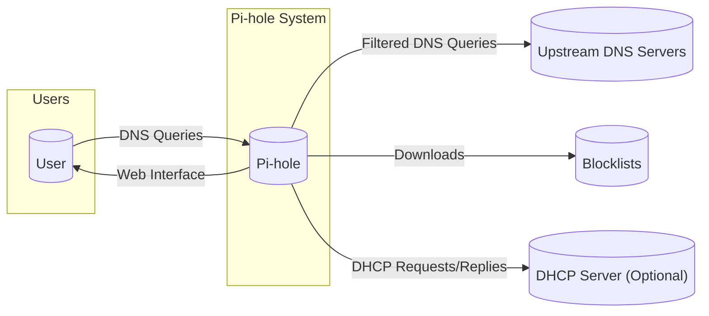
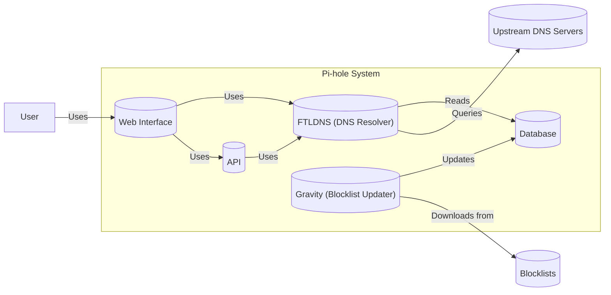
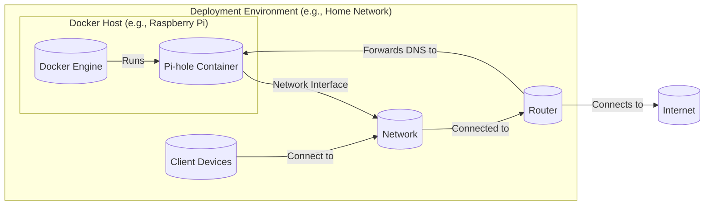
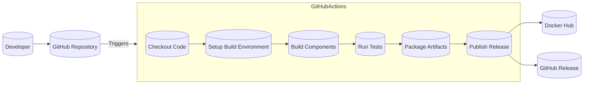

# Project Design Document: Pi-hole

## BUSINESS POSTURE

Pi-hole is a Linux network-level advertisement and Internet tracker blocking application which acts as a DNS sinkhole, and optionally a DHCP server, intended for use on a private network. It is designed for low-resource hardware, most notably the Raspberry Pi, but can be installed on almost any Linux machine.

Business Priorities and Goals:

*   Provide users with a free, open-source solution for network-wide ad blocking and tracking prevention.
*   Enhance user privacy and security by minimizing exposure to unwanted content and data collection.
*   Improve network performance by reducing bandwidth consumption from ads and trackers.
*   Offer a user-friendly and customizable experience, suitable for both technical and non-technical users.
*   Maintain a lightweight and efficient application that can run on low-resource hardware.
*   Foster a strong community around the project, encouraging contributions and support.

Most Important Business Risks:

*   Misconfiguration leading to network disruption: Incorrectly configured Pi-hole instances can disrupt network connectivity for users.
*   Security vulnerabilities: Exploitable vulnerabilities in Pi-hole could expose user networks to attacks.
*   Reliance on community support: As an open-source project, Pi-hole relies on community contributions for development and support. A decline in community engagement could impact the project's long-term viability.
*   Bypass techniques: Advanced ad-serving and tracking techniques may bypass Pi-hole's blocking capabilities, reducing its effectiveness.
*   Legal challenges: Depending on jurisdiction and usage, there might be legal challenges related to blocking certain types of content.
*   Compatibility issues: Pi-hole may not be compatible with all network configurations or devices, leading to user frustration.

## SECURITY POSTURE

Existing Security Controls:

*   security control: DNSSEC validation: Pi-hole can be configured to validate DNS responses using DNSSEC, ensuring the authenticity and integrity of DNS data. Implemented in FTLDNS.
*   security control: Regularly updated blocklists: Pi-hole utilizes regularly updated blocklists to identify and block known ad-serving and tracking domains. Implemented in gravity.
*   security control: Open-source codebase: The open-source nature of Pi-hole allows for community scrutiny and auditing, helping to identify and address potential security vulnerabilities. Described in GitHub repository.
*   security control: Rate limiting: Pi-hole includes rate limiting features to prevent abuse and mitigate potential DoS attacks. Implemented in FTLDNS.
*   security control: Password protection for the web interface: The web interface can be password protected to restrict access to administrative functions. Implemented in web interface.
*   security control: TLS for web interface: Web interface can use TLS to protect credentials. Implemented in web interface.

Accepted Risks:

*   accepted risk: User misconfiguration: Pi-hole relies on users to correctly configure their network settings. Misconfiguration can lead to network issues or ineffective blocking.
*   accepted risk: Limited control over client devices: Pi-hole operates at the network level and cannot directly control the behavior of individual client devices. Malicious or misconfigured devices can still attempt to bypass blocking.
*   accepted risk: Potential for false positives: Blocklists may occasionally include legitimate domains, leading to unintended blocking of non-advertising content.

Recommended Security Controls:

*   security control: Implement robust input validation on all user-configurable settings to prevent injection attacks.
*   security control: Regularly conduct security audits and penetration testing to identify and address potential vulnerabilities.
*   security control: Provide clear and concise documentation on secure configuration and usage of Pi-hole.
*   security control: Consider implementing two-factor authentication (2FA) for the web interface.
*   security control: Offer an option for automatic updates to ensure users are running the latest, most secure version.

Security Requirements:

*   Authentication:
    *   The web interface should require strong password authentication.
    *   Consider offering two-factor authentication (2FA) for enhanced security.
    *   API access should be authenticated using API keys or tokens.

*   Authorization:
    *   Access to administrative functions should be restricted to authorized users.
    *   Role-based access control (RBAC) could be considered for more granular control.

*   Input Validation:
    *   All user inputs, including those from the web interface, API, and configuration files, should be strictly validated to prevent injection attacks (e.g., command injection, SQL injection).
    *   Whitelist-based validation is preferred over blacklist-based validation.

*   Cryptography:
    *   DNSSEC should be enabled by default to ensure the integrity and authenticity of DNS responses.
    *   TLS should be used to secure communication between the web interface and the user's browser.
    *   If storing sensitive data (e.g., API keys), use strong encryption algorithms.

## DESIGN

### C4 CONTEXT

Element Descriptions:

*   Element:
    *   Name: User
    *   Type: Person
    *   Description: A person who uses a device connected to the network protected by Pi-hole.
    *   Responsibilities: Browses the internet, uses applications that make DNS requests.
    *   Security controls: Uses a device with up-to-date security software.

*   Element:
    *   Name: Pi-hole
    *   Type: Software System
    *   Description: The Pi-hole application, acting as a DNS sinkhole and optionally a DHCP server.
    *   Responsibilities: Receives DNS queries, filters them against blocklists, forwards legitimate requests to upstream DNS servers, provides a web interface for configuration and monitoring, and optionally provides DHCP services.
    *   Security controls: DNSSEC validation, rate limiting, password protection for the web interface, regularly updated blocklists.

*   Element:
    *   Name: Upstream DNS Servers
    *   Type: External System
    *   Description: External DNS servers (e.g., Google DNS, Cloudflare DNS) used by Pi-hole to resolve legitimate DNS requests.
    *   Responsibilities: Resolves DNS queries forwarded by Pi-hole.
    *   Security controls: Relies on the security measures implemented by the chosen upstream DNS provider.

*   Element:
    *   Name: Blocklists
    *   Type: External System
    *   Description: Lists of domains associated with advertising, tracking, and malware, used by Pi-hole to filter DNS requests.
    *   Responsibilities: Provides up-to-date lists of domains to be blocked.
    *   Security controls: Relies on the security and integrity of the blocklist providers.

*   Element:
    *   Name: DHCP Server (Optional)
    *   Type: External System/Software System
    *   Description: A DHCP server, either integrated within Pi-hole or a separate server on the network.
    *   Responsibilities: Assigns IP addresses and other network configuration parameters to devices on the network.
    *   Security controls: Standard DHCP security practices.

### C4 CONTAINER

Element Descriptions:

*   Element:
    *   Name: Web Interface
    *   Type: Web Application
    *   Description: Provides a user interface for configuring and monitoring Pi-hole.
    *   Responsibilities: Displays statistics, allows users to manage blocklists, whitelist/blacklist domains, configure settings, and view logs.
    *   Security controls: Password protection, TLS encryption, input validation.

*   Element:
    *   Name: FTLDNS (DNS Resolver)
    *   Type: Application
    *   Description: A custom fork of dnsmasq, serving as the core DNS resolver for Pi-hole.
    *   Responsibilities: Receives DNS queries, checks them against the database, forwards legitimate requests to upstream DNS servers, and caches responses.
    *   Security controls: DNSSEC validation, rate limiting.

*   Element:
    *   Name: Gravity (Blocklist Updater)
    *   Type: Script
    *   Description: A script that downloads and updates the blocklists used by Pi-hole.
    *   Responsibilities: Downloads blocklists from configured sources, parses them, and updates the database.
    *   Security controls: Verifies the integrity of downloaded blocklists (if supported by the source).

*   Element:
    *   Name: API
    *   Type: API
    *   Description: Provides an API for interacting with Pi-hole programmatically.
    *   Responsibilities: Allows external applications to query Pi-hole statistics, manage lists, and control settings.
    *   Security controls: Authentication (API keys/tokens), input validation.

*   Element:
    *   Name: Database
    *   Type: Database
    *   Description: Stores blocklists, whitelists, blacklists, and other configuration data.
    *   Responsibilities: Provides persistent storage for Pi-hole data.
    *   Security controls: Access control, data integrity checks.

### DEPLOYMENT

Possible Deployment Solutions:

1.  Bare-metal installation on a Raspberry Pi or other Linux machine.
2.  Docker container deployment.
3.  Virtual machine deployment.
4. Cloud deployment (e.g., AWS, Azure, GCP) using a virtual machine or container.

Chosen Deployment Solution (Docker Container):

Element Descriptions:

*   Element:
    *   Name: Docker Host
    *   Type: Physical or Virtual Machine
    *   Description: The machine running the Docker Engine. This is often a Raspberry Pi, but could be any Linux machine.
    *   Responsibilities: Provides the runtime environment for the Pi-hole container.
    *   Security controls: Operating system security hardening, firewall, regular updates.

*   Element:
    *   Name: Docker Engine
    *   Type: Software
    *   Description: The software that manages and runs Docker containers.
    *   Responsibilities: Creates, runs, and manages the Pi-hole container.
    *   Security controls: Docker security best practices, regular updates.

*   Element:
    *   Name: Pi-hole Container
    *   Type: Docker Container
    *   Description: The isolated environment containing the Pi-hole application and its dependencies.
    *   Responsibilities: Runs the Pi-hole software.
    *   Security controls: Container security best practices, minimal base image, limited privileges.

*   Element:
    *   Name: Network
    *   Type: Network
    *   Description: The local network to which the Pi-hole container and client devices are connected.
    *   Responsibilities: Facilitates communication between devices on the network.
    *   Security controls: Network segmentation, firewall, WPA2/3 encryption for Wi-Fi.

*   Element:
    *   Name: Router
    *   Type: Network Device
    *   Description: The network router, responsible for routing traffic between the local network and the internet.
    *   Responsibilities: Directs network traffic, often acts as a DHCP server (if Pi-hole is not configured as DHCP).
    *   Security controls: Strong password, updated firmware, firewall.

*   Element:
    *   Name: Client Devices
    *   Type: Devices
    *   Description: Devices on the network that use Pi-hole for DNS resolution.
    *   Responsibilities: Make DNS requests.
    *   Security controls: Up-to-date operating systems and security software.

*   Element:
    *   Name: Internet
    *   Type: Network
    *   Description: The external network (the internet).
    *   Responsibilities: Provides access to external resources.
    *   Security controls: N/A (external network).

### BUILD

The Pi-hole project utilizes a combination of shell scripts and GitHub Actions for its build and release process.

Build Process Description:

1.  Developers contribute code changes to the Pi-hole GitHub repository.
2.  Pull requests trigger GitHub Actions workflows.
3.  The workflows checkout the code, set up the build environment (installing dependencies, etc.).
4.  Build steps compile or prepare the various components of Pi-hole (FTLDNS, web interface, etc.). This may involve shell scripts.
5.  Automated tests are run to ensure code quality and functionality.
6.  The build artifacts are packaged for distribution (e.g., creating Docker images).
7.  The packaged artifacts are published to Docker Hub (for Docker images) and GitHub Releases (for other release assets).

Security Controls in Build Process:

*   security control: Code review: All code changes are reviewed by other developers before being merged.
*   security control: Automated testing: Unit tests and integration tests are run automatically as part of the build process.
*   security control: Dependency management: Dependencies are managed using appropriate package managers, and efforts are made to keep them up-to-date.
*   security control: GitHub Actions: Using a well-known CI/CD platform provides a degree of security and auditability.
*   security control: Linting: Code is checked for style and potential errors using linters.

## RISK ASSESSMENT

Critical Business Processes to Protect:

*   DNS resolution: Ensuring uninterrupted and accurate DNS resolution for users on the network.
*   Network connectivity: Maintaining network connectivity for all devices relying on Pi-hole.
*   User privacy: Protecting user privacy by blocking ads and trackers.

Data to Protect and Sensitivity:

*   DNS query logs (if enabled): These logs can contain sensitive information about user browsing habits. Sensitivity: High.
*   Whitelists and blacklists: These lists may reveal user preferences or specific websites they access. Sensitivity: Medium.
*   Pi-hole configuration settings: These settings control the behavior of Pi-hole and could be exploited if compromised. Sensitivity: Medium.
*   DHCP leases (if Pi-hole is used as a DHCP server): This information reveals the devices connected to the network. Sensitivity: Medium.

## QUESTIONS & ASSUMPTIONS

Questions:

*   Are there any specific compliance requirements (e.g., GDPR, CCPA) that need to be considered?
*   What is the expected scale of deployment (number of users/devices)?
*   What are the specific upstream DNS servers being used, and what are their security policies?
*   What level of logging is required, and what are the retention policies for those logs?
*   What is the process for handling security vulnerabilities reported by the community or discovered internally?

Assumptions:

*   BUSINESS POSTURE: The primary goal is to provide a free, open-source, and effective ad-blocking solution for home and small business users.
*   SECURITY POSTURE: Users are responsible for securing their own network and devices. Pi-hole provides tools to enhance privacy and security, but it is not a comprehensive security solution.
*   DESIGN: The deployment environment is a typical home or small business network with a single router and a mix of wired and wireless devices. The Docker container deployment model is preferred for its ease of installation and management.