# Project Design Document: Alamofire Networking Library

**Version:** 1.1
**Date:** October 26, 2023
**Author:** Gemini (AI Language Model)

## 1. Introduction

This document provides an enhanced design overview of the Alamofire networking library for Swift, specifically tailored for threat modeling activities. It details the key architectural components, data flow with emphasis on data transformation, and security considerations to facilitate the identification of potential vulnerabilities and attack surfaces.

## 2. Goals and Non-Goals

### 2.1. Goals

*   Provide a detailed and clear overview of Alamofire's architecture, focusing on components relevant to security.
*   Elucidate the interactions between major components, highlighting data transformations and potential manipulation points.
*   Describe the typical data flow within the library, emphasizing security-sensitive stages.
*   Highlight specific security considerations and potential threats relevant for threat modeling.
*   Serve as a robust foundation for identifying potential attack surfaces and conducting security risk assessments.

### 2.2. Non-Goals

*   Provide an exhaustive, line-by-line code analysis.
*   Detail every single feature, minor configuration option, or edge case.
*   Include specific implementation details of underlying Apple frameworks or third-party libraries beyond their interaction points with Alamofire.
*   Perform a complete and formal threat modeling exercise within this document; this document serves as input for such an exercise.

## 3. Architectural Overview

Alamofire simplifies network communication in Swift by abstracting and enhancing the functionality of Apple's `URLSession`. The architecture is designed around a series of interconnected components that manage the lifecycle of a network request.

```mermaid
graph LR
    subgraph "Application Code"
        A["'Application Initiates Request'"]
    end
    subgraph "Alamofire"
        B["'Session'"] --> C["'Request'"];
        C --> D["'RequestInterceptor (Optional)'"];
        D --> E["'URLRequest'"];
        E --> F["'Session.dataTask(with:)' (URLSession)"];
        F --> G["'Server'"];
        G --> F;
        F --> H["'Response'"];
        H --> I["'ResponseInterceptor (Optional)'"];
        I --> J["'Response Validation'"];
        J --> K["'Data Processing & Serialization'"];
        K --> L["'Result (Success/Failure)'"];
        style B fill:#f9f,stroke:#333,stroke-width:2px
        style C fill:#ccf,stroke:#333,stroke-width:2px
        style D fill:#ccf,stroke:#333,stroke-width:2px
        style E fill:#ccf,stroke:#333,stroke-width:2px
        style F fill:#ccf,stroke:#333,stroke-width:2px
        style G fill:#eee,stroke:#333,stroke-width:2px
        style H fill:#ccf,stroke:#333,stroke-width:2px
        style I fill:#ccf,stroke:#333,stroke-width:2px
        style J fill:#ccf,stroke:#333,stroke-width:2px
        style K fill:#ccf,stroke:#333,stroke-width:2px
        style L fill:#ccf,stroke:#333,stroke-width:2px
    end
    subgraph "Application Code"
        M["'Application Receives Result'"]
    end
    A --> B
    L --> M
```

## 4. Key Components

*   **Session:**  Manages the underlying `URLSession` and its configuration. This includes settings for timeouts, caching, protocol support, and security policies. It acts as the entry point for creating and executing requests.
*   **Request:** Represents a single network request. It encapsulates the `URLRequest` along with associated data like parameters, encoding strategies, and completion handlers.
*   **RequestInterceptor (Optional):** Allows for interception and modification of the `URLRequest` before it's sent. Common use cases include adding authentication headers, logging, or retrying failed requests. This is a crucial point for security considerations related to request tampering.
*   **URLRequest:** The standard Apple class representing a URL load request. It contains the URL, HTTP method, headers, body, and other request-specific information. This is the actual object sent over the network.
*   **`Session.dataTask(with:)` (URLSession):** The core function of Apple's `URLSession` used by Alamofire to initiate the network communication. This is where the request is handed off to the operating system for transmission.
*   **Server:** The remote endpoint receiving and processing the network request. This is the external entity Alamofire interacts with.
*   **Response:**  Represents the server's response to the request. It includes the HTTP status code, headers, and the raw data received from the server.
*   **ResponseInterceptor (Optional):** Enables interception and modification of the `Response` before it's processed further. This can be used for tasks like logging, error handling, or custom response transformations. Similar to `RequestInterceptor`, this is a point for potential security vulnerabilities if not implemented correctly.
*   **Response Validation:**  A component responsible for verifying the integrity and validity of the server's response. This can involve checking status codes, content types, or applying custom validation logic. Proper validation is critical for preventing issues arising from unexpected or malicious responses.
*   **Data Processing & Serialization:**  Handles the conversion of the raw response data into a usable format. This can involve decoding JSON, parsing XML, or handling other data formats. Vulnerabilities can arise from insecure deserialization practices.
*   **Result (Success/Failure):** An enumeration representing the outcome of the network request. On success, it contains the processed data; on failure, it contains an error object detailing the reason for failure.

## 5. Data Flow with Security Emphasis

The lifecycle of a network request in Alamofire, with a focus on data transformations and potential security implications, is as follows:

1. **Application Initiates Request:** The application code initiates a request, providing parameters that will be encoded and sent to the server. *Potential Threat:* Malicious or unexpected data injected at this stage.
2. **Session and Request Creation:** Alamofire's `Session` creates a `Request` object, preparing the necessary information.
3. **Request Interception (Optional):** If configured, `RequestInterceptor` modifies the `URLRequest`. *Potential Threat:*  Interceptors could introduce vulnerabilities if they improperly handle or expose sensitive data (e.g., logging authentication tokens).
4. **URLRequest Construction:** The `URLRequest` is finalized, including headers, body (after encoding), and the target URL. *Potential Threat:*  Injection vulnerabilities in URL parameters or headers if not properly sanitized.
5. **Network Transmission via URLSession:** The `URLRequest` is passed to `URLSession` for transmission. *Potential Threat:*  Man-in-the-middle attacks if HTTPS is not enforced or TLS configuration is weak.
6. **Server Processing:** The server receives and processes the request.
7. **Response Reception:** Alamofire receives the `Response` from the server, including headers and raw data.
8. **Response Interception (Optional):** If configured, `ResponseInterceptor` can modify the `Response`. *Potential Threat:*  Interceptors could introduce vulnerabilities by altering the expected response or exposing sensitive information.
9. **Response Validation:** The `Response` is validated based on predefined criteria. *Potential Threat:* Insufficient or incorrect validation could allow malicious or unexpected responses to be processed.
10. **Data Processing and Serialization:** The raw response data is processed and serialized into a usable format. *Potential Threat:* Insecure deserialization vulnerabilities if the data format is not handled carefully or if custom serialization logic is flawed.
11. **Result Delivery:** The `Result` (success or failure) is returned to the application. *Potential Threat:* Error messages might leak sensitive information if not handled properly.
12. **Application Processes Result:** The application consumes the result. *Potential Threat:* The application might mishandle the data, leading to further vulnerabilities.

## 6. Security Considerations and Potential Threats

This section details specific security considerations and potential threats relevant to Alamofire:

*   **Transport Layer Security (TLS):**
    *   **Consideration:** Ensuring all communication occurs over HTTPS to protect data in transit.
    *   **Potential Threats:** Man-in-the-middle attacks, eavesdropping, downgrade attacks if TLS is not enforced or configured correctly. Weak cipher suites could also be exploited.
    *   **Mitigation:** Enforce HTTPS, implement certificate pinning for enhanced trust, configure strong TLS settings.
*   **Data Validation (Request & Response):**
    *   **Consideration:** Validating both outgoing request parameters and incoming response data to prevent injection attacks and ensure data integrity.
    *   **Potential Threats:** Cross-site scripting (XSS) through reflected data, SQL injection if response data is used in database queries without sanitization, denial-of-service by sending malformed requests.
    *   **Mitigation:** Implement robust input validation and output encoding, use parameterized queries, adhere to secure coding practices.
*   **Authentication and Authorization:**
    *   **Consideration:** Securely handling authentication credentials and authorization tokens.
    *   **Potential Threats:** Exposure of credentials in transit or at rest, unauthorized access to resources if authentication is weak or bypassed.
    *   **Mitigation:** Use secure storage mechanisms for credentials (e.g., Keychain), transmit tokens securely (e.g., in HTTPS headers), implement proper authorization checks on the server-side.
*   **Request and Response Tampering:**
    *   **Consideration:** Protecting against the modification of requests before they reach the server and responses before they reach the application.
    *   **Potential Threats:**  Bypassing security checks, injecting malicious data, altering the intended functionality.
    *   **Mitigation:** Use HTTPS to protect data in transit, implement integrity checks (e.g., digital signatures) where necessary.
*   **Insecure Deserialization:**
    *   **Consideration:**  Safely deserializing response data to prevent arbitrary code execution or other vulnerabilities.
    *   **Potential Threats:** Remote code execution if untrusted data is deserialized, denial-of-service by sending large or complex data structures.
    *   **Mitigation:** Use safe deserialization methods, validate data structures before deserialization, avoid deserializing data from untrusted sources.
*   **Error Handling and Information Disclosure:**
    *   **Consideration:**  Handling errors gracefully without exposing sensitive information.
    *   **Potential Threats:**  Leaking internal server details, API keys, or other sensitive data in error messages.
    *   **Mitigation:** Implement generic error messages, log detailed errors securely on the server-side, avoid exposing sensitive information in client-side error messages.
*   **Dependency Management:**
    *   **Consideration:**  Keeping dependencies up-to-date to patch known vulnerabilities.
    *   **Potential Threats:**  Exploitation of known vulnerabilities in underlying libraries or system frameworks.
    *   **Mitigation:** Regularly update dependencies, monitor security advisories for vulnerabilities.
*   **Rate Limiting and Denial of Service (DoS):**
    *   **Consideration:** While Alamofire doesn't directly implement rate limiting, its usage can contribute to DoS if not managed by the application or server.
    *   **Potential Threats:**  Exhausting server resources by sending a large number of requests.
    *   **Mitigation:** Implement rate limiting on the server-side, consider using techniques like exponential backoff in the application to handle server-side rate limits.
*   **Configuration Security:**
    *   **Consideration:**  Ensuring secure default configurations and proper handling of configuration settings.
    *   **Potential Threats:**  Using insecure default settings (e.g., allowing insecure protocols), exposing configuration details.
    *   **Mitigation:**  Follow security best practices for configuration management, avoid hardcoding sensitive information.

## 7. Dependencies

Alamofire relies on the following key dependencies, which are important to consider for security implications:

*   **Foundation Framework (Apple):** Provides core functionalities, including `URLSession`. Security vulnerabilities in `URLSession` could directly impact Alamofire.
*   **Swift Standard Library:** The base library for Swift. Security issues in the standard library could potentially affect Alamofire.

## 8. Deployment Considerations

The security of Alamofire in a deployed application depends on several factors:

*   **Application's Security Practices:** How the application uses Alamofire is crucial. Improper handling of data or insecure configurations can introduce vulnerabilities even if Alamofire itself is secure.
*   **Server-Side Security:** The security of the backend API is paramount. Alamofire is just a communication tool; vulnerabilities on the server-side can be exploited regardless of the client-side library.
*   **Device Security:** The security posture of the device running the application can also impact Alamofire's security (e.g., compromised root certificates).

## 9. Future Considerations

*   Detailed analysis of specific extension points and their security implications (e.g., custom parameter encoding, response serializers).
*   Investigation of potential side-channel attacks or information leakage through timing or resource consumption.
*   Regular review of security best practices and updates to address emerging threats.

This enhanced design document provides a more detailed foundation for threat modeling Alamofire. By understanding the architecture, data flow, and potential security considerations, security professionals can more effectively identify and mitigate potential vulnerabilities.
