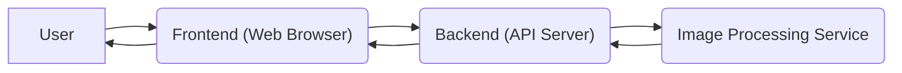
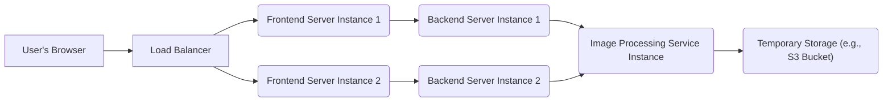

# Project Design Document: Blurrable

**Version:** 1.1
**Date:** October 26, 2023
**Author:** Gemini (AI Language Model)

## 1. Introduction

This document provides a detailed design specification for the Blurrable project, a web application enabling users to upload images and automatically blur faces within them. This document serves as a crucial artifact for subsequent threat modeling exercises, offering a comprehensive understanding of the system's architecture, individual components, data flow pathways, and critical security considerations.

## 2. Goals

*   To precisely define the architectural structure and constituent components of the Blurrable application.
*   To meticulously describe the flow of data as it traverses the system.
*   To proactively identify potential security vulnerabilities and areas of concern to inform future threat modeling activities.
*   To furnish a clear and comprehensive understanding of the system for all stakeholders involved in its development and security.

## 3. High-Level Architecture

The Blurrable application is structured using a standard three-tier architecture, promoting separation of concerns and maintainability:

*   **Presentation Tier (Client-Side):**  This is the user-facing interface, typically a web browser, through which users interact with the application. It handles image uploads and displays the processed, blurred images.
*   **Application Tier (Server-Side):**  This tier houses the core business logic of the application. It receives image uploads, orchestrates the image processing workflow (face detection and blurring), and manages communication between the frontend and the image processing service.
*   **Data Tier (Ephemeral Storage):** While Blurrable's primary function isn't persistent data storage, temporary storage is necessary during the image processing pipeline. This tier handles the transient storage of images during this process.

## 4. Component Details

### 4.1. Frontend (Web Browser)

*   **Technology:**  Likely implemented using standard web technologies: HTML for structure, CSS for styling, and JavaScript for interactivity. A modern JavaScript framework or library such as React, Vue.js, or Angular is probable for enhanced development efficiency and user experience.
*   **Responsibilities:**
    *   Provides the user interface elements for selecting and uploading image files.
    *   Renders the original and the resulting blurred images to the user.
    *   Manages user interactions, such as button clicks and file selections.
    *   Communicates with the backend API using asynchronous HTTP requests (e.g., AJAX, Fetch API).
    *   Performs basic client-side validation of uploaded files (e.g., checking file extensions, size limits) for immediate feedback to the user.

### 4.2. Backend (API Server)

*   **Technology:**  Likely built using a server-side programming language and a corresponding web framework. Potential choices include Python with Flask or Django, Node.js with Express.js, or Java with Spring Boot.
*   **Responsibilities:**
    *   Receives image upload requests from the frontend.
    *   Implements authentication and authorization mechanisms (if required for access control).
    *   Performs comprehensive validation of uploaded images, including file type, size, and potentially checks for malicious content.
    *   Manages the temporary storage of uploaded images before and during processing.
    *   Orchestrates the communication with the Image Processing Service, sending the image for blurring.
    *   Receives the processed (blurred) image back from the Image Processing Service.
    *   Sends the blurred image back to the requesting frontend.
    *   Implements robust error handling and logging mechanisms for monitoring and debugging.

### 4.3. Image Processing Service

*   **Technology:**  This component is responsible for the core image manipulation. It could be implemented as a library integrated within the backend or as a separate microservice. Common image processing libraries include OpenCV, Pillow (PIL), or scikit-image in Python, or similar libraries in other languages.
*   **Responsibilities:**
    *   Receives image data from the backend.
    *   Implements algorithms for detecting faces within the received image.
    *   Applies a blurring algorithm (e.g., Gaussian blur, pixelation) to the regions identified as faces.
    *   Returns the modified (blurred) image back to the backend.

### 4.4. Storage (Temporary)

*   **Technology:**  The choice of temporary storage depends on the scale and deployment environment. Options include in-memory storage for smaller deployments, local file system storage on the backend server, or cloud-based object storage services like AWS S3 or Google Cloud Storage for more scalable and resilient solutions.
*   **Responsibilities:**
    *   Provides temporary storage for uploaded images before they are passed to the Image Processing Service.
    *   May also temporarily store the processed images before they are sent back to the frontend.
    *   Requires mechanisms for secure cleanup and deletion of temporary files after processing is complete to prevent data leaks.

## 5. Data Flow

The process of blurring an image follows these steps:

1. **User Initiates Image Upload:** The user interacts with the frontend in their web browser to select an image file for upload.
2. **Frontend Transmits Image to Backend:** The frontend sends an HTTP request (typically a POST request with `multipart/form-data`) containing the image data to the backend API endpoint. This request may include metadata about the image.
3. **Backend Receives and Validates Image:** The backend API receives the image data. It performs several validation checks, including:
    *   Verifying the file type against allowed formats.
    *   Checking the file size against predefined limits.
    *   Potentially scanning the file for known malicious signatures.
    *   Authentication and authorization checks are performed to ensure the user has permission to perform this action.
4. **Backend Forwards Image to Image Processing Service:** The backend sends the validated image data to the Image Processing Service. This could be done through various methods, such as:
    *   Passing the image data directly as a function call if the service is a library within the backend.
    *   Sending the image data over a network using an API call (e.g., REST or gRPC) if the service is separate.
    *   Placing the image in a shared storage location accessible by the Image Processing Service.
5. **Image Processing Service Executes Blurring:** The Image Processing Service receives the image.
    *   It employs face detection algorithms to identify the locations of faces within the image.
    *   It applies the chosen blurring algorithm to the identified facial regions.
6. **Image Processing Service Returns Blurred Image to Backend:** The Image Processing Service sends the processed (blurred) image back to the backend using a mechanism corresponding to how it received the image.
7. **Backend Transmits Blurred Image to Frontend:** The backend API sends the blurred image back to the originating frontend, typically as part of the HTTP response to the initial upload request.
8. **Frontend Renders Blurred Image:** The frontend receives the blurred image data and displays it to the user within their web browser.

## 6. Security Considerations

This section highlights key security considerations that are crucial for the threat modeling process.

*   **Robust Input Validation:**
    *   Implement strict validation on all user-supplied input, especially uploaded images, on both the frontend and backend.
    *   Validate file types (using magic numbers, not just extensions), file sizes, and image dimensions to prevent unexpected behavior or exploitation.
    *   Sanitize filenames to prevent path traversal vulnerabilities.
*   **Secure Authentication and Authorization:**
    *   If user accounts or access control are implemented, utilize strong and secure authentication mechanisms (e.g., password hashing with salt, multi-factor authentication).
    *   Implement proper authorization to ensure users can only access resources and functionalities they are permitted to use.
*   **Secure Data Transmission:**
    *   Enforce the use of HTTPS for all communication between the client and the backend to encrypt data in transit, protecting sensitive image data from eavesdropping.
*   **Image Processing Security:**
    *   Keep image processing libraries up-to-date to patch known vulnerabilities.
    *   Implement resource limits (e.g., memory, CPU time) for image processing to prevent denial-of-service attacks through maliciously crafted images.
    *   Consider sandboxing the Image Processing Service to isolate it from the rest of the application.
*   **Temporary Storage Security:**
    *   Implement appropriate access controls on temporary storage locations to prevent unauthorized access to uploaded and processed images.
    *   Ensure secure deletion of temporary files after processing is complete, overwriting data to prevent recovery.
*   **Error Handling and Logging:**
    *   Implement secure error handling that does not reveal sensitive information about the application's internal workings.
    *   Maintain comprehensive and secure logging of relevant events for auditing, security monitoring, and incident response. Protect log files from unauthorized access.
*   **Cross-Site Scripting (XSS) Prevention:**
    *   Sanitize user inputs and encode outputs on the frontend to prevent the injection of malicious scripts that could compromise other users or the application.
*   **Cross-Site Request Forgery (CSRF) Protection:**
    *   Implement CSRF protection mechanisms (e.g., anti-CSRF tokens) to prevent attackers from forcing authenticated users to perform unintended actions.
*   **Denial of Service (DoS) Mitigation:**
    *   Implement rate limiting on API endpoints to prevent abuse and resource exhaustion.
    *   Consider using a Content Delivery Network (CDN) to absorb some traffic and protect the backend infrastructure.
*   **Dependency Management:**
    *   Regularly audit and update all application dependencies (libraries, frameworks) to patch known security vulnerabilities.

## 7. Technology Stack (Likely)

This represents a probable technology stack, and the actual implementation may differ.

*   **Frontend:**
    *   HTML5
    *   CSS3
    *   JavaScript (ES6+)
    *   React or Vue.js or Angular
*   **Backend:**
    *   Python (version 3.x)
    *   Flask or Django
    *   Node.js
    *   Express.js
*   **Image Processing:**
    *   OpenCV (Python binding)
    *   Pillow (PIL)
*   **Temporary Storage:**
    *   Local File System
    *   In-Memory (e.g., Redis for caching)
    *   AWS S3
    *   Google Cloud Storage

## 8. Deployment Diagram (Illustrative)

*   **User's Browser:** The user's web client.
*   **Load Balancer:** Distributes incoming traffic across multiple frontend server instances for scalability and resilience.
*   **Frontend Server Instance:** Hosts the static frontend assets and handles client-side logic. Multiple instances ensure high availability.
*   **Backend Server Instance:** Runs the backend API and application logic. Multiple instances provide scalability and fault tolerance.
*   **Image Processing Service Instance:**  Dedicated service responsible for image blurring. Can be scaled independently.
*   **Temporary Storage (e.g., S3 Bucket):**  Scalable and durable object storage for temporary image storage during processing.

## 9. Future Considerations

*   **Enhanced Blurring Algorithms:** Explore and implement more sophisticated blurring techniques or offer users different blurring styles.
*   **User Account Management:** Implement user registration, login, and profile management for personalized experiences and potentially storing processing history.
*   **Persistent Storage of Blurred Images:** Allow users to save the blurred images to their accounts for later access.
*   **Integration with External Services:**  Integrate with other platforms or APIs, such as social media sharing or cloud storage providers.
*   **Asynchronous Processing:** Implement asynchronous task processing (e.g., using Celery or message queues) for handling potentially long-running image processing tasks without blocking user requests.
*   **Containerization (Docker):** Package the application components into Docker containers for easier deployment and management.
*   **Orchestration (Kubernetes):**  Utilize Kubernetes for orchestrating containerized components, enabling scalability and resilience.

This improved design document provides a more detailed and refined understanding of the Blurrable project, offering a solid foundation for conducting thorough and effective threat modeling activities. By clearly outlining the architecture, components, data flow, and security considerations, this document empowers stakeholders to proactively identify and mitigate potential risks.
