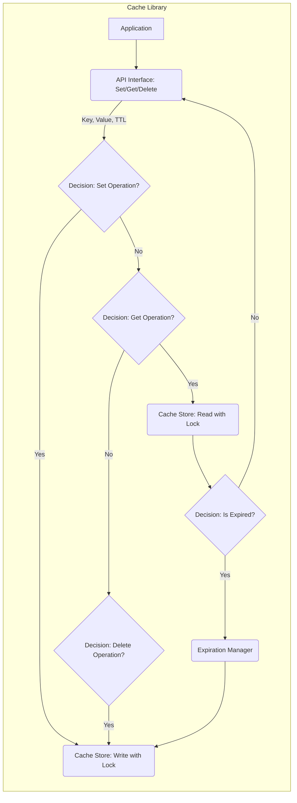

# Project Design Document: Hyperoslo Cache Library

**Version:** 1.1
**Date:** October 26, 2023
**Author:** AI Software Architect

## 1. Introduction

This document provides an enhanced design overview of the `hyperoslo/Cache` library, a lightweight in-memory caching solution for Go applications. This revised document aims to provide a more granular articulation of the library's architecture, component interactions, and data flow to facilitate a more in-depth and effective threat modeling and security analysis.

## 2. Goals and Objectives

The primary goal of this document remains to provide a comprehensive understanding of the `hyperoslo/Cache` library's design. This improved version specifically aims to:

*   Provide more detailed descriptions of the core components, including potential implementation considerations relevant to security.
*   Offer a more granular illustration of the interactions between these components, highlighting data exchange.
*   Present a refined data flow diagram that explicitly shows data movement.
*   Expand on the initial security considerations with more specific examples of potential threats.
*   Introduce potential attack vectors based on the design.

## 3. System Overview

The `hyperoslo/Cache` library offers a straightforward in-memory key-value store with built-in expiration capabilities. It is intended for embedding within Go applications to provide rapid access to frequently accessed data. The library exposes fundamental operations for managing cached items, including setting, retrieving, and deleting entries, alongside automatic removal of expired data.

## 4. Detailed Design

The `hyperoslo/Cache` library can be conceptually divided into the following key components, with a greater emphasis on implementation details relevant to security:

*   **Cache Store:** The central component responsible for holding cached data. It is likely implemented as a concurrent-safe map where keys are strings and values are encapsulated cached data with associated metadata.
*   **Expiration Manager:** This component manages the lifecycle of cached items by tracking their expiration times and triggering their removal.
*   **API Interface:** The public methods through which applications interact with the cache, providing functionalities like `Set`, `Get`, `Delete`, and potentially others.

### 4.1. Core Components

*   **Cache Store:**
    *   Data Structure: Likely implemented using a Go `map[string]*cacheItem` to allow for safe concurrent access and modification of individual `cacheItem` instances. The use of pointers is important for thread-safe updates.
    *   `cacheItem`: A struct containing the cached value (of type `interface{}` or a more specific type if generics are used) and the precise expiration timestamp.
    *   Concurrency Control:  Likely employs `sync.RWMutex` for read-heavy workloads, allowing multiple readers or a single writer. This is a critical point for understanding potential race conditions.
    *   Responsibilities:
        *   Securely storing key-value pairs.
        *   Providing thread-safe methods for adding, retrieving, and removing items.
        *   Managing the underlying memory used for storing cached data.

*   **Expiration Manager:**
    *   Mechanism: Could utilize a dedicated background goroutine that periodically scans the `Cache Store` for expired items. Alternatively, expiration checks might be performed lazily during `Get` operations. A combination of both strategies is also possible.
    *   Expiration Tracking: May use a separate data structure, like a min-heap or a sorted list based on expiration times, to efficiently identify items ready for eviction. This is an area where algorithmic complexity could impact performance and potentially create DoS vulnerabilities if not implemented carefully.
    *   Responsibilities:
        *   Accurately tracking the expiration time for each cached item.
        *   Efficiently identifying and removing expired items from the `Cache Store`.
        *   Potentially handling cleanup of resources associated with expired items.

*   **API Interface:**
    *   Methods:
        *   `Set(key string, value interface{}, ttl time.Duration)`: Atomically adds or updates an item in the cache with a specified time-to-live (TTL). The implementation should ensure that the update to the `Cache Store` is thread-safe.
        *   `Get(key string) (interface{}, bool)`: Retrieves an item from the cache in a thread-safe manner. Returns the value and a boolean indicating if the key exists and is not expired. The expiration check here needs to be carefully implemented to avoid race conditions.
        *   `Delete(key string)`: Atomically removes an item from the cache.
        *   Potentially other methods like `Flush()`, `ItemCount()`, etc.
    *   Input Validation: The API interface should perform basic input validation (e.g., checking for empty keys) to prevent unexpected behavior.
    *   Error Handling:  Clear error handling is important for debugging and security analysis.
    *   Responsibilities:
        *   Providing a well-defined and secure interface for interacting with the cache functionality.
        *   Orchestrating interactions with the `Cache Store` and potentially the `Expiration Manager`.
        *   Implementing necessary locking or synchronization mechanisms for thread safety.

### 4.2. Data Structures

*   `map[string]*cacheItem`: The primary data structure for storing cached data, using pointers for thread-safe updates.
*   `cacheItem`: A struct likely containing:
    *   `value interface{}`: The actual cached data.
    *   `expiry time.Time`: The precise timestamp when the item should expire.
    *   Potentially other metadata like creation timestamp or access count (if more advanced eviction policies are implemented).

### 4.3. Key Interactions

1. **Set Operation:**
    *   The application invokes the `Set` method with a key, value, and TTL.
    *   The API Interface validates the input.
    *   The API Interface calculates the absolute expiration timestamp based on the current time and TTL.
    *   The API Interface acquires a write lock on the `Cache Store` (or a specific segment if sharded).
    *   The API Interface creates or updates the `cacheItem` in the `Cache Store` with the provided key, value, and expiration timestamp.
    *   The write lock is released.

2. **Get Operation:**
    *   The application calls the `Get` method with a key.
    *   The API Interface acquires a read lock on the `Cache Store` (or a specific segment).
    *   The API Interface retrieves the `cacheItem` associated with the key from the `Cache Store`.
    *   The Expiration Manager (or logic within the `Get` method) checks if the current time is after the `expiry` timestamp of the retrieved `cacheItem`.
    *   If the item exists and is not expired, the value is returned, and the read lock is released.
    *   If the item is expired or not found, an appropriate indication (e.g., `nil, false`) is returned, and the read lock is released.

3. **Delete Operation:**
    *   The application calls the `Delete` method with a key.
    *   The API Interface acquires a write lock on the `Cache Store` (or a specific segment).
    *   The API Interface removes the `cacheItem` associated with the key from the `Cache Store`.
    *   The write lock is released.

4. **Expiration Process:**
    *   **Background Goroutine Approach:** The `Expiration Manager` periodically acquires a read lock on the `Cache Store` (or iterates through the separate expiration tracking structure). It checks the `expiry` timestamp of each item. Expired items are identified. The `Expiration Manager` then acquires a write lock to remove the expired items from the `Cache Store`.
    *   **Lazy Expiration Approach:** During a `Get` operation, after acquiring a read lock and retrieving the `cacheItem`, the `expiry` timestamp is checked. If expired, the item is not returned. A separate process might asynchronously clean up these expired entries later.

## 5. Data Flow Diagram

*   **Application:** The external application utilizing the cache library.
*   **API Interface: Set/Get/Delete:** The public methods exposed by the cache library.
*   **Decision: Set Operation?:**  Conditional logic within the API Interface.
*   **Cache Store: Write with Lock:**  Writing data to the in-memory store, protected by a write lock.
*   **Decision: Get Operation?:** Conditional logic within the API Interface.
*   **Cache Store: Read with Lock:** Reading data from the in-memory store, protected by a read lock.
*   **Decision: Is Expired?:**  The expiration check performed during `Get` or by the `Expiration Manager`.
*   **Expiration Manager:** The component responsible for identifying and triggering the removal of expired items.
*   **Decision: Delete Operation?:** Conditional logic within the API Interface.

## 6. Security Considerations

Based on the refined design, potential security considerations for threat modeling include:

*   **Data Sensitivity and Confidentiality:**
    *   **Threat:** Sensitive data stored in the cache could be exposed if the application or the underlying system is compromised.
    *   **Mitigation Considerations (Application Level):**  Applications should avoid caching highly sensitive data or encrypt it before caching.
*   **Denial of Service (DoS):**
    *   **Cache Filling Attack:** An attacker could repeatedly call the `Set` method with unique keys, rapidly filling the cache and consuming excessive memory, leading to application crashes or performance degradation.
    *   **Expiration Manipulation Vulnerabilities:** If the expiration mechanism has flaws (e.g., integer overflows in TTL calculations), an attacker might be able to set extremely long or negative expiration times, preventing eviction and leading to memory exhaustion.
    *   **Hash Collision Attacks:** If the underlying map implementation is vulnerable to hash collision attacks, an attacker could craft keys that cause excessive collisions, leading to performance degradation during lookups and insertions.
*   **Data Integrity:**
    *   **Race Conditions:**  If the locking mechanisms are not implemented correctly, race conditions could occur during `Set` and `Get` operations, leading to inconsistent data being read or written.
*   **Time-of-Check to Time-of-Use (TOCTOU) Issues:**
    *   **Threat:** A subtle race condition could occur where an item is checked as valid during a `Get` operation, but expires before the application actually uses the retrieved value.
    *   **Mitigation:** Atomic operations or careful locking around the expiration check and data retrieval are crucial.
*   **Information Disclosure:**
    *   **Error Messages and Logging:** Verbose error messages or overly detailed logging could inadvertently reveal information about the cache structure, contents, or internal state, aiding attackers.
    *   **Timing Attacks:**  Subtle differences in response times for `Get` operations (e.g., slightly faster for cached items) could potentially be exploited to infer the presence or absence of specific data in the cache.
*   **Memory Safety:**
    *   **Go's Memory Management:** While Go has built-in memory management, vulnerabilities in the underlying implementation or unsafe code could potentially lead to memory corruption issues.

## 7. Assumptions and Constraints

*   **In-Memory Volatility:** The cache is assumed to be purely in-memory, meaning data is lost upon application restart. This has implications for the persistence of sensitive data.
*   **Single Application Instance Focus:** The design primarily considers usage within a single application instance. Security considerations for distributed caching are outside the scope.
*   **Reliance on Go Runtime Security:** The security of the underlying Go runtime environment and operating system is assumed.
*   **No Inherent Authentication or Authorization:** The library itself does not provide built-in mechanisms for authentication or authorization. Enforcing access control is the responsibility of the application using the cache.
*   **Trust in Input Data:** The library assumes that the keys provided by the application are valid strings and does not perform extensive sanitization, which could be a vulnerability if external input is used directly as cache keys.

## 8. Potential Attack Vectors

Based on the design, potential attack vectors to consider during threat modeling include:

*   **Cache Flooding:**  Exploiting the `Set` operation to rapidly fill the cache with garbage data.
*   **Expiration Bypass:** Attempting to manipulate TTL values or exploit flaws in the expiration logic to keep malicious data in the cache indefinitely.
*   **Race Condition Exploitation:**  Attempting to trigger race conditions during concurrent `Set` and `Get` operations to corrupt data or bypass security checks.
*   **Information Leakage via Timing:**  Analyzing response times of `Get` requests to infer cache contents.
*   **Resource Exhaustion:**  Exploiting vulnerabilities to cause excessive memory consumption.

## 9. Future Considerations

Future enhancements that could impact security include:

*   **Distributed Caching Security:** Implementing secure communication and data synchronization mechanisms for distributed deployments.
*   **Advanced Eviction Policies and Security:** Ensuring that more complex eviction policies do not introduce new vulnerabilities.
*   **Encryption at Rest (if persistence is added):**  Protecting cached data if persistence is introduced in the future.
*   **Integration with Security Monitoring Tools:**  Adding hooks or metrics that can be used by security monitoring systems.

This improved document provides a more detailed and security-focused understanding of the `hyperoslo/Cache` library's design. This enhanced information is crucial for conducting a more thorough and effective threat model to identify and mitigate potential security vulnerabilities.
