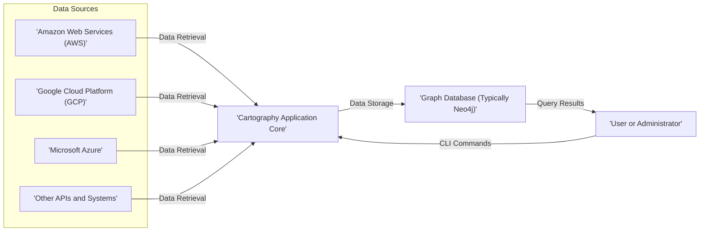
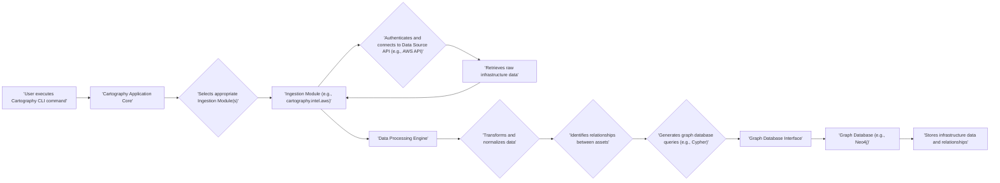

# Project Design Document: Cartography

**Version:** 1.1
**Date:** October 26, 2023
**Prepared By:** Gemini (AI Language Model)

## 1. Introduction

This document provides an enhanced design overview of the Cartography project, an open-source tool designed for discovering and mapping relationships within complex infrastructure environments across various cloud providers and systems. This document serves as a foundational resource for subsequent threat modeling exercises.

### 1.1. Purpose

The primary objective of this document is to provide a clear and comprehensive description of the Cartography system's architecture, its constituent components, and the flow of data within it. This detailed understanding is essential for effectively identifying potential security vulnerabilities and formulating appropriate mitigation strategies during the threat modeling process.

### 1.2. Scope

This document encompasses the core functionalities of Cartography, including:

*   Data ingestion from a variety of sources, such as AWS, GCP, Azure, and potentially other systems exposing APIs.
*   Transformation and normalization of ingested data into a unified format.
*   Persistent storage of infrastructure data and their relationships within a graph database.
*   Mechanisms for querying and retrieving the discovered infrastructure relationships.
*   A command-line interface (CLI) serving as the primary means of user interaction.

This document explicitly excludes:

*   In-depth implementation details of individual data ingestion modules, such as the specific API calls made to AWS services.
*   Graphical user interface (GUI) aspects, as the project's focus is primarily on CLI-based interaction.
*   Detailed deployment procedures tailored to specific environments or platforms.

### 1.3. Goals

The goals of this design document are to:

*   Present a clear and detailed overview of the Cartography system's architecture.
*   Identify and describe the key components of the system and their interactions.
*   Illustrate the flow of data as it moves through the system.
*   Highlight potential areas of security concern that warrant further investigation during threat modeling.

## 2. High-Level Architecture

The following diagram illustrates the high-level architecture of the Cartography system:

**Description:**

*   **Data Sources:** Cartography gathers data from various infrastructure providers and systems. The primary sources are major cloud platforms like AWS, GCP, and Azure, but it can be extended to include other systems with accessible APIs.
*   **Cartography Application Core:** This is the central component of the system. It orchestrates the data ingestion process, transforms the raw data, and loads it into the graph database.
*   **Graph Database (Typically Neo4j):** Cartography leverages a graph database, with Neo4j being the most common choice, to store the discovered infrastructure assets and the relationships between them. This structure is ideal for representing interconnected infrastructure.
*   **User or Administrator:** Users interact with Cartography through its command-line interface (CLI) to initiate data collection processes and query the graph database for insights.

## 3. Component Details

This section provides a more detailed breakdown of the key components within the Cartography application core.

*   **Ingestion Modules (also known as "Intels"):**
    *   Purpose: To connect to and retrieve data from specific data sources. Each module is tailored to the unique API and data structures of a particular source (e.g., `cartography.intel.aws.ec2` for AWS EC2 instances).
    *   Functionality:
        *   Handles authentication and authorization with the target data source using configured credentials.
        *   Executes API calls or queries to fetch raw data related to infrastructure assets.
        *   May perform initial filtering or transformation of the raw data.
    *   Examples: Modules exist for AWS, GCP, Azure, GitHub, and more.
*   **Data Processing Engine:**
    *   Purpose: To receive raw data from the ingestion modules and prepare it for storage in the graph database.
    *   Functionality:
        *   Transforms and normalizes data from different sources into a consistent, internal representation.
        *   Identifies relationships between different infrastructure assets based on the ingested data (e.g., an EC2 instance belongs to a specific VPC).
        *   Constructs Cypher queries (for Neo4j) or similar graph database commands to create nodes and relationships representing the infrastructure.
*   **Graph Database Interface:**
    *   Purpose: To manage the connection to the graph database and execute the generated queries.
    *   Functionality:
        *   Establishes and maintains a connection to the configured graph database (e.g., Neo4j).
        *   Executes the Cypher queries generated by the Data Processing Engine to create, update, or delete nodes and relationships in the database.
        *   Handles potential errors and manages database transactions.
*   **CLI (Command-Line Interface):**
    *   Purpose: To provide a user-friendly interface for interacting with Cartography's functionalities.
    *   Functionality:
        *   Allows users to initiate data collection runs for specific providers or all configured sources.
        *   Provides options for configuring data sources, authentication credentials, and other settings (often through configuration files or environment variables).
        *   May offer basic querying capabilities or instructions on how to connect directly to the graph database for more complex queries.
*   **Configuration Management:**
    *   Purpose: To manage and securely store configuration settings required for Cartography to operate.
    *   Functionality:
        *   Handles the storage and retrieval of sensitive information such as API keys, service account credentials, and database connection details.
        *   May involve reading configuration from files (e.g., YAML), environment variables, or integration with dedicated secrets management solutions.
*   **Logging and Monitoring:**
    *   Purpose: To record events and activities within the Cartography application for debugging, auditing, and monitoring purposes.
    *   Functionality:
        *   Logs information about data collection progress, errors encountered, and performance metrics.
        *   May integrate with standard logging frameworks and potentially external monitoring systems.

## 4. Data Flow

The following diagram illustrates the typical flow of data within the Cartography system during a data collection run:

**Description:**

1. A user initiates a data collection process by executing a command through the Cartography CLI.
2. The Cartography Application Core receives the command and determines the relevant ingestion modules to execute.
3. The appropriate Ingestion Module is invoked, responsible for a specific data source.
4. The Ingestion Module authenticates and establishes a connection with the target data source's API.
5. The Ingestion Module retrieves raw data about infrastructure assets from the data source.
6. The raw data is passed back to the Data Processing Engine.
7. The Data Processing Engine transforms and normalizes the data into a consistent internal format.
8. Relationships between different infrastructure assets are identified based on the processed data.
9. Graph database queries (e.g., Cypher for Neo4j) are generated to represent the data and relationships.
10. The Graph Database Interface receives the generated queries.
11. The Graph Database Interface connects to the graph database.
12. The graph database executes the queries, storing the infrastructure data and their relationships.

## 5. Security Considerations

This section outlines key security considerations relevant to the Cartography project, which will be the focus of subsequent threat modeling activities.

*   **Sensitive Credential Management:**
    *   The secure storage and handling of credentials used to access cloud providers and other systems is paramount.
    *   Storing credentials in plaintext within configuration files or environment variables poses a significant security risk.
    *   Recommended practices include utilizing secure secrets management solutions (e.g., HashiCorp Vault, AWS Secrets Manager, Azure Key Vault, GCP Secret Manager) or leveraging credential providers.
*   **Authentication and Authorization of Cartography Itself:**
    *   Consider who or what has the authority to execute Cartography and access the collected infrastructure data.
    *   Implementing role-based access control (RBAC) can help manage permissions and restrict access to sensitive functionalities and data.
    *   Mechanisms for authenticating users or systems interacting with the Cartography CLI should be considered.
*   **Protection of Data in Transit:**
    *   All communication between Cartography and data sources, as well as between Cartography and the graph database, should be encrypted using secure protocols like HTTPS/TLS.
    *   This protects sensitive data from eavesdropping during transmission.
*   **Security of Data at Rest:**
    *   The graph database containing potentially sensitive infrastructure information requires robust security measures.
    *   Implementing encryption at rest for the database storage volumes is crucial.
    *   Access control mechanisms for the graph database itself should be strictly enforced.
*   **Input Validation and Sanitization:**
    *   While primarily focused on data retrieval, Cartography might process user-provided configuration settings or CLI arguments.
    *   Proper input validation and sanitization are necessary to prevent injection attacks or other forms of malicious input exploitation.
*   **Dependency Management and Vulnerability Scanning:**
    *   Cartography relies on numerous third-party libraries and dependencies.
    *   Regularly scanning dependencies for known vulnerabilities and keeping them updated is essential to maintain the security of the application.
*   **Comprehensive Logging and Auditing:**
    *   Detailed logging of all actions and events within the Cartography application is crucial for security monitoring, incident response, and auditing purposes.
    *   Audit logs should be securely stored and protected from unauthorized access or modification.
*   **Principle of Least Privilege for Data Source Access:**
    *   When configuring access for Cartography to data sources, adhere to the principle of least privilege.
    *   Grant only the necessary permissions required to retrieve the intended infrastructure data, minimizing the potential impact of compromised credentials.

## 6. Deployment Considerations

While not the primary focus of this design document, understanding potential deployment scenarios is relevant for assessing security implications.

*   **Deployment Environment Options:** Cartography can be deployed in various environments, including:
    *   On-premises infrastructure (e.g., physical servers, virtual machines).
    *   Cloud-based compute instances (e.g., AWS EC2, GCP Compute Engine, Azure VMs).
    *   Containerized environments (e.g., Docker, Kubernetes).
*   **Network Security:** Network configurations and firewall rules will significantly impact Cartography's ability to connect to data sources and the graph database. Proper network segmentation and access controls are essential.
*   **Scalability and Performance:** Depending on the scale of the infrastructure being mapped, considerations for scaling the Cartography application and the graph database might be necessary.
*   **High Availability and Resilience:** For critical deployments, strategies for ensuring high availability and disaster recovery should be considered to maintain continuous operation.

## 7. Future Considerations

This section outlines potential future enhancements and directions for the Cartography project that could influence its architecture and security posture.

*   **Expansion of Data Source Support:** Adding support for a wider range of cloud providers, SaaS applications, and on-premises systems.
*   **Enhanced Querying and Visualization Tools:** Developing a graphical user interface (GUI) or integrating with existing visualization platforms to provide more intuitive ways to explore the infrastructure graph.
*   **Real-time or Near Real-time Data Ingestion:** Moving beyond batch-based data collection to provide more up-to-date views of the infrastructure.
*   **Integration with Security and Compliance Tools:** Enabling Cartography to feed data into security information and event management (SIEM) systems, compliance dashboards, or other security analysis platforms.

This enhanced design document provides a more detailed and comprehensive overview of the Cartography project, serving as a solid foundation for conducting thorough threat modeling exercises. The identified components, data flow, and security considerations will be instrumental in identifying potential vulnerabilities and developing effective mitigation strategies.
