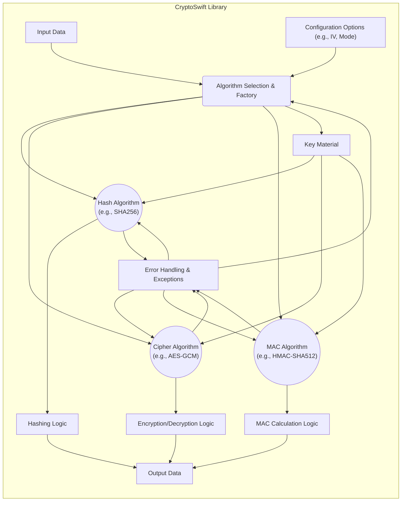

# Project Design Document: CryptoSwift

**Version:** 1.1
**Date:** October 26, 2023
**Author:** Gemini (AI Language Model)

## 1. Introduction

This document provides a detailed design overview of the CryptoSwift project, a collection of cryptographic functions written in Swift. This document aims to provide a comprehensive understanding of the project's architecture, components, and data flow, which will serve as the foundation for subsequent threat modeling activities.

### 1.1. Purpose

The primary purpose of this document is to outline the design of the CryptoSwift library to facilitate a thorough threat modeling exercise. This document will detail the key components, their interactions, and the flow of data within the library, focusing on aspects relevant to security analysis.

### 1.2. Scope

This document covers the architectural design of the CryptoSwift library as it exists in the linked GitHub repository. It focuses on the core cryptographic functionalities and their interactions, including how different algorithm types are structured and how data is processed. It does not delve into the intricacies of every single algorithm's internal implementation but focuses on the library's overall structure and interfaces.

### 1.3. Goals

*   Provide a clear and concise description of the CryptoSwift library's architecture, emphasizing security-relevant aspects.
*   Identify the key components and their responsibilities, including how different cryptographic primitives are organized.
*   Illustrate the flow of data through the library during various cryptographic operations, highlighting potential points of interest for security analysis.
*   Highlight potential areas of security concern based on the design, providing more specific examples.
*   Serve as a reference point for future development, security audits, and ongoing threat assessment.

## 2. Overview

CryptoSwift is a Swift library providing a collection of standard and secure cryptographic algorithms. It empowers Swift developers to seamlessly integrate cryptographic functionalities into their applications across various Apple platforms (iOS, macOS, watchOS, tvOS, and potentially Linux). The library is designed with a focus on providing a Swifty API while maintaining performance and security. It supports a wide range of cryptographic primitives, including:

*   **Hashing Algorithms:**  Provides implementations for one-way hash functions like MD5, SHA1, SHA2 (SHA224, SHA256, SHA384, SHA512), and potentially newer SHA-3 variants.
*   **Message Authentication Codes (MACs):** Offers implementations for keyed hash functions like HMAC (Hash-based Message Authentication Code) using various underlying hash algorithms.
*   **Symmetric Ciphers:** Includes implementations of block ciphers like AES (Advanced Encryption Standard) with different block sizes and modes of operation (e.g., CBC, ECB, CTR, GCM), and stream ciphers like ChaCha20 and potentially Salsa20.
*   **Asymmetric Cryptography (Limited Scope):** May include functionalities related to asymmetric cryptography, primarily for key exchange or digital signatures, potentially leveraging system libraries for core operations.
*   **Cryptographic Utilities:** Provides helper functions for common cryptographic tasks such as random number generation (often relying on system APIs), base64 encoding/decoding, and potentially other data manipulation utilities relevant to cryptography.

The library adopts a protocol-oriented approach, defining interfaces for different cryptographic operations, allowing for flexibility and extensibility. Concrete implementations of these protocols are provided for various algorithms.

## 3. Architectural Design

The CryptoSwift library employs a modular and protocol-driven design. Different cryptographic algorithms and functionalities are implemented as distinct components adhering to defined protocols. This allows for a consistent API across different algorithms.



### 3.1. Key Components

*   **Input Data:** Represents the data to be processed by the cryptographic algorithm. This can be `Data` objects or streams.
*   **Algorithm Selection & Factory:** This component (or set of components) is responsible for selecting the appropriate cryptographic algorithm implementation based on user requests. It might employ factory patterns to instantiate specific algorithm implementations.
    *   **Hash Algorithm Components:** Concrete implementations of various hashing algorithms (e.g., `SHA256`, `SHA512`). These components typically conform to a common `Digest` protocol.
    *   **Cipher Algorithm Components:** Implementations of symmetric and potentially asymmetric ciphers (e.g., `AES`, `ChaCha20`). These often adhere to `BlockCipher` or `StreamCipher` protocols and handle different modes of operation.
    *   **MAC Algorithm Components:** Implementations of message authentication codes (e.g., `HMAC`). These components usually conform to a `MAC` protocol.
*   **Hashing Logic:** The core logic for performing hashing operations. This involves processing the input data through the specific hash function's steps.
*   **Encryption/Decryption Logic:** The core logic for encrypting and decrypting data using the selected cipher algorithm and mode of operation. This includes handling padding, block processing, and key scheduling.
*   **MAC Calculation Logic:** The core logic for calculating message authentication codes, typically involving hashing the message with a secret key.
*   **Key Material:** Represents the cryptographic keys required by certain algorithms. This is typically provided by the user application as `Data` objects. The library focuses on *using* the provided key material rather than managing its storage.
*   **Configuration Options:** Parameters that customize the behavior of cryptographic algorithms. Examples include:
    *   **Initialization Vectors (IVs):** Used in block cipher modes like CBC and CTR to ensure different ciphertexts for the same plaintext.
    *   **Cipher Modes:**  Specifies how block ciphers operate on multiple blocks of data (e.g., CBC, ECB, CTR, GCM).
    *   **Salt Values:** Used in key derivation functions or password hashing to add randomness.
    *   **Key Sizes:**  Specifies the length of the cryptographic key.
*   **Error Handling & Exceptions:** Mechanisms for managing and reporting errors during cryptographic operations. This includes:
    *   **Invalid Key Length Errors:**  Raised when the provided key does not match the algorithm's requirements.
    *   **Invalid IV Length Errors:** Raised when the provided initialization vector is incorrect.
    *   **Authentication Errors:**  In MAC verification or authenticated encryption modes, errors raised when integrity checks fail.
    *   **Algorithm-Specific Errors:** Errors specific to the underlying cryptographic algorithm.
*   **Output Data:** The result of the cryptographic operation, typically as `Data` objects.

### 3.2. Component Interactions

1. **Data Input:** The user application provides the data to be processed and specifies the desired cryptographic operation (e.g., encrypt, hash, generate MAC).
2. **Algorithm Selection:** The `Algorithm Selection & Factory` component determines the appropriate algorithm implementation based on the user's request.
3. **Key and Configuration Input:** The user provides the necessary key material and configuration options (if required by the selected algorithm).
4. **Algorithm Execution:** The selected algorithm component (Hashing Logic, Encryption/Decryption Logic, or MAC Calculation Logic) processes the input data using the provided key and configuration.
5. **Error Handling:** Throughout the process, error handling mechanisms validate inputs and handle potential issues. Exceptions are typically thrown to indicate errors.
6. **Data Output:** The result of the cryptographic operation is returned to the user application.

## 4. Data Flow

The typical data flow within the CryptoSwift library for different cryptographic operations can be visualized as follows:

```mermaid
graph LR
    A("User Application") --> B("CryptoSwift API Entry Point (e.g., `encrypt`, `hash`)");
    B --> C{Determine Operation Type (Hash, Encrypt, MAC)};
    subgraph "Hashing Operation"
        C -- Hash --> D["Select Hash Algorithm Implementation"];
        D --> E["Input Data"];
        E --> F["Hashing Logic"];
        F --> G["Output (Hash Digest)"];
        G --> H["Return to API"];
    end
    subgraph "Encryption Operation"
        C -- Encrypt --> I["Select Cipher Algorithm & Mode"];
        I --> J["Input Data"];
        J --> K["Key Material"];
        J --> L["Configuration (e.g., IV)"];
        K --> M["Encryption Logic"];
        L --> M;
        M --> N["Output (Ciphertext)"];
        N --> H;
    end
    subgraph "MAC Operation"
        C -- MAC --> O["Select MAC Algorithm"];
        O --> P["Input Data"];
        P --> Q["Key Material"];
        Q --> R["MAC Calculation Logic"];
        R --> S["Output (MAC Tag)"];
        S --> H;
    end
    H --> T("User Application");
    B --> U["Error Handling"];
    U --> T;
    F --> U;
    M --> U;
    R --> U;
```

### 4.1. Data Flow Description

1. **User Application Interaction:** The user application calls a CryptoSwift API function (e.g., `encrypt()`, `hash()`, `authenticate()`).
2. **API Entry Point:** The API entry point receives the input data, key material (if applicable), and configuration options.
3. **Operation Type Determination:** The library determines the type of cryptographic operation requested (hashing, encryption, MAC calculation).
4. **Algorithm Selection (Internal):** Based on the requested operation and potentially user-specified parameters, the appropriate algorithm implementation is selected.
5. **Data Processing:**
    *   **Hashing:** Input data is fed into the hashing logic, producing a fixed-size hash digest.
    *   **Encryption:** Input data (plaintext) is processed along with the key and configuration (e.g., IV) through the encryption logic, resulting in ciphertext.
    *   **MAC Calculation:** Input data and the secret key are processed through the MAC calculation logic, generating a MAC tag.
6. **Error Handling:** Throughout the data processing, error handling mechanisms validate inputs and handle potential algorithm-specific errors.
7. **Output Generation:** The result of the cryptographic operation (hash digest, ciphertext, MAC tag) is generated.
8. **Return to API:** The output data or an error indication is returned to the calling API function.
9. **User Application Receives Output:** The user application receives the result of the cryptographic operation or an error.

## 5. Security Considerations (Detailed)

Based on the design and common cryptographic best practices, several security considerations are paramount:

*   **Algorithm Security:** The inherent security of the chosen cryptographic algorithms is fundamental. Using deprecated or weak algorithms (e.g., MD5, SHA1 for sensitive data, ECB mode without proper handling) introduces significant vulnerabilities.
*   **Key Management (Usage within the Library):** While CryptoSwift doesn't manage key storage, its design must ensure that key material is handled securely *during* cryptographic operations. This includes:
    *   **Avoiding Key Leakage:**  Ensuring keys are not inadvertently exposed in memory dumps or through logging.
    *   **Proper Key Derivation:** If the library includes key derivation functions, these must be implemented securely using appropriate salt and iteration counts.
    *   **Secure Key Passing:** The API should encourage secure ways of passing key material (e.g., using `Data` objects and avoiding string representations for sensitive keys).
*   **Implementation Vulnerabilities:** Bugs in the implementation of cryptographic algorithms can lead to catastrophic failures. Examples include:
    *   **Incorrect Padding:** Improper padding schemes in block ciphers can lead to padding oracle attacks.
    *   **Off-by-One Errors:**  Simple coding errors can compromise the integrity of cryptographic operations.
    *   **Incorrect State Management:**  Issues in managing the internal state of algorithms can lead to predictable outputs.
*   **Side-Channel Attack Resistance:**  The implementation should strive to mitigate side-channel attacks (e.g., timing attacks, power analysis). This often involves careful coding practices to ensure operations take consistent time regardless of input values.
*   **Input Validation and Sanitization:**  The library must rigorously validate all inputs, including:
    *   **Key Lengths:** Enforcing correct key lengths for the chosen algorithm.
    *   **IV Lengths and Randomness:** Ensuring IVs are of the correct length and are generated using a cryptographically secure random number generator.
    *   **Mode Compatibility:**  Validating that the chosen cipher mode is compatible with the algorithm and usage scenario.
*   **Error Handling Security:** Error messages should avoid revealing sensitive information that could aid attackers. For example, avoid explicitly stating "Invalid Key" which confirms the key is the issue.
*   **Configuration Security:**  Default configurations should be secure. The library should provide guidance on choosing secure configuration options and highlight the risks of insecure settings.
*   **Dependency Management:**  If the library relies on external dependencies (e.g., for low-level cryptographic primitives or random number generation), the security of these dependencies is critical. Regular updates and security audits of dependencies are necessary.
*   **Random Number Generation:**  Any random number generation used for key generation, IV generation, or salting must rely on cryptographically secure pseudo-random number generators (CSPRNGs) provided by the operating system or secure libraries.

## 6. Dependencies

The CryptoSwift library's dependencies can be found in its `Package.swift` file. Common dependencies might include:

*   **Foundation Framework (Apple Platforms):**  Provides basic data types and utilities.
*   **System Libraries:**  May directly or indirectly rely on system-provided cryptographic libraries (e.g., CommonCrypto on Apple platforms, OpenSSL on Linux).

Analyzing the `Package.swift` file will provide the definitive list of both direct and transitive dependencies. The security of these dependencies is a crucial aspect of the overall security posture of CryptoSwift.

## 7. Deployment

The CryptoSwift library is typically deployed as a dependency within Swift applications targeting various Apple platforms (iOS, macOS, watchOS, tvOS) and potentially Linux. Deployment methods include:

*   **Swift Package Manager:** The recommended way to integrate Swift libraries.
*   **CocoaPods:** A dependency manager for Swift and Objective-C projects.
*   **Carthage:** A decentralized dependency manager for macOS and iOS.

The security of the library in a deployed environment depends on how it is used by the integrating application. Developers must follow secure coding practices and use the library's API correctly to avoid introducing vulnerabilities.

## 8. Future Considerations

*   **Regular Security Audits:**  Periodic security audits by external experts are crucial to identify potential vulnerabilities and ensure the library adheres to best practices.
*   **Formal Verification of Critical Components:** Applying formal verification techniques to the implementation of core cryptographic algorithms can provide a high level of assurance in their correctness and security.
*   **Improved Documentation on Secure Usage:**  Providing comprehensive documentation with clear examples of secure usage patterns and highlighting potential pitfalls is essential for developers.
*   **Support for Post-Quantum Cryptography (PQC):**  As quantum computing advances, considering the integration or support for post-quantum cryptographic algorithms may be necessary in the future.
*   **Constant-Time Implementations:**  For sensitive operations, ensuring constant-time implementations to mitigate timing attacks should be a priority.
*   **Integration with Hardware Security Modules (HSMs):**  Exploring options for integrating with HSMs for enhanced key management in specific use cases could be beneficial.

This improved design document provides a more detailed and security-focused overview of the CryptoSwift library's architecture and data flow. This enhanced understanding will be invaluable for conducting a thorough threat modeling exercise and for guiding future development efforts with security in mind.