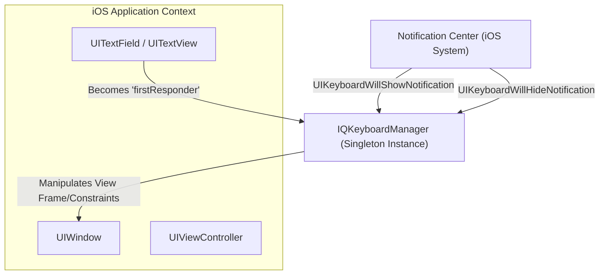
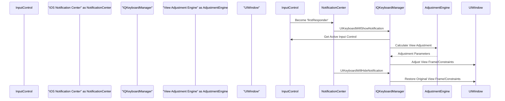

# Project Design Document: IQKeyboardManager

**Version:** 1.1
**Date:** October 26, 2023
**Author:** AI Software Architect

## 1. Introduction

This document provides a detailed design overview of the IQKeyboardManager iOS library. This library is designed to automatically prevent the iOS keyboard from obscuring `UITextField` and `UITextView` controls by dynamically managing the application's view hierarchy in response to keyboard appearance and disappearance events. This document serves as a foundational artifact for subsequent threat modeling activities.

## 2. Goals and Objectives

*   **Primary Goal:** To seamlessly and automatically manage the position of the currently active text input control (`UITextField` or `UITextView`) to ensure its visibility when the software keyboard is presented to the user.
*   **Secondary Goals:**
    *   Provide a zero-configuration or minimal-configuration integration experience for iOS developers.
    *   Offer a comprehensive set of customization options to accommodate diverse UI layouts and specific application requirements.
    *   Maintain a lightweight footprint and minimize any performance overhead on the host application.
    *   Ensure compatibility across a broad range of supported iOS versions.

## 3. High-Level Architecture

IQKeyboardManager operates as a singleton object within the application's process. It intercepts and responds to system-level notifications related to keyboard events, dynamically adjusting the view hierarchy to prevent input controls from being hidden by the keyboard.

**Key Architectural Elements:**

*   **`IQKeyboardManager` Singleton:** The core component responsible for orchestrating keyboard management. It holds global configuration settings and manages the lifecycle of keyboard event observation and view adjustments.
*   **System Notification Observer:**  Subscribes to the iOS `Notification Center` to receive notifications such as `UIKeyboardWillShowNotification`, `UIKeyboardWillHideNotification`, and potentially `UIKeyboardDidChangeFrameNotification`.
*   **Active Input Tracking:**  Maintains awareness of the currently focused `UITextField` or `UITextView` within the application's view hierarchy.
*   **View Adjustment Engine:**  Calculates the necessary transformations (frame adjustments, constraint modifications) to the view hierarchy to ensure the active input control remains visible above the keyboard. This considers the keyboard's dimensions and the input control's position.
*   **Configuration Management:** Provides properties and methods to allow developers to customize the library's behavior, including enabling/disabling the manager, setting the distance between the keyboard and the text field, and managing the appearance of the input accessory view (toolbar).

## 4. Detailed Component Design

### 4.1. `IQKeyboardManager` Singleton

*   **Core Responsibilities:**
    *   Serves as the central access point and controller for the library's functionality.
    *   Manages the global enabled/disabled state of keyboard management.
    *   Persists and provides access to user-configurable settings (e.g., `keyboardDistanceFromTextField`, `shouldResignOnTouchOutside`).
    *   Handles the registration and unregistration of observers for relevant keyboard notifications from the `Notification Center`.
    *   Delegates the tasks of identifying the active input control and performing view adjustments to other internal components.
    *   Exposes a public API for developers to customize the library's behavior and appearance.

*   **Key Attributes:**
    *   `isEnabled`: A boolean flag that globally activates or deactivates the keyboard management functionality.
    *   `keyboardDistanceFromTextField`: A `CGFloat` value specifying the desired vertical spacing between the top of the keyboard and the bottom of the focused text field.
    *   `shouldResignOnTouchOutside`: A boolean indicating whether tapping outside the focused text field should dismiss the keyboard.
    *   `toolbarManageBehaviour`: An enumeration defining the behavior of the automatically generated keyboard toolbar (e.g., individual, bySubviews, none).
    *   `enableAutoToolbar`: A boolean flag to control the automatic creation and display of a toolbar with "Previous," "Next," and "Done" buttons.
    *   `overrideKeyboardAppearance`: A boolean to control whether the keyboard appearance should be overridden.

*   **Key Methods:**
    *   `shared()`: Provides access to the singleton instance of `IQKeyboardManager`.
    *   `enable()`: Programmatically enables the keyboard management.
    *   `disable()`: Programmatically disables the keyboard management.
    *   `resignFirstResponder()`: Programmatically dismisses the keyboard.
    *   `reloadLayoutIfNeeded()`: Forces a recalculation and adjustment of the view layout.

### 4.2. System Notification Handling

*   **Responsibilities:**
    *   Registers as an observer with the `Notification Center` for `UIKeyboardWillShowNotification` and `UIKeyboardWillHideNotification`.
    *   Receives and processes these notifications when the system keyboard is about to appear or disappear.
    *   Extracts relevant information from the notification's `userInfo` dictionary, such as the keyboard's frame (`CGRect`), animation duration, and animation curve.
    *   Triggers the `View Adjustment Engine` to initiate the necessary view modifications.

*   **Process Flow:**
    1. Upon receiving `UIKeyboardWillShowNotification`:
        *   Extract the keyboard's final frame from the notification.
        *   Identify the currently active `UITextField` or `UITextView`.
        *   Invoke the `View Adjustment Engine` to calculate the required view transformation.
        *   Animate the view frame or constraint changes using the animation parameters provided in the notification.
    2. Upon receiving `UIKeyboardWillHideNotification`:
        *   Restore the view's original frame or constraints.
        *   Animate the restoration using the animation parameters from the notification.

### 4.3. Active Input Tracking

*   **Responsibilities:**
    *   Monitors changes in the `firstResponder` status within the application's view hierarchy.
    *   Identifies the specific `UITextField` or `UITextView` that has gained focus and is currently receiving user input.

*   **Mechanism:**
    *   Typically involves observing notifications related to changes in the `firstResponder` status or by directly checking the `firstResponder` property of the application's `UIWindow`.

### 4.4. View Adjustment Engine

*   **Responsibilities:**
    *   Determines the optimal adjustments to the view hierarchy to prevent the active input control from being obscured by the keyboard.
    *   Calculates the necessary vertical offset based on the keyboard's height, the position of the input control, and the configured `keyboardDistanceFromTextField`.
    *   Handles scenarios where the input control is embedded within a `UIScrollView` or other container views.
    *   Applies the calculated transformations to the appropriate view (typically the view controller's root view or a containing scroll view).

*   **Calculation Logic:**
    1. Determine the bottom Y-coordinate of the focused input control in the window's coordinate system.
    2. Determine the top Y-coordinate of the keyboard in the window's coordinate system.
    3. Calculate the vertical overlap between the input control and the keyboard.
    4. Calculate the required upward shift of the view to eliminate the overlap, taking into account the `keyboardDistanceFromTextField` setting.

### 4.5. Configuration Management

*   **Responsibilities:**
    *   Provides a structured way for developers to customize the library's behavior.
    *   Stores and manages the configurable settings exposed by the `IQKeyboardManager` singleton.

*   **Implementation:**
    *   Utilizes public properties on the `IQKeyboardManager` singleton to allow developers to set configuration options.
    *   These configuration values are accessed and used by other components of the library during the keyboard management process.

## 5. Data Flow

1. A user interacts with a `UITextField` or `UITextView`, causing it to become the `firstResponder`.
2. The iOS system posts a `UIKeyboardWillShowNotification` to the `Notification Center`.
3. The `IQKeyboardManager`'s notification observer receives the `UIKeyboardWillShowNotification`.
4. `IQKeyboardManager` identifies the currently active input control by checking the `firstResponder`.
5. The `View Adjustment Engine` calculates the necessary adjustment based on the keyboard's frame and the input control's position.
6. `IQKeyboardManager` manipulates the frame or constraints of the relevant view (e.g., the view controller's view) using an animated transition.
7. When the user dismisses the keyboard (e.g., by tapping "Done" or switching to another app), the iOS system posts a `UIKeyboardWillHideNotification`.
8. The `IQKeyboardManager`'s notification observer receives the `UIKeyboardWillHideNotification`.
9. `IQKeyboardManager` restores the original frame or constraints of the adjusted view, typically using an animated transition.

## 6. Security Considerations (For Threat Modeling)

This section outlines potential security considerations relevant to IQKeyboardManager. These points should be thoroughly investigated during the threat modeling process.

*   **Malicious View Manipulation:** Could a crafted sequence of events or unexpected input cause the library to manipulate the view hierarchy in a way that exposes sensitive information (e.g., pushing a login prompt off-screen to display underlying data) or disrupts the user interface (e.g., making interactive elements inaccessible)?
*   **Resource Exhaustion/Denial of Service:** Could rapid and repeated keyboard appearance/disappearance events, especially in complex view hierarchies, lead to excessive CPU or memory consumption, potentially causing the application to become unresponsive or crash?
*   **Information Disclosure (Indirect):** While the library doesn't directly handle user input data, could vulnerabilities in its view manipulation logic indirectly reveal information about the application's state or layout that should remain private?
*   **Input Validation and Injection (Indirect):** Although IQKeyboardManager primarily deals with view management, vulnerabilities in how it interacts with text fields or their delegate methods could potentially be exploited if not handled carefully.
*   **Method Swizzling Risks:** If the library employs method swizzling to intercept system behavior, this could introduce unforeseen side effects or security vulnerabilities if the swizzling is not implemented robustly and with a thorough understanding of potential consequences. *Action: Verify if method swizzling is used and assess its implementation.*
*   **Third-Party Dependency Vulnerabilities:**  If IQKeyboardManager relies on any external libraries or frameworks, vulnerabilities in those dependencies could indirectly affect the security of applications using IQKeyboardManager. *Action: Review the project's dependencies for known vulnerabilities.*
*   **Insecure Default Configurations:** Are the default configuration settings of IQKeyboardManager secure? Could insecure defaults lead to unintended behavior or vulnerabilities in applications that integrate the library without careful configuration?
*   **Accessibility Issues as Security Concerns:** Could improper view adjustments inadvertently hinder accessibility features, potentially creating usability issues that could be exploited in certain contexts?

## 7. Deployment Considerations

*   **Integration Methods:** IQKeyboardManager is commonly integrated into iOS projects using dependency management tools such as CocoaPods, Carthage, or Swift Package Manager. The chosen integration method can have implications for dependency management and build processes.
*   **Minimum Supported iOS Version:** The range of iOS versions supported by the library is a factor. Security vulnerabilities and best practices can vary across different iOS versions.
*   **Permissions:** IQKeyboardManager does not require any special runtime permissions from the user.
*   **Potential Conflicts with Other Libraries:** Consider potential conflicts with other third-party libraries that also manipulate the view hierarchy or handle keyboard events. Such conflicts could lead to unexpected behavior or security vulnerabilities.

## 8. Alternatives Considered

*   **Manual View Management:** Developers could implement custom logic within each view controller to handle keyboard appearance and disappearance. This approach offers fine-grained control but can be repetitive and error-prone.
*   **Using `UIScrollView` with Content Insets:**  Adjusting the `contentInset` and `scrollIndicatorInsets` of a `UIScrollView` can help manage keyboard obstruction. However, this approach might not be suitable for all UI layouts and can require manual calculations.
*   **Reactive Programming Approaches:** Libraries leveraging reactive programming paradigms (e.g., RxSwift, Combine) can be used to observe keyboard notifications and update the UI accordingly. This can offer a more declarative approach but might introduce additional complexity.

## 9. Future Considerations

*   **Enhanced Handling of Complex Layouts and Custom Containers:** Further improve the robustness of the view adjustment logic to handle more intricate UI structures, including custom container views and complex animation scenarios.
*   **Improved Accessibility Support:**  Ensure seamless integration with iOS accessibility features like VoiceOver and Switch Control, ensuring that view adjustments do not negatively impact users with disabilities.
*   **Comprehensive Testing and Validation:** Implement a robust suite of unit and UI tests to ensure the library functions correctly and securely across a wide range of devices, iOS versions, and application scenarios.
*   **Performance Optimization:** Continuously monitor and optimize the library's performance to minimize any impact on the host application's responsiveness and resource usage.

This revised document provides a more detailed and comprehensive design overview of the IQKeyboardManager library, offering a stronger foundation for subsequent threat modeling activities.