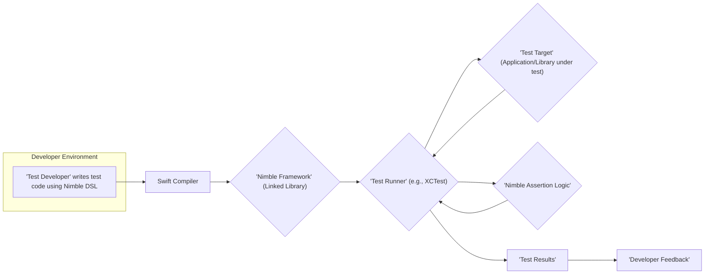

## Project Design Document: Nimble - Swift Testing Framework (Improved)

**1. Introduction**

This document provides an enhanced design overview of Nimble, a popular Swift testing framework. The primary goal is to offer a detailed articulation of Nimble's architecture, internal components, and data flow, specifically tailored for effective threat modeling. This document will serve as a robust foundation for identifying potential security vulnerabilities and risks inherent in the framework's design and implementation.

**2. Goals and Objectives**

*   Present a comprehensive and refined architectural overview of Nimble.
*   Provide detailed descriptions of key components, including their internal responsibilities and sub-components.
*   Illustrate the data flow during test execution with greater granularity.
*   Elaborate on the key interactions between different parts of the framework, including communication protocols and data exchange.
*   Establish a clear and in-depth understanding of the system to facilitate thorough threat modeling activities.

**3. High-Level Architecture**

Nimble functions as a library seamlessly integrated into Swift projects. Its core purpose is to offer a more expressive and human-readable syntax for crafting assertions within unit and integration tests. The central elements of Nimble interact closely with the underlying testing infrastructure provided by platforms like Xcode (utilizing XCTest) or other Swift testing environments.

**4. Component Breakdown (Detailed)**

Nimble comprises several interconnected components, each with specific responsibilities:

*   **Domain Specific Language (DSL) Engine:**
    *   Provides the user-friendly and expressive syntax for writing assertions.
        *   Includes core functions like `expect(...)`, `it(...)`, `describe(...)`, `context(...)`, `beforeEach(...)`, `afterEach(...)`.
        *   Parses the DSL syntax to understand the intended assertion.
        *   Acts as the primary interface for developers interacting with Nimble.
    *   Sub-components:
        *   **Lexer/Parser:**  Analyzes the DSL syntax to create an internal representation.
        *   **DSL Interpreter:**  Translates the parsed DSL into actions for the assertion logic.
*   **Matcher Registry:**
    *   Manages a collection of reusable `Matcher` objects.
    *   Allows developers to register custom matchers, extending Nimble's capabilities.
    *   Facilitates the lookup of the appropriate matcher based on the DSL usage.
*   **Core Assertion Logic & Evaluation:**
    *   Contains the fundamental logic for evaluating assertions.
    *   Receives the actual value and the selected matcher.
    *   Executes the matcher's comparison logic.
    *   Determines the outcome of the assertion (pass or fail).
*   **Asynchronous Testing Management:**
    *   Provides mechanisms for handling and testing asynchronous operations.
        *   Includes functions like `waitUntil(...)`.
        *   Manages timeouts for asynchronous expectations.
        *   Coordinates with the test runner's event loop.
    *   Sub-components:
        *   **Timeout Manager:**  Tracks and enforces timeouts for asynchronous operations.
        *   **Expectation Fulfillment Tracker:** Monitors the fulfillment of asynchronous expectations.
*   **Configuration and Customization:**
    *   Allows developers to customize Nimble's behavior.
        *   Settings for custom failure messages.
        *   Configuration of default timeouts.
        *   Options for integrating with different reporting mechanisms.
    *   Typically configured through global functions or project-level settings.
*   **Test Runner Integration Adapter:**
    *   Acts as a bridge between Nimble's assertion results and the underlying test runner (e.g., XCTest).
    *   Formats Nimble's pass/fail results and failure messages into the format expected by the test runner.
    *   Ensures seamless integration and reporting within the standard testing infrastructure.

**5. Data Flow (Detailed)**

The data flow during a test execution using Nimble involves a series of steps:

1. **Test Execution Initiation:** The test runner (e.g., XCTest) begins executing the test methods defined by the developer.
2. **Nimble DSL Encounter:** When the test runner encounters an `expect(...)` statement in the test code, the Nimble DSL Engine is invoked.
3. **DSL Parsing and Interpretation:** The DSL Engine's Lexer/Parser analyzes the `expect` statement, identifying the value being tested and the intended matcher. The DSL Interpreter translates this into an internal representation.
4. **Matcher Resolution:** The Matcher Registry is consulted to locate the appropriate `Matcher` object based on the matcher specified in the DSL (e.g., `equal`, `beNil`).
5. **Value Hand-off:** The actual value being tested is passed to the resolved `Matcher` object.
6. **Assertion Logic Execution:** The `Matcher`'s comparison logic is executed within the Core Assertion Logic & Evaluation component, comparing the actual value against the expected condition defined by the matcher.
7. **Result Determination:** The Core Assertion Logic determines if the assertion passed or failed based on the matcher's evaluation.
8. **Failure Reporting (if applicable):** If the assertion fails:
    *   The Core Assertion Logic generates a detailed failure message, including the expected and actual values, and the source code location of the failure.
    *   This failure information is passed to the Test Runner Integration Adapter.
    *   The Adapter formats the failure message according to the test runner's requirements.
    *   The formatted failure is reported to the underlying test runner.
9. **Test Runner Aggregation:** The test runner collects and aggregates the results of all executed tests, including the pass/fail status of Nimble assertions.
10. **Developer Feedback Presentation:** The test runner presents the aggregated test results to the developer, indicating which assertions passed and failed, along with any failure messages.

```mermaid
graph LR
    A["'Test Runner' starts execution"] --> B{"'Nimble DSL Engine' invoked upon encountering 'expect' statement"};
    B --> C["'DSL Engine' parses and interprets the 'expect' statement"];
    C --> D["'Matcher Registry' resolves the appropriate 'Matcher'"];
    D --> E["Actual value is passed to the resolved 'Matcher'"];
    E --> F{"'Core Assertion Logic' executes the 'Matcher' comparison"};
    F --> G{"'Assertion Logic' determines Pass/Fail"};
    G -- "Failure" --> H["'Core Assertion Logic' generates failure message"];
    H --> I["'Test Runner Integration Adapter' formats the failure"];
    I --> J["Report failure to 'Test Runner'"];
    G -- "Pass" --> K["Continue test execution"];
    J --> L["'Test Runner' aggregates results"];
    K --> L;
    L --> M["'Developer' receives feedback"];
```

**6. Key Interactions (Elaborated)**

The interactions between Nimble's components are crucial to its functionality:

1. **Test Developer and Nimble DSL Engine:** Developers directly interact with Nimble by writing test code that utilizes the expressive syntax provided by the DSL Engine. This interaction involves the developer providing the assertion logic through the DSL.
2. **Nimble DSL Engine and Matcher Registry:** The DSL Engine analyzes the developer's `expect` statement and queries the Matcher Registry to find the specific `Matcher` object required to perform the assertion. This interaction involves the DSL Engine requesting a specific service (the Matcher) from the Registry.
3. **Matcher Registry and Matchers:** The Matcher Registry stores and provides access to various `Matcher` implementations. When requested by the DSL Engine, the Registry returns the appropriate `Matcher` object.
4. **Matchers and Core Assertion Logic:** The selected `Matcher` object delegates the actual comparison logic to the Core Assertion Logic component. This interaction involves the `Matcher` providing the comparison algorithm and the actual/expected values to the Core Assertion Logic.
5. **Core Assertion Logic and Test Runner Integration Adapter:** The Core Assertion Logic communicates the outcome of an assertion (pass or fail) and any associated failure details to the Test Runner Integration Adapter. This interaction involves the Core Assertion Logic informing the Adapter about the result of its operation.
6. **Asynchronous Testing Management and Test Runner:** The Asynchronous Testing Management component interacts with the underlying test runner's event loop to manage timeouts and ensure that asynchronous expectations are eventually fulfilled. This interaction involves coordinating timing and event handling with the external test runner.
7. **Configuration Options and Various Components:** Configuration settings, defined by the developer, influence the behavior of several Nimble components, such as the formatting of failure messages in the Core Assertion Logic and the timeout durations managed by the Asynchronous Testing Management component. This interaction involves configuration data being accessed and utilized by different parts of the framework.

**7. Deployment Model**

Nimble is distributed as a Swift package or through popular dependency managers like CocoaPods or Carthage. It is integrated directly into a developer's Xcode project (or other Swift development environment) as a linked library. Nimble operates entirely within the context of the test execution environment and does not require a separate server or service component.

**8. Security Considerations (Detailed)**

Building upon the initial considerations, here are more specific security aspects relevant for threat modeling:

*   **Dependency Chain Vulnerabilities:** Nimble relies on its own set of dependencies. A vulnerability in any of these transitive dependencies could be exploited if not properly managed and updated.
*   **Malicious Custom Matchers:** Developers have the ability to create custom matchers. If a developer introduces a malicious or poorly written custom matcher, it could potentially execute arbitrary code or introduce vulnerabilities within the test environment. This is especially concerning if these matchers interact with external systems or sensitive data.
*   **Test Code as an Attack Vector:** While Nimble itself focuses on testing, the test code written by developers, which utilizes Nimble, could inadvertently introduce security risks. For example, tests might interact with sensitive data or external systems in a way that exposes vulnerabilities.
*   **Information Leakage through Failure Messages:** Detailed failure messages generated by Nimble, while beneficial for debugging, could inadvertently expose sensitive information about the application under test or the testing environment if not carefully controlled or sanitized.
*   **Configuration Exploitation:** Misconfigurations of Nimble's settings could potentially weaken security checks within tests or lead to unexpected behavior that could be exploited. For instance, disabling certain safety features or setting overly permissive timeouts could mask underlying issues.
*   **Vulnerabilities in Asynchronous Testing Logic:** The logic for handling asynchronous tests might contain vulnerabilities, such as race conditions or improper timeout handling, that could be exploited to cause test failures or reveal information.
*   **Code Injection through DSL (Potential):** While less likely due to the nature of Swift, there's a theoretical possibility of code injection vulnerabilities if the DSL parsing or interpretation logic is flawed and allows for the execution of arbitrary code through crafted `expect` statements.

**9. Assumptions and Constraints**

*   It is assumed that Nimble is used within a standard and reasonably secure Swift development and testing environment.
*   This document provides a detailed overview of Nimble's architecture but does not cover every single line of code or internal implementation detail.
*   The threat modeling process will utilize this document as a foundation to identify specific vulnerabilities, attack vectors, and potential mitigations.
*   The security considerations outlined are not exhaustive but represent key areas of focus for threat modeling.

This improved document provides a more granular and detailed understanding of Nimble's architecture, components, and interactions, making it a more effective resource for subsequent threat modeling activities. The enhanced descriptions and diagrams offer a clearer picture of the system's inner workings, facilitating the identification of potential security vulnerabilities.
