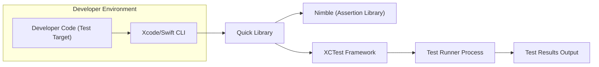
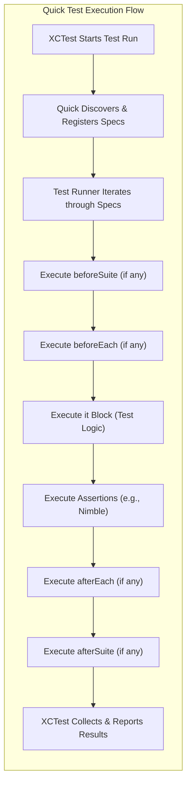

# Project Design Document: Quick - Swift Testing Framework

**Version:** 1.1
**Date:** October 26, 2023
**Author:** AI Software Architect

## 1. Introduction

This document provides an enhanced design overview of the Quick project, a behavior-driven development (BDD) testing framework for Swift. This document aims to clearly articulate the architecture, components, and data flow of Quick to facilitate subsequent threat modeling activities. The information presented here is based on the analysis of the Quick GitHub repository: [https://github.com/Quick/Quick](https://github.com/Quick/Quick). This revision includes more detail on component interactions and potential security considerations.

## 2. Goals and Objectives

The primary goals of Quick are to:

* Provide a clear and expressive Swift-native syntax for writing executable specifications, inspired by BDD principles.
* Enable developers to focus on describing the *intended behavior* of software components.
* Offer a hierarchical structure for organizing tests using `describe`, `context`, and `it` blocks, improving readability and maintainability.
* Integrate seamlessly with the standard Xcode testing infrastructure and Swift development workflows.
* Be extensible to accommodate various testing methodologies and custom needs.

## 3. High-Level Architecture

Quick functions as a library that is integrated into a Swift project's test target. Developers utilize Quick's domain-specific language (DSL) within their test code. The framework interacts with the underlying XCTest framework to execute these specifications.

**Components:**

* **Developer Code (Test Target):**  Swift code written by the developer that includes Quick specifications using its DSL.
* **Xcode/Swift CLI:** The integrated development environment or command-line tools used for building and running tests.
* **Quick Library:** The core framework providing the `describe`, `context`, `it`, lifecycle hooks, and integration with XCTest.
* **Nimble (Assertion Library):** A separate, but commonly used, library that provides expressive matchers for making assertions within Quick specifications.
* **XCTest Framework:** Apple's built-in testing framework, which Quick extends and utilizes for test discovery and execution management.
* **Test Runner Process:** The process initiated by Xcode or the Swift CLI that executes the tests.
* **Test Results Output:** The report generated after the test run, indicating the status (pass/fail) of each specification.

## 4. Detailed Design

This section provides a more in-depth look at the key components and their interactions within the Quick framework.

### 4.1. Core Testing DSL Elements

* **`describe(_:closure:)`:**  A global function that defines a named group of related specifications, typically focusing on a specific unit or feature.
* **`context(_:closure:)`:**  A function used to further refine groupings within a `describe` block, often representing different scenarios or states under which the described behavior is tested.
* **`it(_:closure:)`:**  Defines an individual, executable specification that outlines an expected behavior. The closure contains the code to exercise the system under test and make assertions.
* **Lifecycle Hooks:**
    * **`beforeEach(closure:)`:**  Executed before each `it` block within the current scope (`describe` or `context`).
    * **`afterEach(closure:)`:**  Executed after each `it` block.
    * **`beforeSuite(closure:)`:**  Executed once before all specifications within a `describe` block.
    * **`afterSuite(closure:)`:**  Executed once after all specifications within a `describe` block.
* **Control Flow:**
    * **`pending(_:closure:)` / `xit(_:closure:)`:**  Mechanisms to mark specifications as incomplete or temporarily excluded from execution.

### 4.2. Test Execution Workflow

The execution of Quick tests proceeds as follows:

1. **Test Discovery (via XCTest):** When the test runner starts, XCTest discovers test cases within the test target. Quick integrates with this process by providing mechanisms for XCTest to recognize Quick specifications.
2. **Spec Registration:** Quick's runtime registers the `describe`, `context`, and `it` blocks as individual test cases or logical groupings within the XCTest framework.
3. **Test Case Instantiation:** For each `it` block, the test runner instantiates a corresponding XCTest test case.
4. **Lifecycle Hook Execution:**
    * `beforeSuite` blocks are executed at the beginning of a `describe` block's execution.
    * `beforeEach` blocks are executed before each `it` block.
5. **Specification Execution:** The code within the `it` block's closure is executed. This typically involves:
    * Setting up the necessary preconditions for the test.
    * Interacting with the system under test.
    * Making assertions about the outcome using assertion libraries like Nimble.
6. **Lifecycle Hook Execution (Teardown):**
    * `afterEach` blocks are executed after each `it` block.
    * `afterSuite` blocks are executed after all `it` blocks within a `describe` block have completed.
7. **Result Reporting (via XCTest):** XCTest collects the results of each executed specification (pass, fail, pending) and generates a report.

### 4.3. Interaction with XCTest

Quick is built on top of XCTest and leverages its infrastructure for:

* **Test Discovery:** Quick provides extensions or adapters that allow XCTest to find and recognize Quick specifications.
* **Test Execution Management:** XCTest manages the execution order and lifecycle of the tests, including invoking Quick's setup and teardown methods.
* **Result Reporting:** Quick relies on XCTest's reporting mechanisms to display test outcomes.

### 4.4. Nimble Integration (Common Practice)

While Quick focuses on the structure and description of tests, Nimble provides a fluent and readable syntax for expressing assertions. The combination of Quick and Nimble is a common pattern in Swift BDD testing. Assertions within `it` blocks often use Nimble's matchers (e.g., `expect(someValue).to(equal(expected))`).

## 5. Data Flow Diagram

This diagram illustrates the flow of control and key data elements during the execution of a Quick specification.

**Data Elements:**

* **Test Specification Code:** The Swift code defining the tests using Quick's DSL.
* **Test Execution Context:** The runtime environment in which the tests are executed, including the state of the system under test.
* **Assertion Results:** The boolean outcome (true/false) of individual assertions made within the `it` blocks.
* **Test Results Data:** Information about the status (pass, fail, pending) of each specification, collected by XCTest.

## 6. Deployment Architecture

Quick is deployed as a Swift package and integrated into a project's test target. The typical deployment process involves:

* **Adding the Quick Package Dependency:** Using Swift Package Manager by adding the Quick repository URL to the project's `Package.swift` file.
* **Importing the Quick Module:**  Adding `import Quick` to the test files where Quick specifications are defined.
* **Writing and Organizing Specifications:** Developers create test files and use Quick's DSL to define their tests within the project's test target.

Quick itself does not have a separate deployment infrastructure. It is a library that is included as a dependency within the application's test suite.

## 7. Security Considerations (For Threat Modeling)

This section outlines potential security considerations relevant for threat modeling the Quick framework and projects that utilize it.

* **Dependency Chain Vulnerabilities:** Quick depends on other Swift packages. Vulnerabilities in these transitive dependencies could introduce security risks. Regularly auditing and updating dependencies is crucial.
* **Malicious Test Code Injection:** If an attacker can inject or modify test code, they could potentially execute arbitrary code within the test environment. This is a concern in environments with less strict access controls or where test code is dynamically generated from untrusted sources.
* **Information Disclosure via Test Failures:**  Test failures might inadvertently log or expose sensitive information (e.g., API keys, database credentials) if not handled carefully. Secure logging practices within tests are important.
* **Resource Exhaustion during Test Execution:**  Poorly written or malicious test specifications could consume excessive resources (CPU, memory, network), leading to denial of service during test execution. This could impact CI/CD pipelines.
* **State Management Issues in Tests:** If tests rely on shared mutable state and are not properly isolated, one test might inadvertently affect the outcome of another, potentially masking security vulnerabilities or creating false positives/negatives.
* **Abuse of Lifecycle Hooks:**  Malicious code within `beforeSuite`, `afterSuite`, `beforeEach`, or `afterEach` blocks could perform unintended actions or compromise the test environment.
* **Insecure Handling of Test Fixtures:** If test fixtures (e.g., files, databases) are not created and cleaned up securely, they could introduce vulnerabilities.
* **Overly Permissive Test Environment:** If the test environment has excessive privileges or access to production systems, compromised test code could be used to attack those systems.

## 8. Assumptions and Constraints

* **Trusted Development Environment:** It is assumed that the development environment where tests are written and executed is reasonably secure and that developers are trusted.
* **Standard Swift Toolchain:** Quick is designed to work with standard Swift development tools and the XCTest framework.
* **Appropriate Access Controls:** It is assumed that appropriate access controls are in place to prevent unauthorized modification of test code and the test environment.
* **Regular Security Audits:**  It is assumed that projects using Quick will conduct regular security audits of their dependencies and test code.

## 9. Future Considerations

* **Enhanced Asynchronous Testing Support:**  Further improvements to simplify testing asynchronous code patterns.
* **More Granular Control over Test Execution:**  Options for more fine-grained control over the execution order and filtering of tests.
* **Improved Reporting and Logging:**  More customizable and detailed reporting options, potentially with security-relevant information.
* **Static Analysis Integration:**  Integration with static analysis tools to identify potential issues in test code.

This revised document provides a more detailed and nuanced design overview of the Quick testing framework, specifically focusing on aspects relevant to threat modeling. It highlights the components, their interactions, and potential security considerations for projects utilizing Quick.